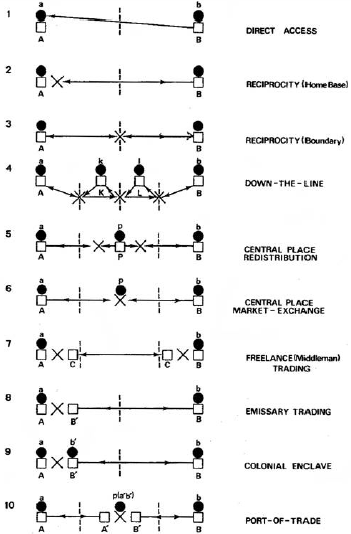
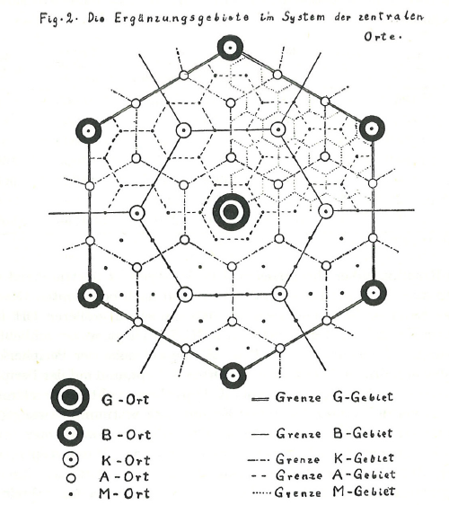
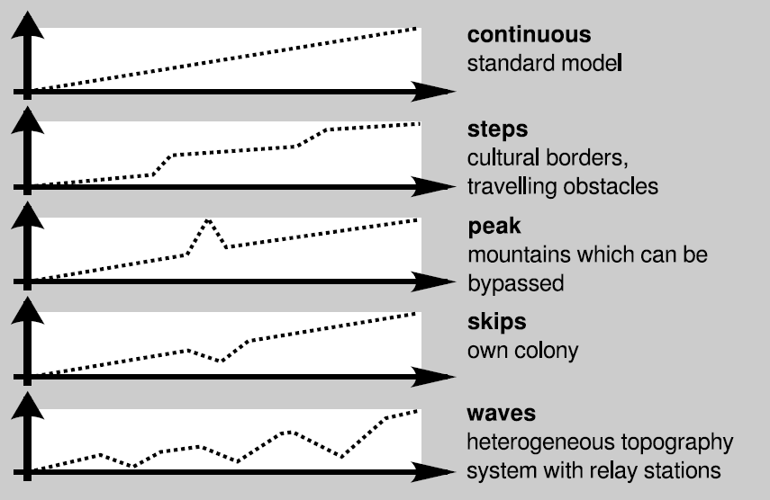

## Interaction as a key term

**Interaction**

- Trade
- Conflict
- Transportation

  

  

  

 paintings from S. Bening, E. Hünten, C. Monet 
 source: Wikipedia 

---

## Interaction

**Purpose of interaction**

- allows to join forces to reach certain targets
- changes (extends/reduces) the individual capability

--- .segue bg:grey

## What is interaction?

--- &twocol

## Defining interaction

*** =left

**Definition 1**
- Interaction is the joint action of at least two interaction partners.

**Definition 2**
- Spatial Interaction connects different locations by the means of moving people, goods or knowledge between the locations.

**Definition 3**
- Communication is the exchange of information.

*** =right

  

---

## Facets of interaction

- culture
- mobility and transport
- centrality
- trade and exchange
- conflicts
- social structure
- territoriality and borders
- collective identities
- …

--- &twocol

## Conflict and cooperation

*** =left

**Conflict**

- contradicting goals of the two interaction partners
- limitation of the other’s capability
- hamper the other’s efforts Cooperation
- similar goals of the two interaction partners
- extension of the other’s capability
- supporting the other’s efforts

*** =right

  

--- &twocol

## Interaction

*** =left

**Power and Leverage**

Traditional history is about events, when people interact. It is about gaining and applying power and influencing and controlling the behaviour of other people using different means.

*** =right

  

 Battle of Königsgrätz, painting by E. Hünten

--- &twocol

## Interaction

*** =left

**Social structures**

Social structures are a kind of infrastructure of effective interaction. Social structures are defining the acceptable and unacceptable kinds of interaction. The negotiation of social status is a process of interaction.

*** =right

  

 Nationalversammlung Frankfurt 1848, painting by L. v. Elliott

--- &twocol

## Interaction

*** =left

**Interaction**

Interaction supports the fulfilment of needs and to overcome shortages by changing the distribution of commodities and conducting
services:

- trade
- division of labour
- services
- …

*** =right

  

 Renfrew 1975

--- &twocol

## Interaction

*** =left

**Innovations**

Interaction supports innovations by
- enabling the required knowledge base by the collaboration of developers
- distributing the innovation

*** =right

  

 M. Lomonosow, painting by I. Feodorov

--- &twocol

## Interaction

*** =left

**Transportation**

If people are at different places, they need means of transportation or telecommunication for conducting interaction. It is required to move people, commodities or ideas/knowledge.
The means of transportation and the transportation infrastructure is at the same time enabling and restricting interaction. The system of transportation:

*** =right

- is mapping the structure of the system of interaction
- is canalizing the interaction
- is influenced by the system of interaction (although, there is a certain inertia)

  

--- &twocol

## Interaction

*** =left

**Daily live and culture**

Interaction is an essential part of the daily live. Every contact to another individual represents a process of interaction, even if the purpose is not clear.

*** =right

  

 painting by P. A. Renoir

--- &twocol

## Interaction

*** =left

**Daily live and culture**

If a certain behaviour becomes a custom and is shared with others, we call it culture. Since interaction causes common standardisations, culture is a kind of effect of interaction.

**Definition 4**
- Culture covers standardisations which are valid in collectives.

 Hansen 2003, 39

*** =right

  

--- &twocol

## Interaction

*** =left

**Culture**

- Formal and abstract definition which covers most other
- Spatial archaeological cultures as special case

    

*** =right

- Applicable in archaeology

**Cultures are mapping interaction structures**

    

--- &twocol

## Advantages of interaction as concept

*** =left

- interaction is the driving force of soical, economic, cultural and historical processes and present in many aspects of daily live
- interaction is very abstract and is able to cover different aspects of human behaviour
**hence**
- we need not to start our investigation with distinguishing different kinds of interaction
- interaction is a key term for different geographical and archaeological topics
- we can easily connect to other disciplines

*** =right

  

---

## Interaction in different disciplines

- **physics**: gravity law, Hamada-Johnston-Potential
- **human-ecology**: human-environment interaction
- **sociology**: Parson theory of roles, Blumer theory of symbolic interaction
- **psychology**: interaction in diades theory, dialog theory
- **ethnology**: Malinowskies theory of gift exchange
- **economy**: Polanyis market theory
- **geography**: Ravensteins theory of migration, Wilsons theory entropy of traffic, Christallers theory of central places

--- &twocol

## Interaction in different disciplines

*** =left

**Physics**

- Newton
- gravity law
$$I = \frac{m_1*m_2}{d^k}  $$

  

*** =right

  

--- &twocol

## Interaction in different disciplines

*** =left

**Ethnology**

- Malinowski
- Kula ring
- gift exchange

  

*** =right

  

--- &twocol

## Interaction in different disciplines

*** =left

**Economy**

- Polanyi
- market, redistribution, reciprocity

  

*** =right

  

--- &twocol

## Interaction in different disciplines

*** =left

**Sociology**

- Blumer
- symbolic interaction

  

*** =right

  

--- &twocol

## Interaction in different disciplines

*** =left

**Psychology**

- Garrod/Pickering
- alignment in dialogues

*** =right

  

--- &twocol

## Interaction in different disciplines

*** =left

**Geography**

- Christaller
- central place theory

  

*** =right

  

--- &twocol

## Centrality as example

*** =left

**Definition 5**

Centrality is the relative surplus of meaning due to fulfilling central functions for the surrounding area.

 Christaller 1933, 26-27

  

*** =right

**Definition 6**

Centrality is the relative concentration of interaction. 

 Nakoinz 2012

  

--- &twocol

## Vector of centrality

*** =left

- **I** Intensity of Interaction
- **R**  Reach of Interaction
- **H** Level of Hierarchy
- **K** Control of Interaction

*** =right

  

---

## Interaction

  

--- .segue bg:grey

## What is a model?

--- &twocol

## Definitions of model

*** =left

**Definition 7**

A possible realisation in which all valid sentences of a theory T are satisfied is called a model of T.

 Alfred Tarski 1953

*** =right

  

--- &twocol

## Definitions of model

*** =left

**A model is characterised by:**
- mapping
- reduction
- pragmatism

 Herbert Stachowiak 1973

# **Definition 8**
$O_1$ and $O_2$ are objects and $O_2$ is a model of $O_1$ for $k$ in the time interval $t$ regarding a certain purpose $Z$ if in $t k$:

- is L-rational
- performs a description $P_1$ of $O_1$
- performs a description $P_2$ of $O_2$

*** =right

- performs a mapping of $P_1$ on $P_2$
- performs a transcoding of $P_1$ in $P_2$
- performs the substitution of $O_1$ by $O_2$
- performs certain operations on $O_2$ in order to fulfil the purpose $Z$ and which transfer $O_2$ to $O_2*$
- performs a description $P_2*$ of $O_2*$
- performs the reverse mapping of $P_2*$ on $P_1*$
- accepts $P_1*$ as the description of $O_1*$
- accepts the substitution of $O_1*$ by $O_2*$
- performs a recoding of P1 in P2 regarding $P_1*$ and $P_2*$

 Herbert Stachowiak 1973

---

## Definitions of model

**Definition 9**

A model is a simplified mapping used for a certain purpose.

---

## Definitions of model

**Definition 10**

- is a structure of a theory;
- complies with a set of hypotheses; and
- is not a simple statement.

 Wolfgang Balzer 2009

---

## Definitions of model

**Definition 11**

A model is an iconic sign.

 Björn Kralemann, Claas Lattmann 2012

  

  

--- &twocol

## Definitions of model

*** =left

**Definition 12**

A model is an artefact, used for a certain purpose by a specific community. The model is analogue to the original. A model has certain methods for development and usage and is based on certain theories and assumptions.

 Bernd Thalheim 2015

*** =right

  

--- &twocol

## Definitions of model

# Cambridge

*** =left

**Peter Haggett**
- New Geography
- Locational Analysis in Human Geography, 1965
- Models in Geography, 1967, together with R. Chorley

**David L. Clarke**
- New Archaeology
- Analytical Archaeology 1968
- Models in Archaeology, 1972

*** =right

  

  

---

## Definitions of model

**Definition 13**

# A model is characterised by:
- comprehensiveness;
- predictivness;
- efficiency; and
- accuracy.

 David L. Clarke 1972

  

--- &twocol

## Definitions of model

*** =left

**Definition 14**

A model is a simplified and intelligible picture of the world.

 Richard Chorley, Peter Haggett 1967

*** =right

  

--- .segue bg:grey

## Which types of models can you distinguish?

---

## Interaction as a key term

  

---

## Interaction as a key term

  

--- &twocol

## Model classification | SQM-Classification

*** =left

 Kai Velten 2009

 S - system

- physical - conceptual
- natural - technical
- stochastic - deterministic
- continuous - discrete
- dimension
- field of application

 Q - objectives

- phenomenological - mechanistic
- stationary -instationary
- lumped - distributed
- direct - inverse

*** =right

- research - management
- speculation - design
- scale

 M - mathematical structure

- linear - non-linear
- analytical - numerical
- autonomous - non-autonomous
- continuous - discrete
- differential equations
- integral equations
- algebraic equations

---

## Interaction as a key term

  

---

## Examples of modelling interaction

**Diffusion model**

$$\frac{\delta p}{\delta t} = k \frac{\delta^2p}{\delta x^2} + mp(1-p)$$

**Wave of advance** (Fisher 1937):
- $p$ is the frequency of a mutantgene
- $t$ the time
- $x$ a spatial coordinate
- $m$ the intensity of selection
- $k$ the diffusion coefficient

---

## Examples of modelling interaction

**Pred predator**

$$\frac{\delta x}{\delta t} = ayx - bx$$

$$\frac{\delta y}{\delta t} = cy - dxy$$

**Lotka-Volterra equations** (Lotka 1925; Volterra 1926):
- $x$ population of the predator
- $y$ population of its prey

  

--- &twocol

## Examples of modelling interaction

*** =left

**Voronoi graph**

- tesselation
- influence of centre depends on distance
- distance to centre is equal for all points of the border
- $a = b$
-  territory is optimized for transportation

*** =right

  

--- &twocol

## Examples of modelling interaction

*** =left

**Voronoi graph**

# geographical space
- economical space (least cost distance)
-  cultural space

*** =right

  

--- &twocol

## Examples of modelling interaction

*** =left

**Voronoi graph**

- geographical space

# economical space (least cost distance)

-  cultural space

*** =right

  

--- &twocol

## Examples of modelling interaction

*** =left

**Voronoi graph**

- geographical space
- economical space (least cost distance)

#  cultural space

*** =right

  

---

## Space

**Disciplinary spaces**

A metrical space is spanned by a metric, which defines
distances.
- A **social space** is constructed by social distances.
- An **economic space** is constructed by economic-distances.
- A **cultural space** is constructed by cultural distances.
- A **geographic space** is constructed by geodetic distances.

--- &twocol

## Interaction as a key term

*** =left

**Fetter modell**

- weighted Voronoi-graph
- market areas on the basis of costs of transport
- Fetter 1924; Haggett 2004

  

 Frank A. Fetter (1863-1949)

*** =right

  

--- &twocol

## Interaction as a key term

*** =left

**X-tent**

- weighted Voronoi-graph
- Renfrew & Level 1979

  

*** =right

  

--- &twocol

## Interaction as a key term

*** =left

**Weighted Voroni**
- $\alpha_s$ static additive weight
- $\alpha_d$ dynamic additive weight
- $\gamma_s$ static multiplicative weight
- $\gamma_d$ dynamic multiplicative weight
- $t_\alpha$ 1=dynamic additive
- $t_\gamma$ 1=dynamic multiplicativeweight
- $\psi$ distance manipulating function
- $x_z$ x reference point
- $y_z$ y reference point

*** =right

- $x_p$ x point in question
- $y_p$ y point in question

$$ \Phi = \alpha - \gamma\psi(\delta) $$

$$ \alpha = \alpha_s(t_\alpha \alpha_d + \mid t_\alpha -1 \mid)$$

$$ \gamma = \gamma_s(t_\gamma \gamma_d + \mid t_\gamma -1 \mid)$$

$$ \delta = \left(\sqrt{(x_z - x_p)^2 + (y_z -y_p)}\right)$$

--- &twocol

## Interaction as a key term

*** =left

**Weighted Voronoi**

- Princely seats
- weighted Voronoi graphs
- weighted with number of rich graves
- Software: `Grass`
- today a Grass-addon is available: r.xtent

*** =right

  

--- &twocol

## Interaction as a key term

*** =left

**Weighted Voronoi**

- Princely seats
- weighted Voronoi graphs
- weighted with number of rich graves and wagon graves
- least cost distance
- Software: `R`

  

*** =right

  

--- .segue bg:grey

## Why modelling interaction?

--- &twocol

## Interaction as a key term

*** =left

**Quantitative analysis**

1. **Problem**: Put your question.
2. Theory: Which theoretical frame is adequate for solving the problem?
3. Data: Which data can be used for solving the problem? Are they available as database etc.? How can you access the data?
4. Method: Which methods can solve the problem? Learn the methods!
5. Tool: Learn the tools to apply the methods.

*** =right

6. Check, validate and interpret the results: plausible? significant?

 ?

 ODTM-Balance

 Objective - Data - Theory - Method

--- &twocol

## Interaction as a key term

*** =left

**Quantitative analysis**

1. Problem: Put your question.
2. **Theory**: Which theoretical frame is adequate for solving the problem?
3. Data: Which data can be used for solving the problem? Are they available as database etc.? How can you access the data?
4. Method: Which methods can solve the problem? Learn the methods!
5. Tool: Learn the tools to apply the methods.

*** =right

6. Check, validate and interpret the results: plausible? significant?

  

---

## Theories

**Definition 15**

A **theory** is an abstract concept of the relationship of facts.

  

--- &twocol

## Theories

*** =left

**Type a**

Meta theories
- philosophy
- research strategies
- epistemology

Low level theories
- mathematics
- database development
- logic
- theory of cluster analysis

*** =right

**Type b**

High level theories
- social theories
- human behaviour and cognition theories
- chronological systems

Middle range theories
- formation processes
- source criticism
- theory of typology

--- &twocol

## Interaction as a key term

*** =left

**Quantitative analysis**

1. Problem: Put your question.
2. Theory: Which theoretical frame is adequate for solving the problem?
3. **Data**: Which data can be used for solving the problem? Are they available as database etc.? How can you access the data?
4. Method: Which methods can solve the problem? Learn the methods!
5. Tool: Learn the tools to apply the methods.

*** =right

6. Check, validate and interpret the results: plausible? significant?

  

---

## Data

  

--- &twocol

## Interaction as a key term

*** =left

**Quantitative analysis**

1. Problem: Put your question.
2. Theory: Which theoretical frame is adequate for solving the problem?
3. Data: Which data can be used for solving the problem? Are they available as database etc.? How can you access the data?
4. **Method**: Which methods can solve the problem? Learn the methods!
5. Tool: Learn the tools to apply the methods.

*** =right

6. Check, validate and interpret the results: plausible? significant?

  

--- &twocol

## Interaction as a key term

*** =left

**Quantitative analysis**

1. Problem: Put your question.
2. Theory: Which theoretical frame is adequate for solving the problem?
3. Data: Which data can be used for solving the problem? Are they available as database etc.? How can you access the data?
4. Method: Which methods can solve the problem? Learn the methods!
5. **Tool**: Learn the tools to apply the methods.

*** =right

6. Check, validate and interpret the results: plausible? significant?

  

--- &twocol

## Interaction as a key term

*** =left

**Quantitative analysis**

1. Problem: Put your question.
2. Theory: Which theoretical frame is adequate for solving the problem?
3. Data: Which data can be used for solving the problem? Are they available as database etc.? How can you access the data?
4. Method: Which methods can solve the problem? Learn the methods!
5. Tool: Learn the tools to apply the methods.

*** =right

6. **Interpret**, check and validate the results. plausible? significant?

  

 Can it be?

 Is it significant?

 What does it mean?

---

## Research process

  

---

## Research process

  

--- &twocol

## Interaction as a key term

*** =left

**Types of interaction models**
- conceptual models
- affirmative models
- quantitative relationship models
- system models
- models of complex systems

*** =right

  

---

## Interaction as a key term

**Considerations**
- which elements do we investigate?
- which parameters are important?
- how are the parameters related?
- how are the elements and parameters establishing systems?
- how can we compare empirical and theoretical models?
- what do the results tell us?

--- .segue bg:grey

## Which factors and parameters of interaction do you know?

--- &twocol

## Interaction as a key term

*** =left

**distance**
- geographical distance
- social distance
- cultural distance
- economical distance

**point features**
- size
- population

*** =right

  

--- .segue bg:grey

## How can we measure interaction?

 Which measures of and proxies for interaction do you know?

--- &twocol

## Measures

*** =left

**point distribution**
- minimal requirements
- measures general degree of interaction in a region

**number of exchanged objects**
- small data
- can deal with individual interactions

  

*** =right

**inverse cultural distance**
- robust because of extensive data
- can deal with short range interaction
- can measure different types of interaction

  

--- &twocol

## Interaction as a key term

*** =left

**NN-Distance**
- Is there interaction between the points?
- Test on complete spatial randomness
- regular - random - clustered

*** =right

  

  

--- &twocol

## Interaction as a key term

*** =left

**Imports**
- connecting a site to a provenience region
- individual interactions can be traced

  

*** =right

  

--- &twocol

## Interaction as a key term

*** =left

**Cultural distance**
- interactions are producing cultural similarities
- difference in material culture
- statistical level of interaction between sites or regions

  

*** =right

  

--- &twocol

## Interaction as a key term

*** =left

**Cultural distance**
- topography of cultural similarities
- territories of cultural similarities
- cultural areas
- interaction models

*** =right

  

  

--- &twocol

## Interaction as a key term

*** =left

**Theoretical Models**
- Interaction decreases with distance. Distance decay functions can quantify the decrease.

  

*** =right

$$I = \frac{k}{d^i}$$

  

  

--- &twocol

## Interaction as a key term

*** =left

**Gravity models**
- involve properties of the interaction partners
- based on an analogy from physics
- population, settlement size, ...
- can be used to produce distance decay functions/fall off curves, which consider population

*** =right

  

--- &twocol

## Interaction as a key term

*** =left

**Distance diagram (dd)**
- different view-points
- different focus-points
- cultural distance as an inverse interaction proxy

*** =right

Viewpoint|fixed vocus|selected focus|all foucused
----|----|----|----
fixed viewpoint|**dd1** fixed profile dd, similarity profiles|**dd2** fixed sector dd|**dd3** fixed multi-focal dd, fall-off curve
selected viewpoints|**dd4** selected profile dd|**dd5** selected secotr dd|**dd6** selected multi-focal dd
all viewpoints**dd7** aggregated profile dd|**dd8** aggregated sector dd|**dd9** aggregated multi-focal dd, variogram

--- &twocol

## Interaction as a key term

*** =left

**Definition 16**
Interaction models plot
intensity of interaction over
distance.

- cultural distances as inverse proxys of interaction
- different metrics and weightings

 Nakoinz 2013

  

  

  

*** =right

  

  

--- &twocol

## Interaction as a key term

*** =left

**Interaction model**
- fixed starting point
- fixed profile
- ceramics
- interaction friction at Black Forrest?

  

*** =right

  

--- &twocol

## Interaction as a key term

*** =left

**Interaction model**
- from all points
- to all points
- fibulae and adornment
- interaction threshold at 200 km?

*** =right

  

--- &twocol

## Interaction as a key term

*** =left

**Modelling systems of transportation**

- is essential for modelling interaction
- produces knowledge of significant parameters
- the system of transportation provides
  - the structure of the interaction model and
  - economical distances by least cost modelling

*** =right

  

--- &twocol

## Interaction as a key term

*** =left

**Modelling systems of transportation**

- empirical model based on the sites
- theoretical least cost path model
- the comparison of both models reveals the parameters of the routes

*** =right

  

--- &twocol

## Interaction as a key term

*** =left

**Least Cost Path**

- calculated the most efficient path
between
$A and B$

*** =right

  

 Surface-Evans 2012

--- &twocol

## Interaction as a key term

*** =left

**What does ’least cost’ mean?**

- ...
- ...
- ...

*** =right

**Which data are required/available?**

- ...
- ...
- ...

--- &twocol

## Interaction as a key term | Least Cost Path

*** =left

**How to find the pathway?**

- costs for moving from one cell to the next one
- ...

*** =right

  

--- &twocol

## Interaction as a key term | Least Cost Path

*** =left

**How to find the pathway?**

- costs for moving from one cell to the next one
- searching for the next connection which produces minimal cumulated costs
- ...

*** =right

  

--- &twocol

## Interaction as a key term | Least Cost Path

*** =left

**How to find the pathway?**

- costs for moving from one cell to the next one
- searching for the next connection which produces minimal cumulated costs
- going back the pathway along the connections, which me noted down

*** =right

  

--- &twocol

## Interaction as a key term | Least Cost Path

*** =left

**How to find the pathway?**

- costs for moving from one cell to the next one
- searching for the next connection which produces minimal cumulated costs
- going back the pathway along the connections, which me noted down

*** =right

  

--- &twocol

## Interaction as a key term

*** =left

**Agent based model**
- dynamic model of the exchange and settlement system

  

*** =right

  

  

--- &twocol

## Interaction as a key term

*** =left

**Consider your own life**

- make a list of your interactions
- which types of interactions can you distinguish?
- which parameters are important?
- which information would be archaeological available?

*** =right

  

--- &twocol

## Interaction as a key term

*** =left

**Summary**

- interaction is a trans-disciplinary key term in many fields of research
- interaction is an driver of historic, economic, social and cultural processes.
- interaction is an abstract concept
- different types of distances can be used
- models of systems of interaction are based on simple interaction-distance relationships

*** =right

  

---
  

