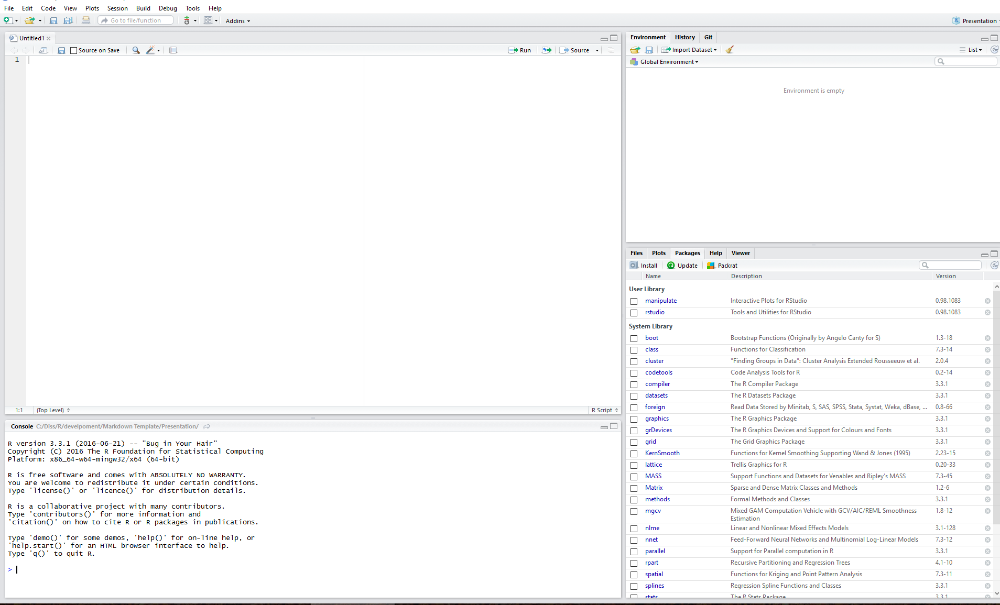
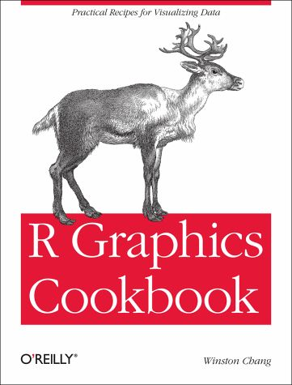

## Why should I apply statistics?

> - Data analysis is an essential tool of empirical research

> - "learning programming is learning to think"

> - forcing the problem in a logical and sequential structure

---

## History of R 

- 1976: **S language by John Chambers** at Bell Laboratories (AT&T)

<div style='position:absolute;bottom:20%;right:40%'>
    
</div>

<div style='position:absolute;bottom:10%;right:5%;font-size:10px'>
  <a href="https://statistics.stanford.edu/people/john-chambers" title="User:John Chambers">
  John Chambers</a> , https://statistics.stanford.edu/people/john-chambers
</div>

---

## History of R 

- 1976: S language by **John Chambers** at Bell Laboratories (AT&T)

- 1993: Free implementation of R under the name R by **Ross Ihaka and Robert Gentleman**

<div style='position:absolute;bottom:20%;right:20%'>
    
</div>

<div style='position:absolute;bottom:20%;left:20%'>
    
</div>

<div style='position:absolute;bottom:10%;right:5%;font-size:10px'>
  <a href="http://america.pink/images/3/8/1/4/7/7/1/en/1-ross-ihaka.jpg" title="User:Ross Ihaka">
  Ross Ihaka</a> , https://america.pink/ross-ihaka_3814771.html
</div>

<div style='position:absolute;bottom:12%;right:5%;font-size:10px'>
  <a href="https://researchers.23andme.org/robert-gentleman-phd" title="User:Robert Gentleman">
  Robert Gentleman</a> , https://researchers.23andme.org/robert-gentleman-phd
</div>

---

## History of R 

- 1976: S language by **John Chambers** at Bell Laboratories (AT&T)
- 1993: Free implementation of R under the name R by **Ross Ihaka** and **Robert Gentleman**

> - 1997: R becomes **GNU project**
> - 2000: **R1.0**
> - 2015: **R Consortium**: R Foundation, Microsoft, R Studio, Google etc.

--- .segue bg:grey

## 2.  Why using R?

<a class="btn btn-primary btn-large" href='https://isaakiel.github.io/index.html'>
 
</a>

---

## 2. Some Advantages and Disadvantages

   
Most statistical software provides convenient standartised test, as $chi^2$ test etc. R has some very convienient advantages:

**Advantages**|**Disadvantages**
------------------------------------|------------------------------------
reproducibility and verifiablilty|high barriers to learn
flexible and extensible|'raw' syntax
many different packages|
customisable|
independent platform with a great support|

---

## 7 levels of using R

> 1. Asking a colleague to run R for you
> 2. Applying build in functions
> 3. Combining build in functions
> 4. Writing own algorithms
> 5. Writing own functions and objects
> 6. Developing efficient code
> 7. Writing own packages

--- .segue bg:grey

## 3.  How to start?

<a class="btn btn-primary btn-large" href='https://isaakiel.github.io/index.html'>
 
</a>

---

## Gerneral Workflow | Before you beginn

> 1. **Problem:** Put your question.
> 2. **Theory:** Which theoretical frame is adequate for solving the problem?
> 3. **Data:** Which data can be used for solving the problem? Are they available as database etc.? How can you access the data?
> 4. **Method:** Which methods can solve the problem? Learn the methods!
> 5. **Tool:** Learn the tools to apply the methods.
> 6. **Finally:** Check, validate and interpret the results. Plausible? Significant?

--- &twocol

## Gerneral Workflow | Now, you can beginn 

*** =left

> - **Loading** data
> - **Exploring** data
> - **Analysing** data
>    - Descriptive analysis
>        - Univariate analysis
>        - Bivariate analysis
>        - Multivariate analysis

*** =right

>    - Inference
>        - tests
>        - Bayes
>    - Simulation
> - **Visualise** and export results
> - **Report** and publication

--- 

## 3.  How to start? | R Studio

<div style='position:absolute;bottom:10%;right:15%'>

</div>

--- 

## 3.  R Studio | Text Editor

<div style='position:absolute;bottom:10%;right:15%'>

</div>

--- 

## 3.  R Studio | Console

<div style='position:absolute;bottom:10%;right:15%'>

</div>

*** =pnotes

The Console gives you a place to execute commands written in R language
Comand promt ">": Tipe in your code and hit enter ro run it
Command "+". Indicating your command/code is unfinished, so complete it and hit 
run; or hit esc, if you expect an Error!
---

## 3.  R Studio | History

<div style='position:absolute;bottom:10%;right:15%'>

</div>

*** =pnotes

As you enter commands, sou accumulate a hsitroy of past commands, which are 
saved in the R history...

--- 

## 3.  R Studio | File Manager

<div style='position:absolute;bottom:10%;right:15%'>

</div>

--- 

## 3.  R Studio | Documentation viewer

<div style='position:absolute;bottom:10%;right:15%'>

</div>

--- 

## 3.  R Studio | Project and Session Manager

<div style='position:absolute;bottom:10%;right:15%'>

</div>

--- 

## 3.  R Studio | Workspace Explorer

<div style='position:absolute;bottom:10%;right:15%'>

</div>

--- 

## 3.  R Studio | Package Manager

<div style='position:absolute;bottom:10%;right:15%'>

</div>

*** =pnotes
Packages...
A Collection of code and functions written for the R Language.
Ususally focusses on a specific task or problem. 
Most of the usful R applications appear in packages.

--- 

## 3.  R Studio | Wirzards and Assistants

<div style='position:absolute;bottom:10%;right:15%'>

</div>

--- &twocol

## 3.  How to start? | R Studio

*** =left

> * Text Editor
> * Console
> * Data Explorer
> * File Manager
> * Image Viewer

*** =right

> * Documentation Viewer
> * Project and Session Manager
> * Workspace Explorer
> * Package Manager
> * Wizards and Assistants

--- .segue bg:grey

## 4. Scipts and why they are usefull

<a class="btn btn-primary btn-large" href='https://isaakiel.github.io/index.html'>
 
</a>

---

## Lets talk about scripts

> - **Scripts** are an exact documentation of the work.
> - **Scripts** allow reproducing the analysis.
> - **Scripts** allow reusing commands, algorithms etc.
> - **Scripts** allow sharing code.
> - **Scripts** allow the automation of complex analyses.
> - **Scripts** allow the automation of report generation; for instance, in R with the packages `knitr` or `sweave`.
> - **Scripts** allow rerunning and testing code snippets.
> - **Scripts** make it easy to create complex solutions.
> - **Scripts** allow limiting the active knowledge of the researcher to the most important aspects.

---

## Lets talk about scripts | Some rules

> * Each analysis has its own **script**.
> * Each **script** has a header containing important information such as title, 
topic, purpose, author, date, etc.

---

## Lets talk about scripts | Script Header
```{r}
 ##################################################################
 ## Didactic R-Script for Modelling Summer School
 ## ===============================================================
 ## Project: Modelling Summer School
 ## Author: O. Nakoinz, D. Knitter & F. Faupel
 ## Version: 01
 ## Date of last changes: 03.08.2016
 ## Data: some.data
 ## Author of data: author.data
 ## Purpose: didactic
 ## Content: 1. preparation, 2. data import, ...
 ## Description: The script include ...
 ## Licence data: -
 ## Licence Script: GPL (http://www.gnu.org/licenses/gpl-3.0.html)
 ##################################################################
```

---

## Lets talk about scripts | Some rules

- For each **command**, you should learn the usage only once.
       - Supplement the command with comments so that you can re-use the 
command for similar purposes without reading the manual again. 
       - Copy, paste and adapt the commands from old scripts.

```{r collapse=TRUE}
# This is a comment
a <- c(3,6,7,4,9,7,3,3,3)       # This is a vector
median(a)                         # This is the "median" function
```

> - Use standardised names and denotations to ease the re-use of code.

---

## Lets talk about scripts | Some rules

> * Use detailed **comments** to understand your analysis years later.
>        * It is useful to think that you should hand over the script to a 
colleague with limited knowledge to optimise comments and structure.
> * Use **versioning** of the scripts by adding a version number to the file name 
(-v01.xxx) or a version control system.

---

## Lets talk about scripts | Some rules

<div style='position:absolute;bottom:10%;right:5%'>
    
</div>

- Use detailed **comments** to understand your analysis years later.
      - It is useful to think that you should hand over the script to a 
colleague with limited knowledge to optimise comments and structure.
- Use **versioning** of the scripts by adding a version number to the file name 
(-v01.xxx) or a version control system.
      - For example GitHub: https://github.com/

---

## Lets talk about scripts | Some rules


> - Avoid special characters in file names, variable names, etc. 
>        - Subset Ä with Ae etc.
>        - Moreover, it is a good idea to encode the file in UTF8.
> - Use a convenient yet standardised folder structure for scripts, data, 
results and reports.

--- &twocol

## Lets talk about scripts 

Use a convenient yet standardised folder structure for scripts, data, 
results and reports. During the Mosaic Summer School, we will work with the follwoing structure.

*** =left
> - 1script
> - 2data
> - 3geodata

*** =right
> - 4ws
> - 5results
> - 6pictures
> - 7report

---

## Weblinks

Source|Link
---------|----------
R Foundation Homepage| https://www.r-project.org/ 
Homepage of RStudio| https://www.rstudio.com/ 
Homepage of R Consortium | https://www.r-consortium.org/
R language | https://de.wikipedia.org/wiki/R_(Programmiersprache)
R language (german) | https://en.wikipedia.org/wiki/R_(programming_language)
Wikibook | https://de.wikibooks.org/wiki/GNU_R
Support |http://www.r-bloggers.com
Support| http://stackoverflow.com/
ISAAKiel|https://isaakiel.github.io/

---

## Weblinks and literature

<div style='position:absolute;bottom:20%;right:20%'>
    
</div>

<div style='position:absolute;bottom:20%;left:20%'>
    
</div>

- J. Adler, R in a nutshell, Second edition. (Sebastopol 2012)
- J. M. Chambers, A Statistical Data Language. In: R. C. Milton, J. A. Nelder (Hrsg.), Statistical Computation. (New York 1969), 179-199.

---

## Things to remember

> - **Scripts** are an exact documentation of the work.
> - **Scripts** allow reproducing the analysis.
> - **Scripts** allow reusing commands, algorithms etc.
> - Each analysis has its own **script**.
> - Each **script** has a header containing important information such as title, 
topic, purpose, author, date, etc.
> - Avoid special characters in file names, variable names, etc. 
> - Use a convenient yet standardised folder structure for scripts, data, 
results and reports.


--- .segue bg:grey


## 5.  Getting started with R

<a class="btn btn-primary btn-large" href='https://isaakiel.github.io/index.html'>
 
</a>

---

## 5.  Getting started with R


```{r collapse=TRUE, results='hide'}
# This is R Code 
5+3
5-3
5*3
5/3
sqrt(25)
sin(3.14)
3.14 * (180 / pi)
```

- **Please start R Studio**

> - We will get used to R!

---

## 5.  Getting started with R

<div style='position:absolute;bottom:10%;right:15%'>

</div>

---

## 5.  Getting started with R


```{r collapse=TRUE, results='hide'}
# This is R Code 
5+3
5-3
5*3
5/3
sqrt(25)
sin(3.14)
3.14 * (180 / pi)
```

---

## 5.  Getting started with R


```{r collapse=TRUE}
# This is R Code
5+3
5-3
5*3
5/3
sqrt(25)
sin(3.14)
3.14 * (180 / pi)
```


---

<a class="btn btn-primary btn-large" href='https://isaakiel.github.io/index.html'>
 
 
</a>
