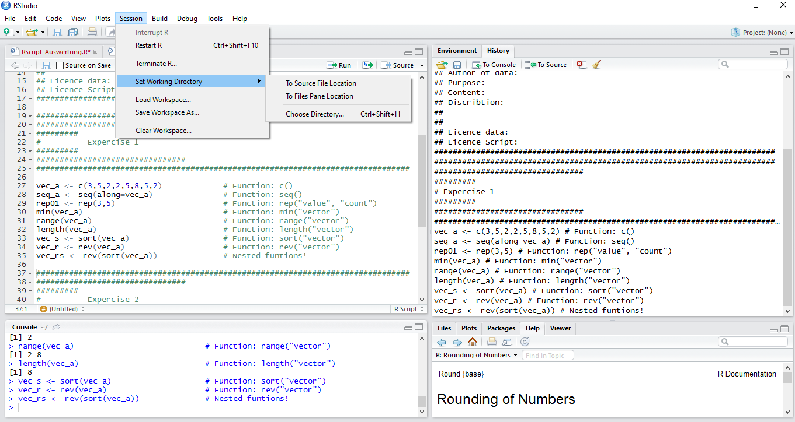

## 1.  Load Data | Where is your project at home?

<div style='position:absolute;bottom:10%;right:15%'>

</div>

---

## 1.  Load Data | Where is your project at home?

```{r collapse=TRUE, eval=FALSE}
wd <- "C:\\Folder\\Subfolder\\SubSubFolder"
setwd(wd)   

wd <- "/home/xxx/subFolder/SubSubFolder"
setwd(wd)

```

---

## 1.  Load Data | Save your current environement

<div style='position:absolute;bottom:10%;right:15%'>

</div>

---

## 1.  Load Data | Save your current environement
```{r collapse=TRUE, eval=FALSE}
save.image("7ws/name01.rws")
load("7ws/name01.rws")
```

---

## 1.  Load Data | Loading a Data Table

```{r collapse=TRUE}
df_mounds <- read.table('2data/gravemounds.csv', header=TRUE)

filename <- "2data/gravemounds02.csv"

write.table(df_mounds, file = filename, append = FALSE, quote = FALSE,
sep = ";", eol = "\n", na = "NA", dec = ".", row.names = TRUE, col.names = TRUE)
```

---

## 1.  Load Data | Loading a Data Table

*** =pnotes
Tabelle laden und prüfen ob alle Splaten richtig angelegt sind. ggf. anpassen

---

## 1.  Load Data | Tidy Data

```{r collapse=TRUE}
df_BA <- subset(df_mounds, variable=="colour")
df_BA_INH <- subset(df_mounds, variable=="diameter" |variable=="length")
str(df_BA_INH)
```


--- .segue bg:grey

## 2.  Manipulate Data

---

## 2.  Manipulate Data | Subset

```{r collapse=TRUE}
vec_a[4]
vec_a[3]
df[1,]
df[ ,1]
```


--- &twocol

## 2.  Manipulate Data | Subset

*** =left

```{r collapse=TRUE}
vec_a[c(3:5)]
df[ c(1:3),c(2,3)]
df[3, c(1,3)]
# Using subset to change a value
df[3,"Imports"] 
df[3,"Imports"] <- 1
df[3,"Imports"] 
```

*** =right

```{r collapse=TRUE}
df[c(6,7,8),2] <- NA
df
df$Site
```

---

## 2.  Manipulate Data | Subset

**vector[...]**

**df[ row , col ]**

**subset**|**effect**|Example
------|------|------
positive integer|returns **specified** elements|`c(1,3:4)` or `2`
negative integer|returns **all other** elements|`c(-1,-3:4)` or `-2`
blank spaces| returns **all**
names|return those with **specific names**|`c("name", "type")` or `"name"`
logical|returns elements, that corresponds to **TRUE**|`c(TRUE, FALSE)` or `TRUE`

---

## 2.  Manipulate Data | Combine Data Frames

```{r collapse=TRUE, eval=FALSE}
merge(x, y, by = intersect(names(x), names(y)),
      by.x = by, by.y = by, all = FALSE, all.x = all, all.y = all,
      sort = TRUE, suffixes = c(".x",".y"),
      incomparables = NULL, ...)
```

---

## 2.  Manipulate Data | Combine Data Frames

```{r collapse=TRUE}
str(ndf)
str(df_mounds)
```

---

## 2.  Manipulate Data | Combine Data Frames

```{r collapse=TRUE, eval=FALSE}
cbind(x,y) # Combines data frames columnwise
rbind(x,y) # Combines data frames rowwise
```

*** =pnotes

If there are several matrix arguments, they must all have the same number of columns (or rows) and this will be the number of columns (or rows) of the result. If all the arguments are vectors, the number of columns (rows) in the result is equal to the length of the longest vector. Values in shorter arguments are recycled to achieve this length (with a warning if they are recycled only fractionally).

---

## 2.  Manipulate Data | Combine Data Frames

```{r collapse=TRUE}
cbind(df_mounds, ndf) 
```

---

## 2.  Manipulate Data | Combine Data Frames

```{r collapse=TRUE}
rbind(df_mounds, ndf)
```

---

## 2.  Manipulate Data | Merge Data Frames

```{r collapse=TRUE }
ndf_mounds <- merge(df_mounds, ndf, all.x=TRUE, all.y=FALSE, by.x=Nekropole,
                    by.y=site)
```

---

## 2.  Manipulate Data | Unique 

 
```{r collapse=TRUE, eval=FALSE}
unique(x, incomparables = FALSE, fromLast = FALSE, ...)
```

**... `unique()` returns a vector, data frame or array like x but with duplicate elements/rows removed.**

```{r collapse=TRUE}
R <- data.frame(V1 = c(1,1,1), V2 = c(2,2,2), V3 = c("A","A","B"))
unique(R)
uni_v3 <- unique(R$V3)
uni_v3
```

---

## 2.  Manipulate Data | Unique 

```{r collapse=TRUE, eval=FALSE}
duplicated(x, incomparables = FALSE, fromLast = FALSE, nmax = NA, ...)
```

**... `duplicated()` determines which elements of a vector or data frame are duplicates of elements with smaller subscripts, and returns a logical vector indicating which elements (rows) are duplicates.**

```{r collapse=TRUE}
R 
duplicated(x = R, fromLast = TRUE)
```

--- .segue bg:grey

## 3.  Loops and Restrictions

--- 

## 3.  Loops and Restrictions

Loops repeat statements

```{r collapse=TRUE, results='hide'}
# Loops repeat statements
a <- 1
for (i in 1:20){
a <- a+a
}

```

--- 

## 3.  Loops and Restrictions

Loops repeat statements

```{r collapse=TRUE}
# Loops repeat statements
a <- 1
for (i in 1:20){
a <- a+a
}

a
```

--- 

## 3.  Loops and Restrictions

```{r collapse=TRUE, results='hide'}
# conditions restrict statements
i <- 1
a <- 1

while (a <55){
a <-a+a
i=i+1
}
```

--- 

## 3.  Loops and Restrictions

```{r collapse=TRUE}
# conditions restrict statements
i <- 1
a <- 1

while (a <55){
a <-a+a
i=i+1
}

a
i
```

--- 

## 3.  Loops and Restrictions

```{r collapse=TRUE, results='hide'}
# conditions restrict statements
if (a>55){
a <- a/2
} else {
a <- a*2
}
```

--- 

## 3.  Loops and Restrictions

```{r collapse=TRUE}
# conditions restrict statements
a 

if (a>55){
a <- a/2
} else {
a <- a*2
}
a
```

--- 

## 3.  Loops and Restrictions

Loops or Restrictions|**starts**|**Condistions**|**Indside**|**Ends**
------|------|------|------|------
Loop|`for`|`(i in **repetition**)`|`{ result <- **functions to apply**`|`}` in a seperate line
Restrictions|`while`|`(i in **condition**)`|`{ result <- **functions to apply**`|`}` in a seperate line
Restrictions|`if` in combination with `else`|`(i in **condition**)`|`{ result <- **functions to apply**`|`}` in a seperate line
Restrictions|`else`|`(i in **condition**)`|`{ result <- **functions to apply**`|`}` in a seperate line

--- .segue bg:grey

## 4.  Package management

---

## 4.  Package management

Package management:

```{r collapse=TRUE, eval=FALSE}
old.packages()                        # Your currently installed packages

update.packages()                     # Update all Packages
update.packages("package-name")       # Update a specific package
```

Loading Packages:

```{r collapse=TRUE, eval=FALSE}
install.packages("package-name")    # Download and install the named package
```

Using Packages:

```{r collapse=TRUE, eval=FALSE}
library(package-name)               # Loading packages every time you restart R!
```

--- .segue bg:grey

## 5.  Plots

---

##  Exercise 3

```{r collapse=TRUE}
# 1. Set your working directory.
# 2. Load gravemound.csv
# 3. Save created Dara Frame of Iron Age graves (Note: This is dummy data!)
# 4. 
# 5.
# 6. Download and load all neccessary packages for our next lectrue.
```


