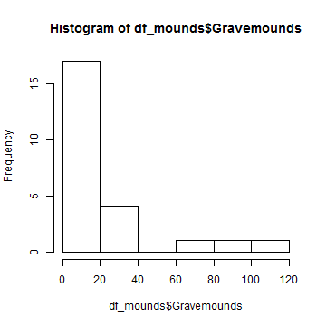
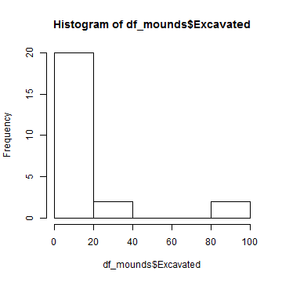
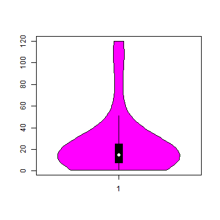
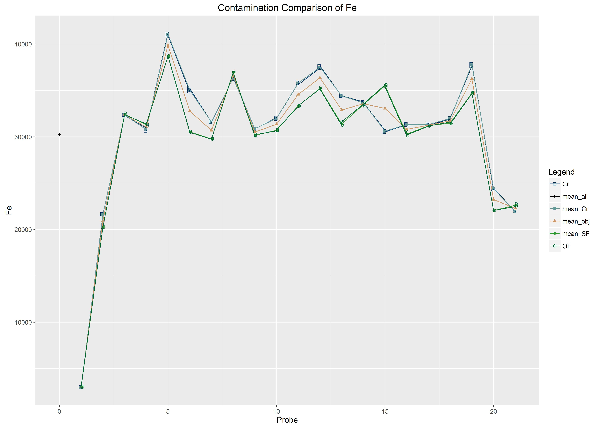

## 1.  Load Data | Where is your project at home?

<div style='position:absolute;bottom:10%;right:15%'>

</div>

---

## 1.  Load Data | Where is your project at home?


```r
wd <- "C:\\Folder\\Subfolder\\SubSubFolder"
setwd(wd)   

wd <- "/home/xxx/subFolder/SubSubFolder"
setwd(wd)

```


---

## 1.  Load Data | Loading a Data Table


```r
df_mounds <- read.table('gravemounds.csv', header=TRUE, sep=';')
# See ?read.table for further information

filename <- "gravemounds02.csv" # Creating a string vector 

# Writing a data frame
write.table(df_mounds, file = filename, quote = FALSE,
sep = ";", na = "NA", dec = ".", row.names = TRUE, col.names = TRUE)
```

---

## 1.  Load Data | Loading a Data Table


```r
df_mounds
```

```
##                    Nekropole Gravemounds Inhumation Incremation Epoche
## 1            Schelmenhostadt           8          y           y   both
## 2                  Heuschier           6                            BA
## 3                Wolfswinkel          33          y           y   both
## 4                  Deilsberg          14                      y     BA
## 5               Taubenhuebel          12          y           y   both
## 6                   Eichlach          16          y           y     BA
## 7                 Fischereck           7          y           y   both
## 8             Hatternstangen          18                      y     BA
## 9        Dachhuebel-Birklach          20          y           y     BA
## 10                Beckenmatt          31          y                 BA
## 11        Weisensee-Oberfeld          63          y           y   both
## 12                   Erzlach           5                            BA
## 13                 Donauberg          14          y           y   both
## 14               Koenigsberg          23          y           y   both
## 15 Fischerhuebel-Kurzgelaend          98          y           y   both
## 16           Schirrheinerweg          17          y           y   both
## 17                 Kirchlach         120          y           y   both
## 18                     Gries           5                          both
## 19                 Weitbruch          15          y           y     BA
## 20                 Harthouse          15          y           y   both
## 21                  Maegstub          31                          both
## 22              Oberstritten           1                            BA
## 23                  Ohlungen           3                      y     IA
## 24                 Uhlwiller          15                      y     IA
##    Excavated     Literature Bronze Ceramics Amber Gold Glass Iron Stone
## 1          8 Schaeffer 1926     43        8     9   NA     1    1     1
## 2          1 Schaeffer 1926     NA       NA    NA   NA    NA   NA    NA
## 3         12 Schaeffer 1930     13        9    NA   NA    NA   NA    NA
## 4          5 Schaeffer 1926     12        3     3    1     2   NA    NA
## 5          7 Schaeffer 1930     29        9     1   NA    NA   NA    NA
## 6          9 Schaeffer 1926      7        9    NA   NA    NA   NA     1
## 7          7 Schaeffer 1930     14        4    NA   NA    NA   NA     2
## 8          9 Schaeffer 1926      4       11    NA   NA    NA   NA    NA
## 9          7 Schaeffer 1926     23       13     4   NA    NA   NA    NA
## 10        26 Schaeffer 1926     15       24    NA   NA    NA   NA    NA
## 11        38 Schaeffer 1930     88       62     8    1    NA    5    NA
## 12         5 Schaeffer 1926      3       NA    NA   NA    NA   NA    NA
## 13        14 Schaeffer 1930     68       24    NA   NA     1    2    NA
## 14        20 Schaeffer 1930    257       50     7    3    11   30     6
## 15        89 Schaeffer 1930    304       90    20    2     8   19    13
## 16        13 Schaeffer 1930     62       11    NA    2     1    3     4
## 17       100 Schaeffer 1930    134      173    12   NA     3   13     4
## 18         2 Schaeffer 1930      7       18    NA   NA    NA   NA    NA
## 19         7 Schaeffer 1930     53       11    NA    2    NA    5    NA
## 20         9 Schaeffer 1930    118       19    NA   NA     2   10    16
## 21        13 Schaeffer 1930    309       23    10    3    10   31     9
## 22         1 Schaeffer 1926      8        1    NA   NA    NA   NA    NA
## 23         3 Schaeffer 1930    101       NA    12    4    16    3    12
## 24        14 Schaeffer 1930     49        1     1   NA     3    9     1
##    Coral       X       Y
## 1     NA 3419142 5416936
## 2     NA 3417717 5415907
## 3     NA 3421495 5415052
## 4     NA 3423415 5413753
## 5     NA 3419884 5414973
## 6     NA 3419139 5413198
## 7     NA 3416267 5413553
## 8     NA 3417327 5412854
## 9     NA 3412431 5412258
## 10    NA 3419640 5411492
## 11    NA 3422261 5411072
## 12    NA 3423314 5411595
## 13    NA 3424722 5411495
## 14     2 3425604 5412985
## 15     3 3422962 5409879
## 16     1 3421628 5408831
## 17    NA 3419741 5408021
## 18    NA 3412957 5404536
## 19    NA 3411268 5404405
## 20     1 3406774 5406406
## 21     1 3406705 5411437
## 22    NA 3412351 5418083
## 23     3 3405413 5410742
## 24    NA 3404224 5411166
```


*** =pnotes
Tabelle laden und prüfen ob alle Splaten richtig angelegt sind. ggf. anpassen

---

## 1.  Load Data | Creating new Data Frames using `subset`


```r
df_BA <- subset(df_mounds, df_mounds$Epoche == "BA")
df_BA_INH <- subset(df_mounds, df_mounds$Epoche == "BA" & df_mounds$Inhumation == "y")
str(df_BA_INH)
## 'data.frame':	4 obs. of  17 variables:
##  $ Nekropole  : Factor w/ 24 levels "Beckenmatt","Dachhuebel-Birklach",..: 5 2 1 23
##  $ Gravemounds: int  16 20 31 15
##  $ Inhumation : Factor w/ 2 levels "","y": 2 2 2 2
##  $ Incremation: Factor w/ 2 levels "","y": 2 2 1 2
##  $ Epoche     : Factor w/ 3 levels "BA","both","IA": 1 1 1 1
##  $ Excavated  : int  9 7 26 7
##  $ Literature : Factor w/ 2 levels "Schaeffer 1926",..: 1 1 1 2
##  $ Bronze     : int  7 23 15 53
##  $ Ceramics   : int  9 13 24 11
##  $ Amber      : int  NA 4 NA NA
##  $ Gold       : int  NA NA NA 2
##  $ Glass      : int  NA NA NA NA
##  $ Iron       : int  NA NA NA 5
##  $ Stone      : int  1 NA NA NA
##  $ Coral      : int  NA NA NA NA
##  $ X          : num  3419139 3412431 3419640 3411268
##  $ Y          : num  5413198 5412258 5411492 5404405
```

---

## 1.  Load Data | Save your current environement

<div style='position:absolute;bottom:10%;right:15%'>

</div>

---

## 1.  Load Data | Save your current environement

```r
save.image("7ws/name01.rws")
load("7ws/name01.rws")
```

--- .segue bg:grey

## 2.  Manipulate Data

<a class="btn btn-primary btn-large" href='https://isaakiel.github.io/index.html'>
 
</a>


--- &twocol

## 2.  Manipulate Data | How to choose a specific value

*** =left


```r
df <- df_mounds # Coping df_mounds
df[c(1:3),c(2,3)]
##   Gravemounds Inhumation
## 1           8          y
## 2           6           
## 3          33          y
df[3, c(1,3)]
##     Nekropole Inhumation
## 3 Wolfswinkel          y
```

*** =right

**... and to change it**


```r
df[c(6,7,8),3] <- NA # Asign these values with NA 
df[c(6,7,8),3]
## [1] <NA> <NA> <NA>
## Levels:  y
```

---

## 2.  Manipulate Data | How to choose a specific value

**vector[...]**

**df[ row , col ]**

**argument**|**effect**|Example
------|------|------
positive integer|returns **specified** elements|`c(1,3:4)` or `2`
negative integer|returns **all other** elements|`c(-1,-3:4)` or `-2`
blank spaces| returns **all**
names|return those with **specific names**|`c("name", "type")` or `"name"`
logical|returns elements, that corresponds to **TRUE**|`c(TRUE, FALSE)` or `TRUE`

---

## 2.  Manipulate Data | Adding new Columns


```r
df$newcol <- df$Excavated/df$Gravemounds*100
df$newcol
##  [1] 100.00000  16.66667  36.36364  35.71429  58.33333  56.25000 100.00000
##  [8]  50.00000  35.00000  83.87097  60.31746 100.00000 100.00000  86.95652
## [15]  90.81633  76.47059  83.33333  40.00000  46.66667  60.00000  41.93548
## [22] 100.00000 100.00000  93.33333
```

---

## 2.  Manipulate Data | Combine Data Frames


```r
merge(x, y, by = intersect(names(x), names(y)),
      by.x = by, by.y = by, all = FALSE, all.x = all, all.y = all,
      sort = TRUE, suffixes = c(".x",".y"),
      incomparables = NULL, ...)
```

---

## 2.  Manipulate Data | Merge Data Frames


```r
ndf<- merge(df_mounds, df, all.x=TRUE, all.y=FALSE, by.x="Nekropole",
                    by.y="Nekropole")
```

---

## 2.  Manipulate Data | Combine Data Frames


```r
str(ndf)
## 'data.frame':	24 obs. of  34 variables:
##  $ Nekropole    : Factor w/ 24 levels "Beckenmatt","Dachhuebel-Birklach",..: 1 2 3 4 5 6 7 8 9 10 ...
##  $ Gravemounds.x: int  31 20 14 14 16 5 7 98 5 15 ...
##  $ Inhumation.x : Factor w/ 2 levels "","y": 2 2 1 2 2 1 2 2 1 2 ...
##  $ Incremation.x: Factor w/ 2 levels "","y": 1 2 2 2 2 1 2 2 1 2 ...
##  $ Epoche.x     : Factor w/ 3 levels "BA","both","IA": 1 1 1 2 1 1 2 2 2 2 ...
##  $ Excavated.x  : int  26 7 5 14 9 5 7 89 2 9 ...
##  $ Literature.x : Factor w/ 2 levels "Schaeffer 1926",..: 1 1 1 2 1 1 2 2 2 2 ...
##  $ Bronze.x     : int  15 23 12 68 7 3 14 304 7 118 ...
##  $ Ceramics.x   : int  24 13 3 24 9 NA 4 90 18 19 ...
##  $ Amber.x      : int  NA 4 3 NA NA NA NA 20 NA NA ...
##  $ Gold.x       : int  NA NA 1 NA NA NA NA 2 NA NA ...
##  $ Glass.x      : int  NA NA 2 1 NA NA NA 8 NA 2 ...
##  $ Iron.x       : int  NA NA NA 2 NA NA NA 19 NA 10 ...
##  $ Stone.x      : int  NA NA NA NA 1 NA 2 13 NA 16 ...
##  $ Coral.x      : int  NA NA NA NA NA NA NA 3 NA 1 ...
##  $ X.x          : num  3419640 3412431 3423415 3424722 3419139 ...
##  $ Y.x          : num  5411492 5412258 5413753 5411495 5413198 ...
##  $ Gravemounds.y: int  31 20 14 14 16 5 7 98 5 15 ...
##  $ Inhumation.y : Factor w/ 2 levels "","y": 2 2 1 2 NA 1 NA 2 1 2 ...
##  $ Incremation.y: Factor w/ 2 levels "","y": 1 2 2 2 2 1 2 2 1 2 ...
##  $ Epoche.y     : Factor w/ 3 levels "BA","both","IA": 1 1 1 2 1 1 2 2 2 2 ...
##  $ Excavated.y  : int  26 7 5 14 9 5 7 89 2 9 ...
##  $ Literature.y : Factor w/ 2 levels "Schaeffer 1926",..: 1 1 1 2 1 1 2 2 2 2 ...
##  $ Bronze.y     : int  15 23 12 68 7 3 14 304 7 118 ...
##  $ Ceramics.y   : int  24 13 3 24 9 NA 4 90 18 19 ...
##  $ Amber.y      : int  NA 4 3 NA NA NA NA 20 NA NA ...
##  $ Gold.y       : int  NA NA 1 NA NA NA NA 2 NA NA ...
##  $ Glass.y      : int  NA NA 2 1 NA NA NA 8 NA 2 ...
##  $ Iron.y       : int  NA NA NA 2 NA NA NA 19 NA 10 ...
##  $ Stone.y      : int  NA NA NA NA 1 NA 2 13 NA 16 ...
##  $ Coral.y      : int  NA NA NA NA NA NA NA 3 NA 1 ...
##  $ X.y          : num  3419640 3412431 3423415 3424722 3419139 ...
##  $ Y.y          : num  5411492 5412258 5413753 5411495 5413198 ...
##  $ newcol       : num  83.9 35 35.7 100 56.2 ...
```

---

## 2.  Manipulate Data | Combine Data Frames


```r
cbind(x,y) # Combines data frames columnwise
rbind(x,y) # Combines data frames rowise
```

*** =pnotes

If there are several matrix arguments, they must all have the same number of columns (or rows) and this will be the number of columns (or rows) of the result. If all the arguments are vectors, the number of columns (rows) in the result is equal to the length of the longest vector. Values in shorter arguments are recycled to achieve this length (with a warning if they are recycled only fractionally).

---

## 2.  Manipulate Data | Unique 

 

```r
unique(x, incomparables = FALSE, fromLast = FALSE, ...)
```

**... `unique()` returns a vector, data frame or array like x but with duplicate elements/rows removed.**


```r
df <- data.frame(V1 = c(1,1,1), V2 = c(2,2,2), V3 = c("A","A","B"))
unique(df)
##   V1 V2 V3
## 1  1  2  A
## 3  1  2  B
uni_v3 <- unique(df$V3)
uni_v3
## [1] A B
## Levels: A B
```

---

## 2.  Manipulate Data | Unique 


```r
duplicated(x, incomparables = FALSE, fromLast = FALSE, nmax = NA, ...)
```

**... `duplicated()` determines which elements of a vector or data frame are duplicates of elements with smaller subscripts, and returns a logical vector indicating which elements (rows) are duplicates.**


```r
df 
##   V1 V2 V3
## 1  1  2  A
## 2  1  2  A
## 3  1  2  B
duplicated(x = df, fromLast = TRUE)
## [1]  TRUE FALSE FALSE
```

--- .segue bg:grey

## 3.  Loops and Restrictions

<a class="btn btn-primary btn-large" href='https://isaakiel.github.io/index.html'>
 
</a>

--- 

## 3.  Loops and Restrictions

Loops repeat statements


```r
# Loops repeat statements
a <- 1
for (i in 1:20){
a <- a+a
}
```

--- 

## 3.  Loops and Restrictions

Loops repeat statements


```r
# Loops repeat statements
a <- 1
for (i in 1:20){
a <- a+a
}

a
## [1] 1048576
```

--- 

## 3.  Loops and Restrictions


```r
# conditions restrict statements
i <- 1
a <- 1

while (a <55){
a <-a+a
i=i+1
}
```

--- 

## 3.  Loops and Restrictions


```r
# conditions restrict statements
i <- 1
a <- 1

while (a <55){
a <-a+a
i=i+1
}

a
## [1] 64
i
## [1] 7
```

--- 

## 3.  Loops and Restrictions


```r
# conditions restrict statements
if (a>55){
a <- a/2
} else {
a <- a*2
}
```

--- 

## 3.  Loops and Restrictions


```r
# conditions restrict statements
a 
## [1] 32

if (a>55){
a <- a/2
} else {
a <- a*2
}
a
## [1] 64
```

--- 

## 3.  Loops and Restrictions

Loops or Restrictions|**starts**|**Condistions**|**Indside**|**Ends**
------|------|------|------|------
Loop|`for`|`(i in "repetition")`|`{ result <- "functions to apply"`|`}` in a seperate line
Restrictions|`while`|`(i in "condition")`|`{ result <- "functions to apply"`|`}` in a seperate line
Restrictions|`if` in combination with `else`|`(i in "condition")`|`{ result <- "functions to apply"`|`}` in a seperate line
Restrictions|`else`|`(i in "condition")`|`{ result <- "functions to apply"`|`}` in a seperate line

--- .segue bg:grey

## 4.  Package management

<a class="btn btn-primary btn-large" href='https://isaakiel.github.io/index.html'>
 
</a>

---

## 4.  Package management

Package management:


```r
old.packages()                        # Your currently installed packages

update.packages()                     # Update all Packages
update.packages("package-name")       # Update a specific package
```

Loading Packages:


```r
install.packages("package-name")    # Download and install the named package
```

Using Packages:


```r
library(package-name)               # Loading packages every time you restart R!
```

--- .segue bg:grey

## 5.  Plots

<a class="btn btn-primary btn-large" href='https://isaakiel.github.io/index.html'>
 
</a>


--- &twocol

## 5. Plots | Histogram

*** =left


```r
hist_gm <- hist(df_mounds$Gravemounds)
```




*** =right


```r
hist_ex <- hist(df_mounds$Excavated)
```



---

## 5. Plots | Histogram


```r
plot(hist_gm, main="Gravemounds of Haguenau Froest", xlab="Number of Gravemounds",
     sub="Schaeffer 1926/1930", col="dark red")
```


--- 

## Plots | Violinplots


```r
library(vioplot)
vioplot(df_mounds$Gravemounds)
```



---

## Plots | ggplot2


```r
library(ggplot2)
```

<div style='position:absolute;bottom:10%;right:5%'>

</div>

<a class="btn btn-primary btn-large" href='https://plot.ly/ggplot2/'>
 
</a>

---

##  Exercise 3


```r
# 1. Set your working directory.
# 2. Load gravemound.csv
# 3. Save created Data Frame of Iron Age graves using `subset`
# 4. Save this Data Frame in your Subfolder `2data`
# 5. Explore following functions `rbind()` and `cbind`
# 6. Create and edit a Histogramm and a Violinplot.
# 7. Use `?plot` to create a scatterplot.
# 8. Download and load all neccessary packages for our next lecture.
```

--- &twocol

## Presentations

*** =left

**Monday, 5th of September**

1. [Interaction as a key term](01-interaction/index.html)

**Tuesday, 6th of September**

1. [Introduction to R](02-introduction/index.html)
2. [R Basics: Frist Steps](03-R_basics01/index.html)
3. [R Basics: Getting used to R](04-R_basics02/index.html)
4. [Using R as GIS](05-R_GIS/index.html)
5. [**Workshop:** Basic Spatial Statistics](06-WS_Basic_Spatial_Statistics/index.html)

*** =right

**Wednesday, 7th of September**

1. [Modelling Interaction: Cultural & Geographic Distance](07-cul_distances/index.html)
2. [**Workshop**: Geographical and Economic Distances](08-WS_Geo_Eco_Distances/index.html)
3. [**Workshop:** Cultural Distances](09-WS_Cul_Distances/index.html)

**Thursday, 8th of September**

1. [Modelling Interaction: Network Approaches](10-Network_Analysis/index.html)
2. [**Workshop:** Pointpattern Analysis](11-WS_Pointpattern/index.html)
3. [**Workshop:** Network Analysis](12-WS_Network/index.html)

<a class="btn btn-primary btn-large" href='https://isaakiel.github.io/index.html'>
 
</a>

---

<a class="btn btn-primary btn-large" href='https://isaakiel.github.io/index.html'>
 
 
</a>


