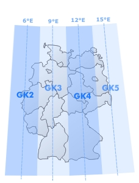

## Packages

**Package**|Properties|pdf
----|----|----
`raster`|Reading, writing, manipulating, analyzing and modeling of gridded spatial data. The package implements basic and high-level functions. Processing of very large files is supported.|https://cran.r-project.org/web/packages/raster/raster.pdf
`rgdal`|Both GDAL raster and OGR vector map data can be imported into R, and GDAL raster data and OGR vector data exported. Use is made of classes defined in the sp package.|https://cran.r-project.org/web/packages/rgdal/rgdal.pdf
`spded`| collection of functions to create spatial weights matrix objects from polygon contiguities, from point patterns by distance and tessellations, for summarizing these objects, and for permitting their use in spatial data analysis, including regional aggregation by minimum spanning tree...|https://cran.r-project.org/web/packages/spdep/spdep.pdf

--- .segue bg:grey

## 1.  Load Spatial Objects

<a class="btn btn-primary btn-large" href='https://isaakiel.github.io/index.html'>
 
</a>

---

## 1.  Load Spatial Objects | Spatial Points Data Frame

```{r collapse=TRUE}
library(rgdal)
file_gravemounds <- "gravemounds"
spdf_gm <- readOGR("2data", file_gravemounds)
class(spdf_gm)
```

---

## SpatialPointsDataFrame | Data

```{r collapse=TRUE}
str(spdf_gm@data)
```

---

## SpatialPointsDataFrame | Coordinates

```{r collapse=TRUE}
str(spdf_gm@coords.nrs)
```

---

## SpatialPointsDataFrame | Coordinates

```{r collapse=TRUE}
str(spdf_gm@coords)
```

---

## SpatialPointsDataFrame | Bonding Box

```{r collapse=TRUE}
str(spdf_gm@bbox)
```

---

## SpatialPointsDataFrame | Projection Information

```{r collapse=TRUE}
str(spdf_gm@proj4string)
```

---

## SpatialPointsDataFrame

```{r collapse=TRUE, fig.align='right', fig.height=6, fig.width=6}
plot(spdf_gm)
```

---

## 1.  Load Spatial Objects | Spatial Grid Data Frame

```{r collapse=TRUE}
library(raster)
file_srtm  <- "3geodata/bw_srtm.asc" # path to srtm DTM 
sgdf_srtm <- read.asciigrid(file_srtm) 
class(sgdf_srtm)
```

---

## 1.  Load Spatial Objects | Spatial Grid Data Frame

```{r collapse=TRUE,  fig.align='right', fig.height=6, fig.width=6}
plot(sgdf_srtm)
```

---

## SpatialGridDataFrame | Data

```{r}
str(sgdf_srtm@data)
```

---

##  SpatialGridDataFrame | Grid

```{r}
str(sgdf_srtm@grid)
```

---

##  SpatialGridDataFrame | Bonding Box

```{r}
str(sgdf_srtm@bbox)
```

---

##  SpatialGridDataFrame | Projection Information

```{r}
str(sgdf_srtm@proj4string)
```

--- .segue bg:grey

## 2.  Create Spatial Objects 

<a class="btn btn-primary btn-large" href='https://isaakiel.github.io/index.html'>
 
</a>

---

## 2.  Create Spatial Objects | Spatial Points Data Frame

```{r collapse=TRUE}
file_gm <- "2data/gravemounds.csv"
crs1 <- "+proj=tmerc +lat_0=0 +lon_0=9 +k=1 +x_0=3500000 +y_0=0 +ellps=WGS84 +units=m +no_defs" # gk3
df_gm <- read.table(file_gm, sep=';', header=TRUE)
spdf_gm01 <- df_gm
coordinates(spdf_gm01)=~X+Y
projection(spdf_gm01)  <- crs1
class(spdf_gm01)
```

---

## 2.  Create Spatial Objects | Spatial Points Data Frame

```{r fig.align='right', fig.height=6, fig.width=6}
plot(spdf_gm01)
```

---

## 2.  Create Spatial Objects | Spatial Lines Data Frame

```{r collapse=TRUE}
library(spdep)
fs_nb_del <- tri2nb(coordinates(spdf_gm)) # Creating a List of Neighbours
coords <- as.matrix(coordinates(spdf_gm)) # extracting gravemound coordinates as a matrix
# Creating a Delauny Graph as a Spatial Lines Data Frame
del <- nb2lines(fs_nb_del,  coords=coords, proj4string = CRS(as.character(crs1)))
class(del)
```

---

## 2.  Create Spatial Objects | Spatial Lines Data Frame

```{r collapse=TRUE, fig.align='right', fig.height=6, fig.width=6}
plot(del)
```

---

## SpatialLinesDataFrame | Data

```{r}
str(del@data)
```

---

## SpatialLinesDataFrame | Lines

```{r}
str(del@lines)
```

---

## SpatialLinesDataFrame | Lines > Coordinates

```{r collapse=TRUE}
str(del@lines$coords)
str(del@lines[1])
```

--- .segue bg:grey

## 3.  Manipulate Spatial Objects

<a class="btn btn-primary btn-large" href='https://isaakiel.github.io/index.html'>
 
</a>

--- 

## 3.  Manipulate Spatial Objects | How to crop?

```{r  collapse=TRUE, fig.align='right', fig.height=5, fig.width=5}
ext <- extent(3404224, 3425604, 5404405, 5418083)
raster_srtm <- raster(sgdf_srtm)
sgdf_ai <- crop(raster_srtm, ext, snap='near', overwrite=TRUE)
sgdf_alsace <- as(sgdf_ai, 'SpatialGridDataFrame')
plot(sgdf_alsace)
```

---

## Raster 

```{r collapse=TRUE, fig.align='right', fig.height=5, fig.width=5}
class(raster)
plot(raster_srtm)
```

---

## Raster | File

```{r collapse=TRUE}
str(raster_srtm@file)
```

---

## Raster | Data

```{r collapse=TRUE}
str(raster_srtm@data)
```

---

## Raster | Legend & Title

```{r collapse=TRUE}
str(raster_srtm@legend)
str(raster_srtm@title)
```

---

## Raster | Extent, Coulmns & Rows

```{r collapse=TRUE}
str(raster_srtm@extent)
str(raster_srtm@ncols)
str(raster_srtm@nrows)
```

---

## Raster | Others...

```{r collapse=TRUE}
str(raster_srtm@rotated)
str(raster_srtm@rotation)
```

---

## Raster | Others...

```{r collapse=TRUE}
str(raster_srtm@crs)
str(raster_srtm@history)
str(raster_srtm@z)
```

--- .segue bg:grey

## 4.  Reproject Spatial Data

<a class="btn btn-primary btn-large" href='https://isaakiel.github.io/index.html'>
 
</a>

---

## 4.  Reproject Spatial Data

<div style='position:absolute;bottom:15%;right:10%'>
    
</div>

<div style='position:absolute;Bottom:15%;left:10%'>
    
</div>

<div style='position:absolute;bottom:10%;right:5%;font-size:10px'>
  <a href="http://www.geocontent.de/uploads/RTEmagicC_karte_gk.jpg.jpg" title="User:Gauss Krueger Zone 3">
  Gauss Krueger</a> , http://www.geocontent.de/uploads/RTEmagicC_karte_gk.jpg.jpg
</div>

<div style='position:absolute;bottom:12%;right:5%;font-size:10px'>
  <a href="http://earth-info.nga.mil/GandG/publications/tr8350.2/TR8350.2-b/Sections%201-5.pdf" title="User:WGS 1984">
  WGS 1984</a> , http://earth-info.nga.mil/GandG/publications/tr8350.2/TR8350.2-b/Sections%201-5.pdf
</div>

---

## 4.  Reproject Spatial Data


```{r collapse=TRUE, eval=FALSE}
# creating a spdf, if not allready existing
coordinates(spdf)=~x+y
# Project Corrdinates
coo  <- project(cbind(spdf@coords[,1], spdf@coords[,2]),crs1) 
# create a spdf
spdf <- SpatialPointsDataFrame(coo , as.data.frame(df)
                               ,proj4string=CRS(as.character(crs1))) 
```

--- .segue bg:grey

## 5.  Plot Spatial Objects

<a class="btn btn-primary btn-large" href='https://isaakiel.github.io/index.html'>
 
</a>

---

## 5.  Plot Spatial Objects

```{r collapse=TRUE, fig.align='right', fig.height=5, fig.width=5}
plot(sgdf_alsace, col = grey.colors(50, start=0.98, end=0.1), main="Gravemounds of Haguenau")
```

---

## 5.  Plot Spatial Objects

```{r collapse=TRUE, fig.align='right', fig.height=5, fig.width=5}
plot(sgdf_alsace, col = grey.colors(50, start=0.98, end=0.1), main="Gravemounds of Haguenau")
points(spdf_gm, col="dark red", pch=15)
legend("bottomright", cex=0.7, legend=c("Gravemounds"), pch=15,col="dark red")
```

---

## 5.  Plot Spatial Objects

```{r collapse=TRUE, fig.align='right', fig.height=5, fig.width=5}
plot(sgdf_alsace, col = grey.colors(50, start=0.98, end=0.1), main="Gravemounds of Haguenau")
points(spdf_gm, col="dark red", pch=15)
lines(del, col="black")
legend("bottomright", cex=0.7, legend=c("Gravemounds"), pch=15,col="dark red")
```


--- .segue bg:grey

## 6. Summary 

<a class="btn btn-primary btn-large" href='https://isaakiel.github.io/index.html'>
 
</a>

---

## 6.   Summary 

**Spatial Object**|Short|Slots|`function`
----|----|----|----|----
Spatial **Points** Data Frame|spdf|@data; @coords.nrs; @coords; @bbox; @porj4string|`SpatialPointsDataFrame()`
Spatial **Grid** Data Frame|sgdf|@data; @grid; @bbox; @porj4string|`SpatialGridDataFrame()`
Spatial **Lines** Data Frame|sldf|@data; @lines|`SpatialLinesDataFrame()`
**raster**|ras|@file; @data; @legend; @title; @extent; @rotated; @rotation; @ncols; @nrows; @crs; @history; @z|`raster()`

---

<a class="btn btn-primary btn-large" href='https://isaakiel.github.io/index.html'>
 
 
</a>


