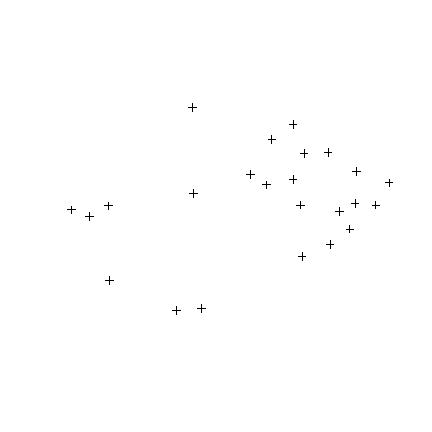
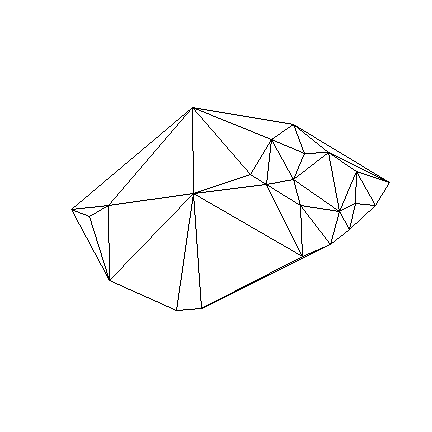
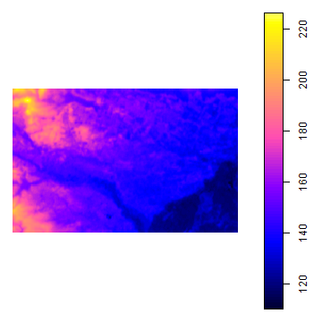

## Packages

**Package**|Properties|pdf
----|----|----
`raster`|Reading, writing, manipulating, analyzing and modeling of gridded spatial data. The package implements basic and high-level functions. Processing of very large files is supported.|https://cran.r-project.org/web/packages/raster/raster.pdf
`rgdal`|Both GDAL raster and OGR vector map data can be imported into R, and GDAL raster data and OGR vector data exported. Use is made of classes defined in the sp package.|https://cran.r-project.org/web/packages/rgdal/rgdal.pdf
`spded`| collection of functions to create spatial weights matrix objects from polygon contiguities, from point patterns by distance and tessellations, for summarizing these objects, and for permitting their use in spatial data analysis, including regional aggregation by minimum spanning tree...|https://cran.r-project.org/web/packages/spdep/spdep.pdf

--- .segue bg:grey

## 1.  Load Spatial Objects

<a class="btn btn-primary btn-large" href='https://isaakiel.github.io/index.html'>
 
</a>

---

## 1.  Load Spatial Objects | Spatial Points Data Frame


```r
library(rgdal)
file_gravemounds <- "gravemounds"
spdf_gm <- readOGR("2data", file_gravemounds)
## OGR data source with driver: ESRI Shapefile 
## Source: "2data", layer: "gravemounds"
## with 24 features
## It has 17 fields
class(spdf_gm)
## [1] "SpatialPointsDataFrame"
## attr(,"package")
## [1] "sp"
```

---

## SpatialPointsDataFrame | Data


```r
str(spdf_gm@data)
## 'data.frame':	24 obs. of  17 variables:
##  $ Nekropole : Factor w/ 24 levels "Beckenmatt","Dachhuebel-Birklach",..: 18 12 24 3 20 5 7 11 2 1 ...
##  $ Gravemound: int  8 6 33 14 12 16 7 18 20 31 ...
##  $ Inhumation: Factor w/ 1 level "y": 1 NA 1 NA 1 1 1 NA 1 1 ...
##  $ Incrematio: Factor w/ 1 level "y": 1 NA 1 1 1 1 1 1 1 NA ...
##  $ Epoche    : Factor w/ 3 levels "BA","both","IA": 2 1 2 1 2 1 2 1 1 1 ...
##  $ Excavated : int  8 1 12 5 7 9 7 9 7 26 ...
##  $ Literature: Factor w/ 2 levels "Schaeffer 1926",..: 1 1 2 1 2 1 2 1 1 1 ...
##  $ Bronze    : int  43 NA 13 12 29 7 14 4 23 15 ...
##  $ Ceramics  : int  8 NA 9 3 9 9 4 11 13 24 ...
##  $ Amber     : int  9 NA NA 3 1 NA NA NA 4 NA ...
##  $ Gold      : int  NA NA NA 1 NA NA NA NA NA NA ...
##  $ Glass     : int  1 NA NA 2 NA NA NA NA NA NA ...
##  $ Iron      : int  1 NA NA NA NA NA NA NA NA NA ...
##  $ Stone     : int  1 NA NA NA NA 1 2 NA NA NA ...
##  $ Coral     : int  NA NA NA NA NA NA NA NA NA NA ...
##  $ X         : num  3419142 3417717 3421495 3423415 3419884 ...
##  $ Y         : num  5416936 5415907 5415052 5413753 5414973 ...
```

---

## SpatialPointsDataFrame | Coordinates


```r
str(spdf_gm@coords.nrs)
##  num(0)
```

---

## SpatialPointsDataFrame | Coordinates


```r
str(spdf_gm@coords)
##  num [1:24, 1:2] 3419142 3417717 3421495 3423415 3419884 ...
##  - attr(*, "dimnames")=List of 2
##   ..$ : NULL
##   ..$ : chr [1:2] "coords.x1" "coords.x2"
```

---

## SpatialPointsDataFrame | Bonding Box


```r
str(spdf_gm@bbox)
##  num [1:2, 1:2] 3404224 5404405 3425604 5418083
##  - attr(*, "dimnames")=List of 2
##   ..$ : chr [1:2] "coords.x1" "coords.x2"
##   ..$ : chr [1:2] "min" "max"
```

---

## SpatialPointsDataFrame | Projection Information


```r
str(spdf_gm@proj4string)
## Formal class 'CRS' [package "sp"] with 1 slot
##   ..@ projargs: chr "+proj=tmerc +lat_0=0 +lon_0=9 +k=1 +x_0=3500000 +y_0=0 +datum=potsdam +units=m +no_defs +ellps=bessel +towgs84=598.1,73.7,418.2"| __truncated__
```

---

## SpatialPointsDataFrame


```r
plot(spdf_gm)
```



---

## 1.  Load Spatial Objects | Spatial Grid Data Frame


```r
library(raster)
file_srtm  <- "3geodata/bw_srtm.asc" # path to srtm DTM 
sgdf_srtm <- read.asciigrid(file_srtm) 
class(sgdf_srtm)
## [1] "SpatialGridDataFrame"
## attr(,"package")
## [1] "sp"
```

---

## 1.  Load Spatial Objects | Spatial Grid Data Frame


```r
plot(sgdf_srtm)
```


---

## SpatialGridDataFrame | Data


```r
str(sgdf_srtm@data)
```

```
## 'data.frame':	15860650 obs. of  1 variable:
##  $ 3geodata/bw_srtm.asc: num  197 197 197 197 197 ...
```

---

##  SpatialGridDataFrame | Grid


```r
str(sgdf_srtm@grid)
```

```
## Formal class 'GridTopology' [package "sp"] with 3 slots
##   ..@ cellcentre.offset: num [1:2] 3347909 5206717
##   ..@ cellsize         : num [1:2] 90 90
##   ..@ cells.dim        : int [1:2] 4225 3754
```

---

##  SpatialGridDataFrame | Bonding Box


```r
str(sgdf_srtm@bbox)
```

```
##  num [1:2, 1:2] 3347864 5206672 3728114 5544532
##  - attr(*, "dimnames")=List of 2
##   ..$ : NULL
##   ..$ : chr [1:2] "min" "max"
```

---

##  SpatialGridDataFrame | Projection Information


```r
str(sgdf_srtm@proj4string)
```

```
## Formal class 'CRS' [package "sp"] with 1 slot
##   ..@ projargs: chr NA
```

--- .segue bg:grey

## 2.  Create Spatial Objects 

<a class="btn btn-primary btn-large" href='https://isaakiel.github.io/index.html'>
 
</a>

---

## 2.  Create Spatial Objects | Spatial Points Data Frame


```r
file_gm <- "2data/gravemounds.csv"
crs1 <- "+proj=tmerc +lat_0=0 +lon_0=9 +k=1 +x_0=3500000 +y_0=0 +ellps=WGS84 +units=m +no_defs" # gk3
df_gm <- read.table(file_gm, sep=';', header=TRUE)
spdf_gm01 <- df_gm
coordinates(spdf_gm01)=~X+Y
projection(spdf_gm01)  <- crs1
class(spdf_gm01)
## [1] "SpatialPointsDataFrame"
## attr(,"package")
## [1] "sp"
```

---

## 2.  Create Spatial Objects | Spatial Points Data Frame


```r
plot(spdf_gm01)
```


---

## 2.  Create Spatial Objects | Spatial Lines Data Frame


```r
library(spdep)
fs_nb_del <- tri2nb(coordinates(spdf_gm)) # Creating a List of Neighbours
coords <- as.matrix(coordinates(spdf_gm)) # extracting gravemound coordinates as a matrix
# Creating a Delauny Graph as a Spatial Lines Data Frame
del <- nb2lines(fs_nb_del,  coords=coords, proj4string = CRS(as.character(crs1)))
class(del)
## [1] "SpatialLinesDataFrame"
## attr(,"package")
## [1] "sp"
```

---

## 2.  Create Spatial Objects | Spatial Lines Data Frame


```r
plot(del)
```



---

## SpatialLinesDataFrame | Data


```r
str(del@data)
```

```
## 'data.frame':	118 obs. of  5 variables:
##  $ i   : int  1 1 1 1 1 2 2 2 2 2 ...
##  $ j   : int  2 3 5 14 22 1 5 6 7 8 ...
##  $ i_ID:Class 'AsIs'  chr [1:118] "1" "1" "1" "1" ...
##  $ j_ID:Class 'AsIs'  chr [1:118] "2" "3" "5" "14" ...
##  $ wt  : num  1 1 1 1 1 1 1 1 1 1 ...
```

---

## SpatialLinesDataFrame | Lines


```r
str(del@lines)
```

```
## List of 118
##  $ :Formal class 'Lines' [package "sp"] with 2 slots
##   .. ..@ Lines:List of 1
##   .. .. ..$ :Formal class 'Line' [package "sp"] with 1 slot
##   .. .. .. .. ..@ coords: num [1:2, 1:2] 3419142 3417717 5416936 5415907
##   .. .. .. .. .. ..- attr(*, "dimnames")=List of 2
##   .. .. .. .. .. .. ..$ : NULL
##   .. .. .. .. .. .. ..$ : chr [1:2] "xx" "yy"
##   .. ..@ ID   : chr "1"
##  $ :Formal class 'Lines' [package "sp"] with 2 slots
##   .. ..@ Lines:List of 1
##   .. .. ..$ :Formal class 'Line' [package "sp"] with 1 slot
##   .. .. .. .. ..@ coords: num [1:2, 1:2] 3419142 3421495 5416936 5415052
##   .. .. .. .. .. ..- attr(*, "dimnames")=List of 2
##   .. .. .. .. .. .. ..$ : NULL
##   .. .. .. .. .. .. ..$ : chr [1:2] "xx" "yy"
##   .. ..@ ID   : chr "2"
##  $ :Formal class 'Lines' [package "sp"] with 2 slots
##   .. ..@ Lines:List of 1
##   .. .. ..$ :Formal class 'Line' [package "sp"] with 1 slot
##   .. .. .. .. ..@ coords: num [1:2, 1:2] 3419142 3419884 5416936 5414973
##   .. .. .. .. .. ..- attr(*, "dimnames")=List of 2
##   .. .. .. .. .. .. ..$ : NULL
##   .. .. .. .. .. .. ..$ : chr [1:2] "xx" "yy"
##   .. ..@ ID   : chr "3"
##  $ :Formal class 'Lines' [package "sp"] with 2 slots
##   .. ..@ Lines:List of 1
##   .. .. ..$ :Formal class 'Line' [package "sp"] with 1 slot
##   .. .. .. .. ..@ coords: num [1:2, 1:2] 3419142 3425604 5416936 5412985
##   .. .. .. .. .. ..- attr(*, "dimnames")=List of 2
##   .. .. .. .. .. .. ..$ : NULL
##   .. .. .. .. .. .. ..$ : chr [1:2] "xx" "yy"
##   .. ..@ ID   : chr "4"
##  $ :Formal class 'Lines' [package "sp"] with 2 slots
##   .. ..@ Lines:List of 1
##   .. .. ..$ :Formal class 'Line' [package "sp"] with 1 slot
##   .. .. .. .. ..@ coords: num [1:2, 1:2] 3419142 3412351 5416936 5418083
##   .. .. .. .. .. ..- attr(*, "dimnames")=List of 2
##   .. .. .. .. .. .. ..$ : NULL
##   .. .. .. .. .. .. ..$ : chr [1:2] "xx" "yy"
##   .. ..@ ID   : chr "5"
##  $ :Formal class 'Lines' [package "sp"] with 2 slots
##   .. ..@ Lines:List of 1
##   .. .. ..$ :Formal class 'Line' [package "sp"] with 1 slot
##   .. .. .. .. ..@ coords: num [1:2, 1:2] 3417717 3419142 5415907 5416936
##   .. .. .. .. .. ..- attr(*, "dimnames")=List of 2
##   .. .. .. .. .. .. ..$ : NULL
##   .. .. .. .. .. .. ..$ : chr [1:2] "xx" "yy"
##   .. ..@ ID   : chr "6"
##  $ :Formal class 'Lines' [package "sp"] with 2 slots
##   .. ..@ Lines:List of 1
##   .. .. ..$ :Formal class 'Line' [package "sp"] with 1 slot
##   .. .. .. .. ..@ coords: num [1:2, 1:2] 3417717 3419884 5415907 5414973
##   .. .. .. .. .. ..- attr(*, "dimnames")=List of 2
##   .. .. .. .. .. .. ..$ : NULL
##   .. .. .. .. .. .. ..$ : chr [1:2] "xx" "yy"
##   .. ..@ ID   : chr "7"
##  $ :Formal class 'Lines' [package "sp"] with 2 slots
##   .. ..@ Lines:List of 1
##   .. .. ..$ :Formal class 'Line' [package "sp"] with 1 slot
##   .. .. .. .. ..@ coords: num [1:2, 1:2] 3417717 3419139 5415907 5413198
##   .. .. .. .. .. ..- attr(*, "dimnames")=List of 2
##   .. .. .. .. .. .. ..$ : NULL
##   .. .. .. .. .. .. ..$ : chr [1:2] "xx" "yy"
##   .. ..@ ID   : chr "8"
##  $ :Formal class 'Lines' [package "sp"] with 2 slots
##   .. ..@ Lines:List of 1
##   .. .. ..$ :Formal class 'Line' [package "sp"] with 1 slot
##   .. .. .. .. ..@ coords: num [1:2, 1:2] 3417717 3416267 5415907 5413553
##   .. .. .. .. .. ..- attr(*, "dimnames")=List of 2
##   .. .. .. .. .. .. ..$ : NULL
##   .. .. .. .. .. .. ..$ : chr [1:2] "xx" "yy"
##   .. ..@ ID   : chr "9"
##  $ :Formal class 'Lines' [package "sp"] with 2 slots
##   .. ..@ Lines:List of 1
##   .. .. ..$ :Formal class 'Line' [package "sp"] with 1 slot
##   .. .. .. .. ..@ coords: num [1:2, 1:2] 3417717 3417327 5415907 5412854
##   .. .. .. .. .. ..- attr(*, "dimnames")=List of 2
##   .. .. .. .. .. .. ..$ : NULL
##   .. .. .. .. .. .. ..$ : chr [1:2] "xx" "yy"
##   .. ..@ ID   : chr "10"
##  $ :Formal class 'Lines' [package "sp"] with 2 slots
##   .. ..@ Lines:List of 1
##   .. .. ..$ :Formal class 'Line' [package "sp"] with 1 slot
##   .. .. .. .. ..@ coords: num [1:2, 1:2] 3417717 3412351 5415907 5418083
##   .. .. .. .. .. ..- attr(*, "dimnames")=List of 2
##   .. .. .. .. .. .. ..$ : NULL
##   .. .. .. .. .. .. ..$ : chr [1:2] "xx" "yy"
##   .. ..@ ID   : chr "11"
##  $ :Formal class 'Lines' [package "sp"] with 2 slots
##   .. ..@ Lines:List of 1
##   .. .. ..$ :Formal class 'Line' [package "sp"] with 1 slot
##   .. .. .. .. ..@ coords: num [1:2, 1:2] 3421495 3419142 5415052 5416936
##   .. .. .. .. .. ..- attr(*, "dimnames")=List of 2
##   .. .. .. .. .. .. ..$ : NULL
##   .. .. .. .. .. .. ..$ : chr [1:2] "xx" "yy"
##   .. ..@ ID   : chr "12"
##  $ :Formal class 'Lines' [package "sp"] with 2 slots
##   .. ..@ Lines:List of 1
##   .. .. ..$ :Formal class 'Line' [package "sp"] with 1 slot
##   .. .. .. .. ..@ coords: num [1:2, 1:2] 3421495 3423415 5415052 5413753
##   .. .. .. .. .. ..- attr(*, "dimnames")=List of 2
##   .. .. .. .. .. .. ..$ : NULL
##   .. .. .. .. .. .. ..$ : chr [1:2] "xx" "yy"
##   .. ..@ ID   : chr "13"
##  $ :Formal class 'Lines' [package "sp"] with 2 slots
##   .. ..@ Lines:List of 1
##   .. .. ..$ :Formal class 'Line' [package "sp"] with 1 slot
##   .. .. .. .. ..@ coords: num [1:2, 1:2] 3421495 3419884 5415052 5414973
##   .. .. .. .. .. ..- attr(*, "dimnames")=List of 2
##   .. .. .. .. .. .. ..$ : NULL
##   .. .. .. .. .. .. ..$ : chr [1:2] "xx" "yy"
##   .. ..@ ID   : chr "14"
##  $ :Formal class 'Lines' [package "sp"] with 2 slots
##   .. ..@ Lines:List of 1
##   .. .. ..$ :Formal class 'Line' [package "sp"] with 1 slot
##   .. .. .. .. ..@ coords: num [1:2, 1:2] 3421495 3419139 5415052 5413198
##   .. .. .. .. .. ..- attr(*, "dimnames")=List of 2
##   .. .. .. .. .. .. ..$ : NULL
##   .. .. .. .. .. .. ..$ : chr [1:2] "xx" "yy"
##   .. ..@ ID   : chr "15"
##  $ :Formal class 'Lines' [package "sp"] with 2 slots
##   .. ..@ Lines:List of 1
##   .. .. ..$ :Formal class 'Line' [package "sp"] with 1 slot
##   .. .. .. .. ..@ coords: num [1:2, 1:2] 3421495 3422261 5415052 5411072
##   .. .. .. .. .. ..- attr(*, "dimnames")=List of 2
##   .. .. .. .. .. .. ..$ : NULL
##   .. .. .. .. .. .. ..$ : chr [1:2] "xx" "yy"
##   .. ..@ ID   : chr "16"
##  $ :Formal class 'Lines' [package "sp"] with 2 slots
##   .. ..@ Lines:List of 1
##   .. .. ..$ :Formal class 'Line' [package "sp"] with 1 slot
##   .. .. .. .. ..@ coords: num [1:2, 1:2] 3421495 3425604 5415052 5412985
##   .. .. .. .. .. ..- attr(*, "dimnames")=List of 2
##   .. .. .. .. .. .. ..$ : NULL
##   .. .. .. .. .. .. ..$ : chr [1:2] "xx" "yy"
##   .. ..@ ID   : chr "17"
##  $ :Formal class 'Lines' [package "sp"] with 2 slots
##   .. ..@ Lines:List of 1
##   .. .. ..$ :Formal class 'Line' [package "sp"] with 1 slot
##   .. .. .. .. ..@ coords: num [1:2, 1:2] 3423415 3421495 5413753 5415052
##   .. .. .. .. .. ..- attr(*, "dimnames")=List of 2
##   .. .. .. .. .. .. ..$ : NULL
##   .. .. .. .. .. .. ..$ : chr [1:2] "xx" "yy"
##   .. ..@ ID   : chr "18"
##  $ :Formal class 'Lines' [package "sp"] with 2 slots
##   .. ..@ Lines:List of 1
##   .. .. ..$ :Formal class 'Line' [package "sp"] with 1 slot
##   .. .. .. .. ..@ coords: num [1:2, 1:2] 3423415 3422261 5413753 5411072
##   .. .. .. .. .. ..- attr(*, "dimnames")=List of 2
##   .. .. .. .. .. .. ..$ : NULL
##   .. .. .. .. .. .. ..$ : chr [1:2] "xx" "yy"
##   .. ..@ ID   : chr "19"
##  $ :Formal class 'Lines' [package "sp"] with 2 slots
##   .. ..@ Lines:List of 1
##   .. .. ..$ :Formal class 'Line' [package "sp"] with 1 slot
##   .. .. .. .. ..@ coords: num [1:2, 1:2] 3423415 3423314 5413753 5411595
##   .. .. .. .. .. ..- attr(*, "dimnames")=List of 2
##   .. .. .. .. .. .. ..$ : NULL
##   .. .. .. .. .. .. ..$ : chr [1:2] "xx" "yy"
##   .. ..@ ID   : chr "20"
##  $ :Formal class 'Lines' [package "sp"] with 2 slots
##   .. ..@ Lines:List of 1
##   .. .. ..$ :Formal class 'Line' [package "sp"] with 1 slot
##   .. .. .. .. ..@ coords: num [1:2, 1:2] 3423415 3424722 5413753 5411495
##   .. .. .. .. .. ..- attr(*, "dimnames")=List of 2
##   .. .. .. .. .. .. ..$ : NULL
##   .. .. .. .. .. .. ..$ : chr [1:2] "xx" "yy"
##   .. ..@ ID   : chr "21"
##  $ :Formal class 'Lines' [package "sp"] with 2 slots
##   .. ..@ Lines:List of 1
##   .. .. ..$ :Formal class 'Line' [package "sp"] with 1 slot
##   .. .. .. .. ..@ coords: num [1:2, 1:2] 3423415 3425604 5413753 5412985
##   .. .. .. .. .. ..- attr(*, "dimnames")=List of 2
##   .. .. .. .. .. .. ..$ : NULL
##   .. .. .. .. .. .. ..$ : chr [1:2] "xx" "yy"
##   .. ..@ ID   : chr "22"
##  $ :Formal class 'Lines' [package "sp"] with 2 slots
##   .. ..@ Lines:List of 1
##   .. .. ..$ :Formal class 'Line' [package "sp"] with 1 slot
##   .. .. .. .. ..@ coords: num [1:2, 1:2] 3419884 3419142 5414973 5416936
##   .. .. .. .. .. ..- attr(*, "dimnames")=List of 2
##   .. .. .. .. .. .. ..$ : NULL
##   .. .. .. .. .. .. ..$ : chr [1:2] "xx" "yy"
##   .. ..@ ID   : chr "23"
##  $ :Formal class 'Lines' [package "sp"] with 2 slots
##   .. ..@ Lines:List of 1
##   .. .. ..$ :Formal class 'Line' [package "sp"] with 1 slot
##   .. .. .. .. ..@ coords: num [1:2, 1:2] 3419884 3417717 5414973 5415907
##   .. .. .. .. .. ..- attr(*, "dimnames")=List of 2
##   .. .. .. .. .. .. ..$ : NULL
##   .. .. .. .. .. .. ..$ : chr [1:2] "xx" "yy"
##   .. ..@ ID   : chr "24"
##  $ :Formal class 'Lines' [package "sp"] with 2 slots
##   .. ..@ Lines:List of 1
##   .. .. ..$ :Formal class 'Line' [package "sp"] with 1 slot
##   .. .. .. .. ..@ coords: num [1:2, 1:2] 3419884 3421495 5414973 5415052
##   .. .. .. .. .. ..- attr(*, "dimnames")=List of 2
##   .. .. .. .. .. .. ..$ : NULL
##   .. .. .. .. .. .. ..$ : chr [1:2] "xx" "yy"
##   .. ..@ ID   : chr "25"
##  $ :Formal class 'Lines' [package "sp"] with 2 slots
##   .. ..@ Lines:List of 1
##   .. .. ..$ :Formal class 'Line' [package "sp"] with 1 slot
##   .. .. .. .. ..@ coords: num [1:2, 1:2] 3419884 3419139 5414973 5413198
##   .. .. .. .. .. ..- attr(*, "dimnames")=List of 2
##   .. .. .. .. .. .. ..$ : NULL
##   .. .. .. .. .. .. ..$ : chr [1:2] "xx" "yy"
##   .. ..@ ID   : chr "26"
##  $ :Formal class 'Lines' [package "sp"] with 2 slots
##   .. ..@ Lines:List of 1
##   .. .. ..$ :Formal class 'Line' [package "sp"] with 1 slot
##   .. .. .. .. ..@ coords: num [1:2, 1:2] 3419139 3417717 5413198 5415907
##   .. .. .. .. .. ..- attr(*, "dimnames")=List of 2
##   .. .. .. .. .. .. ..$ : NULL
##   .. .. .. .. .. .. ..$ : chr [1:2] "xx" "yy"
##   .. ..@ ID   : chr "27"
##  $ :Formal class 'Lines' [package "sp"] with 2 slots
##   .. ..@ Lines:List of 1
##   .. .. ..$ :Formal class 'Line' [package "sp"] with 1 slot
##   .. .. .. .. ..@ coords: num [1:2, 1:2] 3419139 3421495 5413198 5415052
##   .. .. .. .. .. ..- attr(*, "dimnames")=List of 2
##   .. .. .. .. .. .. ..$ : NULL
##   .. .. .. .. .. .. ..$ : chr [1:2] "xx" "yy"
##   .. ..@ ID   : chr "28"
##  $ :Formal class 'Lines' [package "sp"] with 2 slots
##   .. ..@ Lines:List of 1
##   .. .. ..$ :Formal class 'Line' [package "sp"] with 1 slot
##   .. .. .. .. ..@ coords: num [1:2, 1:2] 3419139 3419884 5413198 5414973
##   .. .. .. .. .. ..- attr(*, "dimnames")=List of 2
##   .. .. .. .. .. .. ..$ : NULL
##   .. .. .. .. .. .. ..$ : chr [1:2] "xx" "yy"
##   .. ..@ ID   : chr "29"
##  $ :Formal class 'Lines' [package "sp"] with 2 slots
##   .. ..@ Lines:List of 1
##   .. .. ..$ :Formal class 'Line' [package "sp"] with 1 slot
##   .. .. .. .. ..@ coords: num [1:2, 1:2] 3419139 3417327 5413198 5412854
##   .. .. .. .. .. ..- attr(*, "dimnames")=List of 2
##   .. .. .. .. .. .. ..$ : NULL
##   .. .. .. .. .. .. ..$ : chr [1:2] "xx" "yy"
##   .. ..@ ID   : chr "30"
##  $ :Formal class 'Lines' [package "sp"] with 2 slots
##   .. ..@ Lines:List of 1
##   .. .. ..$ :Formal class 'Line' [package "sp"] with 1 slot
##   .. .. .. .. ..@ coords: num [1:2, 1:2] 3419139 3419640 5413198 5411492
##   .. .. .. .. .. ..- attr(*, "dimnames")=List of 2
##   .. .. .. .. .. .. ..$ : NULL
##   .. .. .. .. .. .. ..$ : chr [1:2] "xx" "yy"
##   .. ..@ ID   : chr "31"
##  $ :Formal class 'Lines' [package "sp"] with 2 slots
##   .. ..@ Lines:List of 1
##   .. .. ..$ :Formal class 'Line' [package "sp"] with 1 slot
##   .. .. .. .. ..@ coords: num [1:2, 1:2] 3419139 3422261 5413198 5411072
##   .. .. .. .. .. ..- attr(*, "dimnames")=List of 2
##   .. .. .. .. .. .. ..$ : NULL
##   .. .. .. .. .. .. ..$ : chr [1:2] "xx" "yy"
##   .. ..@ ID   : chr "32"
##  $ :Formal class 'Lines' [package "sp"] with 2 slots
##   .. ..@ Lines:List of 1
##   .. .. ..$ :Formal class 'Line' [package "sp"] with 1 slot
##   .. .. .. .. ..@ coords: num [1:2, 1:2] 3416267 3417717 5413553 5415907
##   .. .. .. .. .. ..- attr(*, "dimnames")=List of 2
##   .. .. .. .. .. .. ..$ : NULL
##   .. .. .. .. .. .. ..$ : chr [1:2] "xx" "yy"
##   .. ..@ ID   : chr "33"
##  $ :Formal class 'Lines' [package "sp"] with 2 slots
##   .. ..@ Lines:List of 1
##   .. .. ..$ :Formal class 'Line' [package "sp"] with 1 slot
##   .. .. .. .. ..@ coords: num [1:2, 1:2] 3416267 3417327 5413553 5412854
##   .. .. .. .. .. ..- attr(*, "dimnames")=List of 2
##   .. .. .. .. .. .. ..$ : NULL
##   .. .. .. .. .. .. ..$ : chr [1:2] "xx" "yy"
##   .. ..@ ID   : chr "34"
##  $ :Formal class 'Lines' [package "sp"] with 2 slots
##   .. ..@ Lines:List of 1
##   .. .. ..$ :Formal class 'Line' [package "sp"] with 1 slot
##   .. .. .. .. ..@ coords: num [1:2, 1:2] 3416267 3412431 5413553 5412258
##   .. .. .. .. .. ..- attr(*, "dimnames")=List of 2
##   .. .. .. .. .. .. ..$ : NULL
##   .. .. .. .. .. .. ..$ : chr [1:2] "xx" "yy"
##   .. ..@ ID   : chr "35"
##  $ :Formal class 'Lines' [package "sp"] with 2 slots
##   .. ..@ Lines:List of 1
##   .. .. ..$ :Formal class 'Line' [package "sp"] with 1 slot
##   .. .. .. .. ..@ coords: num [1:2, 1:2] 3416267 3412351 5413553 5418083
##   .. .. .. .. .. ..- attr(*, "dimnames")=List of 2
##   .. .. .. .. .. .. ..$ : NULL
##   .. .. .. .. .. .. ..$ : chr [1:2] "xx" "yy"
##   .. ..@ ID   : chr "36"
##  $ :Formal class 'Lines' [package "sp"] with 2 slots
##   .. ..@ Lines:List of 1
##   .. .. ..$ :Formal class 'Line' [package "sp"] with 1 slot
##   .. .. .. .. ..@ coords: num [1:2, 1:2] 3417327 3417717 5412854 5415907
##   .. .. .. .. .. ..- attr(*, "dimnames")=List of 2
##   .. .. .. .. .. .. ..$ : NULL
##   .. .. .. .. .. .. ..$ : chr [1:2] "xx" "yy"
##   .. ..@ ID   : chr "37"
##  $ :Formal class 'Lines' [package "sp"] with 2 slots
##   .. ..@ Lines:List of 1
##   .. .. ..$ :Formal class 'Line' [package "sp"] with 1 slot
##   .. .. .. .. ..@ coords: num [1:2, 1:2] 3417327 3419139 5412854 5413198
##   .. .. .. .. .. ..- attr(*, "dimnames")=List of 2
##   .. .. .. .. .. .. ..$ : NULL
##   .. .. .. .. .. .. ..$ : chr [1:2] "xx" "yy"
##   .. ..@ ID   : chr "38"
##  $ :Formal class 'Lines' [package "sp"] with 2 slots
##   .. ..@ Lines:List of 1
##   .. .. ..$ :Formal class 'Line' [package "sp"] with 1 slot
##   .. .. .. .. ..@ coords: num [1:2, 1:2] 3417327 3416267 5412854 5413553
##   .. .. .. .. .. ..- attr(*, "dimnames")=List of 2
##   .. .. .. .. .. .. ..$ : NULL
##   .. .. .. .. .. .. ..$ : chr [1:2] "xx" "yy"
##   .. ..@ ID   : chr "39"
##  $ :Formal class 'Lines' [package "sp"] with 2 slots
##   .. ..@ Lines:List of 1
##   .. .. ..$ :Formal class 'Line' [package "sp"] with 1 slot
##   .. .. .. .. ..@ coords: num [1:2, 1:2] 3417327 3412431 5412854 5412258
##   .. .. .. .. .. ..- attr(*, "dimnames")=List of 2
##   .. .. .. .. .. .. ..$ : NULL
##   .. .. .. .. .. .. ..$ : chr [1:2] "xx" "yy"
##   .. ..@ ID   : chr "40"
##  $ :Formal class 'Lines' [package "sp"] with 2 slots
##   .. ..@ Lines:List of 1
##   .. .. ..$ :Formal class 'Line' [package "sp"] with 1 slot
##   .. .. .. .. ..@ coords: num [1:2, 1:2] 3417327 3419640 5412854 5411492
##   .. .. .. .. .. ..- attr(*, "dimnames")=List of 2
##   .. .. .. .. .. .. ..$ : NULL
##   .. .. .. .. .. .. ..$ : chr [1:2] "xx" "yy"
##   .. ..@ ID   : chr "41"
##  $ :Formal class 'Lines' [package "sp"] with 2 slots
##   .. ..@ Lines:List of 1
##   .. .. ..$ :Formal class 'Line' [package "sp"] with 1 slot
##   .. .. .. .. ..@ coords: num [1:2, 1:2] 3417327 3419741 5412854 5408021
##   .. .. .. .. .. ..- attr(*, "dimnames")=List of 2
##   .. .. .. .. .. .. ..$ : NULL
##   .. .. .. .. .. .. ..$ : chr [1:2] "xx" "yy"
##   .. ..@ ID   : chr "42"
##  $ :Formal class 'Lines' [package "sp"] with 2 slots
##   .. ..@ Lines:List of 1
##   .. .. ..$ :Formal class 'Line' [package "sp"] with 1 slot
##   .. .. .. .. ..@ coords: num [1:2, 1:2] 3412431 3416267 5412258 5413553
##   .. .. .. .. .. ..- attr(*, "dimnames")=List of 2
##   .. .. .. .. .. .. ..$ : NULL
##   .. .. .. .. .. .. ..$ : chr [1:2] "xx" "yy"
##   .. ..@ ID   : chr "43"
##  $ :Formal class 'Lines' [package "sp"] with 2 slots
##   .. ..@ Lines:List of 1
##   .. .. ..$ :Formal class 'Line' [package "sp"] with 1 slot
##   .. .. .. .. ..@ coords: num [1:2, 1:2] 3412431 3417327 5412258 5412854
##   .. .. .. .. .. ..- attr(*, "dimnames")=List of 2
##   .. .. .. .. .. .. ..$ : NULL
##   .. .. .. .. .. .. ..$ : chr [1:2] "xx" "yy"
##   .. ..@ ID   : chr "44"
##  $ :Formal class 'Lines' [package "sp"] with 2 slots
##   .. ..@ Lines:List of 1
##   .. .. ..$ :Formal class 'Line' [package "sp"] with 1 slot
##   .. .. .. .. ..@ coords: num [1:2, 1:2] 3412431 3419741 5412258 5408021
##   .. .. .. .. .. ..- attr(*, "dimnames")=List of 2
##   .. .. .. .. .. .. ..$ : NULL
##   .. .. .. .. .. .. ..$ : chr [1:2] "xx" "yy"
##   .. ..@ ID   : chr "45"
##  $ :Formal class 'Lines' [package "sp"] with 2 slots
##   .. ..@ Lines:List of 1
##   .. .. ..$ :Formal class 'Line' [package "sp"] with 1 slot
##   .. .. .. .. ..@ coords: num [1:2, 1:2] 3412431 3412957 5412258 5404536
##   .. .. .. .. .. ..- attr(*, "dimnames")=List of 2
##   .. .. .. .. .. .. ..$ : NULL
##   .. .. .. .. .. .. ..$ : chr [1:2] "xx" "yy"
##   .. ..@ ID   : chr "46"
##  $ :Formal class 'Lines' [package "sp"] with 2 slots
##   .. ..@ Lines:List of 1
##   .. .. ..$ :Formal class 'Line' [package "sp"] with 1 slot
##   .. .. .. .. ..@ coords: num [1:2, 1:2] 3412431 3411268 5412258 5404405
##   .. .. .. .. .. ..- attr(*, "dimnames")=List of 2
##   .. .. .. .. .. .. ..$ : NULL
##   .. .. .. .. .. .. ..$ : chr [1:2] "xx" "yy"
##   .. ..@ ID   : chr "47"
##  $ :Formal class 'Lines' [package "sp"] with 2 slots
##   .. ..@ Lines:List of 1
##   .. .. ..$ :Formal class 'Line' [package "sp"] with 1 slot
##   .. .. .. .. ..@ coords: num [1:2, 1:2] 3412431 3406774 5412258 5406406
##   .. .. .. .. .. ..- attr(*, "dimnames")=List of 2
##   .. .. .. .. .. .. ..$ : NULL
##   .. .. .. .. .. .. ..$ : chr [1:2] "xx" "yy"
##   .. ..@ ID   : chr "48"
##  $ :Formal class 'Lines' [package "sp"] with 2 slots
##   .. ..@ Lines:List of 1
##   .. .. ..$ :Formal class 'Line' [package "sp"] with 1 slot
##   .. .. .. .. ..@ coords: num [1:2, 1:2] 3412431 3406705 5412258 5411437
##   .. .. .. .. .. ..- attr(*, "dimnames")=List of 2
##   .. .. .. .. .. .. ..$ : NULL
##   .. .. .. .. .. .. ..$ : chr [1:2] "xx" "yy"
##   .. ..@ ID   : chr "49"
##  $ :Formal class 'Lines' [package "sp"] with 2 slots
##   .. ..@ Lines:List of 1
##   .. .. ..$ :Formal class 'Line' [package "sp"] with 1 slot
##   .. .. .. .. ..@ coords: num [1:2, 1:2] 3412431 3412351 5412258 5418083
##   .. .. .. .. .. ..- attr(*, "dimnames")=List of 2
##   .. .. .. .. .. .. ..$ : NULL
##   .. .. .. .. .. .. ..$ : chr [1:2] "xx" "yy"
##   .. ..@ ID   : chr "50"
##  $ :Formal class 'Lines' [package "sp"] with 2 slots
##   .. ..@ Lines:List of 1
##   .. .. ..$ :Formal class 'Line' [package "sp"] with 1 slot
##   .. .. .. .. ..@ coords: num [1:2, 1:2] 3419640 3419139 5411492 5413198
##   .. .. .. .. .. ..- attr(*, "dimnames")=List of 2
##   .. .. .. .. .. .. ..$ : NULL
##   .. .. .. .. .. .. ..$ : chr [1:2] "xx" "yy"
##   .. ..@ ID   : chr "51"
##  $ :Formal class 'Lines' [package "sp"] with 2 slots
##   .. ..@ Lines:List of 1
##   .. .. ..$ :Formal class 'Line' [package "sp"] with 1 slot
##   .. .. .. .. ..@ coords: num [1:2, 1:2] 3419640 3417327 5411492 5412854
##   .. .. .. .. .. ..- attr(*, "dimnames")=List of 2
##   .. .. .. .. .. .. ..$ : NULL
##   .. .. .. .. .. .. ..$ : chr [1:2] "xx" "yy"
##   .. ..@ ID   : chr "52"
##  $ :Formal class 'Lines' [package "sp"] with 2 slots
##   .. ..@ Lines:List of 1
##   .. .. ..$ :Formal class 'Line' [package "sp"] with 1 slot
##   .. .. .. .. ..@ coords: num [1:2, 1:2] 3419640 3422261 5411492 5411072
##   .. .. .. .. .. ..- attr(*, "dimnames")=List of 2
##   .. .. .. .. .. .. ..$ : NULL
##   .. .. .. .. .. .. ..$ : chr [1:2] "xx" "yy"
##   .. ..@ ID   : chr "53"
##  $ :Formal class 'Lines' [package "sp"] with 2 slots
##   .. ..@ Lines:List of 1
##   .. .. ..$ :Formal class 'Line' [package "sp"] with 1 slot
##   .. .. .. .. ..@ coords: num [1:2, 1:2] 3419640 3421628 5411492 5408831
##   .. .. .. .. .. ..- attr(*, "dimnames")=List of 2
##   .. .. .. .. .. .. ..$ : NULL
##   .. .. .. .. .. .. ..$ : chr [1:2] "xx" "yy"
##   .. ..@ ID   : chr "54"
##  $ :Formal class 'Lines' [package "sp"] with 2 slots
##   .. ..@ Lines:List of 1
##   .. .. ..$ :Formal class 'Line' [package "sp"] with 1 slot
##   .. .. .. .. ..@ coords: num [1:2, 1:2] 3419640 3419741 5411492 5408021
##   .. .. .. .. .. ..- attr(*, "dimnames")=List of 2
##   .. .. .. .. .. .. ..$ : NULL
##   .. .. .. .. .. .. ..$ : chr [1:2] "xx" "yy"
##   .. ..@ ID   : chr "55"
##  $ :Formal class 'Lines' [package "sp"] with 2 slots
##   .. ..@ Lines:List of 1
##   .. .. ..$ :Formal class 'Line' [package "sp"] with 1 slot
##   .. .. .. .. ..@ coords: num [1:2, 1:2] 3422261 3421495 5411072 5415052
##   .. .. .. .. .. ..- attr(*, "dimnames")=List of 2
##   .. .. .. .. .. .. ..$ : NULL
##   .. .. .. .. .. .. ..$ : chr [1:2] "xx" "yy"
##   .. ..@ ID   : chr "56"
##  $ :Formal class 'Lines' [package "sp"] with 2 slots
##   .. ..@ Lines:List of 1
##   .. .. ..$ :Formal class 'Line' [package "sp"] with 1 slot
##   .. .. .. .. ..@ coords: num [1:2, 1:2] 3422261 3423415 5411072 5413753
##   .. .. .. .. .. ..- attr(*, "dimnames")=List of 2
##   .. .. .. .. .. .. ..$ : NULL
##   .. .. .. .. .. .. ..$ : chr [1:2] "xx" "yy"
##   .. ..@ ID   : chr "57"
##  $ :Formal class 'Lines' [package "sp"] with 2 slots
##   .. ..@ Lines:List of 1
##   .. .. ..$ :Formal class 'Line' [package "sp"] with 1 slot
##   .. .. .. .. ..@ coords: num [1:2, 1:2] 3422261 3419139 5411072 5413198
##   .. .. .. .. .. ..- attr(*, "dimnames")=List of 2
##   .. .. .. .. .. .. ..$ : NULL
##   .. .. .. .. .. .. ..$ : chr [1:2] "xx" "yy"
##   .. ..@ ID   : chr "58"
##  $ :Formal class 'Lines' [package "sp"] with 2 slots
##   .. ..@ Lines:List of 1
##   .. .. ..$ :Formal class 'Line' [package "sp"] with 1 slot
##   .. .. .. .. ..@ coords: num [1:2, 1:2] 3422261 3419640 5411072 5411492
##   .. .. .. .. .. ..- attr(*, "dimnames")=List of 2
##   .. .. .. .. .. .. ..$ : NULL
##   .. .. .. .. .. .. ..$ : chr [1:2] "xx" "yy"
##   .. ..@ ID   : chr "59"
##  $ :Formal class 'Lines' [package "sp"] with 2 slots
##   .. ..@ Lines:List of 1
##   .. .. ..$ :Formal class 'Line' [package "sp"] with 1 slot
##   .. .. .. .. ..@ coords: num [1:2, 1:2] 3422261 3423314 5411072 5411595
##   .. .. .. .. .. ..- attr(*, "dimnames")=List of 2
##   .. .. .. .. .. .. ..$ : NULL
##   .. .. .. .. .. .. ..$ : chr [1:2] "xx" "yy"
##   .. ..@ ID   : chr "60"
##  $ :Formal class 'Lines' [package "sp"] with 2 slots
##   .. ..@ Lines:List of 1
##   .. .. ..$ :Formal class 'Line' [package "sp"] with 1 slot
##   .. .. .. .. ..@ coords: num [1:2, 1:2] 3422261 3422962 5411072 5409879
##   .. .. .. .. .. ..- attr(*, "dimnames")=List of 2
##   .. .. .. .. .. .. ..$ : NULL
##   .. .. .. .. .. .. ..$ : chr [1:2] "xx" "yy"
##   .. ..@ ID   : chr "61"
##  $ :Formal class 'Lines' [package "sp"] with 2 slots
##   .. ..@ Lines:List of 1
##   .. .. ..$ :Formal class 'Line' [package "sp"] with 1 slot
##   .. .. .. .. ..@ coords: num [1:2, 1:2] 3422261 3421628 5411072 5408831
##   .. .. .. .. .. ..- attr(*, "dimnames")=List of 2
##   .. .. .. .. .. .. ..$ : NULL
##   .. .. .. .. .. .. ..$ : chr [1:2] "xx" "yy"
##   .. ..@ ID   : chr "62"
##  $ :Formal class 'Lines' [package "sp"] with 2 slots
##   .. ..@ Lines:List of 1
##   .. .. ..$ :Formal class 'Line' [package "sp"] with 1 slot
##   .. .. .. .. ..@ coords: num [1:2, 1:2] 3423314 3423415 5411595 5413753
##   .. .. .. .. .. ..- attr(*, "dimnames")=List of 2
##   .. .. .. .. .. .. ..$ : NULL
##   .. .. .. .. .. .. ..$ : chr [1:2] "xx" "yy"
##   .. ..@ ID   : chr "63"
##  $ :Formal class 'Lines' [package "sp"] with 2 slots
##   .. ..@ Lines:List of 1
##   .. .. ..$ :Formal class 'Line' [package "sp"] with 1 slot
##   .. .. .. .. ..@ coords: num [1:2, 1:2] 3423314 3422261 5411595 5411072
##   .. .. .. .. .. ..- attr(*, "dimnames")=List of 2
##   .. .. .. .. .. .. ..$ : NULL
##   .. .. .. .. .. .. ..$ : chr [1:2] "xx" "yy"
##   .. ..@ ID   : chr "64"
##  $ :Formal class 'Lines' [package "sp"] with 2 slots
##   .. ..@ Lines:List of 1
##   .. .. ..$ :Formal class 'Line' [package "sp"] with 1 slot
##   .. .. .. .. ..@ coords: num [1:2, 1:2] 3423314 3424722 5411595 5411495
##   .. .. .. .. .. ..- attr(*, "dimnames")=List of 2
##   .. .. .. .. .. .. ..$ : NULL
##   .. .. .. .. .. .. ..$ : chr [1:2] "xx" "yy"
##   .. ..@ ID   : chr "65"
##  $ :Formal class 'Lines' [package "sp"] with 2 slots
##   .. ..@ Lines:List of 1
##   .. .. ..$ :Formal class 'Line' [package "sp"] with 1 slot
##   .. .. .. .. ..@ coords: num [1:2, 1:2] 3423314 3422962 5411595 5409879
##   .. .. .. .. .. ..- attr(*, "dimnames")=List of 2
##   .. .. .. .. .. .. ..$ : NULL
##   .. .. .. .. .. .. ..$ : chr [1:2] "xx" "yy"
##   .. ..@ ID   : chr "66"
##  $ :Formal class 'Lines' [package "sp"] with 2 slots
##   .. ..@ Lines:List of 1
##   .. .. ..$ :Formal class 'Line' [package "sp"] with 1 slot
##   .. .. .. .. ..@ coords: num [1:2, 1:2] 3424722 3423415 5411495 5413753
##   .. .. .. .. .. ..- attr(*, "dimnames")=List of 2
##   .. .. .. .. .. .. ..$ : NULL
##   .. .. .. .. .. .. ..$ : chr [1:2] "xx" "yy"
##   .. ..@ ID   : chr "67"
##  $ :Formal class 'Lines' [package "sp"] with 2 slots
##   .. ..@ Lines:List of 1
##   .. .. ..$ :Formal class 'Line' [package "sp"] with 1 slot
##   .. .. .. .. ..@ coords: num [1:2, 1:2] 3424722 3423314 5411495 5411595
##   .. .. .. .. .. ..- attr(*, "dimnames")=List of 2
##   .. .. .. .. .. .. ..$ : NULL
##   .. .. .. .. .. .. ..$ : chr [1:2] "xx" "yy"
##   .. ..@ ID   : chr "68"
##  $ :Formal class 'Lines' [package "sp"] with 2 slots
##   .. ..@ Lines:List of 1
##   .. .. ..$ :Formal class 'Line' [package "sp"] with 1 slot
##   .. .. .. .. ..@ coords: num [1:2, 1:2] 3424722 3425604 5411495 5412985
##   .. .. .. .. .. ..- attr(*, "dimnames")=List of 2
##   .. .. .. .. .. .. ..$ : NULL
##   .. .. .. .. .. .. ..$ : chr [1:2] "xx" "yy"
##   .. ..@ ID   : chr "69"
##  $ :Formal class 'Lines' [package "sp"] with 2 slots
##   .. ..@ Lines:List of 1
##   .. .. ..$ :Formal class 'Line' [package "sp"] with 1 slot
##   .. .. .. .. ..@ coords: num [1:2, 1:2] 3424722 3422962 5411495 5409879
##   .. .. .. .. .. ..- attr(*, "dimnames")=List of 2
##   .. .. .. .. .. .. ..$ : NULL
##   .. .. .. .. .. .. ..$ : chr [1:2] "xx" "yy"
##   .. ..@ ID   : chr "70"
##  $ :Formal class 'Lines' [package "sp"] with 2 slots
##   .. ..@ Lines:List of 1
##   .. .. ..$ :Formal class 'Line' [package "sp"] with 1 slot
##   .. .. .. .. ..@ coords: num [1:2, 1:2] 3425604 3419142 5412985 5416936
##   .. .. .. .. .. ..- attr(*, "dimnames")=List of 2
##   .. .. .. .. .. .. ..$ : NULL
##   .. .. .. .. .. .. ..$ : chr [1:2] "xx" "yy"
##   .. ..@ ID   : chr "71"
##  $ :Formal class 'Lines' [package "sp"] with 2 slots
##   .. ..@ Lines:List of 1
##   .. .. ..$ :Formal class 'Line' [package "sp"] with 1 slot
##   .. .. .. .. ..@ coords: num [1:2, 1:2] 3425604 3421495 5412985 5415052
##   .. .. .. .. .. ..- attr(*, "dimnames")=List of 2
##   .. .. .. .. .. .. ..$ : NULL
##   .. .. .. .. .. .. ..$ : chr [1:2] "xx" "yy"
##   .. ..@ ID   : chr "72"
##  $ :Formal class 'Lines' [package "sp"] with 2 slots
##   .. ..@ Lines:List of 1
##   .. .. ..$ :Formal class 'Line' [package "sp"] with 1 slot
##   .. .. .. .. ..@ coords: num [1:2, 1:2] 3425604 3423415 5412985 5413753
##   .. .. .. .. .. ..- attr(*, "dimnames")=List of 2
##   .. .. .. .. .. .. ..$ : NULL
##   .. .. .. .. .. .. ..$ : chr [1:2] "xx" "yy"
##   .. ..@ ID   : chr "73"
##  $ :Formal class 'Lines' [package "sp"] with 2 slots
##   .. ..@ Lines:List of 1
##   .. .. ..$ :Formal class 'Line' [package "sp"] with 1 slot
##   .. .. .. .. ..@ coords: num [1:2, 1:2] 3425604 3424722 5412985 5411495
##   .. .. .. .. .. ..- attr(*, "dimnames")=List of 2
##   .. .. .. .. .. .. ..$ : NULL
##   .. .. .. .. .. .. ..$ : chr [1:2] "xx" "yy"
##   .. ..@ ID   : chr "74"
##  $ :Formal class 'Lines' [package "sp"] with 2 slots
##   .. ..@ Lines:List of 1
##   .. .. ..$ :Formal class 'Line' [package "sp"] with 1 slot
##   .. .. .. .. ..@ coords: num [1:2, 1:2] 3422962 3422261 5409879 5411072
##   .. .. .. .. .. ..- attr(*, "dimnames")=List of 2
##   .. .. .. .. .. .. ..$ : NULL
##   .. .. .. .. .. .. ..$ : chr [1:2] "xx" "yy"
##   .. ..@ ID   : chr "75"
##  $ :Formal class 'Lines' [package "sp"] with 2 slots
##   .. ..@ Lines:List of 1
##   .. .. ..$ :Formal class 'Line' [package "sp"] with 1 slot
##   .. .. .. .. ..@ coords: num [1:2, 1:2] 3422962 3423314 5409879 5411595
##   .. .. .. .. .. ..- attr(*, "dimnames")=List of 2
##   .. .. .. .. .. .. ..$ : NULL
##   .. .. .. .. .. .. ..$ : chr [1:2] "xx" "yy"
##   .. ..@ ID   : chr "76"
##  $ :Formal class 'Lines' [package "sp"] with 2 slots
##   .. ..@ Lines:List of 1
##   .. .. ..$ :Formal class 'Line' [package "sp"] with 1 slot
##   .. .. .. .. ..@ coords: num [1:2, 1:2] 3422962 3424722 5409879 5411495
##   .. .. .. .. .. ..- attr(*, "dimnames")=List of 2
##   .. .. .. .. .. .. ..$ : NULL
##   .. .. .. .. .. .. ..$ : chr [1:2] "xx" "yy"
##   .. ..@ ID   : chr "77"
##  $ :Formal class 'Lines' [package "sp"] with 2 slots
##   .. ..@ Lines:List of 1
##   .. .. ..$ :Formal class 'Line' [package "sp"] with 1 slot
##   .. .. .. .. ..@ coords: num [1:2, 1:2] 3422962 3421628 5409879 5408831
##   .. .. .. .. .. ..- attr(*, "dimnames")=List of 2
##   .. .. .. .. .. .. ..$ : NULL
##   .. .. .. .. .. .. ..$ : chr [1:2] "xx" "yy"
##   .. ..@ ID   : chr "78"
##  $ :Formal class 'Lines' [package "sp"] with 2 slots
##   .. ..@ Lines:List of 1
##   .. .. ..$ :Formal class 'Line' [package "sp"] with 1 slot
##   .. .. .. .. ..@ coords: num [1:2, 1:2] 3421628 3419640 5408831 5411492
##   .. .. .. .. .. ..- attr(*, "dimnames")=List of 2
##   .. .. .. .. .. .. ..$ : NULL
##   .. .. .. .. .. .. ..$ : chr [1:2] "xx" "yy"
##   .. ..@ ID   : chr "79"
##  $ :Formal class 'Lines' [package "sp"] with 2 slots
##   .. ..@ Lines:List of 1
##   .. .. ..$ :Formal class 'Line' [package "sp"] with 1 slot
##   .. .. .. .. ..@ coords: num [1:2, 1:2] 3421628 3422261 5408831 5411072
##   .. .. .. .. .. ..- attr(*, "dimnames")=List of 2
##   .. .. .. .. .. .. ..$ : NULL
##   .. .. .. .. .. .. ..$ : chr [1:2] "xx" "yy"
##   .. ..@ ID   : chr "80"
##  $ :Formal class 'Lines' [package "sp"] with 2 slots
##   .. ..@ Lines:List of 1
##   .. .. ..$ :Formal class 'Line' [package "sp"] with 1 slot
##   .. .. .. .. ..@ coords: num [1:2, 1:2] 3421628 3422962 5408831 5409879
##   .. .. .. .. .. ..- attr(*, "dimnames")=List of 2
##   .. .. .. .. .. .. ..$ : NULL
##   .. .. .. .. .. .. ..$ : chr [1:2] "xx" "yy"
##   .. ..@ ID   : chr "81"
##  $ :Formal class 'Lines' [package "sp"] with 2 slots
##   .. ..@ Lines:List of 1
##   .. .. ..$ :Formal class 'Line' [package "sp"] with 1 slot
##   .. .. .. .. ..@ coords: num [1:2, 1:2] 3421628 3419741 5408831 5408021
##   .. .. .. .. .. ..- attr(*, "dimnames")=List of 2
##   .. .. .. .. .. .. ..$ : NULL
##   .. .. .. .. .. .. ..$ : chr [1:2] "xx" "yy"
##   .. ..@ ID   : chr "82"
##  $ :Formal class 'Lines' [package "sp"] with 2 slots
##   .. ..@ Lines:List of 1
##   .. .. ..$ :Formal class 'Line' [package "sp"] with 1 slot
##   .. .. .. .. ..@ coords: num [1:2, 1:2] 3421628 3412957 5408831 5404536
##   .. .. .. .. .. ..- attr(*, "dimnames")=List of 2
##   .. .. .. .. .. .. ..$ : NULL
##   .. .. .. .. .. .. ..$ : chr [1:2] "xx" "yy"
##   .. ..@ ID   : chr "83"
##  $ :Formal class 'Lines' [package "sp"] with 2 slots
##   .. ..@ Lines:List of 1
##   .. .. ..$ :Formal class 'Line' [package "sp"] with 1 slot
##   .. .. .. .. ..@ coords: num [1:2, 1:2] 3419741 3417327 5408021 5412854
##   .. .. .. .. .. ..- attr(*, "dimnames")=List of 2
##   .. .. .. .. .. .. ..$ : NULL
##   .. .. .. .. .. .. ..$ : chr [1:2] "xx" "yy"
##   .. ..@ ID   : chr "84"
##  $ :Formal class 'Lines' [package "sp"] with 2 slots
##   .. ..@ Lines:List of 1
##   .. .. ..$ :Formal class 'Line' [package "sp"] with 1 slot
##   .. .. .. .. ..@ coords: num [1:2, 1:2] 3419741 3412431 5408021 5412258
##   .. .. .. .. .. ..- attr(*, "dimnames")=List of 2
##   .. .. .. .. .. .. ..$ : NULL
##   .. .. .. .. .. .. ..$ : chr [1:2] "xx" "yy"
##   .. ..@ ID   : chr "85"
##  $ :Formal class 'Lines' [package "sp"] with 2 slots
##   .. ..@ Lines:List of 1
##   .. .. ..$ :Formal class 'Line' [package "sp"] with 1 slot
##   .. .. .. .. ..@ coords: num [1:2, 1:2] 3419741 3419640 5408021 5411492
##   .. .. .. .. .. ..- attr(*, "dimnames")=List of 2
##   .. .. .. .. .. .. ..$ : NULL
##   .. .. .. .. .. .. ..$ : chr [1:2] "xx" "yy"
##   .. ..@ ID   : chr "86"
##  $ :Formal class 'Lines' [package "sp"] with 2 slots
##   .. ..@ Lines:List of 1
##   .. .. ..$ :Formal class 'Line' [package "sp"] with 1 slot
##   .. .. .. .. ..@ coords: num [1:2, 1:2] 3419741 3421628 5408021 5408831
##   .. .. .. .. .. ..- attr(*, "dimnames")=List of 2
##   .. .. .. .. .. .. ..$ : NULL
##   .. .. .. .. .. .. ..$ : chr [1:2] "xx" "yy"
##   .. ..@ ID   : chr "87"
##  $ :Formal class 'Lines' [package "sp"] with 2 slots
##   .. ..@ Lines:List of 1
##   .. .. ..$ :Formal class 'Line' [package "sp"] with 1 slot
##   .. .. .. .. ..@ coords: num [1:2, 1:2] 3419741 3412957 5408021 5404536
##   .. .. .. .. .. ..- attr(*, "dimnames")=List of 2
##   .. .. .. .. .. .. ..$ : NULL
##   .. .. .. .. .. .. ..$ : chr [1:2] "xx" "yy"
##   .. ..@ ID   : chr "88"
##  $ :Formal class 'Lines' [package "sp"] with 2 slots
##   .. ..@ Lines:List of 1
##   .. .. ..$ :Formal class 'Line' [package "sp"] with 1 slot
##   .. .. .. .. ..@ coords: num [1:2, 1:2] 3412957 3412431 5404536 5412258
##   .. .. .. .. .. ..- attr(*, "dimnames")=List of 2
##   .. .. .. .. .. .. ..$ : NULL
##   .. .. .. .. .. .. ..$ : chr [1:2] "xx" "yy"
##   .. ..@ ID   : chr "89"
##  $ :Formal class 'Lines' [package "sp"] with 2 slots
##   .. ..@ Lines:List of 1
##   .. .. ..$ :Formal class 'Line' [package "sp"] with 1 slot
##   .. .. .. .. ..@ coords: num [1:2, 1:2] 3412957 3421628 5404536 5408831
##   .. .. .. .. .. ..- attr(*, "dimnames")=List of 2
##   .. .. .. .. .. .. ..$ : NULL
##   .. .. .. .. .. .. ..$ : chr [1:2] "xx" "yy"
##   .. ..@ ID   : chr "90"
##  $ :Formal class 'Lines' [package "sp"] with 2 slots
##   .. ..@ Lines:List of 1
##   .. .. ..$ :Formal class 'Line' [package "sp"] with 1 slot
##   .. .. .. .. ..@ coords: num [1:2, 1:2] 3412957 3419741 5404536 5408021
##   .. .. .. .. .. ..- attr(*, "dimnames")=List of 2
##   .. .. .. .. .. .. ..$ : NULL
##   .. .. .. .. .. .. ..$ : chr [1:2] "xx" "yy"
##   .. ..@ ID   : chr "91"
##  $ :Formal class 'Lines' [package "sp"] with 2 slots
##   .. ..@ Lines:List of 1
##   .. .. ..$ :Formal class 'Line' [package "sp"] with 1 slot
##   .. .. .. .. ..@ coords: num [1:2, 1:2] 3412957 3411268 5404536 5404405
##   .. .. .. .. .. ..- attr(*, "dimnames")=List of 2
##   .. .. .. .. .. .. ..$ : NULL
##   .. .. .. .. .. .. ..$ : chr [1:2] "xx" "yy"
##   .. ..@ ID   : chr "92"
##  $ :Formal class 'Lines' [package "sp"] with 2 slots
##   .. ..@ Lines:List of 1
##   .. .. ..$ :Formal class 'Line' [package "sp"] with 1 slot
##   .. .. .. .. ..@ coords: num [1:2, 1:2] 3411268 3412431 5404405 5412258
##   .. .. .. .. .. ..- attr(*, "dimnames")=List of 2
##   .. .. .. .. .. .. ..$ : NULL
##   .. .. .. .. .. .. ..$ : chr [1:2] "xx" "yy"
##   .. ..@ ID   : chr "93"
##  $ :Formal class 'Lines' [package "sp"] with 2 slots
##   .. ..@ Lines:List of 1
##   .. .. ..$ :Formal class 'Line' [package "sp"] with 1 slot
##   .. .. .. .. ..@ coords: num [1:2, 1:2] 3411268 3412957 5404405 5404536
##   .. .. .. .. .. ..- attr(*, "dimnames")=List of 2
##   .. .. .. .. .. .. ..$ : NULL
##   .. .. .. .. .. .. ..$ : chr [1:2] "xx" "yy"
##   .. ..@ ID   : chr "94"
##  $ :Formal class 'Lines' [package "sp"] with 2 slots
##   .. ..@ Lines:List of 1
##   .. .. ..$ :Formal class 'Line' [package "sp"] with 1 slot
##   .. .. .. .. ..@ coords: num [1:2, 1:2] 3411268 3406774 5404405 5406406
##   .. .. .. .. .. ..- attr(*, "dimnames")=List of 2
##   .. .. .. .. .. .. ..$ : NULL
##   .. .. .. .. .. .. ..$ : chr [1:2] "xx" "yy"
##   .. ..@ ID   : chr "95"
##  $ :Formal class 'Lines' [package "sp"] with 2 slots
##   .. ..@ Lines:List of 1
##   .. .. ..$ :Formal class 'Line' [package "sp"] with 1 slot
##   .. .. .. .. ..@ coords: num [1:2, 1:2] 3406774 3412431 5406406 5412258
##   .. .. .. .. .. ..- attr(*, "dimnames")=List of 2
##   .. .. .. .. .. .. ..$ : NULL
##   .. .. .. .. .. .. ..$ : chr [1:2] "xx" "yy"
##   .. ..@ ID   : chr "96"
##  $ :Formal class 'Lines' [package "sp"] with 2 slots
##   .. ..@ Lines:List of 1
##   .. .. ..$ :Formal class 'Line' [package "sp"] with 1 slot
##   .. .. .. .. ..@ coords: num [1:2, 1:2] 3406774 3411268 5406406 5404405
##   .. .. .. .. .. ..- attr(*, "dimnames")=List of 2
##   .. .. .. .. .. .. ..$ : NULL
##   .. .. .. .. .. .. ..$ : chr [1:2] "xx" "yy"
##   .. ..@ ID   : chr "97"
##  $ :Formal class 'Lines' [package "sp"] with 2 slots
##   .. ..@ Lines:List of 1
##   .. .. ..$ :Formal class 'Line' [package "sp"] with 1 slot
##   .. .. .. .. ..@ coords: num [1:2, 1:2] 3406774 3406705 5406406 5411437
##   .. .. .. .. .. ..- attr(*, "dimnames")=List of 2
##   .. .. .. .. .. .. ..$ : NULL
##   .. .. .. .. .. .. ..$ : chr [1:2] "xx" "yy"
##   .. ..@ ID   : chr "98"
##  $ :Formal class 'Lines' [package "sp"] with 2 slots
##   .. ..@ Lines:List of 1
##   .. .. ..$ :Formal class 'Line' [package "sp"] with 1 slot
##   .. .. .. .. ..@ coords: num [1:2, 1:2] 3406774 3405413 5406406 5410742
##   .. .. .. .. .. ..- attr(*, "dimnames")=List of 2
##   .. .. .. .. .. .. ..$ : NULL
##   .. .. .. .. .. .. ..$ : chr [1:2] "xx" "yy"
##   .. ..@ ID   : chr "99"
##   [list output truncated]
```

---

## SpatialLinesDataFrame | Lines > Coordinates


```r
str(del@lines$coords)
##  NULL
str(del@lines[1])
## List of 1
##  $ :Formal class 'Lines' [package "sp"] with 2 slots
##   .. ..@ Lines:List of 1
##   .. .. ..$ :Formal class 'Line' [package "sp"] with 1 slot
##   .. .. .. .. ..@ coords: num [1:2, 1:2] 3419142 3417717 5416936 5415907
##   .. .. .. .. .. ..- attr(*, "dimnames")=List of 2
##   .. .. .. .. .. .. ..$ : NULL
##   .. .. .. .. .. .. ..$ : chr [1:2] "xx" "yy"
##   .. ..@ ID   : chr "1"
```

--- .segue bg:grey

## 3.  Manipulate Spatial Objects

<a class="btn btn-primary btn-large" href='https://isaakiel.github.io/index.html'>
 
</a>

--- 

## 3.  Manipulate Spatial Objects | How to crop?


```r
ext <- extent(3404224, 3425604, 5404405, 5418083)
raster_srtm <- raster(sgdf_srtm)
sgdf_ai <- crop(raster_srtm, ext, snap='near', overwrite=TRUE)
sgdf_alsace <- as(sgdf_ai, 'SpatialGridDataFrame')
plot(sgdf_alsace)
```



---

## Raster 


```r
class(raster)
## [1] "standardGeneric"
## attr(,"package")
## [1] "methods"
plot(raster_srtm)
```


---

## Raster | File


```r
str(raster_srtm@file)
## Formal class '.RasterFile' [package "raster"] with 13 slots
##   ..@ name        : chr ""
##   ..@ datanotation: chr "FLT4S"
##   ..@ byteorder   : chr "little"
##   ..@ nodatavalue : num -Inf
##   ..@ NAchanged   : logi FALSE
##   ..@ nbands      : int 1
##   ..@ bandorder   : chr "BIL"
##   ..@ offset      : int 0
##   ..@ toptobottom : logi TRUE
##   ..@ blockrows   : int 0
##   ..@ blockcols   : int 0
##   ..@ driver      : chr ""
##   ..@ open        : logi FALSE
```

---

## Raster | Data


```r
str(raster_srtm@data)
## Formal class '.SingleLayerData' [package "raster"] with 13 slots
##   ..@ values    : num [1:15860650] 197 197 197 197 197 ...
##   ..@ offset    : num 0
##   ..@ gain      : num 1
##   ..@ inmemory  : logi TRUE
##   ..@ fromdisk  : logi FALSE
##   ..@ isfactor  : logi FALSE
##   ..@ attributes: list()
##   ..@ haveminmax: logi TRUE
##   ..@ min       : num 35.5
##   ..@ max       : num 3452
##   ..@ band      : int 1
##   ..@ unit      : chr ""
##   ..@ names     : chr "X3geodata.bw_srtm.asc"
```

---

## Raster | Legend & Title


```r
str(raster_srtm@legend)
## Formal class '.RasterLegend' [package "raster"] with 5 slots
##   ..@ type      : chr(0) 
##   ..@ values    : logi(0) 
##   ..@ color     : logi(0) 
##   ..@ names     : logi(0) 
##   ..@ colortable: logi(0)
str(raster_srtm@title)
##  chr(0)
```

---

## Raster | Extent, Coulmns & Rows


```r
str(raster_srtm@extent)
## Formal class 'Extent' [package "raster"] with 4 slots
##   ..@ xmin: num 3347864
##   ..@ xmax: num 3728114
##   ..@ ymin: num 5206672
##   ..@ ymax: num 5544532
str(raster_srtm@ncols)
##  int 4225
str(raster_srtm@nrows)
##  int 3754
```

---

## Raster | Others...


```r
str(raster_srtm@rotated)
##  logi FALSE
str(raster_srtm@rotation)
## Formal class '.Rotation' [package "raster"] with 2 slots
##   ..@ geotrans: num(0) 
##   ..@ transfun:function ()
```

---

## Raster | Others...


```r
str(raster_srtm@crs)
## Formal class 'CRS' [package "sp"] with 1 slot
##   ..@ projargs: chr NA
str(raster_srtm@history)
##  list()
str(raster_srtm@z)
##  list()
```

--- .segue bg:grey

## 4.  Reproject Spatial Data

<a class="btn btn-primary btn-large" href='https://isaakiel.github.io/index.html'>
 
</a>

---

## 4.  Reproject Spatial Data

<div style='position:absolute;bottom:15%;right:10%'>
    
</div>

<div style='position:absolute;Bottom:15%;left:10%'>
    
</div>

<div style='position:absolute;bottom:10%;right:5%;font-size:10px'>
  <a href="http://www.geocontent.de/uploads/RTEmagicC_karte_gk.jpg.jpg" title="User:Gauss Krueger Zone 3">
  Gauss Krueger</a> , http://www.geocontent.de/uploads/RTEmagicC_karte_gk.jpg.jpg
</div>

<div style='position:absolute;bottom:12%;right:5%;font-size:10px'>
  <a href="http://earth-info.nga.mil/GandG/publications/tr8350.2/TR8350.2-b/Sections%201-5.pdf" title="User:WGS 1984">
  WGS 1984</a> , http://earth-info.nga.mil/GandG/publications/tr8350.2/TR8350.2-b/Sections%201-5.pdf
</div>

---

## 4.  Reproject Spatial Data


```r
# creating a spdf, if not allready existing
coordinates(spdf)=~x+y
# Project Corrdinates
coo  <- project(cbind(spdf@coords[,1], spdf@coords[,2]),crs1) 
# create a spdf
spdf <- SpatialPointsDataFrame(coo , as.data.frame(df)
                               ,proj4string=CRS(as.character(crs1))) 
```

--- .segue bg:grey

## 5.  Plot Spatial Objects

<a class="btn btn-primary btn-large" href='https://isaakiel.github.io/index.html'>
 
</a>

---

## 5.  Plot Spatial Objects


```r
plot(sgdf_alsace, col = grey.colors(50, start=0.98, end=0.1), main="Gravemounds of Haguenau")
```


---

## 5.  Plot Spatial Objects


```r
plot(sgdf_alsace, col = grey.colors(50, start=0.98, end=0.1), main="Gravemounds of Haguenau")
points(spdf_gm, col="dark red", pch=15)
legend("bottomright", cex=0.7, legend=c("Gravemounds"), pch=15,col="dark red")
```


---

## 5.  Plot Spatial Objects


```r
plot(sgdf_alsace, col = grey.colors(50, start=0.98, end=0.1), main="Gravemounds of Haguenau")
points(spdf_gm, col="dark red", pch=15)
lines(del, col="black")
legend("bottomright", cex=0.7, legend=c("Gravemounds"), pch=15,col="dark red")
```


--- .segue bg:grey

## 6. Summary 

<a class="btn btn-primary btn-large" href='https://isaakiel.github.io/index.html'>
 
</a>

---

## 6.   Summary 

**Spatial Object**|Short|Slots|`function`
----|----|----|----|----
Spatial **Points** Data Frame|spdf|@data; @coords.nrs; @coords; @bbox; @porj4string|`SpatialPointsDataFrame()`
Spatial **Grid** Data Frame|sgdf|@data; @grid; @bbox; @porj4string|`SpatialGridDataFrame()`
Spatial **Lines** Data Frame|sldf|@data; @lines|`SpatialLinesDataFrame()`
**raster**|ras|@file; @data; @legend; @title; @extent; @rotated; @rotation; @ncols; @nrows; @crs; @history; @z|`raster()`

---

<a class="btn btn-primary btn-large" href='https://isaakiel.github.io/index.html'>
 
 
</a>


