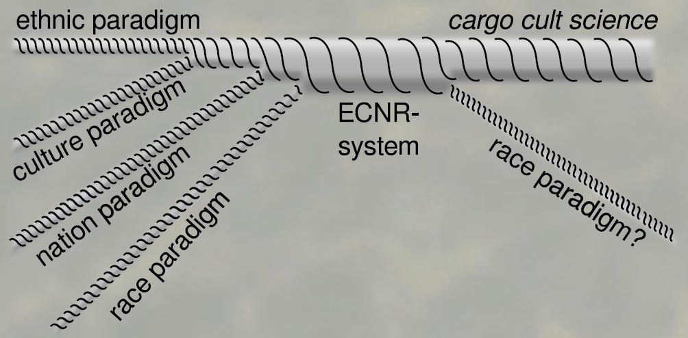
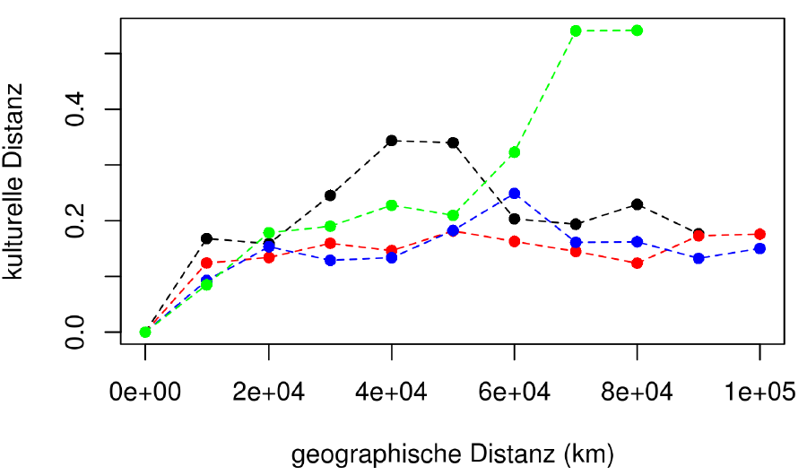
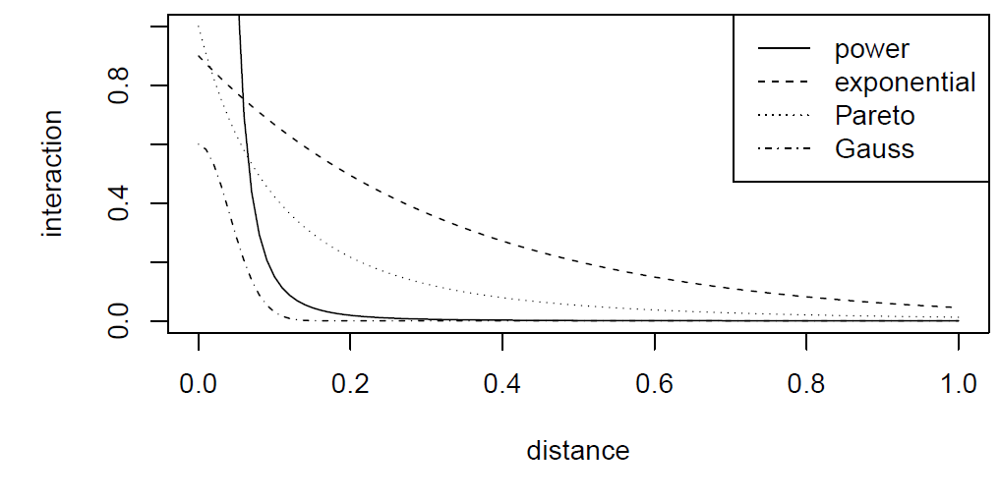
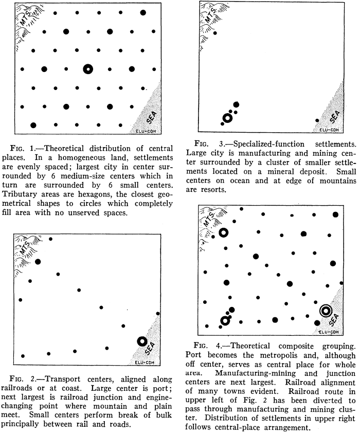

## Cultural Distances

- Introduction
- Cultural distances: Theory
- Cultural distances: Practice
- Distance diagramms: Theory
- Distance diagramms: Practice


<div style='position:absolute;bottom:20%;right:5%'>
    
</div>

<a class="btn btn-primary btn-large" href='https://isaakiel.github.io/index.html'>
 
</a>

--- .segue bg:grey

## Cultural distances

<a class="btn btn-primary btn-large" href='https://isaakiel.github.io/index.html'>
 
</a>

--- &twocol 

## Cultural distances

*** =left

**Imports vs cultural distances**

- connectinga site to a provenience region
- individual interactions can be traced

<div style='position:absolute;bottom:20%;left:15%'>
    
</div>

*** =right

**Cultural distance**

- interactions are producing cultural similarities
- difference in material culture
- statistical level of interaction between sites or regions

<div style='position:absolute;bottom:15%;right:10%'>
    
</div>

---

## Cultural distances

**traditional „Culture“ in Archaeology**

Archaeological culture = spatial and temporal limited entity of material culture 

**Cultures can correspond with:**

- language
- people
- race
- collective identity
- more...

<div style='position:absolute;top:35%;right:30%'>
    
</div>

<div style='position:absolute;top:35%;right:5%'>
    
</div>

<div style='position:absolute;bottom:10%;right:50%'>
    
</div>

--- &twocol

## Cultural distances | Components of cultural theory

*** =left

- What is culture?
  - Hansen, Tylor
- Why using culture?
  - B. Malinowski, A. Schweitzer
- How does culture work?
  - T. Parsons, A. Kroeber, R.Dawkins
- How are cultures connected?
  - F. Steger
- How do cultures evolve?
  - O. Spengler, R. Redfield, R. Linton u. M. Herskovits


*** =right

- Which components have cultures?
  - J. Huxley

<div style='position:absolute;top:35%;right:30%'>
    
</div>

<div style='position:absolute;top:35%;right:5%'>
    
</div>

<div style='position:absolute;bottom:7%;right:25%'>
    
</div>

--- .segue bg:grey

## What is wrong with the traditional approaches?

--- &twocol

## Cultural distances | Culture

*** =left

```{r collapse=TRUE, eval=FALSE}
Culture covers standardisations which 
are valid in collectives. 

(Hansen 2003, 39)
```

<div style='position:absolute;top:45%;left:5%'>
    
</div>

*** =right

- Formal and abstract definition which covers most other
- Spatial archaeological cultures as special case
- Applicable in archaeology

<div style='position:absolute;bottom:5%;right:5%'>
    
</div>

--- 

## Cultural distances

Structures|**Traditional arch. culture**|**Current arch. culture**
----|----|----
Actors|historical actor|cultures can not act
Dimensions|disjunct and exclusive|overlapping, multiple mem.
Hierarchy|mono-hierarchic|poly-hierarchic
Markers|based on cultural markers |broad basis of material culture
...|* ECNR-System| * No cultural equation
...|* Ethnic Groups = historical identification| * Ethnic Groups are the results of social interaction
...|* Cultures = empirical foundation| * Cultures are the adaptation, caused by interaction
...|* Nations = significance for people| * Nations are the result of political interaction
...|*Races = modern science based on laws of nature| * ’Races’, or rather biological units are the result of biological interaction
Entaglement|ethnic group = seed of nation = race = culture|ethnic group ̸= seed of nation ̸= race ̸= culture

<div style='position:absolute;top:5%;right:5%'>
    
</div>

--- 

## Cultural distances


<div style='position:absolute;bottom:30%;right:10%'>
    
</div>

--- &twocol

## Cultural distances

*** =left

**'Typenspektren'**

- All data are used for the calculation of cultural distances
- No diagnostic types or cultural markers
- ’Typenspektren’ include the relative amount of objects of certain types.

<div style='position:absolute;bottom:15%;left:10%'>
    
</div>

*** =right

<div style='position:absolute;bottom:20%;right:10%'>
    
</div>

--- &twocol

## Cultural distances | 'Typenspektren' 

*** =left

**Cultural fingerprint**

- 'Typenspektren' are a kind of cultural fingerprints.
- 'Typenspektren' don’t assume spatial archaeological cultures.
- 'Typenspektren' consider quantities and not only presence/absence.
- for every type of 'Typenspektren' a group of types, representing a certain part of society can be defines.
- 'Typenspektren' provide much more information and are much more robust than so called 'cultural markers'.

*** =right

<div style='position:absolute;top:15%;right:15%'>
  
</div>

<div style='position:absolute;bottom:10%;right:10%'>
  
</div>

--- &twocol

## Cultural distances | 'Typenspektren' 

**'Typenspektren' - using all available information**

*** =left

- 2; ”Beil”; xxx
  - 22; ”Beil, Tüllenbeil”; xxx
  - 221; ”Beil, T, Schlichte vierkantige T”; xxx
  - 2211; ”Beil, T, Schlichte vierkantige T, Norddeutsche T, Var. Hesepe”; xxx


*** =right

- 4; ”Nadel”; xxx
  - 41; ”Nadel, Rippenkopfnadeln”; xxx
  - 411; ”Nadel, Rippenkopfnadeln, Var. Nutteln”; xxx
  - 412; ”Nadel, Rippenkopfnadeln, Var. Badenstedt”; xxx

<div style='position:absolute;bottom:5%;right:25%'>
  
</div>

--- .segue bg:grey

## Which information can be used in 'Typenspektren'?

<a class="btn btn-primary btn-large" href='https://isaakiel.github.io/index.html'>
 
</a>

---

## Cultural distances

**Map of cultural distances**
- the cultural distances to one reference point are mapped on a grid
- topography of cultural similarities
- structure of interaction space

<div style='position:absolute;bottom:15%;right:20%'>
  
</div>

--- &twocol

## Cultural distances

*** =left

**Interaction spaces**

- groups of similar material culture indicate interaction spaces
- hierarchical Cluster analysis of regional Typensprektren
- cultural distance as Euclidean distance of two normalised Typensprektren

*** =right

<div style='position:absolute;bottom:10%;right:5%'>
  
</div>

---

## Cultural distances | Methodology for cultural areas

**Interaction areas**

<div style='position:absolute;bottom:10%;right:15%'>
  
</div>

--- &twocol

## Cultural distances

*** =left

**Hunsrück-Eifel-Kultur**
- same extent of different groups of material culture
- crisp border

<div style='position:absolute;bottom:20%;left:10%'>
  
</div>


*** =right

**Baden-Württemberg**
- fuzzy borders
- overlapping cultural areas

<div style='position:absolute;bottom:15%;right:5%'>
  
</div>

---

## Cultural distances | Methodology for cultural areas

**distance diagrams**

<div style='position:absolute;bottom:20%;right:15%'>
  
</div>

--- .segue bg:grey

## But how?!

<a class="btn btn-primary btn-large" href='https://isaakiel.github.io/index.html'>
 
</a>

---

## Preparation | Working Directory & Load Data

```{r collapse=TRUE, eval=FALSE}
wd <- ".//home/fon/daten/analyse/mosaic"
setwd(wd)
```

```{r collapse=TRUE}
df.weapons <- read.csv("2data/shkr-weapons.csv", header=TRUE, sep=";")
t <- as.character(df.weapons[,13])
df.weapons <- data.frame(id= df.weapons[,4], 
               x=df.weapons[,1], y=df.weapons[,2], 
               t, stringsAsFactors = FALSE)
```

---

## Exploring Data | Structure & Content

```{r collapse=TRUE}
str(df.weapons)
```

```{r collapse=TRUE}
df.weapons[1:4,]
```

--- &twocol

## Global 'Typenspektrum' 

*** =left

- counting finds per type
- considering type hierarchy

```{r echo=FALSE, fig.align='right', fig.height=6, fig.width=6 }
tab.weapons <- table(df.weapons[,4])
tw <- tab.weapons
for (i in seq_along(tab.weapons)) {
  a <- dimnames(tab.weapons)[[1]][i]
  b <- dimnames(tab.weapons)[[1]][]
  tw[i] <- sum(tab.weapons[grepl(a, b)])
}
barplot(tw)
```

*** =right

```{r collapse=TRUE, fig.show='hide', eval=FALSE}
tab.weapons <- table(df.weapons[,4])
tw <- tab.weapons
for (i in seq_along(tab.weapons)) {
  a <- dimnames(tab.weapons)[[1]][i]
  b <- dimnames(tab.weapons)[[1]][]
  tw[i] <- sum(tab.weapons[grepl(a, b)])
}
barplot(tw)
```

--- &twocol

## Spatial Data

*** =left

- packages
- projection data
- conversion

*** =right

```{r collapse=TRUE, results='hide'}
library(sp)         # spatial objects
library(proj4)      # projection
library(spatstat)   # spatial statistics
library(maptools)   # spatial tools

crs1 <- "+proj=tmerc +lat_0=0 +lon_0=9
+k=1 +x_0=3500000 +y_0=0
+ellps=WGS84 +units=m +no_defs"

coordinates(df.weapons)=~x+y
proj4string(df.weapons) <-
CRS(as.character(crs1))
```

---

## What is inside? | Structure of Spatial Objects

```{r collapse=TRUE}
str(df.weapons)
```

--- &twocol

## Prep. local 'Typenspektren'

*** =left

- list of types
- variables
- owin object (`spatstat`)
- regular sample points

*** =right

```{r collapse=TRUE}
type.list <- unlist(dimnames(tab.weapons))
type.n <- length(type.list)
sdev <- 5000
bb <- bbox(df.weapons)
win <- owin(xrange=c(bb[1,1],bb[1,2]),
yrange= c(bb[2,1],bb[2,2]),
  unitname="m")
s.points <- spsample(df.weapons, 100,
  type="regular")
samp <- list()
i=0
```

--- &twocol

## Loop local 'Typenspektren'

*** =left

- loop through all types
- producing a point pattern object
- calculating density
- sampling density
- Typenspektren as list of vectors

*** =right

```{r collapse=TRUE, warning=FALSE}
for (t in type.list) {
  i <- i+1
  finds <- df.weapons[which(df.weapons
                            @data$t==t),]
  ppp_w <- ppp(finds@coords[,1],
      finds@coords[,2], window=win)
  dens <- density(ppp_w, kernel="gaussian", 
      sigma=sdev, dimyx=c(36,56), w=win,
      edge=TRUE, at="pixels")
  sgdf_w_dens <- as.SpatialGridDataFrame.im(
      dens)
  proj4string(sgdf_w_dens) <- CRS(
      as.character(crs1))
  meg_dens_samp <- over(s.points, 
                        sgdf_w_dens)
  samp[[i]] <- meg_dens_samp
}
```

--- 

## Exploring the result | Structure & Content

```{r}
str(samp)
```

--- 

## Exploring the result | Structure & Content


```{r}
samp
```

--- &twocol

## Conversion to Data Frame

*** =left

- points in rows
- types in columns
- rename columns

*** =right

```{r collapse=TRUE, warning=FALSE}
ts <- data.frame(matrix(unlist(samp),
      nrow=49, byrow=T))
colnames(ts) <- type.list
ts[1:4,1:3]
```

--- &twocol

## Distance diagram (dd)

*** =left

- different view-points
- different focus-points
- cultural distance as an inverse interaction proxy

<div style='position:absolute;bottom:20%;left:10%'>
  
</div>


*** =right

Viewpoint|fixed vocus|selected focus|all foucused
----|----|----|----
fixed viewpoint|**dd1** fixed profile dd, similarity profiles|**dd2** fixed sector dd|**dd3** fixed multi-focal dd, fall-off curve
selected viewpoints|**dd4** selected profile dd|**dd5** selected secotr dd|**dd6** selected multi-focal dd
all viewpoints**dd7** aggregated profile dd|**dd8** aggregated sector dd|**dd9** aggregated multi-focal dd, variogram
  

---

## Cultural Distances 

<div style='position:absolute;bottom:10%;right:15%'>
  
</div>

--- .segue bg:grey

## Do you have other ideas for interpretation?

<a class="btn btn-primary btn-large" href='https://isaakiel.github.io/index.html'>
 
</a>

---

## Space 

**Disciplinary spaces**

A metrical space is spanned by a metric, which defines
distances.
- A **social space** is constructed by social distances.
- An **economic space** is constructed by economic distances.
- A **cultural space** is constructed by cultural distances.
- A **geographic space** is constructed by geodetic distances.

--- &twocol

## Interaction model

*** =left

- fixed starting point
- fixed profile
- ceramics
- interaction friction at Black Forrest?

<div style='position:absolute;bottom:10%;left:10%'>
  
</div>


*** =right

<div style='position:absolute;bottom:20%;right:5%'>
  
</div>

--- &twocol

## Interaction model

*** =left

- fixed starting point
- along the main axes
- ceramics
- rivers as interactive areas?

<div style='position:absolute;bottom:10%;left:10%'>
  
</div>


*** =right

<div style='position:absolute;bottom:20%;right:5%'>
  
</div>

--- &twocol

## Interaction model

*** =left

- from all points
- to all points
- fibulae and adornment
- interaction threshold at 200 km?


*** =right

<div style='position:absolute;bottom:20%;right:5%'>
  
</div>

---

## Theoretical Models

**Interaction decreases with distance.**
Distance decay functions can quantify the decrease.

<div style='position:absolute;bottom:10%;left:5%'>
  <p><b>Tobler’s first law of geography</b></p>
  <p>Everything is related to everything else, but near things are more related </p>
  <p>than distant things.</p>
</div>

<div style='position:absolute;bottom:33%;right:5%'>
  
</div>

<div style='position:absolute;bottom:35%;left:5%'>
  
</div>

--- &twocol

## Gravity models

*** =left

- involve properties of the interaction partners
- based on an analogy from physics
- population, settlement size, …
- can be used to produce distance decay functions/fall off curves, which consider population

*** =right

<div style='position:absolute;bottom:25%;right:5%'>
  
</div>

--- &twocol

## Distance diagram (dd)

*** =left

- different viewpoints
- different focus-points
- cultural distance as an inverse interaction proxy

*** =right

Viewpoint|fixed vocus|selected focus|all foucused
----|----|----|----
fixed viewpoint|**dd1** fixed profile dd, similarity profiles|**dd2** fixed sector dd|**dd3** fixed multi-focal dd, fall-off curve
selected viewpoints|**dd4** selected profile dd|**dd5** selected secotr dd|**dd6** selected multi-focal dd
all viewpoints**dd7** aggregated profile dd|**dd8** aggregated sector dd|**dd9** aggregated multi-focal dd, variogram

--- &twocol

## Mapping profiles

*** =left 

```{r collapse=TRUE,  fig.show='hide'}
p.index <- (s.points@coords[,1] > 3475200 & s.points@coords[,1] < 3511200)
p.points <- s.points[p.index,]
p.ts <- ts[p.index,]

plot(s.points)
points(df.weapons, col='grey')
points(p.points, pch=16, col="dark red")
```

*** =right

```{r echo=FALSE,  fig.align='right', fig.height=6, fig.width=6 }
plot(s.points)
points(df.weapons, col='grey')
points(p.points, pch=16, col="dark red")
```

--- &twocol

## dd1

*** =left

- distance function
- data for specific distance diagram
- distance calculation
- plot

<div style='position:absolute;bottom:15%;left:10%'>
  
</div>

*** =right

```{r collapse=TRUE, fig.show='hide', eval=FALSE}
edist <- function(a,b){sqrt(sum((a-b)^2))}
n <-length(p.points@coords[,1])
x <-1:n
df.d <- data.frame(p1=rep(1,n),p2=x,
  d1=x,d2=x)
for (i in seq_along(p.ts[,1])) {
  df.d[i,3] <- edist(p.points@coords[1,],
  p.points@coords[i,])
}
for (i in seq_along(p.ts[,1])) {
  df.d[i,4] <- edist(p.ts[1,],p.ts[i,])
}
plot(df.d[,3:4], pch=16, xlab="spatial
  distance (km)", ylab= "density
  distance", main="dd1")
lines(df.d[,3:4])
```

--- &twocol

## dd3

*** =left

- similar to dd1
- sampling cultural distances in spatial distance ranges

<div style='position:absolute;bottom:15%;left:10%'>
  
</div>

*** =right

```{r collapse=TRUE, fi.show='hide', eval=FALSE}
p.points <- s.points; p.ts <- ts
n <-length(p.points@coords[,1]); x <-1:n
df.d<-data.frame(p1=rep(1,n),p2=x,d1=x,d2=x)
for (i in seq_along(p.ts[,1])) {
  df.d[i,3] <- edist(p.points@coords[50,],
  p.points@coords[i,])}
for (i in seq_along(p.ts[,1])) {
  df.d[i,4] <- edist(p.ts[50,],p.ts[i,])}
  df.dd <- data.frame(id=seq(0,250000,20000)
  /20000+1,d1=seq(0,250000,20000),
  d2=seq(0,250000,20000))
for (i in df.dd[,1]) {
  df.dd[i,3] <- mean(df.d[(df.d[,3] >
  df.dd[i,2] & df.d[,3] < df.dd[i+1,2]),4])}
plot(df.dd[,2:3], pch=16, xlab="spatial distance (m)", 
  ylab= "density distance", main="dd3")
lines(df.dd[,2:3])
```

--- &twocol

## dd9

*** =left

- similar to dd1
- sampling cultural distances in spatial distance ranges


*** =right

```{r collapse=TRUE, fi.show='hide', eval=FALSE}
p.points <- s.points; p.ts <- ts
n <-length(p.points@coords[,1]); x <-1:n
df.d <- data.frame(p1=rep(1,n),p2=x,d1=x,d2=x)
for (i in 2:n) {
  df.d <- rbind(df.d,data.frame(p1=rep
  (i,n),p2=x,d1=x,d2=x))}
for (i in seq_along(df.d[,1])) {
  df.d[i,3] <- edist(p.points@coords[
  df.d[i,1],],p.points@coords[df.d[i,2],])}
for (i in seq_along(df.d[,1])) {
  df.d[i,4] <- edist(p.ts[df.d[i,1],],
  p.ts[df.d[i,2],])}
df.dd <- data.frame(id=seq(0,250000,20000)
  /20000+1,d1=seq(0,250000,20000),
  d2=seq(0,250000,20000))
for (i in df.dd[,1]) {
  df.dd[i,3] <- mean(df.d[(df.d[,3] >
  df.dd[i,2] & df.d[,3] < df.dd[i+1,2]),4])}
```

--- &twocol

## dd9

*** =left

- similar to dd1
- sampling cultural distances in spatial distance ranges

<div style='position:absolute;bottom:15%;left:15%'>
  
</div>


*** =right

```{r collapse=TRUE, fi.show='hide', eval=FALSE}
plot(df.dd[,2:3], pch=16, xlab="spatial distance
  (m)", ylab= "density distance", main="dd9")
lines(df.dd[,2:3])
```


--- 

## How can we interpret the distance diagrams?
## Which pitfalls for interpretation can you find?
## How can we improve the distance diagrams and develop other versions?

<a class="btn btn-primary btn-large" href='https://isaakiel.github.io/index.html'>
 
</a>
    

--- .segue bg:grey

## Apply distance diagrams in the workshop this afternoon!

<a class="btn btn-primary btn-large" href='https://isaakiel.github.io/index.html'>
 
</a>

--- .segue bg:grey

## Cultural & Geographic Distance

<a class="btn btn-primary btn-large" href='https://isaakiel.github.io/index.html'>
 
</a>

--- &twocol

## Distance analyses in geographic space

*** =left

- abstract concept: can be measured in meters, time, money, strangeness, ...
- influence interactions


*** =right

<div style='text-align: center;'>
    
</div>

---

## Distance analyses in geographic space

1. straight/ direct

- Euclidean distance
- "As the crow flies"
- "In a beeline"
- geodesic distance
- great-circle distance

2. not direct/ random
    
- random walk
- "Drunkard's Walk"

--- &twocol

## Distance analyses in geographic space

Two concepts with different premises

*** =left

1. straight/ direct

- Euclidean distance
- "As the crow flies"
- "In a beeline"
- geodesic distance
- great-circle distance
- least-cost distance

*** =right

2. not direct/ random
    
- random walk
- "Drunkard's Walk"

--- &twocol

## Distance analyses in geographic space

A reminder about spatial data. 

```{r echo=FALSE, message=FALSE, results="hide"}
library(rgdal)
dem <- readGDAL("./3geodata/dw_gk3_50_ag.asc")
```

*** =left

What is the meaning of the coordinates?

```{r}
dem@bbox
```

What is the Spatial Reference System (SRS)?

[= Coordinate Reference System (CRS)]


*** =right

<div style='text-align: center;'>
    
</div>

<div style="font-size:10px">By <a href="//commons.wikimedia.org/wiki/User:Peter_Mercator" title="User:Peter Mercator">Peter Mercator</a> - <span class="int-own-work" lang="en">Own work</span>, Public Domain, https://commons.wikimedia.org/w/index.php?curid=9910926</div>


--- &twocol

## Distance analyses in geographic space

A reminder about spatial data. 

```{r echo=FALSE, message=FALSE, results="hide"}
library(rgdal)
dem <- readGDAL("./3geodata/dw_gk3_50_ag.asc")
```

*** =left

What is the meaning of the coordinates?

```{r}
dem@bbox
```

What is the Spatial Reference System (SRS)?

[= Coordinate Reference System (CRS)]


*** =right

<div style='text-align: center;'>
    
</div>

<div style="font-size:10px">Von <a href="//de.wikipedia.org/wiki/Benutzer:BerndH" title="Benutzer:BerndH">BerndH</a> - selbst erstellt mit Generic Mapping Tools (psbasemap, psxy), Python, GIMP, <a title="Creative Commons Namensnennung-Weitergabe unter gleichen Bedingungen Unported 3.0" href="http://creativecommons.org/licenses/by-sa/3.0/legalcode">CC BY-SA 3.0</a>, https://de.wikipedia.org/w/index.php?curid=4186798</div>


--- &twocol

## Distance analyses in geographic space

*** =left

https://epsg.io/5677

```{r fig.show='hide'}
dem@proj4string
dem@proj4string <- CRS("+init=epsg:5677")
## dem@proj4string
is.projected(dem)
```

*** =right

```{r echo=FALSE}
library(raster)
plot(raster(dem))
```

---

## Distance analyses in geographic space

From a list of points to a spatial object [a reminder]

```{r}
download.file(
    url = "https://raw.githubusercontent.com/dakni/mhbil/master/data/meg_dw.csv",
    destfile = "2data/meg_dw.csv")

meg_dw <- read.table(file = "2data/meg_dw.csv",
                     header = TRUE,
                     sep = ";")
head(meg_dw)
```

---


<a class="btn btn-primary btn-large" href='https://isaakiel.github.io/index.html'>
  
</a>
