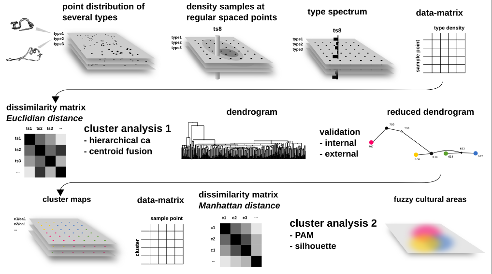
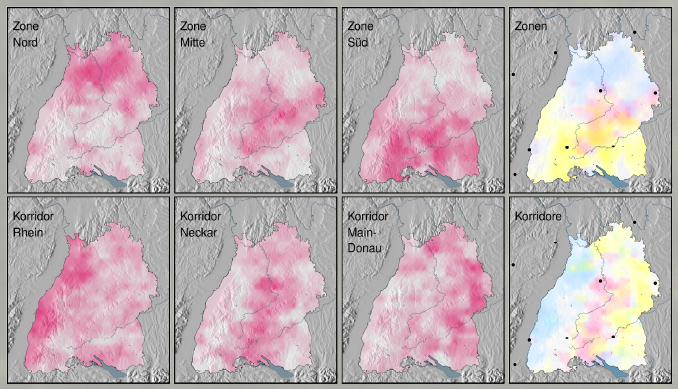
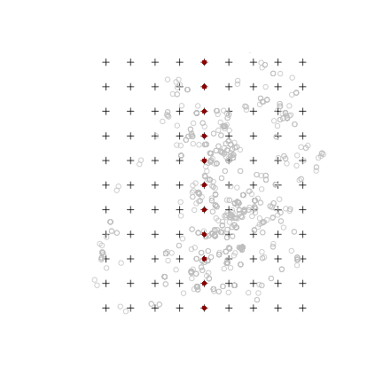

## Cultural Distances

- Introduction
- Cultural distances: Theory
- Cultural distances: Practice
- Distance diagramms: Theory
- Distance diagramms: Practice


<div style='position:absolute;bottom:20%;right:5%'>
    
</div>

<a class="btn btn-primary btn-large" href='https://isaakiel.github.io/index.html'>
 
</a>

--- .segue bg:grey

## Cultural distances

<a class="btn btn-primary btn-large" href='https://isaakiel.github.io/index.html'>
 
</a>

--- &twocol 

## Cultural distances

*** =left

**Imports vs cultural distances**

- connectinga site to a provenience region
- individual interactions can be traced

<div style='position:absolute;bottom:20%;left:15%'>
    
</div>

*** =right

**Cultural distance**

- interactions are producing cultural similarities
- difference in material culture
- statistical level of interaction between sites or regions

<div style='position:absolute;bottom:15%;right:10%'>
    
</div>

---

## Cultural distances

**traditional „Culture“ in Archaeology**

Archaeological culture = spatial and temporal limited entity of material culture 

**Cultures can correspond with:**

- language
- people
- race
- collective identity
- more...

<div style='position:absolute;top:35%;right:30%'>
    
</div>

<div style='position:absolute;top:35%;right:5%'>
    
</div>

<div style='position:absolute;bottom:10%;right:50%'>
    
</div>

--- &twocol

## Cultural distances | Components of cultural theory

*** =left

- What is culture?
  - Hansen, Tylor
- Why using culture?
  - B. Malinowski, A. Schweitzer
- How does culture work?
  - T. Parsons, A. Kroeber, R.Dawkins
- How are cultures connected?
  - F. Steger
- How do cultures evolve?
  - O. Spengler, R. Redfield, R. Linton u. M. Herskovits


*** =right

- Which components have cultures?
  - J. Huxley

<div style='position:absolute;top:35%;right:30%'>
    
</div>

<div style='position:absolute;top:35%;right:5%'>
    
</div>

<div style='position:absolute;bottom:7%;right:25%'>
    
</div>

--- .segue bg:grey

## What is wrong with the traditional approaches?

--- &twocol

## Cultural distances | Culture

*** =left


```r
Culture covers standardisations which 
are valid in collectives. 

(Hansen 2003, 39)
```

<div style='position:absolute;top:45%;left:5%'>
    
</div>

*** =right

- Formal and abstract definition which covers most other
- Spatial archaeological cultures as special case
- Applicable in archaeology

<div style='position:absolute;bottom:5%;right:5%'>
    
</div>

--- 

## Cultural distances

Structures|**Traditional arch. culture**|**Current arch. culture**
----|----|----
Actors|historical actor|cultures can not act
Dimensions|disjunct and exclusive|overlapping, multiple mem.
Hierarchy|mono-hierarchic|poly-hierarchic
Markers|based on cultural markers |broad basis of material culture
...|* ECNR-System| * No cultural equation
...|* Ethnic Groups = historical identification| * Ethnic Groups are the results of social interaction
...|* Cultures = empirical foundation| * Cultures are the adaptation, caused by interaction
...|* Nations = significance for people| * Nations are the result of political interaction
...|*Races = modern science based on laws of nature| * ’Races’, or rather biological units are the result of biological interaction
Entaglement|ethnic group = seed of nation = race = culture|ethnic group ̸= seed of nation ̸= race ̸= culture

<div style='position:absolute;top:5%;right:5%'>
    
</div>

--- 

## Cultural distances


<div style='position:absolute;bottom:30%;right:10%'>
    
</div>

--- &twocol

## Cultural distances

*** =left

**'Typenspektren'**

- All data are used for the calculation of cultural distances
- No diagnostic types or cultural markers
- ’Typenspektren’ include the relative amount of objects of certain types.

<div style='position:absolute;bottom:15%;left:10%'>
    
</div>

*** =right

<div style='position:absolute;bottom:20%;right:10%'>
    
</div>

--- &twocol

## Cultural distances | 'Typenspektren' 

*** =left

**Cultural fingerprint**

- 'Typenspektren' are a kind of cultural fingerprints.
- 'Typenspektren' don’t assume spatial archaeological cultures.
- 'Typenspektren' consider quantities and not only presence/absence.
- for every type of 'Typenspektren' a group of types, representing a certain part of society can be defines.
- 'Typenspektren' provide much more information and are much more robust than so called 'cultural markers'.

*** =right

<div style='position:absolute;top:15%;right:15%'>
  
</div>

<div style='position:absolute;bottom:10%;right:10%'>
  
</div>

--- &twocol

## Cultural distances | 'Typenspektren' 

**'Typenspektren' - using all available information**

*** =left

- 2; ”Beil”; xxx
  - 22; ”Beil, Tüllenbeil”; xxx
  - 221; ”Beil, T, Schlichte vierkantige T”; xxx
  - 2211; ”Beil, T, Schlichte vierkantige T, Norddeutsche T, Var. Hesepe”; xxx


*** =right

- 4; ”Nadel”; xxx
  - 41; ”Nadel, Rippenkopfnadeln”; xxx
  - 411; ”Nadel, Rippenkopfnadeln, Var. Nutteln”; xxx
  - 412; ”Nadel, Rippenkopfnadeln, Var. Badenstedt”; xxx

<div style='position:absolute;bottom:5%;right:25%'>
  
</div>

--- .segue bg:grey

## Which information can be used in 'Typenspektren'?

<a class="btn btn-primary btn-large" href='https://isaakiel.github.io/index.html'>
 
</a>

---

## Cultural distances

**Map of cultural distances**
- the cultural distances to one reference point are mapped on a grid
- topography of cultural similarities
- structure of interaction space

<div style='position:absolute;bottom:15%;right:20%'>
  
</div>

--- &twocol

## Cultural distances

*** =left

**Interaction spaces**

- groups of similar material culture indicate interaction spaces
- hierarchical Cluster analysis of regional Typensprektren
- cultural distance as Euclidean distance of two normalised Typensprektren

*** =right

<div style='position:absolute;bottom:10%;right:5%'>
  
</div>

---

## Cultural distances | Methodology for cultural areas

**Interaction areas**

<div style='position:absolute;bottom:10%;right:15%'>
  
</div>

--- &twocol

## Cultural distances

*** =left

**Hunsrück-Eifel-Kultur**
- same extent of different groups of material culture
- crisp border

<div style='position:absolute;bottom:20%;left:10%'>
  
</div>


*** =right

**Baden-Württemberg**
- fuzzy borders
- overlapping cultural areas

<div style='position:absolute;bottom:15%;right:5%'>
  
</div>

---

## Cultural distances | Methodology for cultural areas

**distance diagrams**

<div style='position:absolute;bottom:20%;right:15%'>
  
</div>

--- .segue bg:grey

## But how?!

<a class="btn btn-primary btn-large" href='https://isaakiel.github.io/index.html'>
 
</a>

---

## Preparation | Working Directory & Load Data


```r
wd <- ".//home/fon/daten/analyse/mosaic"
setwd(wd)
```


```r
df.weapons <- read.csv("2data/shkr-weapons.csv", header=TRUE, sep=";")
t <- as.character(df.weapons[,13])
df.weapons <- data.frame(id= df.weapons[,4], 
               x=df.weapons[,1], y=df.weapons[,2], 
               t, stringsAsFactors = FALSE)
```

---

## Exploring Data | Structure & Content


```r
str(df.weapons)
## 'data.frame':	1165 obs. of  4 variables:
##  $ id: int  10261 10432 9439 9439 18567 18567 13415 13415 17039 17039 ...
##  $ x : num  3510314 3513254 3499751 3499751 3506691 ...
##  $ y : num  5433893 5417700 5417080 5417080 5345116 ...
##  $ t : chr  "B42213" "B4221" "B413" "B4211" ...
```


```r
df.weapons[1:4,]
##      id       x       y      t
## 1 10261 3510314 5433893 B42213
## 2 10432 3513254 5417700  B4221
## 3  9439 3499751 5417080   B413
## 4  9439 3499751 5417080  B4211
```

--- &twocol

## Global 'Typenspektrum' 

*** =left

- counting finds per type
- considering type hierarchy


*** =right


```r
tab.weapons <- table(df.weapons[,4])
tw <- tab.weapons
for (i in seq_along(tab.weapons)) {
  a <- dimnames(tab.weapons)[[1]][i]
  b <- dimnames(tab.weapons)[[1]][]
  tw[i] <- sum(tab.weapons[grepl(a, b)])
}
barplot(tw)
```

--- &twocol

## Spatial Data

*** =left

- packages
- projection data
- conversion

*** =right


```r
library(sp)         # spatial objects
library(proj4)      # projection
library(spatstat)   # spatial statistics
library(maptools)   # spatial tools

crs1 <- "+proj=tmerc +lat_0=0 +lon_0=9
+k=1 +x_0=3500000 +y_0=0
+ellps=WGS84 +units=m +no_defs"

coordinates(df.weapons)=~x+y
proj4string(df.weapons) <-
CRS(as.character(crs1))
```

---

## What is inside? | Structure of Spatial Objects


```r
str(df.weapons)
## Formal class 'SpatialPointsDataFrame' [package "sp"] with 5 slots
##   ..@ data       :'data.frame':	1165 obs. of  2 variables:
##   .. ..$ id: int [1:1165] 10261 10432 9439 9439 18567 18567 13415 13415 17039 17039 ...
##   .. ..$ t : chr [1:1165] "B42213" "B4221" "B413" "B4211" ...
##   ..@ coords.nrs : int [1:2] 2 3
##   ..@ coords     : num [1:1165, 1:2] 3510314 3513254 3499751 3499751 3506691 ...
##   .. ..- attr(*, "dimnames")=List of 2
##   .. .. ..$ : chr [1:1165] "1" "2" "3" "4" ...
##   .. .. ..$ : chr [1:2] "x" "y"
##   ..@ bbox       : num [1:2, 1:2] 3391750 5268797 3606087 5516434
##   .. ..- attr(*, "dimnames")=List of 2
##   .. .. ..$ : chr [1:2] "x" "y"
##   .. .. ..$ : chr [1:2] "min" "max"
##   ..@ proj4string:Formal class 'CRS' [package "sp"] with 1 slot
##   .. .. ..@ projargs: chr "+proj=tmerc +lat_0=0 +lon_0=9 +k=1 +x_0=3500000 +y_0=0 +ellps=WGS84 +units=m +no_defs"
```

--- &twocol

## Prep. local 'Typenspektren'

*** =left

- list of types
- variables
- owin object (`spatstat`)
- regular sample points

*** =right


```r
type.list <- unlist(dimnames(tab.weapons))
type.n <- length(type.list)
sdev <- 5000
bb <- bbox(df.weapons)
win <- owin(xrange=c(bb[1,1],bb[1,2]),
yrange= c(bb[2,1],bb[2,2]),
  unitname="m")
s.points <- spsample(df.weapons, 100,
  type="regular")
samp <- list()
i=0
```

--- &twocol

## Loop local 'Typenspektren'

*** =left

- loop through all types
- producing a point pattern object
- calculating density
- sampling density
- Typenspektren as list of vectors

*** =right


```r
for (t in type.list) {
  i <- i+1
  finds <- df.weapons[which(df.weapons
                            @data$t==t),]
  ppp_w <- ppp(finds@coords[,1],
      finds@coords[,2], window=win)
  dens <- density(ppp_w, kernel="gaussian", 
      sigma=sdev, dimyx=c(36,56), w=win,
      edge=TRUE, at="pixels")
  sgdf_w_dens <- as.SpatialGridDataFrame.im(
      dens)
  proj4string(sgdf_w_dens) <- CRS(
      as.character(crs1))
  meg_dens_samp <- over(s.points, 
                        sgdf_w_dens)
  samp[[i]] <- meg_dens_samp
}
```

--- 

## Exploring the result | Structure & Content


```r
str(samp)
```

```
## List of 49
##  $ :'data.frame':	99 obs. of  1 variable:
##   ..$ v: num [1:99] -1.47e-25 -4.69e-25 2.88e-22 3.26e-19 2.41e-25 ...
##  $ :'data.frame':	99 obs. of  1 variable:
##   ..$ v: num [1:99] 1.99e-25 5.87e-26 1.21e-25 1.51e-14 5.09e-13 ...
##  $ :'data.frame':	99 obs. of  1 variable:
##   ..$ v: num [1:99] 7.76e-11 2.55e-09 5.91e-17 1.39e-13 1.41e-10 ...
##  $ :'data.frame':	99 obs. of  1 variable:
##   ..$ v: num [1:99] 7.74e-26 4.09e-27 -2.66e-26 1.68e-25 1.38e-26 ...
##  $ :'data.frame':	99 obs. of  1 variable:
##   ..$ v: num [1:99] -1.16e-28 -6.58e-27 -2.42e-26 1.37e-26 1.35e-26 ...
##  $ :'data.frame':	99 obs. of  1 variable:
##   ..$ v: num [1:99] 6.93e-16 1.58e-23 -4.51e-25 2.17e-15 2.45e-12 ...
##  $ :'data.frame':	99 obs. of  1 variable:
##   ..$ v: num [1:99] 1.31e-25 -1.28e-25 -2.41e-26 1.95e-25 1.19e-20 ...
##  $ :'data.frame':	99 obs. of  1 variable:
##   ..$ v: num [1:99] 8.08e-26 4.62e-26 1.15e-26 1.38e-26 8.82e-26 ...
##  $ :'data.frame':	99 obs. of  1 variable:
##   ..$ v: num [1:99] 7.55e-26 2.04e-26 -1.29e-25 1.96e-25 1.62e-25 ...
##  $ :'data.frame':	99 obs. of  1 variable:
##   ..$ v: num [1:99] 4.21e-26 -3.22e-26 -3.25e-26 1.08e-15 1.23e-12 ...
##  $ :'data.frame':	99 obs. of  1 variable:
##   ..$ v: num [1:99] 6.84e-26 -3.69e-27 5.86e-27 -5.30e-27 1.49e-26 ...
##  $ :'data.frame':	99 obs. of  1 variable:
##   ..$ v: num [1:99] 2.13e-26 1.38e-26 -2.36e-26 -3.87e-26 1.93e-26 ...
##  $ :'data.frame':	99 obs. of  1 variable:
##   ..$ v: num [1:99] 1.46e-26 5.56e-27 -3.58e-26 -1.31e-26 5.87e-26 ...
##  $ :'data.frame':	99 obs. of  1 variable:
##   ..$ v: num [1:99] 1.10e-27 7.82e-27 1.76e-27 -1.51e-26 -1.39e-26 ...
##  $ :'data.frame':	99 obs. of  1 variable:
##   ..$ v: num [1:99] -1.54e-26 1.23e-26 -2.28e-26 -1.03e-26 1.57e-26 ...
##  $ :'data.frame':	99 obs. of  1 variable:
##   ..$ v: num [1:99] 2.18e-26 -5.72e-27 3.75e-26 1.77e-26 2.64e-26 ...
##  $ :'data.frame':	99 obs. of  1 variable:
##   ..$ v: num [1:99] 5.64e-27 -7.71e-28 6.52e-27 -1.77e-26 5.95e-27 ...
##  $ :'data.frame':	99 obs. of  1 variable:
##   ..$ v: num [1:99] 4.85e-27 3.44e-26 -4.69e-27 -2.71e-26 1.06e-26 ...
##  $ :'data.frame':	99 obs. of  1 variable:
##   ..$ v: num [1:99] -2.64e-26 -1.93e-26 1.48e-26 2.88e-26 -2.49e-27 ...
##  $ :'data.frame':	99 obs. of  1 variable:
##   ..$ v: num [1:99] 4.90e-25 3.00e-25 -1.52e-25 1.26e-13 1.43e-10 ...
##  $ :'data.frame':	99 obs. of  1 variable:
##   ..$ v: num [1:99] 2.18e-25 -7.32e-26 -1.18e-25 1.47e-25 -2.48e-25 ...
##  $ :'data.frame':	99 obs. of  1 variable:
##   ..$ v: num [1:99] -9.17e-26 1.91e-26 -1.53e-25 3.35e-26 1.18e-20 ...
##  $ :'data.frame':	99 obs. of  1 variable:
##   ..$ v: num [1:99] 4.65e-25 -5.94e-26 3.94e-25 -2.15e-25 7.98e-26 ...
##  $ :'data.frame':	99 obs. of  1 variable:
##   ..$ v: num [1:99] 5.86e-25 -1.12e-24 1.09e-16 1.39e-10 6.88e-12 ...
##  $ :'data.frame':	99 obs. of  1 variable:
##   ..$ v: num [1:99] 7.33e-26 2.92e-25 1.57e-25 1.08e-15 1.23e-12 ...
##  $ :'data.frame':	99 obs. of  1 variable:
##   ..$ v: num [1:99] -1.77e-25 9.57e-15 1.23e-08 1.08e-11 2.36e-13 ...
##  $ :'data.frame':	99 obs. of  1 variable:
##   ..$ v: num [1:99] 1.26e-25 2.52e-25 2.78e-25 -5.58e-26 -7.89e-26 ...
##  $ :'data.frame':	99 obs. of  1 variable:
##   ..$ v: num [1:99] 2.73e-26 1.83e-26 -6.94e-26 8.80e-26 -4.20e-26 ...
##  $ :'data.frame':	99 obs. of  1 variable:
##   ..$ v: num [1:99] -2.96e-26 1.32e-25 3.84e-26 1.64e-25 1.18e-25 ...
##  $ :'data.frame':	99 obs. of  1 variable:
##   ..$ v: num [1:99] 1.38e-26 2.59e-26 1.25e-26 -6.25e-26 -1.58e-26 ...
##  $ :'data.frame':	99 obs. of  1 variable:
##   ..$ v: num [1:99] -3.15e-26 1.44e-26 5.15e-26 5.39e-26 -4.34e-26 ...
##  $ :'data.frame':	99 obs. of  1 variable:
##   ..$ v: num [1:99] 5.22e-13 1.18e-20 1.56e-16 1.56e-16 1.66e-19 ...
##  $ :'data.frame':	99 obs. of  1 variable:
##   ..$ v: num [1:99] -1.09e-25 1.22e-24 1.56e-15 1.56e-15 1.07e-24 ...
##  $ :'data.frame':	99 obs. of  1 variable:
##   ..$ v: num [1:99] -5.38e-27 1.62e-22 2.35e-13 2.35e-13 1.62e-22 ...
##  $ :'data.frame':	99 obs. of  1 variable:
##   ..$ v: num [1:99] -1.00e-28 -1.07e-26 -1.71e-27 1.57e-23 6.76e-16 ...
##  $ :'data.frame':	99 obs. of  1 variable:
##   ..$ v: num [1:99] 7.89e-25 -1.71e-24 6.25e-16 6.25e-16 -5.83e-25 ...
##  $ :'data.frame':	99 obs. of  1 variable:
##   ..$ v: num [1:99] 3.00e-25 2.88e-25 -5.17e-25 6.25e-20 6.25e-20 ...
##  $ :'data.frame':	99 obs. of  1 variable:
##   ..$ v: num [1:99] -8.29e-26 6.56e-25 9.37e-16 9.37e-16 7.20e-25 ...
##  $ :'data.frame':	99 obs. of  1 variable:
##   ..$ v: num [1:99] -7.25e-27 1.23e-25 1.56e-16 1.56e-16 1.07e-25 ...
##  $ :'data.frame':	99 obs. of  1 variable:
##   ..$ v: num [1:99] 5.88e-26 -8.50e-27 7.65e-27 -2.46e-26 3.50e-26 ...
##  $ :'data.frame':	99 obs. of  1 variable:
##   ..$ v: num [1:99] 2.21e-26 2.35e-26 7.68e-26 -4.25e-26 2.45e-26 ...
##  $ :'data.frame':	99 obs. of  1 variable:
##   ..$ v: num [1:99] 9.22e-27 -1.61e-26 -1.90e-26 5.18e-26 6.37e-27 ...
##  $ :'data.frame':	99 obs. of  1 variable:
##   ..$ v: num [1:99] 1.57e-26 4.96e-26 3.50e-27 8.10e-27 1.17e-26 ...
##  $ :'data.frame':	99 obs. of  1 variable:
##   ..$ v: num [1:99] 2.86e-24 4.21e-12 4.76e-09 1.27e-13 1.53e-10 ...
##  $ :'data.frame':	99 obs. of  1 variable:
##   ..$ v: num [1:99] 1.54e-25 -1.36e-25 3.39e-25 1.56e-16 5.06e-15 ...
##  $ :'data.frame':	99 obs. of  1 variable:
##   ..$ v: num [1:99] -3.32e-27 -2.66e-26 -2.63e-26 -2.03e-26 4.81e-27 ...
##  $ :'data.frame':	99 obs. of  1 variable:
##   ..$ v: num [1:99] 8.22e-26 1.24e-25 -2.37e-25 -1.29e-25 -2.03e-25 ...
##  $ :'data.frame':	99 obs. of  1 variable:
##   ..$ v: num [1:99] 5.56e-12 6.13e-09 4.79e-15 9.19e-27 3.81e-25 ...
##  $ :'data.frame':	99 obs. of  1 variable:
##   ..$ v: num [1:99] 2.14e-25 4.38e-25 -4.78e-25 2.43e-22 3.53e-13 ...
```

--- 

## Exploring the result | Structure & Content


```r
samp
```

```
## [[1]]
##                v
## 1  -1.468375e-25
## 2  -4.690261e-25
## 3   2.875436e-22
## 4   3.255933e-19
## 5   2.412500e-25
## 6   2.638872e-25
## 7  -8.624706e-26
## 8  -1.518988e-25
## 9  -5.795981e-25
## 10  4.129006e-26
## 11 -9.928858e-26
## 12  9.523463e-14
## 13  1.077997e-10
## 14  1.131108e-15
## 15  3.114935e-17
## 16  2.335798e-19
## 17  1.113810e-18
## 18  1.260774e-15
## 19 -4.890458e-25
## 20  6.023714e-25
## 21  9.523461e-14
## 22  1.077998e-10
## 23  3.945551e-09
## 24  3.396998e-10
## 25  1.707667e-09
## 26  4.195605e-12
## 27  4.749145e-09
## 28  9.952511e-25
## 29  1.715085e-25
## 30  2.222249e-22
## 31  1.672018e-13
## 32  8.794198e-09
## 33  5.275086e-10
## 34  8.656526e-10
## 35  2.275046e-11
## 36  9.497903e-13
## 37  5.362344e-26
## 38 -1.338603e-25
## 39  2.790308e-23
## 40  1.520906e-12
## 41  2.623928e-10
## 42  6.031703e-11
## 43  2.061810e-09
## 44  1.342156e-12
## 45  3.505653e-23
## 46 -8.579751e-26
## 47 -2.091567e-25
## 48  1.227349e-21
## 49  6.013109e-11
## 50  6.707469e-09
## 51  6.728473e-10
## 52  8.205105e-10
## 53  2.275014e-11
## 54  1.556006e-17
## 55 -3.020072e-24
## 56  6.693016e-25
## 57  6.299148e-23
## 58  1.029477e-13
## 59  3.945119e-09
## 60  6.678160e-08
## 61  2.356157e-10
## 62  7.653946e-10
## 63  2.274981e-11
## 64 -4.633065e-25
## 65 -1.542122e-25
## 66  3.141979e-19
## 67  4.556916e-10
## 68  4.564803e-10
## 69  1.332052e-11
## 70  1.186909e-14
## 71  4.476006e-11
## 72  1.330520e-12
## 73  5.576838e-25
## 74 -5.049501e-25
## 75  4.983159e-25
## 76  1.209743e-16
## 77  1.209743e-16
## 78  4.877836e-24
## 79  3.144197e-19
## 80  4.556916e-10
## 81  4.556953e-10
## 82  3.092732e-25
## 83  1.376308e-25
## 84  3.806653e-25
## 85  4.405772e-25
## 86  7.980235e-25
## 87 -1.122568e-25
## 88  9.523461e-14
## 89  1.078908e-10
## 90  9.121949e-14
## 91  1.930656e-25
## 92  1.133442e-25
## 93 -3.346876e-26
## 94  6.624788e-25
## 95  1.519438e-24
## 96 -1.184349e-24
## 97  1.628690e-12
## 98  1.843576e-09
## 99  1.438863e-15
## 
## [[2]]
##                v
## 1   1.991534e-25
## 2   5.871202e-26
## 3   1.209554e-25
## 4   1.513614e-14
## 5   5.092446e-13
## 6   1.527733e-12
## 7   4.540841e-14
## 8   9.254807e-25
## 9   2.901336e-27
## 10 -5.147851e-25
## 11 -2.007905e-25
## 12  1.228180e-21
## 13  5.994054e-11
## 14  2.016656e-09
## 15  5.915780e-09
## 16  1.759216e-10
## 17  3.665911e-21
## 18 -5.689111e-25
## 19 -1.415659e-25
## 20  2.175230e-25
## 21  2.731839e-23
## 22  1.331842e-12
## 23  1.910883e-09
## 24  9.439021e-10
## 25  1.768775e-10
## 26  1.219563e-19
## 27  1.594833e-25
## 28  1.769574e-26
## 29 -1.190610e-25
## 30 -8.061636e-26
## 31  8.413729e-17
## 32  1.091309e-10
## 33  4.580508e-11
## 34  1.227539e-16
## 35  2.451523e-25
## 36 -4.721660e-25
## 37  1.823197e-25
## 38 -2.784399e-26
## 39 -1.026758e-25
## 40  2.926334e-24
## 41  4.195555e-12
## 42  4.749106e-09
## 43  3.706524e-15
## 44 -3.913235e-25
## 45  1.555404e-26
## 46  1.608703e-25
## 47 -6.711659e-26
## 48 -5.409379e-25
## 49  1.216251e-25
## 50  1.410329e-18
## 51  2.951480e-15
## 52  4.603871e-20
## 53  5.234871e-16
## 54  1.330414e-12
## 55 -1.973343e-25
## 56  1.986989e-26
## 57 -2.285037e-25
## 58  8.413415e-17
## 59  1.078648e-10
## 60  2.794398e-09
## 61  3.506033e-13
## 62  7.653946e-10
## 63  4.549961e-11
## 64  8.579751e-26
## 65 -2.719038e-25
## 66 -1.930451e-25
## 67  1.438693e-15
## 68  1.843667e-09
## 69  5.999645e-09
## 70  4.889581e-12
## 71  4.515430e-11
## 72  1.342136e-12
## 73 -3.260305e-25
## 74  3.271996e-25
## 75 -2.007905e-25
## 76  3.142011e-19
## 77  4.601728e-10
## 78  5.528196e-09
## 79  4.880386e-10
## 80  1.123141e-09
## 81  2.274981e-11
## 82  6.005825e-26
## 83  4.554388e-25
## 84  3.346508e-26
## 85  6.274142e-23
## 86  9.197369e-14
## 87  1.040971e-12
## 88  2.317266e-09
## 89  8.894853e-11
## 90  1.557526e-17
## 91  1.716139e-25
## 92 -2.091797e-26
## 93  3.681563e-25
## 94 -1.364098e-25
## 95  4.707346e-25
## 96  1.522443e-14
## 97  2.550167e-09
## 98  5.863181e-11
## 99  1.200933e-21
## 
## [[3]]
##                v
## 1   7.761498e-11
## 2   2.546326e-09
## 3   5.906874e-17
## 4   1.391969e-13
## 5   1.409390e-10
## 6   1.018619e-12
## 7   5.395167e-13
## 8   1.513614e-14
## 9   1.067363e-23
## 10  1.589946e-14
## 11  3.943632e-13
## 12  9.113464e-14
## 13  7.487671e-11
## 14  9.635131e-09
## 15  3.966559e-09
## 16  2.089117e-09
## 17  5.861112e-11
## 18  9.560943e-13
## 19  1.461086e-08
## 20  1.111969e-14
## 21  1.769423e-10
## 22  2.680954e-09
## 23  1.275336e-08
## 24  8.240581e-12
## 25  4.574136e-10
## 26  2.321762e-09
## 27  2.558911e-08
## 28  2.922054e-12
## 29  2.223824e-18
## 30  3.915226e-15
## 31  1.458396e-10
## 32  2.028736e-09
## 33  1.689382e-09
## 34  3.125174e-09
## 35  9.665584e-10
## 36  4.936837e-12
## 37  2.247895e-23
## 38 -2.409486e-24
## 39  1.238074e-21
## 40  5.994389e-11
## 41  2.418041e-09
## 42  4.870720e-09
## 43  1.598282e-08
## 44  6.957238e-09
## 45  4.573267e-10
## 46  3.946685e-25
## 47  4.977930e-25
## 48  1.015230e-21
## 49  7.845708e-12
## 50  7.439126e-09
## 51  1.324297e-10
## 52  8.581959e-10
## 53  2.276398e-11
## 54  1.330520e-12
## 55 -5.147850e-25
## 56  4.326930e-25
## 57  1.438702e-15
## 58  1.845098e-09
## 59  4.943679e-11
## 60  4.755831e-09
## 61  4.492909e-11
## 62  1.330389e-12
## 63  6.751012e-11
## 64 -6.863801e-26
## 65  1.255547e-22
## 66  1.823992e-13
## 67  2.280835e-09
## 68  1.068630e-09
## 69  7.839571e-09
## 70  1.767666e-12
## 71  1.528217e-12
## 72  7.655958e-10
## 73  0.000000e+00
## 74  2.439108e-19
## 75  3.537563e-10
## 76  2.211138e-09
## 77  1.429380e-08
## 78  2.077086e-10
## 79  7.486508e-09
## 80  9.706369e-09
## 81  4.409423e-10
## 82 -3.946685e-25
## 83  8.533595e-25
## 84  1.628837e-12
## 85  1.951175e-09
## 86  2.946067e-12
## 87  1.971909e-09
## 88  5.604058e-10
## 89  4.583681e-10
## 90  1.281967e-14
## 91 -5.683369e-25
## 92 -6.844467e-25
## 93  9.524508e-14
## 94  1.078115e-10
## 95  8.415280e-17
## 96  3.944065e-13
## 97  1.028676e-13
## 98  9.114463e-14
## 99  6.343787e-23
## 
## [[4]]
##                v
## 1   7.735967e-26
## 2   4.086838e-27
## 3  -2.659562e-26
## 4   1.682960e-25
## 5   1.383224e-26
## 6  -3.715739e-26
## 7   1.148793e-27
## 8   1.043604e-26
## 9   1.202742e-26
## 10  1.292935e-15
## 11  9.839752e-22
## 12  2.564777e-27
## 13  5.962256e-26
## 14  1.312126e-27
## 15 -1.222598e-26
## 16 -3.217226e-26
## 17  6.130896e-27
## 18  3.706061e-27
## 19  4.870288e-09
## 20  3.706524e-15
## 21  2.630430e-25
## 22  1.823961e-25
## 23 -4.183135e-26
## 24 -9.202897e-26
## 25 -1.628309e-25
## 26 -2.228381e-26
## 27 -2.069880e-25
## 28  9.740180e-13
## 29  7.412747e-19
## 30  1.785945e-26
## 31  1.565429e-26
## 32  3.445367e-26
## 33  1.502497e-26
## 34 -8.914155e-27
## 35 -1.860006e-27
## 36 -1.226431e-26
## 37  7.863541e-24
## 38  1.628367e-26
## 39  2.596829e-26
## 40 -4.355753e-26
## 41 -1.742354e-26
## 42 -9.636167e-27
## 43  7.175037e-27
## 44 -1.300571e-26
## 45 -5.821390e-26
## 46  1.143195e-25
## 47 -3.909230e-26
## 48 -1.260887e-26
## 49 -2.364147e-25
## 50  2.822933e-26
## 51 -2.930042e-26
## 52  3.436153e-26
## 53  3.139518e-26
## 54  1.252671e-26
## 55 -1.973347e-26
## 56 -6.030669e-27
## 57  1.412978e-26
## 58  6.180934e-26
## 59 -2.206947e-26
## 60 -9.252827e-28
## 61  2.036758e-26
## 62  3.565633e-26
## 63  9.807673e-27
## 64  9.514338e-26
## 65  3.822542e-26
## 66 -2.589898e-26
## 67  1.018993e-23
## 68 -2.485839e-26
## 69 -1.414583e-26
## 70 -1.435457e-26
## 71 -3.426674e-26
## 72  3.654963e-26
## 73 -2.587331e-26
## 74 -1.097079e-26
## 75  3.794252e-15
## 76  1.444974e-10
## 77  3.794252e-15
## 78 -9.785184e-28
## 79  8.160243e-27
## 80  2.372622e-26
## 81  1.882426e-26
## 82  1.640877e-25
## 83 -8.260731e-26
## 84  6.488168e-14
## 85  2.470904e-09
## 86  6.488168e-14
## 87  7.645038e-26
## 88  1.043396e-26
## 89  1.594820e-26
## 90 -3.346535e-26
## 91  3.553468e-26
## 92  2.308173e-27
## 93  4.438030e-20
## 94  1.690146e-15
## 95  4.438030e-20
## 96  1.138976e-26
## 97 -2.355361e-26
## 98  2.894326e-27
## 99 -3.429193e-26
## 
## [[5]]
##                v
## 1  -1.155920e-28
## 2  -6.584519e-27
## 3  -2.422403e-26
## 4   1.365232e-26
## 5   1.345361e-26
## 6   1.629553e-26
## 7  -1.683302e-26
## 8  -1.915620e-26
## 9  -5.320259e-26
## 10  6.122440e-27
## 11  1.136978e-26
## 12 -2.563428e-27
## 13 -9.739597e-27
## 14  7.197736e-27
## 15 -1.018020e-26
## 16 -1.361463e-27
## 17  1.670544e-26
## 18  4.308212e-26
## 19 -1.013397e-26
## 20 -2.377605e-26
## 21  1.120121e-26
## 22  1.594137e-26
## 23  2.338868e-27
## 24  3.418054e-26
## 25 -4.814102e-27
## 26  3.450304e-27
## 27 -1.195897e-26
## 28  2.020497e-26
## 29  4.477680e-26
## 30 -2.996249e-26
## 31 -1.208185e-26
## 32 -8.175852e-27
## 33 -3.070441e-26
## 34  9.680328e-27
## 35  2.653318e-26
## 36  1.297607e-25
## 37  2.505695e-27
## 38  9.599250e-27
## 39  2.203563e-26
## 40  3.575734e-26
## 41 -1.830341e-29
## 42 -4.925660e-26
## 43 -2.408466e-26
## 44 -3.596210e-27
## 45 -1.789214e-26
## 46  4.238352e-27
## 47 -1.164392e-26
## 48 -3.035501e-26
## 49  1.508848e-26
## 50 -1.481018e-26
## 51 -1.734370e-26
## 52  9.706216e-27
## 53  1.772612e-25
## 54  2.521444e-19
## 55 -1.166310e-26
## 56  2.739266e-26
## 57 -1.228443e-26
## 58 -1.405272e-26
## 59  5.947895e-27
## 60  1.506982e-26
## 61  3.948266e-27
## 62  8.413415e-17
## 63  1.078005e-10
## 64  0.000000e+00
## 65 -4.118428e-26
## 66  3.378243e-26
## 67  4.392292e-26
## 68 -6.274702e-27
## 69  7.897600e-26
## 70 -1.345880e-25
## 71  1.438693e-15
## 72  1.843388e-09
## 73 -1.313312e-26
## 74  1.067036e-26
## 75  4.025347e-26
## 76 -2.143172e-27
## 77  1.870686e-26
## 78 -9.518321e-27
## 79 -1.164626e-26
## 80  1.755082e-25
## 81  2.521446e-19
## 82 -1.052911e-26
## 83 -1.171191e-26
## 84 -2.039422e-26
## 85  1.780942e-26
## 86 -2.966988e-26
## 87 -2.531602e-26
## 88 -2.115676e-26
## 89  8.017648e-27
## 90  2.673416e-26
## 91 -1.136111e-26
## 92  5.542935e-27
## 93  7.575011e-27
## 94  3.400136e-26
## 95 -2.309897e-26
## 96  2.383078e-26
## 97  2.259413e-26
## 98 -2.648616e-26
## 99 -8.692833e-26
## 
## [[6]]
##                v
## 1   6.932322e-16
## 2   1.576815e-23
## 3  -4.511850e-25
## 4   2.167013e-15
## 5   2.452924e-12
## 6   1.914429e-18
## 7  -6.011062e-25
## 8  -2.287735e-25
## 9   2.937023e-25
## 10  7.849252e-10
## 11  1.775535e-17
## 12  4.588505e-24
## 13  8.391110e-12
## 14  9.498213e-09
## 15  7.413050e-15
## 16  1.787381e-24
## 17  7.027820e-25
## 18  5.856438e-26
## 19  4.044261e-13
## 20  9.148254e-21
## 21  5.873669e-26
## 22  2.227621e-18
## 23  2.521528e-15
## 24  1.968731e-21
## 25  3.190295e-24
## 26  2.476187e-26
## 27  8.806768e-25
## 28  4.219021e-24
## 29  1.576878e-24
## 30  9.839031e-22
## 31  1.260764e-15
## 32  1.113944e-18
## 33  1.033797e-13
## 34  4.855134e-13
## 35  9.113462e-14
## 36  9.113536e-14
## 37  9.346008e-14
## 38  9.113461e-14
## 39  1.438693e-15
## 40  1.843380e-09
## 41  9.226789e-12
## 42  1.279698e-09
## 43  2.450337e-09
## 44  4.556934e-10
## 45  4.556953e-10
## 46  1.813908e-10
## 47  1.768774e-10
## 48  8.652060e-19
## 49  1.398039e-11
## 50  1.474699e-08
## 51  4.749515e-09
## 52  4.323690e-09
## 53  7.002597e-09
## 54  1.681174e-13
## 55  1.240611e-16
## 56  1.209742e-16
## 57  2.877500e-15
## 58  3.687140e-09
## 59  3.107056e-10
## 60  1.097150e-09
## 61  2.274644e-10
## 62  4.761004e-09
## 63  4.195622e-12
## 64 -1.372760e-25
## 65  1.038387e-18
## 66  4.485508e-11
## 67  2.333416e-09
## 68  1.914047e-09
## 69  9.177092e-09
## 70  2.454912e-11
## 71  9.497826e-13
## 72  8.390836e-16
## 73  7.138353e-24
## 74  1.160278e-18
## 75  2.216412e-10
## 76  3.982257e-10
## 77  8.548398e-08
## 78  2.615469e-09
## 79  6.867598e-14
## 80  9.035571e-25
## 81  1.539406e-24
## 82 -4.624687e-25
## 83  4.847522e-26
## 84  1.210790e-16
## 85  1.522470e-14
## 86  1.709609e-11
## 87  1.703641e-15
## 88  4.438640e-20
## 89  3.222012e-25
## 90 -4.438898e-25
## 91  2.148668e-26
## 92  2.704392e-25
## 93 -2.337151e-25
## 94 -3.755514e-25
## 95  1.477943e-22
## 96  1.879459e-25
## 97  1.185168e-25
## 98  3.179351e-25
## 99 -1.578629e-25
## 
## [[7]]
##                v
## 1   1.305257e-25
## 2  -1.282908e-25
## 3  -2.405452e-26
## 4   1.952752e-25
## 5   1.185313e-20
## 6   6.322217e-13
## 7   1.392177e-10
## 8   1.086431e-16
## 9  -3.180149e-26
## 10  1.715950e-25
## 11  0.000000e+00
## 12  7.519840e-26
## 13  1.002892e-16
## 14  3.819384e-12
## 15  1.973525e-09
## 16  1.901983e-09
## 17  1.438695e-15
## 18 -1.777331e-25
## 19  1.887545e-25
## 20  2.027114e-26
## 21 -3.909104e-25
## 22  1.946480e-13
## 23  7.416510e-09
## 24  1.986458e-13
## 25  1.581162e-17
## 26  2.435439e-25
## 27 -3.864203e-25
## 28  1.372760e-25
## 29 -2.581452e-25
## 30 -3.869068e-25
## 31  1.482635e-14
## 32  1.917331e-08
## 33  1.936605e-10
## 34  9.497827e-13
## 35  7.412750e-19
## 36  2.699451e-25
## 37  1.201165e-25
## 38  1.003952e-25
## 39  1.479784e-25
## 40  2.972231e-18
## 41  1.414284e-11
## 42  1.454262e-11
## 43  4.749106e-09
## 44  3.706524e-15
## 45  9.172931e-26
## 46 -8.798867e-26
## 47 -1.744984e-25
## 48  3.940216e-26
## 49 -1.135887e-25
## 50  1.369868e-23
## 51  5.246009e-16
## 52  1.276323e-15
## 53  9.840783e-22
## 54  2.833654e-27
## 55  1.115368e-25
## 56  8.366270e-26
## 57  1.202602e-25
## 58 -4.585164e-26
## 59  1.775535e-17
## 60  7.653946e-10
## 61  2.274962e-11
## 62  4.661655e-22
## 63 -6.910674e-26
## 64 -2.150300e-25
## 65  1.160820e-25
## 66  1.792317e-25
## 67 -9.027721e-27
## 68  1.220126e-16
## 69  4.476006e-11
## 70  1.330388e-12
## 71  2.724755e-23
## 72  1.724150e-26
## 73 -2.252185e-25
## 74  7.416728e-26
## 75 -9.150233e-26
## 76  3.141983e-19
## 77  4.556916e-10
## 78  4.556916e-10
## 79  3.141979e-19
## 80  1.362983e-25
## 81 -3.025263e-26
## 82 -9.022249e-27
## 83 -9.598103e-26
## 84 -2.259753e-25
## 85  6.284984e-23
## 86  9.113461e-14
## 87  9.113461e-14
## 88  6.254816e-23
## 89 -5.888750e-26
## 90 -2.488267e-25
## 91 -1.327862e-25
## 92  7.986229e-26
## 93  4.938310e-26
## 94 -2.565514e-26
## 95  6.178586e-25
## 96  9.499787e-25
## 97  3.994822e-26
## 98  1.055179e-25
## 99 -1.517687e-25
## 
## [[8]]
##                v
## 1   8.084580e-26
## 2   4.620669e-26
## 3   1.150123e-26
## 4   1.381055e-26
## 5   8.823836e-26
## 6  -9.208482e-26
## 7  -1.531413e-26
## 8  -1.347531e-26
## 9   1.182061e-25
## 10  1.292935e-15
## 11  9.840325e-22
## 12 -8.303877e-26
## 13  4.439975e-26
## 14  1.555947e-17
## 15  5.234871e-16
## 16  1.204677e-23
## 17  1.113811e-18
## 18  1.260774e-15
## 19  4.870288e-09
## 20  3.706524e-15
## 21  4.367556e-25
## 22  1.201396e-21
## 23  5.861014e-11
## 24  1.971896e-09
## 25  4.574333e-17
## 26  4.195554e-12
## 27  4.749145e-09
## 28  9.740180e-13
## 29  7.412746e-19
## 30  6.740046e-26
## 31  4.629881e-25
## 32  1.172155e-14
## 33  3.943632e-13
## 34  9.148347e-21
## 35  8.390767e-16
## 36  9.497903e-13
## 37  7.928098e-24
## 38  3.946589e-26
## 39  6.665310e-26
## 40  8.390767e-16
## 41  9.503060e-13
## 42  1.630074e-17
## 43 -1.569274e-26
## 44  4.413568e-27
## 45  7.768553e-24
## 46  5.147850e-26
## 47  7.124524e-26
## 48  9.881565e-25
## 49  1.628558e-12
## 50  3.816219e-09
## 51  5.861242e-11
## 52  1.201211e-21
## 53  2.739814e-23
## 54  1.330399e-12
## 55  3.431900e-26
## 56 -5.271942e-26
## 57  8.413415e-17
## 58  1.078034e-10
## 59  4.749597e-09
## 60  4.207276e-12
## 61  3.234754e-24
## 62  4.672147e-22
## 63  2.274981e-11
## 64  2.316533e-25
## 65 -5.262553e-26
## 66  1.438693e-15
## 67  1.843373e-09
## 68  2.578294e-12
## 69  8.390767e-16
## 70  1.046840e-21
## 71  9.239538e-14
## 72  9.115203e-14
## 73  1.458558e-25
## 74 -2.064283e-25
## 75  1.171278e-25
## 76  2.521422e-19
## 77  2.230441e-22
## 78 -2.369186e-25
## 79  3.706646e-15
## 80  4.925983e-09
## 81  1.810745e-10
## 82  1.973877e-25
## 83 -4.309844e-26
## 84  4.496972e-26
## 85  6.101086e-26
## 86  1.907334e-25
## 87  1.319956e-25
## 88  7.412748e-19
## 89  9.499035e-13
## 90  9.600589e-16
## 91  2.912741e-26
## 92 -4.290107e-26
## 93  1.150272e-25
## 94 -1.043971e-25
## 95 -1.239001e-25
## 96  2.822181e-26
## 97 -5.721882e-26
## 98  8.017787e-24
## 99  1.202192e-25
## 
## [[9]]
##                v
## 1   7.549894e-26
## 2   2.038492e-26
## 3  -1.293130e-25
## 4   1.960963e-25
## 5   1.620285e-25
## 6  -1.320233e-26
## 7   9.065237e-26
## 8   1.554663e-27
## 9  -7.184353e-26
## 10 -4.321910e-26
## 11 -9.476152e-26
## 12  6.513933e-26
## 13 -3.627426e-26
## 14  3.101295e-26
## 15  6.728615e-26
## 16 -2.196514e-26
## 17  3.349026e-26
## 18  7.135666e-26
## 19  2.769986e-26
## 20 -1.120485e-25
## 21 -7.857733e-26
## 22  1.678153e-15
## 23  1.899565e-12
## 24  1.482549e-18
## 25 -1.537192e-26
## 26  6.061559e-26
## 27 -1.210893e-25
## 28  0.000000e+00
## 29 -4.334841e-26
## 30  4.374060e-24
## 31  8.391109e-12
## 32  9.498212e-09
## 33  7.936536e-15
## 34  1.555947e-17
## 35 -4.237753e-25
## 36  9.202972e-26
## 37 -1.372760e-25
## 38  0.000000e+00
## 39 -1.188222e-26
## 40  2.517230e-15
## 41  2.849365e-12
## 42  7.653946e-10
## 43  2.274962e-11
## 44  4.661814e-22
## 45 -1.234178e-25
## 46  3.002913e-26
## 47 -4.534453e-27
## 48  8.402235e-25
## 49  1.628511e-12
## 50  1.843373e-09
## 51  3.964463e-13
## 52  1.173711e-14
## 53  2.932438e-25
## 54 -2.091585e-27
## 55 -8.579751e-27
## 56 -1.673254e-26
## 57 -4.578303e-26
## 58  1.235767e-18
## 59  1.768787e-10
## 60  9.422720e-10
## 61  2.274962e-11
## 62  4.662708e-22
## 63  2.273371e-25
## 64  8.418880e-26
## 65  1.202651e-26
## 66  5.976211e-26
## 67  7.142140e-21
## 68  1.034371e-11
## 69  5.510366e-11
## 70  1.330388e-12
## 71  2.735927e-23
## 72  9.520769e-26
## 73  3.653097e-26
## 74  3.930232e-26
## 75  3.794252e-15
## 76  1.444974e-10
## 77  3.794252e-15
## 78  4.175791e-24
## 79  3.161512e-26
## 80  2.253337e-26
## 81  5.438120e-26
## 82 -7.936269e-26
## 83 -3.088135e-26
## 84  6.488168e-14
## 85  2.470904e-09
## 86  6.488168e-14
## 87  1.131075e-25
## 88  5.161314e-26
## 89 -1.670639e-25
## 90 -1.171287e-25
## 91 -6.475146e-26
## 92  1.161879e-25
## 93  4.438037e-20
## 94  1.690146e-15
## 95  4.438036e-20
## 96 -5.285847e-26
## 97  5.846023e-26
## 98  5.923854e-26
## 99 -2.498539e-26
## 
## [[10]]
##                v
## 1   4.210925e-26
## 2  -3.218726e-26
## 3  -3.252747e-26
## 4   1.083507e-15
## 5   1.226462e-12
## 6   9.572141e-19
## 7  -2.406307e-26
## 8   5.253707e-27
## 9  -3.445469e-26
## 10  1.292935e-15
## 11  9.841076e-22
## 12  2.210014e-24
## 13  4.195555e-12
## 14  4.749106e-09
## 15  3.706525e-15
## 16  3.590568e-25
## 17  6.659151e-26
## 18  2.007921e-25
## 19  4.870288e-09
## 20  3.706524e-15
## 21  3.822300e-25
## 22  1.113810e-18
## 23  1.260764e-15
## 24  9.840741e-22
## 25 -4.769940e-26
## 26 -3.245315e-26
## 27 -1.591787e-25
## 28  9.740180e-13
## 29  7.412748e-19
## 30  8.922994e-28
## 31 -1.750696e-26
## 32  3.021447e-25
## 33  5.617207e-26
## 34 -2.685698e-26
## 35 -5.497649e-27
## 36 -1.062669e-26
## 37  7.861320e-24
## 38  2.576130e-26
## 39  3.829841e-26
## 40  1.878339e-27
## 41  1.632104e-26
## 42 -3.394427e-26
## 43  6.780241e-27
## 44 -3.364675e-26
## 45 -1.134319e-26
## 46  8.037646e-26
## 47 -9.904732e-27
## 48  1.263741e-26
## 49  1.104181e-26
## 50  5.325336e-26
## 51  2.918610e-26
## 52  3.400531e-26
## 53 -2.264691e-26
## 54  9.438384e-27
## 55  2.384001e-26
## 56  2.623790e-26
## 57 -3.648086e-26
## 58  1.220008e-26
## 59  1.658208e-25
## 60  1.560301e-26
## 61 -5.724070e-27
## 62  6.543025e-26
## 63  1.063231e-26
## 64 -3.816086e-27
## 65 -2.850902e-26
## 66 -4.525165e-26
## 67  1.113810e-18
## 68  1.260764e-15
## 69  9.840073e-22
## 70  8.504328e-28
## 71 -3.234661e-26
## 72  1.110324e-26
## 73 -1.201165e-25
## 74 -4.765053e-26
## 75  2.208221e-24
## 76  4.195554e-12
## 77  4.749106e-09
## 78  3.706524e-15
## 79  1.645320e-25
## 80 -1.214485e-26
## 81 -4.183169e-26
## 82  7.947581e-26
## 83  1.840068e-26
## 84  5.033665e-27
## 85  8.390767e-16
## 86  9.497825e-13
## 87  7.412748e-19
## 88  9.970708e-27
## 89 -4.975138e-27
## 90 -2.735911e-26
## 91  2.356820e-26
## 92 -5.541206e-26
## 93 -5.184292e-26
## 94 -1.219998e-26
## 95  8.237869e-24
## 96  1.556460e-26
## 97  3.180925e-26
## 98 -3.404929e-26
## 99 -1.166924e-26
## 
## [[11]]
##                v
## 1   6.838696e-26
## 2  -3.689431e-27
## 3   5.863280e-27
## 4  -5.299163e-27
## 5   1.489229e-26
## 6   4.517210e-26
## 7  -2.762447e-26
## 8  -2.873176e-26
## 9  -3.879515e-26
## 10  1.292935e-15
## 11  9.840106e-22
## 12 -6.643264e-27
## 13  3.277432e-26
## 14  1.913628e-26
## 15 -2.730111e-26
## 16 -1.879996e-26
## 17  5.603868e-27
## 18 -3.113359e-27
## 19  4.870288e-09
## 20  3.706524e-15
## 21  3.026462e-25
## 22  1.602095e-26
## 23 -6.274702e-26
## 24 -9.621210e-26
## 25  3.110661e-24
## 26 -9.021726e-26
## 27  4.275110e-26
## 28  9.740180e-13
## 29  7.412747e-19
## 30  2.060978e-26
## 31 -2.580500e-27
## 32  2.536373e-25
## 33  1.172155e-14
## 34  3.943632e-13
## 35  9.148291e-21
## 36 -3.588927e-26
## 37  7.927690e-24
## 38  3.346508e-25
## 39  2.700859e-26
## 40 -3.944097e-26
## 41  1.201216e-21
## 42  5.861014e-11
## 43  1.971896e-09
## 44  4.574333e-17
## 45 -1.195651e-25
## 46  1.073202e-25
## 47 -2.377372e-26
## 48  1.152659e-26
## 49 -3.229675e-26
## 50  4.748976e-26
## 51  1.555947e-17
## 52  5.234871e-16
## 53  1.215127e-23
## 54  4.483087e-26
## 55  4.781711e-27
## 56  2.672567e-26
## 57  1.865233e-26
## 58 -2.171104e-26
## 59  3.747780e-26
## 60  3.097533e-26
## 61  8.094610e-26
## 62  2.021928e-26
## 63  9.071093e-27
## 64  5.948974e-26
## 65 -1.400634e-26
## 66 -2.846314e-26
## 67 -1.776926e-27
## 68  1.281237e-26
## 69  1.985703e-26
## 70 -7.806367e-27
## 71  2.311743e-27
## 72 -8.204097e-27
## 73 -3.899985e-26
## 74  6.243218e-27
## 75  8.325137e-27
## 76 -4.166111e-26
## 77 -2.325842e-26
## 78  1.843473e-26
## 79  1.532659e-26
## 80  1.824713e-26
## 81  2.807819e-26
## 82  1.346973e-25
## 83 -1.029489e-26
## 84 -1.106467e-26
## 85  3.788093e-26
## 86 -1.817858e-26
## 87  1.904822e-27
## 88 -2.399346e-27
## 89  1.675230e-26
## 90 -7.869932e-27
## 91  2.129580e-26
## 92  3.324632e-26
## 93 -2.616799e-26
## 94 -3.045345e-26
## 95 -2.403898e-26
## 96 -1.539465e-26
## 97 -5.158809e-26
## 98 -9.264833e-27
## 99 -5.594455e-27
## 
## [[12]]
##                v
## 1   2.133432e-26
## 2   1.384264e-26
## 3  -2.361827e-26
## 4  -3.871850e-26
## 5   1.929334e-26
## 6   6.042666e-26
## 7  -7.790869e-27
## 8  -1.559977e-27
## 9  -2.199575e-26
## 10  3.603049e-26
## 11 -9.071663e-27
## 12 -1.586897e-27
## 13 -2.538455e-26
## 14  1.145815e-26
## 15 -6.902493e-27
## 16  2.324930e-26
## 17 -8.544844e-27
## 18 -1.804568e-26
## 19  5.706365e-27
## 20 -2.094740e-26
## 21 -1.064102e-26
## 22  5.249023e-27
## 23  1.773487e-25
## 24  2.521424e-19
## 25  2.227594e-22
## 26 -2.526920e-27
## 27  1.043688e-26
## 28 -1.823197e-26
## 29  4.575304e-27
## 30  1.123844e-26
## 31  3.031154e-27
## 32  8.413415e-17
## 33  1.077996e-10
## 34  9.523461e-14
## 35  5.789862e-26
## 36  1.180054e-26
## 37 -4.718863e-26
## 38 -8.366270e-27
## 39 -3.769727e-26
## 40  7.772143e-26
## 41  1.438693e-15
## 42  1.843373e-09
## 43  1.628511e-12
## 44  9.509323e-25
## 45  6.754993e-27
## 46  5.572567e-27
## 47  3.902438e-27
## 48 -4.441032e-27
## 49 -1.336755e-26
## 50  1.792794e-25
## 51  2.521427e-19
## 52  2.227508e-22
## 53  3.275599e-26
## 54 -2.445286e-26
## 55  2.539441e-26
## 56 -1.107177e-26
## 57 -7.279435e-27
## 58 -9.719411e-27
## 59  2.226183e-27
## 60  1.036590e-26
## 61 -8.121387e-27
## 62 -2.550157e-26
## 63  4.976700e-27
## 64 -1.231795e-26
## 65 -2.087320e-26
## 66  1.857311e-26
## 67  1.703324e-26
## 68 -6.904941e-27
## 69 -3.334395e-27
## 70  9.708271e-27
## 71 -5.655054e-27
## 72  5.892596e-27
## 73  4.023806e-27
## 74 -2.438092e-27
## 75  2.050554e-27
## 76 -1.898816e-27
## 77 -4.278025e-27
## 78 -2.017595e-26
## 79  2.709104e-26
## 80  4.479420e-28
## 81  5.400351e-27
## 82  2.468110e-26
## 83 -9.895960e-27
## 84  2.136079e-26
## 85  1.583896e-26
## 86 -1.338770e-26
## 87  5.497732e-26
## 88  1.173386e-26
## 89 -8.755974e-27
## 90  1.859507e-26
## 91 -1.982538e-26
## 92  1.843063e-26
## 93 -6.997732e-27
## 94 -1.020497e-26
## 95  9.499830e-27
## 96  7.772461e-26
## 97 -1.078121e-27
## 98 -1.522702e-26
## 99 -7.038144e-27
## 
## [[13]]
##                v
## 1   1.460455e-26
## 2   5.560955e-27
## 3  -3.584747e-26
## 4  -1.314662e-26
## 5   5.871656e-26
## 6   1.335281e-26
## 7   6.674084e-27
## 8  -2.211168e-26
## 9   1.746297e-26
## 10 -4.497868e-26
## 11 -1.543970e-26
## 12  4.745225e-27
## 13 -2.083863e-26
## 14 -1.187704e-26
## 15  3.396880e-27
## 16 -1.739610e-26
## 17  9.007257e-27
## 18 -3.403611e-26
## 19  1.298268e-26
## 20  1.252640e-26
## 21  9.755352e-27
## 22 -7.903661e-27
## 23  2.253158e-25
## 24 -3.212024e-26
## 25 -2.411845e-26
## 26  4.304585e-26
## 27  1.770172e-26
## 28 -3.932838e-26
## 29 -1.940035e-26
## 30 -3.932753e-26
## 31  2.958946e-26
## 32  6.289720e-27
## 33  2.053769e-26
## 34  1.472579e-26
## 35  1.244713e-26
## 36 -6.409592e-27
## 37 -2.513161e-26
## 38  1.001610e-26
## 39 -2.281606e-26
## 40 -1.782547e-26
## 41  7.431793e-24
## 42  8.793857e-27
## 43 -8.112966e-27
## 44 -1.952965e-26
## 45 -1.738004e-26
## 46  4.826110e-27
## 47  2.085176e-26
## 48  7.014075e-27
## 49  8.413415e-17
## 50  1.077996e-10
## 51  9.523461e-14
## 52  7.907125e-26
## 53  1.948354e-26
## 54 -2.880831e-26
## 55  5.147850e-26
## 56  2.111321e-26
## 57 -1.215207e-25
## 58  1.438693e-15
## 59  1.843373e-09
## 60  1.628511e-12
## 61  1.114345e-24
## 62  1.963887e-26
## 63 -3.594911e-27
## 64  1.303620e-26
## 65 -1.639279e-26
## 66  1.997968e-26
## 67  9.839924e-22
## 68  1.260764e-15
## 69  1.113810e-18
## 70 -1.153859e-28
## 71 -5.787217e-30
## 72 -2.196845e-26
## 73 -7.362440e-27
## 74  4.282680e-27
## 75  1.158122e-28
## 76 -1.378869e-27
## 77  4.820225e-26
## 78 -4.060973e-27
## 79 -2.130286e-26
## 80 -6.616820e-27
## 81  2.469866e-28
## 82 -6.739345e-27
## 83 -3.564666e-27
## 84  2.260970e-26
## 85  1.041568e-26
## 86 -3.296465e-26
## 87  1.614619e-26
## 88 -9.194359e-27
## 89  8.871325e-27
## 90  2.325702e-28
## 91  1.010049e-26
## 92  1.111845e-27
## 93  1.942925e-26
## 94 -1.932343e-27
## 95  1.079117e-26
## 96  4.448186e-27
## 97 -1.552097e-26
## 98 -5.000669e-27
## 99  8.054539e-27
## 
## [[14]]
##                v
## 1   1.095831e-27
## 2   7.816060e-27
## 3   1.756352e-27
## 4  -1.510070e-26
## 5  -1.393958e-26
## 6   2.371046e-27
## 7  -4.069524e-27
## 8   1.419657e-26
## 9   2.315267e-26
## 10 -3.875889e-26
## 11 -8.840900e-27
## 12  5.039622e-27
## 13  2.409724e-26
## 14 -2.120889e-27
## 15 -9.591740e-27
## 16  8.147987e-27
## 17  8.375324e-27
## 18 -6.662934e-27
## 19 -1.831594e-26
## 20 -3.294205e-27
## 21  7.993266e-27
## 22  6.648366e-27
## 23 -1.181209e-26
## 24 -5.418148e-27
## 25  1.738926e-26
## 26  8.580322e-27
## 27  1.754501e-26
## 28  8.641961e-27
## 29  1.154569e-28
## 30 -2.182119e-26
## 31  9.508324e-26
## 32  1.209743e-16
## 33  1.209743e-16
## 34  1.015426e-25
## 35 -2.271117e-26
## 36 -6.769311e-28
## 37 -1.501456e-26
## 38  1.801144e-26
## 39 -5.018733e-26
## 40  1.219565e-19
## 41  1.768774e-10
## 42  1.768774e-10
## 43  1.219564e-19
## 44  3.364926e-26
## 45  1.056299e-25
## 46 -2.499774e-26
## 47  2.936494e-26
## 48 -2.078693e-27
## 49  6.283801e-23
## 50  9.113461e-14
## 51  9.113461e-14
## 52  6.285700e-23
## 53 -2.134093e-26
## 54  6.208307e-27
## 55 -1.445694e-26
## 56  3.656617e-26
## 57  7.166061e-28
## 58  4.627164e-26
## 59  7.493232e-25
## 60  7.608524e-25
## 61  1.241731e-26
## 62 -5.567710e-27
## 63  1.580708e-26
## 64 -2.149346e-26
## 65 -1.424296e-27
## 66  2.467513e-26
## 67 -1.534737e-26
## 68 -2.884570e-26
## 69 -2.189066e-27
## 70  2.604428e-26
## 71 -1.633712e-26
## 72 -2.317488e-26
## 73 -8.400417e-27
## 74 -1.045113e-26
## 75 -2.356999e-27
## 76  6.451780e-27
## 77 -7.983204e-27
## 78  2.209314e-27
## 79  4.045876e-27
## 80 -1.218479e-26
## 81  7.045829e-27
## 82 -2.002667e-26
## 83 -2.691358e-27
## 84  1.738109e-26
## 85 -1.190927e-26
## 86  3.843016e-27
## 87 -4.823084e-27
## 88 -2.396990e-26
## 89  1.288799e-26
## 90 -7.811056e-27
## 91  1.564008e-26
## 92 -2.424095e-27
## 93  1.879920e-27
## 94 -9.462357e-27
## 95  9.442981e-27
## 96  3.039127e-27
## 97 -3.117489e-28
## 98 -9.354444e-27
## 99  1.011512e-27
## 
## [[15]]
##                v
## 1  -1.543114e-26
## 2   1.226399e-26
## 3  -2.275352e-26
## 4  -1.027559e-26
## 5   1.573730e-26
## 6   9.442976e-27
## 7   4.147399e-27
## 8  -3.113539e-26
## 9  -6.953684e-28
## 10  1.568633e-29
## 11  1.480178e-26
## 12  9.127446e-27
## 13  6.123771e-27
## 14  4.492764e-27
## 15  2.060326e-26
## 16 -4.382472e-27
## 17 -3.644647e-26
## 18 -3.934366e-27
## 19 -1.040688e-26
## 20  1.489469e-26
## 21 -7.018413e-27
## 22  2.474005e-26
## 23 -2.203845e-26
## 24  2.172517e-26
## 25  2.959913e-27
## 26  2.070975e-25
## 27  1.685110e-27
## 28 -3.732963e-27
## 29 -8.329587e-27
## 30 -9.763759e-27
## 31 -1.386388e-26
## 32 -1.146650e-26
## 33  4.115901e-27
## 34 -2.139008e-26
## 35  5.579645e-26
## 36 -3.162428e-26
## 37 -5.527471e-27
## 38  8.177003e-27
## 39 -3.496752e-27
## 40  3.971811e-27
## 41 -1.704164e-26
## 42 -1.035610e-26
## 43  4.437544e-20
## 44  1.689960e-15
## 45  4.437579e-20
## 46  6.365805e-26
## 47 -8.239931e-26
## 48  6.693016e-26
## 49  8.784583e-26
## 50  3.594186e-26
## 51 -2.965599e-25
## 52  1.671555e-13
## 53  6.365821e-09
## 54  1.671569e-13
## 55 -1.067640e-27
## 56  2.937161e-27
## 57 -1.128303e-26
## 58 -2.659714e-26
## 59  1.096260e-26
## 60 -5.641772e-27
## 61  3.342974e-17
## 62  1.273112e-12
## 63  3.343002e-17
## 64 -1.721918e-26
## 65 -7.132950e-27
## 66  5.032791e-28
## 67 -6.026097e-27
## 68 -2.235149e-26
## 69  1.060006e-26
## 70  1.298063e-26
## 71  1.078522e-23
## 72  1.397626e-26
## 73 -6.725620e-27
## 74  2.328365e-26
## 75  1.372179e-26
## 76 -9.686814e-27
## 77 -1.322868e-26
## 78  1.794902e-26
## 79 -6.802794e-27
## 80  3.331312e-26
## 81 -1.082369e-26
## 82  1.085177e-26
## 83 -1.697342e-26
## 84 -4.976080e-27
## 85  8.219865e-27
## 86  1.039994e-26
## 87 -2.583778e-27
## 88 -5.764032e-27
## 89  3.802191e-25
## 90 -3.666764e-26
## 91 -1.635992e-26
## 92  3.586677e-27
## 93 -9.933213e-27
## 94 -4.871886e-28
## 95 -4.689114e-27
## 96  1.246849e-27
## 97 -5.090024e-27
## 98 -1.125749e-25
## 99 -1.087699e-27
## 
## [[16]]
##                v
## 1   2.183437e-26
## 2  -5.723634e-27
## 3   3.748558e-26
## 4   1.771613e-26
## 5   2.639481e-26
## 6  -1.401781e-26
## 7   2.117619e-26
## 8  -2.520393e-27
## 9   7.647427e-26
## 10 -1.633809e-26
## 11  1.295648e-26
## 12 -5.197344e-26
## 13  3.953947e-26
## 14 -1.194290e-27
## 15 -2.519310e-26
## 16 -1.214743e-26
## 17  1.113811e-18
## 18  1.260774e-15
## 19  1.715950e-26
## 20 -1.158546e-25
## 21 -2.475827e-25
## 22 -4.015809e-25
## 23  1.926530e-25
## 24 -7.839280e-26
## 25  2.325181e-24
## 26  4.195554e-12
## 27  4.749145e-09
## 28  8.056084e-27
## 29  3.982181e-27
## 30 -2.474857e-26
## 31  1.057222e-26
## 32 -1.447775e-26
## 33  8.251731e-27
## 34  1.411931e-26
## 35  8.390767e-16
## 36  9.497903e-13
## 37 -8.011450e-27
## 38  9.243423e-27
## 39 -2.712273e-26
## 40  2.343820e-26
## 41  1.485841e-26
## 42 -2.262667e-26
## 43 -5.065439e-28
## 44  1.083816e-26
## 45  7.649731e-24
## 46  2.504926e-26
## 47 -1.610538e-27
## 48 -9.645736e-27
## 49  8.383692e-27
## 50 -1.020214e-27
## 51  4.762837e-27
## 52  7.191288e-27
## 53 -5.198476e-27
## 54  1.210189e-25
## 55 -1.512868e-26
## 56 -9.249798e-27
## 57  8.278448e-27
## 58 -2.580536e-26
## 59 -9.015853e-27
## 60 -3.033976e-26
## 61  2.012948e-26
## 62  1.698750e-26
## 63  1.887929e-26
## 64  1.630991e-27
## 65  1.973066e-28
## 66 -4.858326e-27
## 67  1.612848e-26
## 68 -6.803956e-27
## 69 -2.267261e-26
## 70 -1.259913e-26
## 71 -5.380768e-26
## 72  2.282969e-26
## 73  1.290387e-26
## 74  1.026464e-26
## 75 -2.053955e-26
## 76 -2.448451e-26
## 77 -1.921650e-26
## 78 -1.242109e-27
## 79 -8.646991e-27
## 80  5.616250e-27
## 81  3.527886e-27
## 82  8.066288e-27
## 83 -6.521633e-27
## 84  2.387663e-26
## 85 -3.554919e-26
## 86  1.385133e-26
## 87  2.340437e-26
## 88 -1.002553e-26
## 89 -2.390570e-26
## 90  1.668326e-25
## 91 -1.390869e-26
## 92 -8.130473e-27
## 93 -1.904147e-27
## 94  1.858156e-26
## 95 -1.500037e-26
## 96  4.339744e-27
## 97  2.409686e-26
## 98 -1.707798e-26
## 99  1.724817e-27
## 
## [[17]]
##                v
## 1   5.642689e-27
## 2  -7.710139e-28
## 3   6.518600e-27
## 4  -1.767284e-26
## 5   5.947523e-27
## 6  -2.748761e-26
## 7   2.629800e-26
## 8   2.315015e-26
## 9  -2.960980e-27
## 10 -9.731610e-27
## 11 -9.627540e-27
## 12 -4.114245e-27
## 13 -6.881282e-27
## 14 -2.234815e-27
## 15 -1.405520e-26
## 16 -3.804212e-27
## 17 -1.148511e-26
## 18  8.873490e-27
## 19 -2.752063e-26
## 20  2.901040e-26
## 21 -2.500557e-27
## 22  2.044533e-27
## 23  2.109501e-26
## 24  1.295588e-27
## 25 -2.602769e-26
## 26 -4.288334e-26
## 27  2.011005e-26
## 28  1.832876e-26
## 29  7.598337e-27
## 30 -1.340549e-26
## 31  4.919232e-27
## 32  5.599245e-28
## 33 -2.595577e-26
## 34 -1.069564e-26
## 35 -6.100322e-27
## 36  7.921890e-27
## 37  2.449211e-26
## 38  7.461590e-27
## 39  4.064657e-27
## 40  3.088909e-27
## 41 -7.510646e-27
## 42  2.560609e-26
## 43  2.419386e-20
## 44  2.419389e-20
## 45 -3.312191e-27
## 46  5.791332e-26
## 47 -4.686418e-26
## 48 -3.346508e-26
## 49 -4.567772e-27
## 50 -6.566799e-27
## 51  1.219566e-19
## 52  1.768774e-10
## 53  1.768774e-10
## 54  1.219573e-19
## 55  4.517775e-26
## 56  2.237814e-26
## 57 -8.366270e-27
## 58  6.879654e-27
## 59 -7.463476e-28
## 60  7.131956e-21
## 61  1.034371e-11
## 62  1.034371e-11
## 63  7.132035e-21
## 64  1.066074e-26
## 65 -2.792378e-26
## 66  3.764155e-27
## 67  1.105979e-26
## 68  1.262054e-27
## 69 -2.468275e-26
## 70  2.419390e-20
## 71  2.419387e-20
## 72  3.263613e-27
## 73 -1.830245e-26
## 74 -1.854639e-26
## 75 -1.680285e-26
## 76 -2.191654e-26
## 77  1.600476e-26
## 78  2.709909e-26
## 79  2.557795e-27
## 80  7.692011e-27
## 81  1.942374e-27
## 82 -2.969954e-26
## 83 -8.689268e-28
## 84 -1.164801e-26
## 85 -2.281101e-26
## 86  6.619062e-27
## 87 -3.708201e-26
## 88  1.001109e-25
## 89  1.111647e-25
## 90 -3.876063e-26
## 91 -1.241478e-26
## 92 -1.224988e-26
## 93  1.838701e-26
## 94 -5.214761e-27
## 95  1.138624e-26
## 96  9.361494e-27
## 97 -1.168413e-26
## 98 -1.693825e-27
## 99 -3.259736e-27
## 
## [[18]]
##                v
## 1   4.848316e-27
## 2   3.435724e-26
## 3  -4.692134e-27
## 4  -2.705406e-26
## 5   1.056995e-26
## 6   2.977739e-26
## 7  -8.475654e-27
## 8  -6.375800e-27
## 9   3.732851e-27
## 10 -6.569920e-27
## 11  1.214407e-26
## 12  5.705038e-27
## 13 -5.910775e-27
## 14  1.230479e-26
## 15  3.111770e-21
## 16  1.046930e-19
## 17  1.914764e-26
## 18  1.660628e-26
## 19 -6.434813e-27
## 20  8.366270e-26
## 21  3.556175e-26
## 22  2.343971e-26
## 23  4.662843e-22
## 24  2.274962e-11
## 25  7.653946e-10
## 26  1.775535e-17
## 27 -6.861427e-26
## 28  2.225373e-26
## 29 -1.045784e-27
## 30  6.470085e-27
## 31  5.915183e-27
## 32  2.726232e-23
## 33  1.330388e-12
## 34  4.475994e-11
## 35  1.038325e-18
## 36  9.004573e-28
## 37 -8.777728e-27
## 38 -4.180561e-27
## 39 -1.135150e-26
## 40 -4.192816e-27
## 41  1.436785e-26
## 42  3.111789e-21
## 43  1.046932e-19
## 44  2.734258e-26
## 45  6.564969e-27
## 46  2.548466e-26
## 47  1.894403e-26
## 48  9.383089e-27
## 49  1.030304e-26
## 50  3.417062e-26
## 51  6.285874e-27
## 52 -3.309878e-26
## 53 -3.659497e-26
## 54 -2.233073e-26
## 55 -1.835981e-26
## 56  2.115725e-26
## 57  2.492341e-26
## 58  2.215385e-26
## 59  5.327614e-27
## 60 -5.070002e-26
## 61  2.880345e-26
## 62  1.398525e-26
## 63 -4.958517e-27
## 64  2.824025e-26
## 65 -2.163155e-26
## 66 -6.572837e-27
## 67 -3.783593e-26
## 68 -4.475063e-26
## 69  6.717851e-28
## 70 -1.013998e-26
## 71  2.272333e-26
## 72 -1.561230e-27
## 73  2.259367e-26
## 74  3.717366e-27
## 75  3.830507e-27
## 76 -2.246858e-26
## 77  1.897016e-26
## 78 -5.055161e-27
## 79  4.926516e-26
## 80 -4.685087e-27
## 81  1.825674e-26
## 82  5.490863e-27
## 83 -7.945665e-27
## 84 -8.874259e-27
## 85  1.438030e-26
## 86 -5.594676e-27
## 87 -8.651787e-27
## 88 -1.015418e-26
## 89 -1.517348e-27
## 90  4.545200e-27
## 91 -1.163225e-26
## 92 -1.300948e-26
## 93 -1.828091e-26
## 94  4.976146e-26
## 95 -1.543184e-26
## 96 -9.478719e-27
## 97  4.592295e-26
## 98  7.953018e-27
## 99 -2.365219e-26
## 
## [[19]]
##                v
## 1  -2.639885e-26
## 2  -1.928898e-26
## 3   1.478777e-26
## 4   2.878418e-26
## 5  -2.485798e-27
## 6   5.204720e-27
## 7  -2.941283e-26
## 8   1.354606e-26
## 9  -3.465632e-26
## 10  5.047166e-27
## 11  1.024191e-26
## 12 -1.928252e-26
## 13  4.910006e-26
## 14  3.422538e-26
## 15 -1.322692e-26
## 16  3.104702e-26
## 17 -8.185766e-27
## 18 -1.888966e-26
## 19 -1.515598e-26
## 20 -1.199993e-26
## 21  2.915577e-26
## 22  1.866375e-26
## 23  6.413580e-28
## 24 -1.473880e-26
## 25  2.871982e-27
## 26  1.055388e-26
## 27 -8.932605e-27
## 28 -3.694562e-27
## 29 -1.851623e-26
## 30  4.761543e-27
## 31  1.329357e-26
## 32 -4.058424e-26
## 33 -3.064730e-27
## 34  3.379698e-26
## 35 -1.915864e-26
## 36  6.211919e-26
## 37 -1.441856e-26
## 38 -5.841341e-27
## 39  1.769595e-26
## 40  5.137290e-28
## 41  1.266915e-26
## 42  1.251325e-26
## 43 -1.666139e-26
## 44 -9.657027e-27
## 45 -7.385226e-27
## 46  1.049878e-26
## 47 -4.014353e-27
## 48  3.036535e-26
## 49 -4.339836e-26
## 50  9.660965e-27
## 51 -1.995012e-26
## 52 -2.007955e-26
## 53 -1.005912e-27
## 54  1.113820e-18
## 55  8.579751e-26
## 56 -4.961470e-26
## 57 -1.838603e-25
## 58  2.416747e-26
## 59 -2.509881e-25
## 60 -1.429782e-26
## 61 -2.358169e-26
## 62  9.989783e-25
## 63  1.628524e-12
## 64 -2.144938e-27
## 65 -6.574966e-28
## 66  2.037667e-26
## 67 -1.071442e-27
## 68 -3.032773e-26
## 69 -8.611375e-27
## 70  2.210579e-26
## 71  4.404818e-26
## 72  9.523540e-14
## 73 -3.685592e-26
## 74  8.510055e-27
## 75  1.290320e-26
## 76  9.829375e-27
## 77  1.392550e-26
## 78  9.947214e-27
## 79 -8.077183e-27
## 80  1.499908e-26
## 81  6.335845e-27
## 82 -5.041533e-27
## 83 -2.332147e-26
## 84  2.279594e-27
## 85 -1.260954e-26
## 86 -4.807762e-27
## 87  1.688430e-26
## 88 -2.316030e-26
## 89  8.349273e-27
## 90 -1.396070e-26
## 91 -9.833577e-27
## 92 -8.737203e-26
## 93 -9.038146e-27
## 94  1.807677e-27
## 95 -4.775939e-26
## 96  1.936379e-26
## 97 -3.693602e-26
## 98 -2.051490e-27
## 99  1.510192e-26
## 
## [[20]]
##                v
## 1   4.899041e-25
## 2   2.997014e-25
## 3  -1.520090e-25
## 4   1.262278e-13
## 5   1.428826e-10
## 6   1.316068e-16
## 7  -1.602035e-25
## 8  -3.773316e-25
## 9  -4.928263e-25
## 10  5.171739e-15
## 11  3.935896e-21
## 12  1.755165e-23
## 13  1.421519e-11
## 14  1.685609e-08
## 15  2.276271e-11
## 16  7.012817e-22
## 17  2.479764e-18
## 18  2.521549e-15
## 19  1.948125e-08
## 20  1.059607e-13
## 21  6.488168e-14
## 22  2.470904e-09
## 23  6.041732e-11
## 24  1.971920e-09
## 25  1.629818e-12
## 26  1.851764e-09
## 27  9.498291e-09
## 28  4.712155e-10
## 29  4.556916e-10
## 30  3.794566e-15
## 31  1.445011e-10
## 32  6.721018e-09
## 33  6.330500e-11
## 34  1.843954e-09
## 35  1.094298e-10
## 36  1.899665e-12
## 37  9.346008e-14
## 38  9.113461e-14
## 39  7.243451e-23
## 40  8.402871e-16
## 41  1.791714e-10
## 42  1.456586e-09
## 43  2.558137e-09
## 44  9.697091e-14
## 45  4.439161e-20
## 46  1.608703e-25
## 47 -3.283761e-25
## 48  1.976180e-21
## 49  1.631033e-12
## 50  1.843465e-09
## 51  4.877336e-13
## 52  1.770570e-10
## 53  6.542699e-09
## 54  1.671573e-13
## 55  4.804660e-25
## 56  7.412743e-19
## 57  9.526599e-13
## 58  3.687141e-09
## 59  1.054672e-09
## 60  1.164984e-09
## 61  3.451906e-11
## 62  1.161691e-11
## 63  1.078006e-10
## 64 -5.147850e-25
## 65  3.706524e-15
## 66  4.749106e-09
## 67  2.368570e-09
## 68  2.334200e-09
## 69  1.881165e-08
## 70  2.610773e-11
## 71  9.512212e-13
## 72  1.843389e-09
## 73  1.647312e-24
## 74  9.863586e-22
## 75  1.260764e-15
## 76  5.882942e-11
## 77  6.648766e-08
## 78  1.419519e-12
## 79  1.472215e-15
## 80  1.843373e-09
## 81  1.628525e-12
## 82  2.787414e-25
## 83 -1.973160e-25
## 84 -4.271260e-25
## 85  1.174707e-14
## 86  1.329696e-11
## 87  1.037786e-17
## 88  9.837251e-22
## 89  1.260764e-15
## 90  1.113820e-18
## 91  4.039184e-25
## 92 -1.377805e-25
## 93 -6.806057e-25
## 94 -3.343563e-25
## 95  1.143635e-22
## 96 -4.466212e-27
## 97 -6.202435e-25
## 98 -2.756072e-26
## 99 -1.853688e-25
## 
## [[21]]
##                v
## 1   2.182115e-25
## 2  -7.322531e-26
## 3  -1.175408e-25
## 4   1.467825e-25
## 5  -2.484728e-25
## 6   5.773643e-25
## 7  -1.312200e-25
## 8   1.253320e-25
## 9  -8.700307e-26
## 10  3.878805e-15
## 11  2.952103e-21
## 12  2.577473e-25
## 13  1.017494e-25
## 14  6.869062e-26
## 15 -1.325474e-25
## 16  1.011387e-25
## 17  2.689490e-27
## 18 -1.373517e-25
## 19  1.461086e-08
## 20  1.111957e-14
## 21  1.191874e-24
## 22 -7.955184e-26
## 23 -3.095520e-25
## 24  8.583793e-24
## 25  3.462296e-24
## 26  3.457485e-25
## 27  4.361281e-26
## 28  2.922054e-12
## 29  2.223824e-18
## 30 -2.484991e-25
## 31 -1.958732e-25
## 32  7.412962e-19
## 33  9.615041e-13
## 34  3.952189e-13
## 35  1.784260e-15
## 36  9.964924e-22
## 37  2.290793e-23
## 38  6.693016e-26
## 39  6.693016e-26
## 40  2.517230e-15
## 41  2.853054e-12
## 42  4.807716e-09
## 43  2.000470e-09
## 44  2.608768e-09
## 45  1.456461e-15
## 46  2.745520e-25
## 47  2.500252e-26
## 48  2.863977e-24
## 49  4.885533e-12
## 50  5.530119e-09
## 51  5.592403e-15
## 52  1.308523e-14
## 53  1.344146e-12
## 54  7.504293e-19
## 55  2.901561e-25
## 56 -9.715180e-27
## 57 -1.023941e-25
## 58  3.341431e-18
## 59  3.782292e-15
## 60  5.072474e-19
## 61  7.605479e-25
## 62  1.605569e-23
## 63  5.104179e-24
## 64  1.726675e-25
## 65  2.650490e-25
## 66 -4.675244e-25
## 67  1.113811e-18
## 68  1.918844e-13
## 69  2.168725e-10
## 70  2.016985e-16
## 71  6.379423e-13
## 72  6.379475e-13
## 73 -6.863801e-26
## 74 -3.438014e-25
## 75  1.493771e-24
## 76  4.195555e-12
## 77  5.205053e-09
## 78  3.142198e-09
## 79  6.505111e-14
## 80  1.238142e-09
## 81  1.238152e-09
## 82  4.153869e-25
## 83  2.973334e-25
## 84 -4.215780e-25
## 85  8.390768e-16
## 86  1.040917e-12
## 87  9.282582e-14
## 88  4.443937e-20
## 89  8.468198e-16
## 90  8.468267e-16
## 91  1.702655e-26
## 92  9.012767e-26
## 93  9.589788e-26
## 94 -1.251636e-25
## 95  9.109442e-24
## 96  1.249366e-24
## 97 -2.144406e-25
## 98  5.784345e-25
## 99  1.697856e-25
## 
## [[22]]
##                v
## 1  -9.167850e-26
## 2   1.906954e-26
## 3  -1.528357e-25
## 4   3.346573e-26
## 5   1.181329e-20
## 6   5.092444e-13
## 7   1.513614e-14
## 8   1.546768e-25
## 9   4.792421e-26
## 10  3.431901e-26
## 11  2.175230e-25
## 12 -1.389313e-25
## 13 -1.521317e-25
## 14  4.574334e-17
## 15  1.971896e-09
## 16  5.861015e-11
## 17  1.201132e-21
## 18 -5.491401e-26
## 19 -4.397122e-26
## 20 -3.346508e-26
## 21 -3.484993e-26
## 22  2.469194e-26
## 23  4.783248e-22
## 24  2.275014e-11
## 25  7.653946e-10
## 26  1.775535e-17
## 27  1.044418e-25
## 28  1.033592e-25
## 29 -6.588437e-26
## 30 -1.712083e-25
## 31  1.176833e-25
## 32  1.210790e-16
## 33  1.330509e-12
## 34  4.475994e-11
## 35  9.510443e-13
## 36  8.390846e-16
## 37  3.431900e-26
## 38 -6.783568e-26
## 39 -2.677206e-25
## 40  1.160282e-18
## 41  2.216374e-10
## 42  1.782078e-10
## 43  1.632218e-12
## 44  6.592479e-09
## 45  4.197027e-12
## 46  1.017505e-25
## 47  3.403663e-26
## 48 -7.328656e-26
## 49  1.038388e-18
## 50  4.485108e-11
## 51  1.421522e-12
## 52  8.390778e-16
## 53  9.510433e-13
## 54  1.855100e-18
## 55 -3.470329e-26
## 56  2.259453e-25
## 57 -2.706593e-26
## 58 -1.112521e-26
## 59  1.046940e-19
## 60  3.112586e-21
## 61  3.146025e-25
## 62  7.829944e-24
## 63  1.473026e-26
## 64  2.116762e-25
## 65  1.151208e-25
## 66  1.956856e-26
## 67  1.569307e-25
## 68  8.840747e-26
## 69 -3.849659e-26
## 70 -6.894776e-25
## 71 -6.520812e-26
## 72 -6.695265e-26
## 73 -2.401688e-25
## 74 -5.541755e-26
## 75  6.701899e-26
## 76 -1.103797e-26
## 77 -2.192890e-26
## 78  7.220863e-26
## 79  7.521104e-26
## 80 -3.414308e-26
## 81  5.166250e-26
## 82 -9.305655e-26
## 83  1.439602e-26
## 84 -1.196298e-25
## 85 -3.185403e-26
## 86  1.924777e-26
## 87  2.669484e-23
## 88  1.013934e-18
## 89  2.656832e-23
## 90  1.667191e-25
## 91  2.788725e-26
## 92 -4.497364e-26
## 93 -2.503620e-26
## 94  1.908055e-27
## 95  9.650900e-26
## 96  1.138401e-14
## 97  4.335397e-10
## 98  1.138401e-14
## 99 -7.712413e-26
## 
## [[23]]
##                v
## 1   4.653223e-25
## 2  -5.941888e-26
## 3   3.943253e-25
## 4  -2.148210e-25
## 5   7.976657e-26
## 6   3.715593e-15
## 7   4.760726e-09
## 8   4.207448e-12
## 9   1.272815e-21
## 10 -1.823197e-25
## 11  1.215724e-26
## 12  1.338603e-25
## 13  6.223788e-17
## 14  2.127378e-15
## 15  1.364416e-12
## 16  2.173190e-10
## 17  1.843564e-09
## 18  1.438705e-15
## 19  4.204078e-25
## 20  9.370222e-25
## 21  4.804369e-21
## 22  2.344406e-10
## 23  7.888832e-09
## 24  2.693319e-09
## 25  1.707732e-09
## 26  9.732613e-13
## 27  7.887336e-13
## 28  2.745520e-25
## 29  3.137351e-25
## 30 -3.733448e-25
## 31  4.702344e-14
## 32  5.917396e-09
## 33  5.121252e-09
## 34  1.344111e-10
## 35  1.185507e-10
## 36  3.943825e-09
## 37 -1.029570e-25
## 38  6.693016e-26
## 39  6.023714e-25
## 40  1.172182e-14
## 41  3.553436e-10
## 42  7.688074e-09
## 43  1.603241e-09
## 44  4.552268e-11
## 45  7.887328e-13
## 46 -3.195957e-25
## 47 -2.210770e-25
## 48  4.661966e-22
## 49  2.274962e-11
## 50  7.656721e-10
## 51  1.091663e-10
## 52  4.296132e-13
## 53  1.172230e-14
## 54  9.497907e-13
## 55  2.144938e-25
## 56 -7.175057e-26
## 57 -2.231352e-25
## 58  1.555947e-17
## 59  1.629035e-12
## 60  1.843767e-09
## 61  1.316025e-14
## 62  7.500776e-15
## 63  4.893643e-09
## 64 -2.230735e-25
## 65 -1.673254e-25
## 66 -5.716071e-25
## 67  2.698122e-23
## 68  1.330435e-12
## 69  2.016657e-09
## 70  5.861067e-11
## 71  6.488242e-14
## 72  2.471874e-09
## 73  8.150763e-26
## 74  0.000000e+00
## 75  2.089239e-25
## 76  2.687503e-23
## 77  1.330388e-12
## 78  1.033706e-10
## 79  1.971896e-09
## 80  4.574334e-17
## 81  3.379815e-19
## 82 -2.095326e-25
## 83  1.394651e-26
## 84 -2.316830e-25
## 85  9.042719e-28
## 86  3.112238e-21
## 87  1.172166e-14
## 88  3.943632e-13
## 89  9.148424e-21
## 90 -1.245966e-25
## 91 -2.134270e-25
## 92 -1.867186e-25
## 93 -1.305926e-25
## 94 -1.189784e-25
## 95  3.686265e-25
## 96  6.354264e-25
## 97  3.279091e-24
## 98 -1.726491e-25
## 99 -4.262094e-25
## 
## [[24]]
##                v
## 1   5.861538e-25
## 2  -1.119295e-24
## 3   1.086431e-16
## 4   1.392199e-10
## 5   6.875160e-12
## 6   1.217605e-10
## 7   6.454733e-13
## 8   1.513614e-14
## 9   1.130318e-24
## 10  3.026017e-15
## 11  4.536206e-20
## 12  2.664035e-15
## 13  1.933725e-09
## 14  1.311233e-08
## 15  2.550449e-08
## 16  2.499392e-09
## 17  5.861016e-11
## 18  5.043099e-15
## 19  1.150910e-08
## 20  1.709494e-13
## 21  4.792404e-09
## 22  6.837035e-09
## 23  1.143789e-08
## 24  1.819802e-08
## 25  1.348554e-08
## 26  1.245821e-10
## 27  1.899658e-08
## 28  1.892690e-09
## 29  1.472872e-15
## 30  1.126822e-11
## 31  2.031907e-09
## 32  1.397503e-08
## 33  9.290286e-09
## 34  2.797926e-09
## 35  1.877761e-09
## 36  3.812322e-12
## 37  1.292935e-15
## 38  9.817316e-22
## 39  3.231723e-20
## 40  1.044284e-11
## 41  4.434634e-09
## 42  3.265961e-08
## 43  5.823219e-09
## 44  2.525474e-09
## 45  5.861062e-11
## 46  2.402330e-25
## 47 -7.362317e-25
## 48  1.203940e-21
## 49  6.359235e-11
## 50  9.466134e-09
## 51  1.870556e-09
## 52  1.387667e-09
## 53  9.115739e-10
## 54  9.115489e-14
## 55  6.520610e-25
## 56 -1.618873e-24
## 57  9.148636e-21
## 58  5.091578e-13
## 59  7.534048e-09
## 60  2.923131e-08
## 61  1.011195e-12
## 62  4.558739e-10
## 63  4.605809e-10
## 64 -1.510036e-24
## 65 -9.244728e-25
## 66  4.574333e-17
## 67  1.973654e-09
## 68  7.028410e-09
## 69  6.091315e-09
## 70  1.639314e-12
## 71  1.936378e-12
## 72  8.867046e-13
## 73 -2.745520e-25
## 74 -2.165818e-24
## 75  4.439169e-20
## 76  1.258888e-11
## 77  1.515896e-08
## 78  3.743344e-09
## 79  7.569383e-14
## 80  2.002575e-08
## 81  1.288286e-09
## 82  6.823583e-25
## 83  4.935875e-26
## 84  6.488168e-14
## 85  2.470906e-09
## 86  3.096499e-12
## 87  1.839622e-13
## 88  3.729076e-13
## 89  4.570545e-10
## 90  7.656517e-10
## 91  4.633575e-25
## 92 -3.145540e-25
## 93  3.794669e-15
## 94  1.445132e-10
## 95  3.794669e-15
## 96  6.284704e-19
## 97  9.147422e-10
## 98  6.443541e-09
## 99  4.639681e-11
## 
## [[25]]
##                v
## 1   7.326111e-26
## 2   2.922732e-25
## 3   1.574195e-25
## 4   1.083569e-15
## 5   1.226462e-12
## 6   9.572143e-19
## 7  -2.604201e-25
## 8  -4.748694e-25
## 9  -1.595656e-25
## 10  1.286963e-25
## 11  3.587567e-25
## 12  1.426623e-20
## 13  2.488299e-11
## 14  4.769794e-09
## 15  3.706552e-15
## 16  4.187723e-19
## 17 -2.095807e-25
## 18  1.422278e-25
## 19  2.585763e-19
## 20  2.222081e-22
## 21  1.426384e-20
## 22  2.068743e-11
## 23  2.071213e-11
## 24  9.178721e-11
## 25  3.061578e-09
## 26  7.102139e-17
## 27 -1.715099e-25
## 28  1.105504e-10
## 29  9.523461e-14
## 30 -7.014334e-26
## 31  5.079017e-20
## 32  1.172203e-10
## 33  3.949114e-09
## 34  1.790399e-10
## 35  2.525933e-15
## 36  2.191100e-21
## 37  1.890410e-09
## 38  1.628511e-12
## 39  6.693016e-25
## 40  8.390767e-16
## 41  9.732256e-13
## 42  7.895665e-13
## 43  4.206889e-12
## 44  3.794547e-09
## 45  9.811285e-14
## 46  2.585762e-19
## 47  2.222249e-22
## 48  9.851450e-22
## 49  1.629772e-12
## 50  1.845001e-09
## 51  1.845003e-09
## 52  1.843543e-09
## 53  6.475522e-09
## 54  2.623938e-13
## 55 -9.008738e-26
## 56 -2.785318e-26
## 57  1.438693e-15
## 58  1.843373e-09
## 59  1.725127e-12
## 60  1.077996e-10
## 61  1.378328e-15
## 62  1.273113e-12
## 63  3.343024e-17
## 64 -5.576838e-26
## 65 -8.574621e-26
## 66  8.425611e-17
## 67  2.846771e-10
## 68  1.769752e-10
## 69  3.760674e-19
## 70  2.873701e-25
## 71  1.090154e-23
## 72 -5.019803e-26
## 73  2.402330e-25
## 74 -1.635331e-25
## 75  6.754693e-23
## 76  8.482243e-12
## 77  9.498303e-09
## 78  7.413049e-15
## 79  8.787329e-25
## 80 -3.222955e-25
## 81 -8.366338e-26
## 82  1.397896e-25
## 83  1.622430e-25
## 84 -1.548580e-25
## 85  1.678153e-15
## 86  1.899565e-12
## 87  1.482550e-18
## 88 -2.000501e-25
## 89  3.671769e-25
## 90 -3.874334e-26
## 91  1.138165e-25
## 92 -1.503770e-25
## 93 -1.837410e-25
## 94  2.477540e-27
## 95  1.634839e-23
## 96 -5.136953e-26
## 97  2.529002e-25
## 98  6.477147e-25
## 99 -3.487837e-26
## 
## [[26]]
##                v
## 1  -1.772656e-25
## 2   9.572531e-15
## 3   1.226512e-08
## 4   1.083582e-11
## 5   2.360418e-13
## 6   2.353858e-13
## 7   1.623177e-22
## 8  -1.728549e-25
## 9  -4.149411e-25
## 10  2.585753e-19
## 11  1.726463e-18
## 12  3.556546e-10
## 13  3.847878e-10
## 14  1.707814e-09
## 15  9.341329e-10
## 16  6.288899e-19
## 17  1.113811e-18
## 18  1.260774e-15
## 19  1.890410e-09
## 20  1.439008e-15
## 21  4.558739e-10
## 22  6.642839e-10
## 23  1.930645e-08
## 24  7.414277e-09
## 25  1.946458e-13
## 26  4.195554e-12
## 27  4.749145e-09
## 28  1.105504e-10
## 29  8.413422e-17
## 30  9.113462e-14
## 31  1.043499e-11
## 32  2.445958e-09
## 33  5.696923e-09
## 34  1.114753e-11
## 35  1.034455e-11
## 36  9.497903e-13
## 37  2.585761e-19
## 38 -8.031619e-25
## 39  7.027667e-25
## 40  7.150592e-15
## 41  1.487828e-10
## 42  1.182767e-10
## 43  4.120670e-09
## 44  1.768775e-10
## 45  1.690096e-15
## 46  2.402330e-25
## 47  2.739928e-25
## 48  3.590736e-24
## 49  6.517839e-12
## 50  7.518172e-09
## 51  1.464962e-12
## 52  1.080459e-15
## 53  1.671555e-13
## 54  6.365874e-09
## 55 -7.979168e-25
## 56 -8.157113e-26
## 57 -5.185651e-25
## 58  5.083647e-18
## 59  9.115554e-10
## 60  7.377068e-09
## 61  1.317165e-11
## 62  3.343693e-17
## 63  1.273123e-12
## 64  6.863801e-26
## 65 -5.019762e-25
## 66  1.937557e-25
## 67  1.002442e-17
## 68  1.936852e-13
## 69  1.709122e-09
## 70  2.223767e-10
## 71  1.228890e-19
## 72  1.065339e-23
## 73  4.804660e-25
## 74 -2.900699e-26
## 75  9.167276e-21
## 76  3.815435e-11
## 77  4.274196e-08
## 78  3.335895e-14
## 79  3.041922e-20
## 80  9.888385e-25
## 81  1.003961e-24
## 82 -6.520610e-25
## 83 -4.954920e-25
## 84  4.574333e-17
## 85  1.971904e-09
## 86  6.715819e-11
## 87  6.672674e-18
## 88  1.446504e-25
## 89 -3.098645e-25
## 90  1.338614e-25
## 91  7.705907e-25
## 92  3.954624e-25
## 93  9.149897e-21
## 94  3.944065e-13
## 95  1.172284e-14
## 96  6.152570e-25
## 97 -1.911662e-26
## 98  2.705650e-25
## 99 -4.364783e-25
## 
## [[27]]
##                v
## 1   1.255170e-25
## 2   2.524412e-25
## 3   2.784316e-25
## 4  -5.577111e-26
## 5  -7.892524e-26
## 6  -2.123506e-25
## 7   2.588839e-25
## 8   3.255934e-19
## 9   2.875816e-22
## 10 -1.148882e-25
## 11 -2.820220e-25
## 12 -1.045784e-25
## 13 -6.536149e-26
## 14  3.817323e-25
## 15 -1.645279e-26
## 16  8.413417e-17
## 17  1.077997e-10
## 18  9.523541e-14
## 19  2.585763e-19
## 20  2.225927e-22
## 21  3.725604e-26
## 22  1.403965e-25
## 23  5.076442e-26
## 24 -3.746007e-25
## 25  8.413415e-17
## 26  1.077996e-10
## 27  9.523540e-14
## 28  1.105504e-10
## 29  9.523461e-14
## 30  1.059101e-25
## 31  1.466057e-25
## 32  2.419485e-16
## 33  3.634383e-16
## 34  2.676246e-15
## 35  1.273115e-12
## 36  3.343024e-17
## 37  1.890410e-09
## 38  1.628632e-12
## 39  1.104348e-24
## 40  8.393206e-16
## 41  3.547048e-10
## 42  7.506208e-10
## 43  3.999222e-09
## 44  6.369078e-09
## 45  1.671569e-13
## 46  4.673194e-10
## 47  4.556916e-10
## 48  3.141990e-19
## 49  1.628511e-12
## 50  1.843647e-09
## 51  9.869808e-10
## 52  2.002584e-09
## 53  4.809922e-15
## 54  4.437563e-20
## 55  9.346008e-14
## 56  9.113461e-14
## 57  9.210963e-21
## 58  3.943646e-13
## 59  4.573332e-10
## 60  2.406865e-09
## 61  9.795026e-14
## 62  9.843738e-22
## 63  1.938147e-25
## 64  6.692205e-25
## 65  5.228919e-25
## 66  4.574333e-17
## 67  1.971896e-09
## 68  5.880047e-11
## 69  1.951264e-09
## 70  1.628595e-12
## 71  1.089192e-24
## 72 -3.346535e-25
## 73 -3.431900e-26
## 74  5.529486e-25
## 75  1.683763e-23
## 76  8.391632e-12
## 77  9.498212e-09
## 78  7.413301e-15
## 79  2.239181e-22
## 80 -3.335203e-26
## 81  7.529705e-26
## 82 -2.883936e-26
## 83  5.489015e-26
## 84 -4.589255e-26
## 85  1.678153e-15
## 86  1.899565e-12
## 87  1.482549e-18
## 88  4.918680e-26
## 89  1.129197e-25
## 90 -1.436923e-25
## 91 -8.129032e-26
## 92  1.062266e-25
## 93  2.135705e-25
## 94  1.509725e-25
## 95  1.602728e-23
## 96  1.833675e-25
## 97  2.149488e-25
## 98 -2.349057e-25
## 99 -1.379677e-25
## 
## [[28]]
##                v
## 1   2.729468e-26
## 2   1.832778e-26
## 3  -6.935602e-26
## 4   8.802367e-26
## 5  -4.201459e-26
## 6   4.185019e-26
## 7   1.043634e-25
## 8   1.255337e-26
## 9  -1.712114e-25
## 10  3.542991e-26
## 11  1.937563e-26
## 12 -4.685640e-26
## 13  2.381819e-26
## 14  7.028499e-26
## 15  4.525676e-26
## 16  8.269196e-27
## 17 -6.753902e-27
## 18 -4.679852e-26
## 19  3.710719e-26
## 20 -1.910833e-26
## 21  5.128419e-27
## 22 -1.188036e-25
## 23  8.110501e-26
## 24  2.521425e-19
## 25  2.228035e-22
## 26  8.489311e-26
## 27 -4.420004e-26
## 28 -2.359431e-26
## 29 -3.006628e-26
## 30  5.547029e-26
## 31  9.904985e-27
## 32  8.413415e-17
## 33  1.077996e-10
## 34  9.525017e-14
## 35  5.234871e-16
## 36  1.215641e-23
## 37 -7.721776e-26
## 38 -5.438075e-26
## 39 -3.346508e-26
## 40 -9.316718e-26
## 41  1.438693e-15
## 42  1.843373e-09
## 43  2.437813e-11
## 44  7.653946e-10
## 45  1.775549e-17
## 46  2.964161e-26
## 47  1.316922e-26
## 48  8.855468e-24
## 49  3.379782e-19
## 50  2.521514e-19
## 51  2.523656e-19
## 52  1.172155e-14
## 53  3.943632e-13
## 54  9.148449e-21
## 55  5.684085e-26
## 56 -4.905605e-26
## 57  3.794252e-15
## 58  1.444974e-10
## 59  1.078036e-10
## 60  9.535559e-14
## 61  2.814019e-25
## 62  3.250410e-24
## 63 -1.620978e-26
## 64 -6.863801e-26
## 65 -1.492132e-25
## 66  6.488168e-14
## 67  2.470905e-09
## 68  2.020315e-09
## 69  1.785059e-10
## 70  1.219575e-19
## 71  1.356904e-25
## 72 -9.202972e-26
## 73 -1.034136e-26
## 74 -1.744455e-27
## 75  8.909793e-24
## 76  3.380413e-19
## 77  9.113486e-14
## 78  9.113461e-14
## 79  6.285492e-23
## 80 -1.050816e-25
## 81  1.452119e-26
## 82 -5.532189e-26
## 83  5.646878e-27
## 84  5.977039e-27
## 85 -3.609424e-26
## 86  7.234965e-25
## 87  8.402167e-25
## 88  3.288759e-28
## 89 -2.466833e-26
## 90 -8.952932e-27
## 91 -6.384407e-26
## 92  6.474677e-27
## 93  5.693326e-26
## 94 -1.654737e-25
## 95 -1.339018e-25
## 96  1.027310e-25
## 97 -1.875540e-27
## 98  6.302816e-26
## 99 -1.382553e-26
## 
## [[29]]
##                v
## 1  -2.962998e-26
## 2   1.321020e-25
## 3   3.842523e-26
## 4   1.644041e-25
## 5   1.177136e-25
## 6   6.970525e-25
## 7   3.144368e-26
## 8   4.970237e-26
## 9   4.610324e-26
## 10  2.585762e-19
## 11  3.498389e-25
## 12  8.567536e-26
## 13  3.124827e-26
## 14  5.154555e-25
## 15  4.838767e-20
## 16  4.838774e-20
## 17 -3.453161e-25
## 18  2.851427e-25
## 19  1.890410e-09
## 20  1.438693e-15
## 21  1.985852e-25
## 22  8.390860e-16
## 23  1.526415e-12
## 24  3.539488e-10
## 25  3.537548e-10
## 26  2.439130e-19
## 27 -4.560533e-26
## 28  1.105504e-10
## 29  8.413415e-17
## 30  1.952116e-24
## 31  4.195601e-12
## 32  7.632385e-09
## 33  1.098484e-09
## 34  2.078266e-11
## 35  1.426397e-20
## 36  5.354457e-25
## 37  2.585761e-19
## 38  1.171278e-25
## 39 -4.863066e-26
## 40  3.356438e-15
## 41  1.812546e-10
## 42  2.020444e-09
## 43  1.628511e-12
## 44  1.689960e-15
## 45  4.437556e-20
## 46 -3.775090e-25
## 47 -3.170124e-25
## 48  2.442951e-24
## 49  4.886972e-12
## 50  7.373583e-09
## 51  1.723962e-12
## 52  1.671555e-13
## 53  6.365821e-09
## 54  1.671569e-13
## 55  1.024208e-25
## 56 -1.895348e-25
## 57 -2.666748e-26
## 58  8.747558e-17
## 59  1.078034e-10
## 60  9.523512e-14
## 61  3.342974e-17
## 62  1.273112e-12
## 63  3.343002e-17
## 64 -1.915697e-25
## 65 -2.705046e-25
## 66 -2.045443e-25
## 67  2.227621e-18
## 68  1.929910e-13
## 69  2.155993e-10
## 70  1.682683e-16
## 71  1.055756e-23
## 72  5.237282e-26
## 73  2.402330e-25
## 74 -7.509830e-26
## 75  4.752495e-24
## 76  8.391109e-12
## 77  9.498402e-09
## 78  2.156068e-10
## 79  2.892426e-16
## 80  1.944296e-25
## 81  6.693071e-26
## 82 -2.573925e-26
## 83 -1.338603e-25
## 84  5.491320e-26
## 85  1.678153e-15
## 86  1.899565e-12
## 87  1.768774e-10
## 88  1.768774e-10
## 89  1.219568e-19
## 90  1.048448e-26
## 91  8.956099e-26
## 92 -6.275392e-27
## 93  9.497549e-27
## 94  1.125472e-25
## 95  7.149059e-21
## 96  1.034485e-11
## 97  1.034485e-11
## 98  7.132764e-21
## 99  1.139865e-25
## 
## [[30]]
##                v
## 1   1.379546e-26
## 2   2.588518e-26
## 3   1.250063e-26
## 4  -6.254122e-26
## 5  -1.578397e-26
## 6  -2.868945e-26
## 7   2.188995e-28
## 8  -6.418542e-26
## 9  -5.192619e-26
## 10  1.025418e-26
## 11 -1.038564e-26
## 12  6.740492e-26
## 13 -5.251897e-26
## 14  1.232660e-25
## 15  5.248994e-26
## 16 -1.191614e-25
## 17 -1.059419e-25
## 18 -9.687271e-26
## 19 -1.751939e-26
## 20  3.123551e-26
## 21  4.493626e-26
## 22 -3.231912e-27
## 23 -2.524711e-26
## 24 -4.588274e-27
## 25 -1.315756e-26
## 26  7.293896e-27
## 27 -1.971641e-26
## 28  3.153956e-26
## 29  9.328768e-27
## 30 -8.300370e-27
## 31  4.720338e-26
## 32  1.288869e-19
## 33  3.041737e-20
## 34  1.046930e-19
## 35  4.649281e-27
## 36 -3.905034e-26
## 37 -1.099281e-26
## 38 -2.509881e-26
## 39  2.703119e-27
## 40  1.045457e-18
## 41  5.510366e-11
## 42  1.300449e-11
## 43  4.475994e-11
## 44  1.038325e-18
## 45 -1.751945e-26
## 46  2.775013e-26
## 47  1.673254e-26
## 48 -2.633046e-26
## 49  1.045457e-18
## 50  5.510366e-11
## 51  1.300449e-11
## 52  4.475994e-11
## 53  1.038325e-18
## 54 -1.994052e-27
## 55 -1.465385e-26
## 56  1.374098e-26
## 57 -1.689870e-26
## 58  4.393011e-27
## 59  1.288871e-19
## 60  3.041745e-20
## 61  1.046932e-19
## 62  1.812528e-26
## 63 -1.746731e-26
## 64 -4.073435e-26
## 65 -2.861442e-27
## 66  3.035138e-26
## 67 -6.501379e-28
## 68  5.271872e-27
## 69  6.251717e-26
## 70 -3.110198e-26
## 71 -2.726800e-27
## 72  1.765234e-26
## 73 -3.476058e-26
## 74  5.271877e-26
## 75 -1.508073e-26
## 76 -7.477138e-26
## 77 -8.458044e-26
## 78  5.051519e-26
## 79  4.353014e-26
## 80 -7.468777e-26
## 81  6.615110e-26
## 82 -2.503639e-26
## 83 -4.128085e-27
## 84 -1.333563e-26
## 85 -2.374257e-26
## 86 -2.357875e-26
## 87 -1.021456e-26
## 88 -1.693444e-26
## 89 -3.324679e-26
## 90 -2.749268e-26
## 91 -1.968839e-26
## 92 -2.474115e-26
## 93 -4.445047e-26
## 94  6.115507e-26
## 95  1.706712e-25
## 96  4.177592e-26
## 97  6.204942e-26
## 98  5.928654e-26
## 99  1.576810e-26
## 
## [[31]]
##                v
## 1  -3.145420e-26
## 2   1.438365e-26
## 3   5.153503e-26
## 4   5.386622e-26
## 5  -4.338451e-26
## 6   8.933052e-25
## 7   8.727654e-25
## 8  -2.223106e-26
## 9  -5.338488e-26
## 10 -3.520296e-26
## 11  3.322815e-26
## 12 -3.782930e-26
## 13 -6.559501e-26
## 14  6.280503e-23
## 15  9.113462e-14
## 16  9.113462e-14
## 17  6.286563e-23
## 18 -2.364605e-26
## 19 -6.434813e-26
## 20 -3.346508e-26
## 21  2.028454e-26
## 22 -9.219149e-26
## 23  1.219564e-19
## 24  1.768774e-10
## 25  1.768774e-10
## 26  1.219565e-19
## 27  3.627845e-27
## 28 -1.853989e-26
## 29  8.486780e-28
## 30 -1.103668e-26
## 31 -3.927279e-26
## 32  7.412748e-19
## 33  9.499035e-13
## 34  9.600510e-16
## 35  6.140204e-26
## 36 -3.444085e-26
## 37  1.887545e-25
## 38  9.621210e-26
## 39 -1.306540e-25
## 40  1.466613e-25
## 41  3.706524e-15
## 42  4.749106e-09
## 43  4.195554e-12
## 44  2.417629e-24
## 45  9.203121e-26
## 46 -2.375239e-26
## 47 -2.434788e-26
## 48 -3.534013e-26
## 49  1.216345e-23
## 50  5.234881e-16
## 51  1.276323e-15
## 52  1.113810e-18
## 53 -5.309093e-26
## 54 -5.857162e-27
## 55  2.573925e-26
## 56 -1.066472e-25
## 57 -2.463935e-26
## 58  1.775535e-17
## 59  7.653946e-10
## 60  2.274962e-11
## 61  4.662819e-22
## 62 -2.135706e-26
## 63  3.336067e-26
## 64 -8.043516e-28
## 65 -1.259879e-26
## 66 -6.596079e-27
## 67  1.038325e-18
## 68  4.475994e-11
## 69  1.330388e-12
## 70  2.727313e-23
## 71  5.465046e-27
## 72  3.114909e-28
## 73 -4.849767e-26
## 74  1.225298e-26
## 75  3.875943e-26
## 76 -2.450306e-27
## 77  3.443055e-24
## 78  1.505534e-25
## 79  1.542280e-26
## 80  3.557920e-26
## 81  1.201553e-26
## 82 -1.831802e-26
## 83 -4.816550e-26
## 84 -7.599409e-26
## 85 -3.691070e-26
## 86 -2.033553e-26
## 87  1.867397e-26
## 88  3.189173e-26
## 89  7.255499e-27
## 90  1.042255e-26
## 91  1.027670e-26
## 92  1.744553e-27
## 93  1.608827e-26
## 94 -6.624263e-26
## 95 -1.150807e-25
## 96 -1.063387e-27
## 97 -4.130656e-26
## 98  4.895179e-26
## 99  2.308492e-26
## 
## [[32]]
##                v
## 1   5.222392e-13
## 2   1.182921e-20
## 3   1.562151e-16
## 4   1.562503e-16
## 5   1.664318e-19
## 6   2.644459e-23
## 7  -2.402079e-25
## 8  -6.095649e-25
## 9   1.306301e-25
## 10  2.170410e-09
## 11  3.982034e-13
## 12  1.768776e-10
## 13  1.885517e-10
## 14  5.510373e-11
## 15  2.546226e-12
## 16  6.688369e-17
## 17  2.227621e-18
## 18  2.521549e-15
## 19  1.715151e-10
## 20  7.653984e-10
## 21  4.557827e-10
## 22  4.674577e-10
## 23  5.713298e-11
## 24  5.118686e-09
## 25  1.770072e-10
## 26  8.391109e-12
## 27  9.498289e-09
## 28  1.630310e-17
## 29  5.234871e-16
## 30  9.113461e-14
## 31  4.290412e-12
## 32  9.498213e-09
## 33  3.481401e-10
## 34  1.718487e-11
## 35  1.678161e-15
## 36  1.899581e-12
## 37  6.863801e-25
## 38  2.141765e-24
## 39  4.664878e-22
## 40  2.437897e-11
## 41  2.662396e-09
## 42  2.109484e-08
## 43  2.392904e-09
## 44  9.523603e-14
## 45  6.759834e-19
## 46 -4.804660e-25
## 47  4.598834e-25
## 48 -5.065515e-25
## 49  1.424155e-13
## 50  8.939845e-09
## 51  1.719011e-10
## 52  1.086786e-10
## 53  3.202326e-13
## 54  5.049648e-09
## 55  2.059140e-25
## 56 -1.401350e-25
## 57 -6.956043e-25
## 58  1.543523e-14
## 59  6.496097e-09
## 60  3.862615e-09
## 61  1.629950e-12
## 62  1.636100e-12
## 63  2.132385e-09
## 64 -6.906699e-25
## 65  2.597465e-25
## 66  1.219558e-19
## 67  1.770072e-10
## 68  5.119963e-09
## 69  2.170373e-10
## 70  9.535220e-14
## 71  1.138022e-18
## 72  1.261450e-15
## 73  3.946685e-25
## 74  1.788290e-25
## 75  6.311514e-23
## 76  9.113461e-14
## 77  1.560170e-13
## 78  2.470904e-09
## 79  1.769423e-10
## 80  1.768774e-10
## 81  1.219572e-19
## 82 -2.761607e-26
## 83 -4.323805e-25
## 84  5.772726e-25
## 85  6.551621e-25
## 86  4.437813e-20
## 87  1.689967e-15
## 88  1.043485e-11
## 89  1.043485e-11
## 90  7.196760e-21
## 91  5.834872e-25
## 92  1.913341e-25
## 93 -3.346876e-25
## 94  9.471435e-28
## 95 -1.157361e-25
## 96  3.142333e-19
## 97  4.557417e-10
## 98  4.557417e-10
## 99  3.142344e-19
## 
## [[33]]
##                v
## 1  -1.085221e-25
## 2   1.218226e-24
## 3   1.562151e-15
## 4   1.562151e-15
## 5   1.073683e-24
## 6  -4.241679e-25
## 7  -3.330495e-25
## 8   5.148808e-26
## 9  -1.482508e-25
## 10 -4.461471e-25
## 11  1.219563e-18
## 12  1.768774e-09
## 13  1.768774e-09
## 14  1.219577e-18
## 15  5.234871e-16
## 16  1.555947e-17
## 17  8.031620e-25
## 18  1.018340e-25
## 19 -4.976255e-25
## 20  6.281228e-22
## 21  9.113461e-13
## 22  9.113461e-13
## 23  4.574396e-17
## 24  1.971896e-09
## 25  5.861014e-11
## 26  1.201008e-21
## 27 -3.054193e-26
## 28 -9.467889e-26
## 29 -3.867194e-25
## 30  7.282091e-24
## 31  7.576782e-24
## 32  9.148339e-21
## 33  3.943632e-13
## 34  1.298232e-14
## 35  1.113811e-18
## 36  3.636899e-25
## 37  3.775090e-25
## 38  4.057641e-25
## 39  1.422266e-25
## 40  5.294572e-26
## 41  1.662620e-25
## 42  1.438693e-15
## 43  1.843373e-09
## 44  1.628511e-12
## 45  1.191990e-24
## 46  3.819413e-25
## 47 -3.456785e-25
## 48  2.161933e-26
## 49 -5.309117e-26
## 50  1.113810e-18
## 51  1.261505e-15
## 52  9.497825e-13
## 53  8.390767e-16
## 54  1.112359e-25
## 55  3.646394e-26
## 56  2.983915e-25
## 57  1.890661e-26
## 58  1.310403e-24
## 59  1.628511e-12
## 60  1.843373e-09
## 61  1.438693e-15
## 62 -2.452026e-25
## 63 -1.302946e-26
## 64 -1.201165e-25
## 65  2.178202e-25
## 66  3.158110e-25
## 67  2.889226e-25
## 68  9.523461e-14
## 69  1.077996e-10
## 70  8.413415e-17
## 71  3.380382e-25
## 72  7.270541e-24
## 73 -1.010802e-25
## 74  4.888458e-26
## 75  3.170065e-25
## 76  2.332098e-25
## 77  7.251856e-26
## 78  8.282384e-24
## 79 -1.346337e-25
## 80  9.523461e-14
## 81  1.078005e-10
## 82  6.005825e-26
## 83 -2.587535e-25
## 84 -1.540051e-25
## 85 -1.673254e-25
## 86 -2.121797e-25
## 87  1.714099e-25
## 88  7.164804e-25
## 89  1.628511e-12
## 90  1.843388e-09
## 91 -8.246136e-27
## 92  1.202527e-25
## 93  4.196796e-26
## 94  7.345100e-26
## 95  1.072340e-26
## 96 -4.723660e-25
## 97  1.232022e-25
## 98  1.113933e-18
## 99  1.260913e-15
## 
## [[34]]
##                v
## 1  -5.382670e-27
## 2   1.622217e-22
## 3   2.353658e-13
## 4   2.353658e-13
## 5   1.623456e-22
## 6  -1.688976e-26
## 7  -2.067183e-26
## 8  -3.236810e-26
## 9  -5.197025e-26
## 10  1.544355e-25
## 11  6.283951e-19
## 12  9.113833e-10
## 13  9.113833e-10
## 14  6.283963e-19
## 15 -2.708089e-27
## 16  5.342257e-25
## 17 -2.677207e-25
## 18 -1.849745e-26
## 19 -1.803019e-26
## 20  1.399346e-25
## 21  2.419485e-16
## 22  2.419485e-16
## 23  1.672460e-25
## 24 -3.993555e-26
## 25 -2.651047e-26
## 26 -1.463255e-26
## 27 -5.540909e-26
## 28 -3.297470e-27
## 29  9.578919e-27
## 30  1.030988e-25
## 31  9.565760e-26
## 32  5.078999e-26
## 33  8.664165e-27
## 34  3.347044e-26
## 35  6.565913e-27
## 36  9.711522e-27
## 37  2.256557e-27
## 38  3.533562e-26
## 39  1.336406e-26
## 40 -9.390668e-27
## 41  8.264780e-27
## 42  4.559147e-26
## 43 -1.212910e-27
## 44  4.589408e-26
## 45  2.348937e-26
## 46  1.444419e-26
## 47  6.812794e-27
## 48 -7.899519e-27
## 49  5.010014e-27
## 50  1.835391e-26
## 51  4.277039e-27
## 52  2.328220e-26
## 53 -3.731605e-27
## 54  4.391218e-27
## 55  3.612549e-26
## 56 -1.866496e-26
## 57  1.014806e-26
## 58  1.636226e-26
## 59 -1.127136e-26
## 60  2.847386e-26
## 61 -1.463363e-26
## 62  1.195936e-26
## 63 -2.123541e-26
## 64 -6.116065e-27
## 65  2.547489e-27
## 66  4.817314e-26
## 67 -7.118920e-27
## 68  7.150520e-27
## 69  1.580523e-28
## 70  3.945101e-26
## 71  3.806251e-26
## 72  5.245094e-26
## 73  9.856739e-26
## 74  4.341587e-26
## 75 -1.790284e-25
## 76  3.617622e-26
## 77  9.430104e-26
## 78  2.748736e-26
## 79  3.705352e-26
## 80  2.987814e-26
## 81 -8.907757e-26
## 82 -4.606419e-27
## 83  1.311810e-26
## 84 -5.164169e-27
## 85  3.235805e-26
## 86  4.214569e-26
## 87 -2.801350e-26
## 88  1.045506e-27
## 89  3.024073e-27
## 90 -2.552300e-26
## 91 -2.191971e-26
## 92  7.051941e-26
## 93 -1.024467e-26
## 94 -1.940651e-26
## 95 -6.111472e-26
## 96 -4.281564e-26
## 97 -1.221112e-27
## 98 -9.933349e-26
## 99 -1.487940e-26
## 
## [[35]]
##                v
## 1  -1.004007e-28
## 2  -1.066514e-26
## 3  -1.708078e-27
## 4   1.569366e-23
## 5   6.759832e-16
## 6   2.009207e-17
## 7   1.244599e-26
## 8  -1.775138e-26
## 9  -5.135255e-27
## 10  3.431901e-26
## 11  5.666308e-28
## 12 -3.380083e-26
## 13  1.775535e-17
## 14  7.653947e-10
## 15  2.274962e-11
## 16  4.662615e-22
## 17 -1.346292e-26
## 18 -2.078666e-26
## 19 -2.025542e-27
## 20 -2.139433e-26
## 21 -8.745351e-27
## 22  9.148284e-21
## 23  3.943632e-13
## 24  1.172155e-14
## 25  2.495245e-25
## 26 -2.412702e-26
## 27 -1.844842e-26
## 28 -2.835015e-26
## 29  7.725088e-27
## 30  1.811645e-26
## 31 -2.140920e-26
## 32  3.334064e-24
## 33  1.483941e-25
## 34  3.315048e-26
## 35 -1.594472e-26
## 36  1.077046e-26
## 37 -1.458942e-26
## 38 -1.201603e-26
## 39 -2.891510e-26
## 40  1.581347e-26
## 41 -1.560862e-27
## 42  1.744488e-26
## 43  1.386880e-26
## 44  5.758702e-27
## 45  2.682051e-26
## 46 -1.444519e-26
## 47 -1.931338e-26
## 48  5.544872e-27
## 49 -2.329178e-26
## 50  2.468232e-26
## 51  6.100555e-27
## 52 -4.030289e-27
## 53 -1.406252e-26
## 54 -1.442725e-26
## 55  3.652572e-27
## 56  5.554857e-27
## 57  1.132840e-26
## 58 -5.236253e-27
## 59  3.066327e-26
## 60 -2.081548e-26
## 61 -1.167128e-28
## 62 -2.289692e-26
## 63  1.239626e-26
## 64 -1.612389e-26
## 65 -8.552820e-27
## 66 -1.153159e-26
## 67 -9.482681e-27
## 68  5.306412e-26
## 69  1.478859e-26
## 70 -3.257882e-26
## 71  4.777543e-27
## 72  3.526138e-27
## 73 -4.151116e-27
## 74  2.375298e-26
## 75 -1.071715e-26
## 76  4.036459e-27
## 77  3.798583e-26
## 78 -3.333307e-26
## 79 -7.559475e-27
## 80  1.180948e-26
## 81 -5.699321e-27
## 82 -5.400921e-27
## 83  3.005717e-27
## 84  6.273387e-27
## 85 -5.022167e-27
## 86  2.998166e-26
## 87 -2.559790e-26
## 88  9.702229e-27
## 89 -1.139815e-27
## 90 -1.725684e-26
## 91 -1.798671e-26
## 92 -2.038796e-27
## 93  3.234456e-27
## 94  1.789078e-26
## 95 -6.981512e-27
## 96  1.451228e-26
## 97  5.760170e-27
## 98 -1.582312e-26
## 99 -2.005019e-26
## 
## [[36]]
##                v
## 1   7.888708e-25
## 2  -1.710783e-24
## 3   6.248602e-16
## 4   6.248602e-16
## 5  -5.833042e-25
## 6  -4.766414e-25
## 7  -1.154406e-25
## 8   1.698595e-24
## 9   2.570023e-25
## 10  1.372760e-25
## 11  4.878244e-19
## 12  7.075098e-10
## 13  7.075098e-10
## 14  4.878274e-19
## 15  1.233885e-18
## 16  1.233887e-18
## 17 -6.693017e-25
## 18 -2.637358e-25
## 19 -3.706452e-24
## 20  2.484447e-22
## 21  3.645384e-13
## 22  3.645384e-13
## 23  6.220019e-18
## 24  9.020748e-09
## 25  9.020748e-09
## 26  6.219778e-18
## 27  1.479170e-24
## 28  6.520610e-25
## 29 -9.370222e-25
## 30  2.956914e-24
## 31  3.305293e-24
## 32  3.637283e-19
## 33  5.275294e-10
## 34  5.275294e-10
## 35  3.637313e-19
## 36  8.676342e-25
## 37 -1.295722e-25
## 38  1.581952e-24
## 39  1.399871e-24
## 40 -5.573731e-25
## 41 -3.170619e-25
## 42  1.233888e-18
## 43  1.233886e-18
## 44  1.108207e-25
## 45 -2.836455e-25
## 46 -1.855921e-25
## 47 -1.255400e-25
## 48 -7.689286e-25
## 49  2.785429e-25
## 50  1.217477e-24
## 51 -5.138162e-25
## 52 -5.470858e-25
## 53  1.817414e-24
## 54 -1.299878e-24
## 55 -1.427234e-24
## 56 -3.391243e-24
## 57  9.305723e-25
## 58  5.452444e-25
## 59 -3.946907e-25
## 60  3.669400e-25
## 61  2.642008e-24
## 62  1.811620e-24
## 63 -1.726928e-24
## 64 -4.890240e-25
## 65 -5.329700e-25
## 66 -3.729209e-25
## 67  1.765282e-24
## 68 -1.589272e-24
## 69  6.535493e-26
## 70  1.676722e-24
## 71  7.514959e-25
## 72  8.554803e-25
## 73 -9.922798e-25
## 74  8.344895e-26
## 75 -1.990307e-25
## 76 -4.592875e-25
## 77 -3.938959e-25
## 78  1.304711e-24
## 79  8.356266e-25
## 80 -9.352729e-25
## 81 -5.180622e-25
## 82 -5.095209e-25
## 83  1.638674e-25
## 84  4.924246e-25
## 85 -8.275470e-25
## 86  3.726444e-25
## 87  8.547183e-25
## 88  3.592196e-25
## 89  6.854568e-25
## 90  3.817989e-25
## 91  8.721637e-25
## 92  1.209731e-24
## 93 -3.746854e-25
## 94  1.328329e-24
## 95 -1.040929e-24
## 96  5.617361e-25
## 97 -8.280868e-25
## 98 -9.333231e-25
## 99 -1.320238e-24
## 
## [[37]]
##                v
## 1   2.998793e-25
## 2   2.884389e-25
## 3  -5.169590e-25
## 4   6.248384e-20
## 5   6.248352e-20
## 6   5.126763e-25
## 7  -1.192407e-25
## 8  -9.869329e-26
## 9  -1.972017e-25
## 10 -5.421331e-25
## 11  7.587567e-25
## 12  8.468341e-16
## 13  2.068828e-11
## 14  2.068743e-11
## 15  2.664059e-19
## 16  2.216950e-22
## 17 -3.913613e-25
## 18 -9.223889e-25
## 19 -6.177420e-25
## 20  2.199384e-18
## 21  3.189841e-09
## 22  3.210529e-09
## 23  2.068887e-11
## 24  1.843373e-09
## 25  1.628511e-12
## 26  1.070883e-23
## 27  3.221040e-25
## 28  3.485524e-26
## 29  4.403513e-22
## 30  6.379423e-13
## 31  6.379423e-13
## 32  8.418298e-17
## 33  1.078034e-10
## 34  1.445926e-10
## 35  3.794256e-15
## 36 -9.674785e-26
## 37 -4.633065e-25
## 38 -4.601448e-25
## 39  5.400427e-24
## 40  5.444408e-24
## 41  8.842396e-25
## 42  6.639634e-14
## 43  4.411297e-09
## 44  1.779105e-12
## 45  1.339769e-24
## 46 -1.201165e-25
## 47  6.839426e-25
## 48 -1.213109e-25
## 49  6.307120e-23
## 50  9.113461e-14
## 51  9.264903e-14
## 52  1.940394e-09
## 53  1.714223e-12
## 54  1.172165e-14
## 55  6.177420e-25
## 56 -3.105221e-25
## 57 -7.505116e-25
## 58  3.141985e-19
## 59  4.557034e-10
## 60  4.573596e-10
## 61  3.829167e-17
## 62  5.210807e-21
## 63  5.861062e-11
## 64 -7.164092e-25
## 65  3.153038e-25
## 66 -2.628027e-25
## 67  1.730534e-21
## 68  8.161805e-11
## 69  9.103203e-09
## 70  1.672190e-13
## 71 -1.437845e-25
## 72  1.172165e-14
## 73  1.475441e-25
## 74  2.569635e-25
## 75  3.342974e-17
## 76  1.273112e-12
## 77  1.177059e-14
## 78  3.965766e-13
## 79  5.353614e-20
## 80  4.153418e-25
## 81 -3.243345e-25
## 82  3.431900e-25
## 83 -5.088203e-26
## 84  1.671555e-13
## 85  6.365821e-09
## 86  1.671555e-13
## 87  3.525895e-24
## 88 -2.799926e-25
## 89  2.792243e-25
## 90 -6.693071e-26
## 91  3.033985e-25
## 92 -3.399379e-25
## 93  3.343342e-17
## 94  1.273252e-12
## 95  3.343342e-17
## 96 -4.428479e-25
## 97  3.416855e-24
## 98  3.868373e-25
## 99 -2.278158e-25
## 
## [[38]]
##                v
## 1  -8.291438e-26
## 2   6.560975e-25
## 3   9.372903e-16
## 4   9.372903e-16
## 5   7.199678e-25
## 6  -1.804971e-25
## 7  -1.701804e-25
## 8   5.125878e-26
## 9  -1.010299e-25
## 10 -3.431901e-26
## 11  7.317381e-19
## 12  1.061265e-09
## 13  1.061265e-09
## 14  7.317393e-19
## 15  1.505352e-25
## 16  3.937162e-25
## 17  6.693017e-25
## 18  1.525550e-25
## 19 -1.710085e-26
## 20  3.769879e-22
## 21  5.468077e-13
## 22  5.468077e-13
## 23  3.769771e-22
## 24 -2.453401e-25
## 25  2.437758e-26
## 26  3.666779e-26
## 27 -3.479192e-25
## 28 -9.795251e-26
## 29 -1.144014e-25
## 30  4.263920e-24
## 31  4.653477e-24
## 32  2.427820e-25
## 33  1.725593e-25
## 34 -3.333142e-26
## 35  1.333338e-25
## 36 -2.569449e-25
## 37  2.950227e-25
## 38  9.346571e-26
## 39  8.228715e-26
## 40  2.028340e-26
## 41  2.071089e-26
## 42 -1.382826e-25
## 43 -2.108123e-25
## 44  8.963330e-26
## 45  2.081151e-25
## 46  7.694576e-26
## 47  2.044778e-27
## 48 -1.221485e-26
## 49 -3.968161e-26
## 50  1.842969e-25
## 51  5.626281e-26
## 52  6.416744e-26
## 53 -2.364563e-25
## 54  1.305106e-25
## 55  5.117741e-26
## 56 -6.459193e-26
## 57 -5.286033e-26
## 58  6.995707e-27
## 59  3.592158e-26
## 60 -1.894252e-25
## 61 -1.242199e-25
## 62  3.993018e-25
## 63  8.987310e-26
## 64  3.952789e-26
## 65  2.472190e-26
## 66  1.104069e-25
## 67  2.975975e-26
## 68 -7.608933e-26
## 69  4.326089e-26
## 70  4.612461e-26
## 71  5.282143e-26
## 72  2.809810e-26
## 73 -9.344618e-26
## 74 -1.184816e-26
## 75  5.214039e-26
## 76  2.798499e-25
## 77  8.382888e-26
## 78  1.337047e-25
## 79  1.207461e-25
## 80 -4.279114e-26
## 81 -7.040651e-26
## 82 -4.617609e-26
## 83  1.048367e-25
## 84  9.373686e-26
## 85 -1.724675e-26
## 86 -1.129310e-25
## 87 -4.844042e-26
## 88 -3.129215e-26
## 89  6.419001e-26
## 90  1.514372e-26
## 91  1.239511e-25
## 92 -2.583541e-26
## 93  1.251700e-25
## 94  8.181207e-26
## 95  1.133958e-25
## 96 -1.594248e-25
## 97  1.945733e-25
## 98 -1.497752e-25
## 99 -1.411249e-26
## 
## [[39]]
##                v
## 1  -7.246019e-27
## 2   1.226468e-25
## 3   1.562151e-16
## 4   1.562151e-16
## 5   1.073020e-25
## 6  -4.493183e-26
## 7  -7.703834e-27
## 8  -1.020364e-27
## 9  -7.889629e-27
## 10 -4.289876e-26
## 11  1.219564e-19
## 12  1.768774e-10
## 13  1.768774e-10
## 14  1.219565e-19
## 15  1.139903e-26
## 16  1.302392e-25
## 17  1.003953e-25
## 18  3.235420e-27
## 19 -2.713011e-26
## 20  6.282560e-23
## 21  9.113461e-14
## 22  9.113461e-14
## 23  6.284677e-23
## 24 -1.982702e-26
## 25 -4.000736e-26
## 26 -1.330106e-26
## 27 -1.258266e-26
## 28  1.913802e-26
## 29 -4.290331e-27
## 30  7.898111e-25
## 31  7.638695e-25
## 32  7.183263e-26
## 33  1.420906e-26
## 34  1.197769e-26
## 35 -1.119690e-26
## 36 -8.671446e-27
## 37 -3.791811e-28
## 38  2.027329e-26
## 39 -7.659594e-27
## 40  1.973023e-27
## 41 -9.615921e-27
## 42 -1.540431e-26
## 43 -3.726903e-26
## 44 -1.431669e-26
## 45  5.954940e-26
## 46 -2.399289e-27
## 47  1.477528e-26
## 48  4.247083e-26
## 49  1.556051e-26
## 50 -9.926879e-28
## 51 -3.855911e-27
## 52 -1.879244e-26
## 53  4.589933e-27
## 54  3.047013e-26
## 55  2.533327e-26
## 56 -9.561967e-27
## 57  5.911569e-27
## 58  1.503557e-26
## 59 -3.667622e-27
## 60  1.895739e-26
## 61 -3.501325e-26
## 62 -6.544517e-26
## 63 -2.071969e-26
## 64  5.198540e-27
## 65  1.381426e-27
## 66  7.952465e-28
## 67  8.274973e-27
## 68 -2.218694e-26
## 69 -8.370272e-27
## 70  2.310613e-26
## 71  1.451388e-26
## 72 -7.825388e-28
## 73  1.199992e-26
## 74  3.483625e-26
## 75  2.561235e-27
## 76  5.045634e-26
## 77 -2.300560e-27
## 78  2.841224e-26
## 79 -2.784967e-26
## 80  2.265867e-26
## 81 -6.159236e-27
## 82  1.151901e-27
## 83  1.012223e-26
## 84  1.514040e-26
## 85 -1.310187e-26
## 86  5.056932e-27
## 87 -1.779120e-26
## 88 -9.474001e-27
## 89  2.373820e-26
## 90 -5.879795e-27
## 91  2.248967e-26
## 92  1.655145e-26
## 93 -8.610758e-27
## 94  1.300477e-27
## 95  1.282500e-26
## 96 -1.626179e-26
## 97  2.641156e-26
## 98 -2.307046e-27
## 99 -7.322421e-27
## 
## [[40]]
##                v
## 1   5.877288e-26
## 2  -8.499365e-27
## 3   7.646430e-27
## 4  -2.463251e-26
## 5   3.504085e-26
## 6  -3.512223e-26
## 7   1.790257e-27
## 8   2.826714e-26
## 9  -1.471786e-26
## 10 -3.234528e-26
## 11 -3.659165e-26
## 12  2.591997e-26
## 13 -1.542379e-26
## 14  1.260312e-26
## 15 -3.307403e-27
## 16  8.722718e-27
## 17 -3.719995e-26
## 18  1.752024e-26
## 19  9.346008e-14
## 20  9.113461e-14
## 21  6.285402e-23
## 22 -8.681725e-26
## 23 -1.899569e-26
## 24  1.613612e-26
## 25 -1.553585e-26
## 26 -7.609806e-27
## 27  3.633011e-26
## 28  4.673194e-10
## 29  4.556916e-10
## 30  3.141980e-19
## 31  1.500410e-25
## 32  1.660147e-26
## 33 -5.019762e-25
## 34 -5.127608e-26
## 35 -6.393145e-26
## 36  1.167553e-25
## 37  9.346008e-14
## 38  9.113461e-14
## 39  6.287891e-23
## 40 -1.010135e-26
## 41  2.359366e-26
## 42  7.439362e-25
## 43  6.977564e-25
## 44  1.116901e-26
## 45 -3.468467e-27
## 46  3.565959e-26
## 47  1.254940e-26
## 48  2.224795e-26
## 49  9.869759e-27
## 50  7.131990e-21
## 51  1.034371e-11
## 52  1.034371e-11
## 53  7.131980e-21
## 54  1.186193e-26
## 55  0.000000e+00
## 56  0.000000e+00
## 57  3.154767e-26
## 58 -3.234200e-26
## 59  1.219563e-19
## 60  1.768774e-10
## 61  1.768774e-10
## 62  1.219565e-19
## 63 -3.624786e-26
## 64 -1.216734e-26
## 65  1.180353e-26
## 66 -5.882727e-27
## 67 -8.672743e-27
## 68  5.197478e-26
## 69  1.209743e-16
## 70  1.209743e-16
## 71  1.091082e-25
## 72  1.601373e-26
## 73 -8.457079e-27
## 74 -1.379654e-26
## 75  1.653166e-26
## 76  1.983348e-27
## 77  1.710058e-26
## 78 -2.719088e-26
## 79  1.877643e-26
## 80  8.653311e-27
## 81  1.321633e-26
## 82  8.644736e-26
## 83 -2.593483e-26
## 84  2.362073e-26
## 85 -1.607429e-26
## 86 -5.914911e-27
## 87 -1.634460e-26
## 88  1.469589e-26
## 89 -4.011698e-26
## 90  6.594560e-27
## 91 -1.038616e-26
## 92  3.180522e-26
## 93 -6.764649e-27
## 94  5.073290e-26
## 95  1.471184e-26
## 96  2.460127e-26
## 97 -7.360794e-27
## 98 -3.942614e-26
## 99  5.678929e-27
## 
## [[41]]
##                v
## 1   2.206786e-26
## 2   2.345353e-26
## 3   7.678672e-26
## 4  -4.247933e-26
## 5   2.450107e-26
## 6  -4.653890e-26
## 7  -8.508180e-27
## 8  -5.731961e-26
## 9   4.714764e-26
## 10 -3.129409e-26
## 11 -2.112231e-26
## 12 -1.889343e-27
## 13  5.654633e-26
## 14 -3.485773e-26
## 15 -1.639607e-26
## 16  1.081131e-27
## 17 -1.748631e-26
## 18  5.840700e-28
## 19 -6.291494e-26
## 20  5.573063e-26
## 21  1.278838e-26
## 22  4.933399e-26
## 23 -7.944958e-28
## 24 -4.557806e-26
## 25  1.017458e-25
## 26 -6.781806e-27
## 27  2.356449e-26
## 28  1.887829e-26
## 29  3.798755e-26
## 30  9.253303e-27
## 31 -1.538552e-26
## 32 -1.174384e-26
## 33  9.841419e-22
## 34  1.260764e-15
## 35  1.113810e-18
## 36  4.694764e-26
## 37  5.147850e-26
## 38 -6.274702e-26
## 39  5.228919e-26
## 40  4.673363e-26
## 41  4.775283e-26
## 42  1.438693e-15
## 43  1.843373e-09
## 44  1.628511e-12
## 45  9.300491e-25
## 46 -2.563242e-26
## 47 -2.969454e-26
## 48  1.724011e-26
## 49 -8.245503e-26
## 50  3.342974e-17
## 51  1.273113e-12
## 52  9.498160e-13
## 53  8.390767e-16
## 54 -8.868485e-26
## 55  2.144938e-26
## 56 -5.124340e-26
## 57  4.485920e-26
## 58  6.534083e-26
## 59  1.671555e-13
## 60  6.365821e-09
## 61  1.671555e-13
## 62 -3.938106e-25
## 63  1.796465e-25
## 64 -9.867970e-27
## 65 -3.987293e-26
## 66 -1.816925e-26
## 67 -2.778697e-26
## 68  3.342974e-17
## 69  1.273112e-12
## 70  3.342974e-17
## 71 -9.244390e-27
## 72  7.421749e-24
## 73  2.118126e-26
## 74 -3.366593e-26
## 75  2.893413e-27
## 76 -2.719038e-26
## 77  1.693271e-26
## 78  4.104420e-25
## 79  2.609620e-26
## 80  9.523461e-14
## 81  1.078005e-10
## 82  8.579751e-27
## 83 -8.334972e-26
## 84 -8.332676e-26
## 85 -1.003952e-25
## 86  2.939633e-26
## 87  1.183587e-25
## 88  9.741554e-25
## 89  1.628511e-12
## 90  1.843388e-09
## 91  1.212738e-26
## 92 -1.179833e-26
## 93 -5.922261e-27
## 94 -2.248938e-26
## 95 -3.340552e-26
## 96 -1.384787e-25
## 97  1.276252e-25
## 98  1.113933e-18
## 99  1.260913e-15
## 
## [[42]]
##                v
## 1   9.223469e-27
## 2  -1.614645e-26
## 3  -1.895273e-26
## 4   5.181017e-26
## 5   6.370899e-27
## 6   2.333130e-26
## 7   3.274228e-27
## 8   2.081013e-26
## 9   1.894494e-26
## 10 -9.087528e-27
## 11  1.431284e-25
## 12  1.209743e-16
## 13  1.209743e-16
## 14  4.992730e-26
## 15 -2.745756e-26
## 16 -2.533846e-27
## 17 -5.392535e-26
## 18 -5.186456e-27
## 19 -3.860888e-26
## 20  3.141977e-19
## 21  4.556916e-10
## 22  4.556916e-10
## 23  3.141983e-19
## 24 -8.309196e-26
## 25  5.881640e-26
## 26 -1.338603e-25
## 27  1.837326e-25
## 28  1.530258e-26
## 29  6.285477e-23
## 30  9.113461e-14
## 31  9.113461e-14
## 32  6.289643e-23
## 33 -9.327950e-27
## 34  5.768520e-27
## 35 -3.268074e-29
## 36  9.492261e-27
## 37  2.708596e-26
## 38 -2.967910e-27
## 39  7.727389e-25
## 40  7.647033e-25
## 41 -4.426083e-27
## 42  1.135736e-26
## 43  8.936094e-27
## 44  2.064626e-26
## 45  2.006154e-26
## 46  1.862984e-26
## 47 -1.021434e-27
## 48 -2.318677e-27
## 49  1.214711e-23
## 50  5.234871e-16
## 51  1.555947e-17
## 52 -1.034237e-26
## 53 -2.306109e-27
## 54 -8.241212e-27
## 55 -3.431900e-26
## 56  4.230497e-26
## 57 -6.396776e-26
## 58  1.775535e-17
## 59  7.653946e-10
## 60  2.274962e-11
## 61  4.662190e-22
## 62  2.124846e-26
## 63  5.795926e-26
## 64  1.340586e-28
## 65 -2.875603e-26
## 66 -9.955308e-27
## 67  1.038325e-18
## 68  4.475994e-11
## 69  1.330388e-12
## 70  2.726527e-23
## 71  4.058221e-27
## 72 -2.638264e-26
## 73 -3.293778e-26
## 74  1.435544e-26
## 75  9.767533e-27
## 76  3.201937e-26
## 77  3.464835e-24
## 78  1.213273e-25
## 79  3.660697e-26
## 80 -2.786571e-26
## 81  2.680718e-26
## 82  1.687996e-26
## 83  1.151427e-26
## 84  1.065730e-27
## 85  5.880952e-26
## 86 -2.273685e-26
## 87  2.822375e-26
## 88  1.303544e-26
## 89  6.446228e-26
## 90  3.269333e-26
## 91  1.398350e-26
## 92  4.240169e-27
## 93  3.057651e-26
## 94 -2.374840e-26
## 95 -1.065974e-25
## 96 -1.515924e-26
## 97  5.138548e-27
## 98  4.000206e-26
## 99  3.621118e-26
## 
## [[43]]
##                v
## 1   1.572210e-26
## 2   4.964339e-26
## 3   3.503511e-27
## 4   8.095425e-27
## 5   1.170693e-26
## 6   1.735528e-26
## 7  -2.811610e-26
## 8   2.452483e-26
## 9  -3.547642e-27
## 10  2.555522e-26
## 11  1.246724e-25
## 12  1.209743e-16
## 13  1.209743e-16
## 14  8.082371e-26
## 15  9.406330e-27
## 16  1.046930e-19
## 17  3.111741e-21
## 18 -9.681333e-27
## 19 -2.831318e-25
## 20  3.141977e-19
## 21  4.556916e-10
## 22  4.556916e-10
## 23  3.141980e-19
## 24  1.775535e-17
## 25  7.653946e-10
## 26  2.274962e-11
## 27  4.661285e-22
## 28 -3.552553e-27
## 29  6.286529e-23
## 30  9.113461e-14
## 31  9.113461e-14
## 32  6.285957e-23
## 33  1.038325e-18
## 34  4.475994e-11
## 35  1.330388e-12
## 36  2.725377e-23
## 37  4.340542e-26
## 38 -1.808368e-27
## 39  7.355846e-25
## 40  7.631075e-25
## 41  1.041882e-26
## 42  4.107069e-26
## 43  1.046931e-19
## 44  3.111807e-21
## 45  1.770881e-26
## 46  2.385201e-26
## 47  3.209962e-26
## 48 -5.615522e-27
## 49  7.674108e-27
## 50  3.559051e-26
## 51  2.056213e-26
## 52 -3.182581e-26
## 53  2.955642e-26
## 54  2.146656e-26
## 55 -2.755475e-26
## 56 -5.337199e-26
## 57  3.384298e-27
## 58 -1.105882e-28
## 59 -2.119893e-26
## 60 -3.317584e-26
## 61  7.207176e-27
## 62 -3.535104e-26
## 63  6.177565e-27
## 64 -2.825143e-26
## 65 -2.351289e-26
## 66 -1.712842e-26
## 67  2.340034e-26
## 68 -2.463646e-26
## 69 -1.306394e-26
## 70  8.306270e-27
## 71  5.401458e-27
## 72  9.610952e-27
## 73 -2.289310e-26
## 74 -2.535063e-26
## 75 -8.883452e-27
## 76  4.269142e-27
## 77  4.249344e-27
## 78 -3.178809e-26
## 79  2.349512e-26
## 80  1.288263e-26
## 81  2.524427e-26
## 82  1.591263e-26
## 83  1.098619e-26
## 84 -2.852416e-27
## 85  8.059754e-26
## 86 -3.720447e-27
## 87  8.204505e-27
## 88 -1.201261e-26
## 89  3.270351e-26
## 90  1.003851e-26
## 91  3.379591e-26
## 92 -5.439942e-27
## 93  2.428525e-26
## 94  2.401986e-27
## 95 -8.156499e-27
## 96 -3.386443e-26
## 97  3.039865e-26
## 98 -3.276189e-26
## 99 -1.956138e-26
## 
## [[44]]
##                v
## 1   2.858409e-24
## 2   4.205820e-12
## 3   4.760726e-09
## 4   1.266929e-13
## 5   1.525633e-10
## 6   1.631920e-11
## 7   1.513950e-14
## 8   1.628035e-15
## 9   1.272138e-21
## 10  1.292935e-15
## 11  1.904693e-13
## 12  2.155999e-10
## 13  1.197447e-11
## 14  3.886481e-09
## 15  1.176151e-08
## 16  6.034169e-11
## 17  1.843373e-09
## 18  3.960254e-15
## 19  4.870288e-09
## 20  3.708096e-15
## 21  2.278458e-09
## 22  2.288872e-09
## 23  9.859564e-09
## 24  2.499719e-08
## 25  1.045544e-08
## 26  9.208154e-10
## 27  9.498289e-09
## 28  3.326251e-10
## 29  2.857046e-13
## 30  4.556738e-13
## 31  1.409477e-12
## 32  1.718365e-08
## 33  4.203062e-08
## 34  1.296527e-09
## 35  4.569182e-10
## 36  1.991555e-12
## 37  5.671230e-09
## 38  4.885533e-12
## 39  3.706524e-15
## 40  4.749106e-09
## 41  3.277140e-10
## 42  5.169785e-08
## 43  2.992340e-09
## 44  7.675794e-09
## 45  4.599558e-10
## 46  7.851770e-19
## 47  4.854978e-13
## 48  1.028562e-13
## 49  5.061194e-15
## 50  9.279580e-09
## 51  7.715818e-10
## 52  9.060148e-11
## 53  1.668860e-12
## 54  1.187717e-14
## 55  4.723277e-17
## 56  2.427588e-09
## 57  5.143017e-10
## 58  1.575604e-16
## 59  1.558633e-09
## 60  1.399597e-08
## 61  8.394050e-12
## 62  1.971896e-09
## 63  5.861062e-11
## 64  9.445194e-21
## 65  4.854978e-13
## 66  1.028563e-13
## 67  1.768774e-10
## 68  2.679194e-10
## 69  2.649196e-10
## 70  1.847500e-15
## 71  4.895980e-13
## 72  1.078122e-10
## 73 -4.289875e-25
## 74  2.343536e-25
## 75  9.523461e-14
## 76  1.120863e-10
## 77  4.749197e-09
## 78  3.706647e-15
## 79  2.223767e-10
## 80  1.707762e-09
## 81  1.078006e-10
## 82 -6.349015e-25
## 83  2.256554e-25
## 84  1.628511e-12
## 85  1.843374e-09
## 86  9.512212e-13
## 87  7.484628e-19
## 88  1.300449e-11
## 89  9.986360e-11
## 90  2.335943e-18
## 91 -6.042772e-25
## 92 -4.540709e-25
## 93  1.113933e-18
## 94  1.260902e-15
## 95  9.924459e-22
## 96  5.342717e-25
## 97  3.042149e-20
## 98  2.336056e-19
## 99 -8.821383e-25
## 
## [[45]]
##                v
## 1   1.537226e-25
## 2  -1.355493e-25
## 3   3.389577e-25
## 4   1.562151e-16
## 5   5.055764e-15
## 6   1.865906e-10
## 7   5.831303e-11
## 8   1.733078e-12
## 9   6.106440e-22
## 10 -4.289876e-27
## 11 -7.738801e-26
## 12  1.219560e-19
## 13  1.768774e-10
## 14  1.769423e-10
## 15  2.470905e-09
## 16  2.737356e-09
## 17  2.969591e-10
## 18  1.904708e-13
## 19  2.114451e-12
## 20  2.347653e-14
## 21  6.316978e-23
## 22  9.125559e-14
## 23  5.870140e-11
## 24  1.994646e-09
## 25  7.653954e-10
## 26  2.155998e-10
## 27  1.904864e-13
## 28  1.057268e-08
## 29  1.173874e-10
## 30  1.243592e-19
## 31  1.768774e-10
## 32  1.768892e-10
## 33  4.897429e-12
## 34  4.571154e-11
## 35  8.731951e-10
## 36  2.284504e-11
## 37  2.114451e-12
## 38  2.347653e-14
## 39  7.195218e-21
## 40  1.043485e-11
## 41  1.060942e-11
## 42  1.586537e-08
## 43  4.802425e-09
## 44  1.892328e-09
## 45  2.958923e-12
## 46  4.332774e-25
## 47 -1.045784e-27
## 48  1.219564e-19
## 49  1.768775e-10
## 50  2.850719e-10
## 51  1.445783e-12
## 52  4.476121e-11
## 53  3.518112e-18
## 54  1.261888e-15
## 55  3.431900e-25
## 56 -3.011857e-25
## 57  1.881888e-22
## 58  2.750270e-13
## 59  4.581005e-09
## 60  6.240638e-09
## 61  3.321971e-12
## 62  4.174737e-12
## 63  1.845017e-09
## 64  6.177420e-25
## 65  3.469387e-25
## 66  1.196444e-14
## 67  1.367481e-09
## 68  1.868583e-09
## 69  1.236312e-09
## 70  6.289995e-13
## 71  1.298537e-08
## 72  1.529943e-10
## 73  1.372760e-25
## 74  6.288616e-19
## 75  9.341328e-10
## 76  1.679640e-09
## 77  4.564609e-10
## 78  3.348699e-09
## 79  4.794769e-09
## 80  1.785849e-09
## 81  1.973251e-10
## 82 -7.550181e-25
## 83  1.241552e-22
## 84  3.496233e-13
## 85  1.425359e-08
## 86  2.346077e-10
## 87  3.052781e-15
## 88  3.701693e-12
## 89  1.139892e-10
## 90  2.608789e-09
## 91 -8.580694e-27
## 92 -2.596443e-25
## 93  3.347002e-17
## 94  2.850879e-12
## 95  4.692479e-14
## 96  3.142339e-19
## 97  4.557417e-10
## 98  4.557417e-10
## 99  1.784776e-15
## 
## [[46]]
##                v
## 1  -3.320341e-27
## 2  -2.656730e-26
## 3  -2.626224e-26
## 4  -2.025581e-26
## 5   4.809582e-27
## 6  -1.462911e-26
## 7   3.807628e-26
## 8  -6.717898e-27
## 9  -1.450859e-27
## 10 -3.513429e-27
## 11 -5.902827e-27
## 12 -7.604052e-27
## 13  8.043098e-27
## 14 -1.862765e-26
## 15  1.311383e-26
## 16  6.066505e-27
## 17 -3.364543e-28
## 18 -1.445181e-27
## 19 -2.515484e-26
## 20 -1.841244e-27
## 21  6.530810e-27
## 22  9.148268e-21
## 23  3.943632e-13
## 24  1.172155e-14
## 25  2.253692e-25
## 26  7.588486e-27
## 27 -1.902121e-26
## 28  6.005825e-26
## 29 -9.463067e-27
## 30 -1.881962e-25
## 31  4.574333e-17
## 32  1.971896e-09
## 33  5.861014e-11
## 34  1.201369e-21
## 35  2.827255e-27
## 36  6.728509e-26
## 37  7.030745e-27
## 38 -6.490618e-27
## 39  1.543436e-26
## 40  9.148282e-21
## 41  3.943632e-13
## 42  1.172155e-14
## 43  2.138121e-25
## 44  1.909555e-26
## 45 -3.438527e-27
## 46 -3.243867e-27
## 47 -3.086651e-26
## 48 -1.448963e-27
## 49  1.407379e-26
## 50  9.658834e-26
## 51  2.230204e-26
## 52  2.428554e-26
## 53  3.039174e-27
## 54  1.360084e-26
## 55 -1.750378e-26
## 56 -9.375589e-27
## 57  3.091097e-28
## 58 -7.114750e-27
## 59  7.912941e-27
## 60 -5.518550e-27
## 61  2.396728e-26
## 62  1.112987e-26
## 63  1.072235e-26
## 64  2.957203e-27
## 65  2.184460e-26
## 66 -7.130530e-27
## 67 -3.057297e-26
## 68  4.017529e-26
## 69 -1.862003e-26
## 70 -2.354839e-26
## 71 -2.660295e-26
## 72 -7.372933e-27
## 73 -1.816268e-26
## 74 -8.663555e-28
## 75  7.850467e-27
## 76  2.020125e-26
## 77  5.305199e-26
## 78 -3.557236e-28
## 79 -2.782823e-26
## 80  2.671260e-27
## 81 -3.883726e-27
## 82 -1.428879e-27
## 83 -2.874380e-26
## 84 -5.171565e-27
## 85  9.148540e-27
## 86 -3.200750e-27
## 87  3.032185e-27
## 88 -8.290977e-27
## 89 -1.528913e-27
## 90 -3.765817e-27
## 91 -8.967182e-27
## 92  1.391423e-26
## 93  1.799305e-26
## 94  1.804296e-27
## 95  2.426613e-26
## 96 -1.587641e-26
## 97 -1.908353e-26
## 98  8.472074e-27
## 99 -2.786340e-26
## 
## [[47]]
##                v
## 1   8.218974e-26
## 2   1.239141e-25
## 3  -2.372636e-25
## 4  -1.291633e-25
## 5  -2.034945e-25
## 6   9.890498e-25
## 7   8.311662e-25
## 8  -1.599781e-25
## 9  -3.131102e-25
## 10  1.660442e-26
## 11 -6.994497e-26
## 12  8.563279e-27
## 13 -2.226571e-26
## 14  3.111900e-17
## 15  9.218160e-14
## 16  9.113462e-14
## 17  6.303220e-23
## 18 -2.172237e-25
## 19 -8.579751e-26
## 20 -1.003952e-25
## 21 -4.168322e-25
## 22  2.465184e-21
## 23  1.173114e-10
## 24  4.120761e-09
## 25  1.768788e-10
## 26  1.235767e-18
## 27 -1.514138e-25
## 28 -2.488128e-25
## 29  2.342556e-25
## 30 -9.412053e-26
## 31  3.141988e-19
## 32  4.557150e-10
## 33  4.574327e-10
## 34  1.843374e-09
## 35  1.628511e-12
## 36  9.258746e-25
## 37  1.715950e-26
## 38 -2.342556e-25
## 39  8.980668e-26
## 40  2.517245e-15
## 41  2.363165e-11
## 42  6.300674e-09
## 43  1.574946e-10
## 44  9.704555e-14
## 45  4.437597e-20
## 46  1.029570e-25
## 47 -1.729792e-25
## 48  2.409486e-24
## 49  4.885533e-12
## 50  5.550806e-09
## 51  2.148173e-11
## 52  4.558822e-10
## 53  6.821513e-09
## 54  1.671572e-13
## 55  2.696924e-25
## 56  1.277240e-25
## 57  9.148329e-21
## 58  3.944875e-13
## 59  1.562487e-14
## 60  5.140960e-20
## 61  9.116804e-14
## 62  1.364247e-12
## 63  3.343008e-17
## 64  3.431900e-26
## 65  8.441688e-26
## 66  4.586529e-17
## 67  2.148774e-09
## 68  2.354888e-10
## 69  1.241419e-19
## 70  2.522025e-23
## 71  1.046974e-15
## 72  3.111919e-17
## 73  3.431900e-26
## 74 -4.993087e-25
## 75  7.784187e-23
## 76  4.287212e-12
## 77  4.749197e-09
## 78  3.706524e-15
## 79  9.148666e-17
## 80  3.943792e-09
## 81  1.172212e-10
## 82  3.985730e-26
## 83 -1.712537e-25
## 84  1.566924e-25
## 85  8.390767e-16
## 86  9.497825e-13
## 87  7.412750e-19
## 88  1.829670e-20
## 89  7.887264e-13
## 90  2.344330e-14
## 91 -3.482650e-25
## 92  1.288504e-25
## 93 -4.611504e-26
## 94  4.126795e-26
## 95  8.434362e-24
## 96  3.511650e-25
## 97 -1.705464e-25
## 98  6.597658e-24
## 99  1.263340e-25
## 
## [[48]]
##                v
## 1   5.555998e-12
## 2   6.132560e-09
## 3   4.786265e-15
## 4   9.190991e-27
## 5   3.810612e-25
## 6   5.401717e-26
## 7  -1.728549e-25
## 8  -2.208535e-25
## 9   8.360603e-26
## 10  8.604875e-16
## 11  9.497827e-13
## 12  7.412748e-19
## 13  9.404721e-27
## 14 -5.134407e-26
## 15  1.319077e-26
## 16  6.073002e-26
## 17 -8.553929e-26
## 18 -4.500774e-26
## 19  1.144991e-25
## 20  3.061774e-26
## 21 -1.993265e-26
## 22 -4.184200e-26
## 23  9.188509e-26
## 24  1.040032e-25
## 25 -3.911297e-26
## 26  3.084587e-26
## 27  5.280676e-27
## 28  9.038025e-26
## 29  2.482810e-26
## 30 -2.013626e-27
## 31  5.663063e-26
## 32  1.450042e-23
## 33  1.079180e-25
## 34 -8.354598e-26
## 35  5.533330e-26
## 36  5.940911e-26
## 37  5.410521e-26
## 38  3.920013e-26
## 39  1.312485e-26
## 40  1.678153e-15
## 41  1.899565e-12
## 42  1.482549e-18
## 43 -2.658921e-26
## 44  7.591992e-26
## 45 -3.989943e-26
## 46 -2.059140e-25
## 47 -5.410335e-26
## 48  1.758296e-24
## 49  3.257022e-12
## 50  3.686746e-09
## 51  2.877387e-15
## 52  3.414840e-25
## 53 -1.335965e-26
## 54 -2.007921e-25
## 55  9.496666e-27
## 56  2.932855e-26
## 57  1.922236e-26
## 58  2.227621e-18
## 59  2.521528e-15
## 60  1.968001e-21
## 61  2.588741e-26
## 62 -6.865295e-26
## 63 -1.212399e-27
## 64 -1.711542e-26
## 65  7.885023e-26
## 66 -1.452797e-26
## 67  3.038903e-28
## 68  5.701828e-25
## 69 -2.532493e-26
## 70 -7.135034e-27
## 71  2.633137e-26
## 72  4.041090e-26
## 73 -6.884092e-26
## 74  1.106752e-25
## 75  1.209743e-16
## 76  1.209743e-16
## 77 -2.383994e-26
## 78 -3.309338e-26
## 79  4.207627e-26
## 80  3.915402e-27
## 81  1.037988e-26
## 82 -1.715950e-26
## 83  1.219565e-19
## 84  1.768774e-10
## 85  1.768774e-10
## 86  1.219566e-19
## 87 -2.456003e-26
## 88  1.282872e-25
## 89  1.003952e-25
## 90  4.514881e-26
## 91 -2.922799e-26
## 92  7.132843e-21
## 93  1.034485e-11
## 94  1.034485e-11
## 95  7.132755e-21
## 96 -4.587699e-26
## 97 -2.053352e-26
## 98 -8.367189e-27
## 99  4.698003e-26
## 
## [[49]]
##                v
## 1   2.136108e-25
## 2   4.384714e-25
## 3  -4.778105e-25
## 4   2.433890e-22
## 5   3.530486e-13
## 6   3.530486e-13
## 7   2.444675e-22
## 8   6.278038e-26
## 9  -3.304522e-25
## 10  1.292935e-15
## 11  9.836078e-22
## 12 -6.110556e-25
## 13  9.425949e-19
## 14  1.367075e-09
## 15  1.369712e-09
## 16  9.120245e-14
## 17  3.175121e-21
## 18  1.046940e-19
## 19  4.870288e-09
## 20  3.706524e-15
## 21  3.061338e-25
## 22  8.246087e-20
## 23  3.927453e-12
## 24  7.770251e-09
## 25  3.539495e-10
## 26  2.274962e-11
## 27  7.654009e-10
## 28  9.740180e-13
## 29  7.412753e-19
## 30 -2.650535e-24
## 31  4.123184e-16
## 32  1.866461e-08
## 33  2.091793e-08
## 34  1.077822e-11
## 35  1.330388e-12
## 36  4.476031e-11
## 37  7.653138e-24
## 38  3.346508e-26
## 39 -3.862747e-25
## 40  8.959275e-20
## 41  1.417139e-11
## 42  5.802795e-10
## 43  5.452116e-10
## 44  2.393959e-18
## 45  1.046934e-19
## 46  9.973960e-26
## 47 -7.529643e-26
## 48 -6.511791e-26
## 49  1.634315e-20
## 50  1.082923e-11
## 51  1.311177e-11
## 52  8.952001e-11
## 53  3.943653e-13
## 54  1.172165e-14
## 55 -9.780916e-25
## 56 -6.609353e-25
## 57 -9.767620e-25
## 58  1.670322e-16
## 59  2.451969e-09
## 60  6.809815e-09
## 61  3.258525e-12
## 62  1.971896e-09
## 63  5.861062e-11
## 64 -1.458558e-25
## 65  2.758255e-25
## 66  1.219564e-19
## 67  1.768774e-10
## 68  1.787887e-10
## 69  3.682617e-10
## 70  1.905545e-13
## 71  3.960534e-13
## 72  1.172169e-14
## 73  3.517698e-25
## 74 -5.604673e-25
## 75  6.257970e-23
## 76  9.113461e-14
## 77  9.113461e-14
## 78  9.015898e-23
## 79  1.685942e-13
## 80  8.209290e-09
## 81  1.095962e-10
## 82  2.616824e-25
## 83 -3.548086e-25
## 84  1.359519e-26
## 85  6.023714e-25
## 86  7.764944e-25
## 87  9.479643e-24
## 88  1.179019e-16
## 89  1.107013e-10
## 90  1.843483e-09
## 91 -9.063358e-26
## 92  2.996500e-25
## 93 -1.322735e-25
## 94  2.118235e-25
## 95  5.146704e-25
## 96  3.794669e-15
## 97  1.445132e-10
## 98  3.796035e-15
## 99  1.260913e-15
```

--- &twocol

## Conversion to Data Frame

*** =left

- points in rows
- types in columns
- rename columns

*** =right


```r
ts <- data.frame(matrix(unlist(samp),
      nrow=49, byrow=T))
colnames(ts) <- type.list
ts[1:4,1:3]
##              B4           B41          B411
## 1 -1.468375e-25 -4.690261e-25  2.875436e-22
## 2  1.991534e-25  5.871202e-26  1.209554e-25
## 3  7.761498e-11  2.546326e-09  5.906874e-17
## 4  7.735967e-26  4.086838e-27 -2.659562e-26
```

--- &twocol

## Distance diagram (dd)

*** =left

- different view-points
- different focus-points
- cultural distance as an inverse interaction proxy

<div style='position:absolute;bottom:20%;left:10%'>
  
</div>


*** =right

Viewpoint|fixed vocus|selected focus|all foucused
----|----|----|----
fixed viewpoint|**dd1** fixed profile dd, similarity profiles|**dd2** fixed sector dd|**dd3** fixed multi-focal dd, fall-off curve
selected viewpoints|**dd4** selected profile dd|**dd5** selected secotr dd|**dd6** selected multi-focal dd
all viewpoints**dd7** aggregated profile dd|**dd8** aggregated sector dd|**dd9** aggregated multi-focal dd, variogram
  

---

## Cultural Distances 

<div style='position:absolute;bottom:10%;right:15%'>
  
</div>

--- .segue bg:grey

## Do you have other ideas for interpretation?

<a class="btn btn-primary btn-large" href='https://isaakiel.github.io/index.html'>
 
</a>

---

## Space 

**Disciplinary spaces**

A metrical space is spanned by a metric, which defines
distances.
- A **social space** is constructed by social distances.
- An **economic space** is constructed by economic distances.
- A **cultural space** is constructed by cultural distances.
- A **geographic space** is constructed by geodetic distances.

--- &twocol

## Interaction model

*** =left

- fixed starting point
- fixed profile
- ceramics
- interaction friction at Black Forrest?

<div style='position:absolute;bottom:10%;left:10%'>
  
</div>


*** =right

<div style='position:absolute;bottom:20%;right:5%'>
  
</div>

--- &twocol

## Interaction model

*** =left

- fixed starting point
- along the main axes
- ceramics
- rivers as interactive areas?

<div style='position:absolute;bottom:10%;left:10%'>
  
</div>


*** =right

<div style='position:absolute;bottom:20%;right:5%'>
  
</div>

--- &twocol

## Interaction model

*** =left

- from all points
- to all points
- fibulae and adornment
- interaction threshold at 200 km?


*** =right

<div style='position:absolute;bottom:20%;right:5%'>
  
</div>

---

## Theoretical Models

**Interaction decreases with distance.**
Distance decay functions can quantify the decrease.

<div style='position:absolute;bottom:10%;left:5%'>
  <p><b>Tobler’s first law of geography</b></p>
  <p>Everything is related to everything else, but near things are more related </p>
  <p>than distant things.</p>
</div>

<div style='position:absolute;bottom:33%;right:5%'>
  
</div>

<div style='position:absolute;bottom:35%;left:5%'>
  
</div>

--- &twocol

## Gravity models

*** =left

- involve properties of the interaction partners
- based on an analogy from physics
- population, settlement size, …
- can be used to produce distance decay functions/fall off curves, which consider population

*** =right

<div style='position:absolute;bottom:25%;right:5%'>
  
</div>

--- &twocol

## Distance diagram (dd)

*** =left

- different viewpoints
- different focus-points
- cultural distance as an inverse interaction proxy

*** =right

Viewpoint|fixed vocus|selected focus|all foucused
----|----|----|----
fixed viewpoint|**dd1** fixed profile dd, similarity profiles|**dd2** fixed sector dd|**dd3** fixed multi-focal dd, fall-off curve
selected viewpoints|**dd4** selected profile dd|**dd5** selected secotr dd|**dd6** selected multi-focal dd
all viewpoints**dd7** aggregated profile dd|**dd8** aggregated sector dd|**dd9** aggregated multi-focal dd, variogram

--- &twocol

## Mapping profiles

*** =left 


```r
p.index <- (s.points@coords[,1] > 3475200 & s.points@coords[,1] < 3511200)
p.points <- s.points[p.index,]
p.ts <- ts[p.index,]

plot(s.points)
points(df.weapons, col='grey')
points(p.points, pch=16, col="dark red")
```

*** =right



--- &twocol

## dd1

*** =left

- distance function
- data for specific distance diagram
- distance calculation
- plot

<div style='position:absolute;bottom:15%;left:10%'>
  
</div>

*** =right


```r
edist <- function(a,b){sqrt(sum((a-b)^2))}
n <-length(p.points@coords[,1])
x <-1:n
df.d <- data.frame(p1=rep(1,n),p2=x,
  d1=x,d2=x)
for (i in seq_along(p.ts[,1])) {
  df.d[i,3] <- edist(p.points@coords[1,],
  p.points@coords[i,])
}
for (i in seq_along(p.ts[,1])) {
  df.d[i,4] <- edist(p.ts[1,],p.ts[i,])
}
plot(df.d[,3:4], pch=16, xlab="spatial
  distance (km)", ylab= "density
  distance", main="dd1")
lines(df.d[,3:4])
```

--- &twocol

## dd3

*** =left

- similar to dd1
- sampling cultural distances in spatial distance ranges

<div style='position:absolute;bottom:15%;left:10%'>
  
</div>

*** =right


```r
p.points <- s.points; p.ts <- ts
n <-length(p.points@coords[,1]); x <-1:n
df.d<-data.frame(p1=rep(1,n),p2=x,d1=x,d2=x)
for (i in seq_along(p.ts[,1])) {
  df.d[i,3] <- edist(p.points@coords[50,],
  p.points@coords[i,])}
for (i in seq_along(p.ts[,1])) {
  df.d[i,4] <- edist(p.ts[50,],p.ts[i,])}
  df.dd <- data.frame(id=seq(0,250000,20000)
  /20000+1,d1=seq(0,250000,20000),
  d2=seq(0,250000,20000))
for (i in df.dd[,1]) {
  df.dd[i,3] <- mean(df.d[(df.d[,3] >
  df.dd[i,2] & df.d[,3] < df.dd[i+1,2]),4])}
plot(df.dd[,2:3], pch=16, xlab="spatial distance (m)", 
  ylab= "density distance", main="dd3")
lines(df.dd[,2:3])
```

--- &twocol

## dd9

*** =left

- similar to dd1
- sampling cultural distances in spatial distance ranges


*** =right


```r
p.points <- s.points; p.ts <- ts
n <-length(p.points@coords[,1]); x <-1:n
df.d <- data.frame(p1=rep(1,n),p2=x,d1=x,d2=x)
for (i in 2:n) {
  df.d <- rbind(df.d,data.frame(p1=rep
  (i,n),p2=x,d1=x,d2=x))}
for (i in seq_along(df.d[,1])) {
  df.d[i,3] <- edist(p.points@coords[
  df.d[i,1],],p.points@coords[df.d[i,2],])}
for (i in seq_along(df.d[,1])) {
  df.d[i,4] <- edist(p.ts[df.d[i,1],],
  p.ts[df.d[i,2],])}
df.dd <- data.frame(id=seq(0,250000,20000)
  /20000+1,d1=seq(0,250000,20000),
  d2=seq(0,250000,20000))
for (i in df.dd[,1]) {
  df.dd[i,3] <- mean(df.d[(df.d[,3] >
  df.dd[i,2] & df.d[,3] < df.dd[i+1,2]),4])}
```

--- &twocol

## dd9

*** =left

- similar to dd1
- sampling cultural distances in spatial distance ranges

<div style='position:absolute;bottom:15%;left:15%'>
  
</div>


*** =right


```r
plot(df.dd[,2:3], pch=16, xlab="spatial distance
  (m)", ylab= "density distance", main="dd9")
lines(df.dd[,2:3])
```


--- 

## How can we interpret the distance diagrams?
## Which pitfalls for interpretation can you find?
## How can we improve the distance diagrams and develop other versions?

<a class="btn btn-primary btn-large" href='https://isaakiel.github.io/index.html'>
 
</a>
    

--- .segue bg:grey

## Apply distance diagrams in the workshop this afternoon!

<a class="btn btn-primary btn-large" href='https://isaakiel.github.io/index.html'>
 
</a>

--- .segue bg:grey

## Cultural & Geographic Distance

<a class="btn btn-primary btn-large" href='https://isaakiel.github.io/index.html'>
 
</a>

--- &twocol

## Distance analyses in geographic space

*** =left

- abstract concept: can be measured in meters, time, money, strangeness, ...
- influence interactions


*** =right

<div style='text-align: center;'>
    
</div>

---

## Distance analyses in geographic space

1. straight/ direct

- Euclidean distance
- "As the crow flies"
- "In a beeline"
- geodesic distance
- great-circle distance

2. not direct/ random
    
- random walk
- "Drunkard's Walk"

--- &twocol

## Distance analyses in geographic space

Two concepts with different premises

*** =left

1. straight/ direct

- Euclidean distance
- "As the crow flies"
- "In a beeline"
- geodesic distance
- great-circle distance
- least-cost distance

*** =right

2. not direct/ random
    
- random walk
- "Drunkard's Walk"

--- &twocol

## Distance analyses in geographic space

A reminder about spatial data. 


*** =left

What is the meaning of the coordinates?


```r
dem@bbox
```

```
##       min     max
## x 3550736 3579036
## y 6022467 6040567
```

What is the Spatial Reference System (SRS)?

[= Coordinate Reference System (CRS)]


*** =right

<div style='text-align: center;'>
    
</div>

<div style="font-size:10px">By <a href="//commons.wikimedia.org/wiki/User:Peter_Mercator" title="User:Peter Mercator">Peter Mercator</a> - <span class="int-own-work" lang="en">Own work</span>, Public Domain, https://commons.wikimedia.org/w/index.php?curid=9910926</div>


--- &twocol

## Distance analyses in geographic space

A reminder about spatial data. 


*** =left

What is the meaning of the coordinates?


```r
dem@bbox
```

```
##       min     max
## x 3550736 3579036
## y 6022467 6040567
```

What is the Spatial Reference System (SRS)?

[= Coordinate Reference System (CRS)]


*** =right

<div style='text-align: center;'>
    
</div>

<div style="font-size:10px">Von <a href="//de.wikipedia.org/wiki/Benutzer:BerndH" title="Benutzer:BerndH">BerndH</a> - selbst erstellt mit Generic Mapping Tools (psbasemap, psxy), Python, GIMP, <a title="Creative Commons Namensnennung-Weitergabe unter gleichen Bedingungen Unported 3.0" href="http://creativecommons.org/licenses/by-sa/3.0/legalcode">CC BY-SA 3.0</a>, https://de.wikipedia.org/w/index.php?curid=4186798</div>


--- &twocol

## Distance analyses in geographic space

*** =left

https://epsg.io/5677


```r
dem@proj4string
```

```
## CRS arguments: NA
```

```r
dem@proj4string <- CRS("+init=epsg:5677")
## dem@proj4string
is.projected(dem)
```

```
## [1] TRUE
```

*** =right


---

## Distance analyses in geographic space

From a list of points to a spatial object [a reminder]


```r
download.file(
    url = "https://raw.githubusercontent.com/dakni/mhbil/master/data/meg_dw.csv",
    destfile = "2data/meg_dw.csv")

meg_dw <- read.table(file = "2data/meg_dw.csv",
                     header = TRUE,
                     sep = ";")
head(meg_dw)
```

```
##   id       x       y
## 1  1 3553751 6028609
## 2  2 3553442 6027416
## 3  3 3552502 6025080
## 4  4 3552518 6024799
## 5  5 3553799 6025130
## 6  6 3551621 6025247
```

---

## Distance analyses in geographic space

Create SpatialPointsDataFrame (spdf)


```r
library(sp)
coordinates(meg_dw) <- ~x+y
str(meg_dw)
```

```
## Formal class 'SpatialPointsDataFrame' [package "sp"] with 5 slots
##   ..@ data       :'data.frame':	267 obs. of  1 variable:
##   .. ..$ id: int [1:267] 1 2 3 4 5 6 7 8 9 10 ...
##   ..@ coords.nrs : int [1:2] 2 3
##   ..@ coords     : num [1:267, 1:2] 3553751 3553442 3552502 3552518 3553799 ...
##   .. ..- attr(*, "dimnames")=List of 2
##   .. .. ..$ : chr [1:267] "1" "2" "3" "4" ...
##   .. .. ..$ : chr [1:2] "x" "y"
##   ..@ bbox       : num [1:2, 1:2] 3551621 6022761 3576305 6040236
##   .. ..- attr(*, "dimnames")=List of 2
##   .. .. ..$ : chr [1:2] "x" "y"
##   .. .. ..$ : chr [1:2] "min" "max"
##   ..@ proj4string:Formal class 'CRS' [package "sp"] with 1 slot
##   .. .. ..@ projargs: chr NA
```

--- &twocol


## Distance analyses in geographic space

Project `spdf` and plot

*** =left


```r
is.projected(meg_dw)
```

```
## [1] NA
```

```r
proj4string(meg_dw) <- CRS("+init=epsg:5677")
is.projected(meg_dw)
```

```
## [1] TRUE
```

```r
plot(raster(dem)); points(meg_dw)     
```

*** =right


---

## Distance analyses in geographic space

$$d(i,j) = \sqrt{(x_i-x_j)^2 + (y_i-y_j)^2}$$

--- &twocol

## Distance analyses in geographic space

*** =left

Distance between points using Euclidean distance using package `rgeos`


```r
library(rgeos)
ed <- gDistance(spgeom1 = meg_dw,
                byid = TRUE)
## class(ed)
## str(ed)
library(fields)
```

```
## Loading required package: spam
```

```
## Loading required package: grid
```

```
## Spam version 1.3-0 (2015-10-24) is loaded.
## Type 'help( Spam)' or 'demo( spam)' for a short introduction 
## and overview of this package.
## Help for individual functions is also obtained by adding the
## suffix '.spam' to the function name, e.g. 'help( chol.spam)'.
```

```
## 
## Attaching package: 'spam'
```

```
## The following objects are masked from 'package:base':
## 
##     backsolve, forwardsolve
```

```
## Loading required package: maps
```

```
## 
## Attaching package: 'maps'
```

```
## The following object is masked from 'package:plyr':
## 
##     ozone
```

```r
image.plot(ed)
```

*** =right


--- 

## Distance analyses in geographic space


```r
min(ed)
```

```
## [1] 0
```


```r
round(data.frame(min = min(ed[ed>0]),
                 max = max(ed[ed>0]),
                 mean = mean(ed[ed>0]),
                 median = median(ed[ed>0])
                 ),
      2)
```

```
##     min      max    mean  median
## 1 18.44 27561.77 9565.89 8619.07
```


--- &twocol

## Distance analyses in geographic space

*** =left


```r
hist(ed)
abline(v = mean(ed[ed>0]), col = "red")
abline(v = median(ed[ed>0]), col = "blue")
```

*** =right


--- &twocol

## Distance analyses in geographic space

Some further questions that might be interesting

*** =left


```r
mp <- apply(X = ed,
            MARGIN = 2,
            FUN = mean)

tmp <- ed
tmp[tmp==0] <- 9999

cp <- apply(X = tmp,
            MARGIN = 2,
            FUN = min)

meg_dw$mp <- mp
meg_dw@data$cp <- cp
```

*** =right

What is the mean euclidean distance from a point to its surrounding points (mp)?

What is the closest euclidean distance from a point to its surrounding points (cp)?

**Question:** Why changing 0 to 9999?

--- &twocol

## Distance analyses in geographic space

Examples how to use `spplot`: http://rspatial.r-forge.r-project.org/gallery/

*** =left


```r
spplot(meg_dw, "cp")
```


*** =right


```r
spplot(meg_dw, "mp")
```


---

## Distance analyses in geographic space

Leaflet in `R`: https://rstudio.github.io/leaflet/


```r
library(leaflet)
tmp <- spTransform(meg_dw, CRSobj = CRS("+init=epsg:4326"))
leaflet(data=tmp$cp) %>%
    addTiles() %>%
    addCircleMarkers(lng = tmp@coords[,1],
                     lat = tmp@coords[,2],
                     radius = tmp$mp/1000,
                     )
```

---

## Distance analyses in geographic space

`Mapview` [as alternative to `leaflet`]: http://environmentalinformatics-marburg.github.io/mapview/introduction.html


```r
library(mapview)
mapview(meg_dw, zcol = "mp", legend = TRUE)
```

---

## Distance analyses in geographic space

**Least-cost distances**

- Cost is --- like distance --- an abstract concept; hence, YOU decide what your costs are (time, energy, ugliness, ...)
- Least-cost distance analyses allow to integrate prior knowledge and more complexity into your model.

---

## Distance analyses in geographic space

**Least-cost distances**

- Cost is --- like distance --- an abstract concept; hence, YOU decide what your costs are (time, energy, ugliness, ...)
- Least-cost distance analyses allow to integrate prior knowledge and more complexity into your model.

**There was a discourse at the LAC about least-cost paths (LCP):**
- Opinion 1: LCP follow a **capitalistic** ideology since their aim is the best optimization. They are blind for post-processual ideas
- Opinion 2: LCP do optimize a certain path. But the rules, how they do it, is defined by **parameters** chosen for the model. Hence, they are able to grasp post-processual ideas

---

## Distance analyses in geographic space

Basic work about least-cost distances and path analyses (usefulness, applicability, problems,...) was/is conducted quite excessively by Irmela Herzog (https://bodendenkmalpflege-lvr.academia.edu/IrmelaHerzog)

--- &twocol

## Distance analyses in geographic space

What does it mean?

*** =left


```r
## km/h
tobler1993a <- function(s){
    6 * exp(-3.5 * abs(s + 0.05))
}
## m/min
tobler1993b <- function(s){
    0.36 * exp(-3.5 * abs(s + 0.05))
}   
```

*** =right


--- &twocol

## Distance analyses in geographic space

Technically speaking, there are two different ways how least-cost paths are created

*** =left

1. create a cost raster
2. accumulate the costs from one of your points of interest
3. "walk" from a target point along the accumulated raster to your starting point (like water flows into a sink)

In `GrassGIS`:

- cost raster
- `r.cost`/`r.walk`
- `r.drain`

*** =right

--- &twocol

## Distance analyses in geographic space

Technically speaking, there are two different ways how least-cost paths are created

*** =left

1. create a cost raster
2. accumulate the costs from one of your points of interest
3. "walk" from a target point along the accumulated raster to your starting point (like water flows into a sink)

In `GrassGIS`:

- cost raster
- `r.cost`/`r.walk`
- `r.drain`

*** =right

1. create cost raster
2. create matrix of cell connections
3. find "cheapest" path between points along cell connections

`gdistance` in `R` a package by Jacob van Etten (https://cran.r-project.org/web/packages/gdistance)

---

## Distance analyses in geographic space

What are the necessary steps?

1. Create cost surface

<div style='text-align: center;'>
	
</div>

<div style='text-align: right; font-size:12px'>
https://cran.r-project.org/web/packages/gdistance/vignettes/gdistance1.pdf
</div>

---

## Distance analyses in geographic space

What are the necessary steps?

1. Create cost surface
2. Create transition matrix, i.e. matrix recording connections between cells

<div style='text-align: center;'>
	
</div>

<div style='text-align: right; font-size:12px'>
https://cran.r-project.org/web/packages/gdistance/vignettes/gdistance1.pdf
</div>

---

## Distance analyses in geographic space

What are the necessary steps?

1. Create cost surface
2. Create transition matrix, i.e. matrix recording connections between cells
3. Transition matrix is filled with conductance, rather than resistance values; hence unconnected cells have value 0 (= no conductance); memory efficient

---

## Distance analyses in geographic space

What are the necessary steps?

1. Create cost surface
2. Create transition matrix, i.e. matrix recording connections between cells
3. Transition matrix is filled with conductance, rather than resistance values; hence unconnected cells have value 0 (= no conductance); memory efficient
4. Geocorrection of values

<a class="btn btn-primary btn-large" href='http://image.slidesharecdn.com/maths-quadrilateral-150915085844-lva1-app6891/95/maths-quadrilateral-15-638.jpg?cb=1442307682'>
<div style='text-align: center;'>

</div>
</a>

---

## Distance analyses in geographic space

What are the necessary steps?

1. Create cost surface
2. Create transition matrix, i.e. matrix recording connections between cells
3. Transition matrix is filled with conductance, rather than resistance values; hence unconnected cells have value 0 (= no conductance); memory efficient
4. Geocorrection of values
5. Identify adjacent cells

---

## Distance analyses in geographic space

What are the necessary steps?

1. Create cost surface
2. Create transition matrix, i.e. matrix recording connections between cells
3. Transition matrix is filled with conductance, rather than resistance values; hence unconnected cells have value 0 (= no conductance); memory efficient
4. Geocorrection of values
5. Identify adjacent cells
6. Calculate walking speed for adjacent cells

---

## Distance analyses in geographic space

What are the necessary steps?

1. Create cost surface
2. Create transition matrix, i.e. matrix recording connections between cells
3. Transition matrix is filled with conductance, rather than resistance values; hence unconnected cells have value 0 (= no conductance); memory efficient
4. Geocorrection of values
5. Identify adjacent cells
6. Calculate walking speed for adjacent cells
7. Geocorrect speed values

---

## Distance analyses in geographic space

What are the necessary steps?

1. Create cost surface
2. Create transition matrix, i.e. matrix recording connections between cells
3. Transition matrix is filled with conductance, rather than resistance values; hence unconnected cells have value 0 (= no conductance); memory efficient
4. Geocorrection of values
5. Identify adjacent cells
6. Calculate walking speed for adjacent cells
7. Geocorrect speed values
8. Find path using least-cost ("as the wolf runs") or random walk ("drunkard's walk") algorithm

--- &twocol

## Distance analyses in geographic space

*** =left

First we calculate the slope, as this is used as cost


```r
library(raster)
dem <- raster(dem)
slope <- terrain(x = dem,
                 opt = "slope",
                 neighbors = 8,
                 unit = "degrees")
##drawExtent()
crop.extent <- extent(
    c(3551000,3578650,6022770,6045000))
slope <- crop(x = slope, y = crop.extent)
```

*** =right


--- &twocol

## Distance analyses in geographic space

*** =left

We need to get rid of the ocean areas since it is not crossable (by foot)

- get land areas
- reproject them
- mask the slope
- reproject and factorize
- create uncrossable transition area


*** =right


```r
ab <- getData('GADM', country = 'DEU', level = 1)
```


```r
ab <- spTransform(ab, CRSobj = CRS("+init=epsg:5677"))
slope <- mask(slope, mask = ab, updatevalue = 9999)
```

---

## Distance analyses in geographic space

Afterwards we create the transition object and geocorrect it


```r
library(gdistance)
slope.tran <- transition(x = slope,
                         transitionFunction = mean,
                         directions = 8,
                         symm = TRUE)

slope.geo <- geoCorrection(x = slope.tran, scl = TRUE)
```

To see how the results look like we create a raster stack for easy plotting


```r
slopes <- stack(slope,
                raster(slope.tran),
                raster(slope.geo))
names(slopes) <- c("Slope","Transition","Geocorrection")
plot(slopes, nr = 1)
```

--- &twocol

## Distance analyses in geographic space

Now, the final step. Calculate Tobler's hiking speed, geocorrect again and calculate a shortest path

*** =left


```r
adj <- adjacent(x = slope,
                cells=1:ncell(slope),
                pairs=TRUE,
                directions=8)
speed <- slope.geo
speed[adj] <-  6 * exp(-3.5 * abs(slope.geo[adj] + 0.05))

speed.geo <- geoCorrection(x = speed, scl=TRUE)

sp1 <- shortestPath(x = speed.geo,
                    origin = meg_dw@coords[4,],
                    goal = meg_dw@coords[231,],
                    output = "SpatialLines")

plot(raster(speed.geo))
lines(sp1)
```

*** =right


---

## Distance analyses in geographic space

What about the "drunkard's walk"? `theta` is the level of drunkenness, i.e. the degree from which
the path randomly deviates from the shortest path


```r
p1 <- passage(x = speed.geo,
              origin = meg_dw@coords[4,],
              goal = meg_dw@coords[231,],
              theta = .005)              
              
p2 <- passage(x = speed.geo,
              origin = meg_dw@coords[4,],
              goal = meg_dw@coords[231,],
              theta = .05)

hs <-  hillShade(slope = terrain(x = dem*10, opt = "slope"),
                 aspect = terrain(x = dem, opt = "aspect"),
                 angle = 40, direction = 270)

plot(hs, col=grey(0:100/100), legend=FALSE)
plot(p1, alpha = .5, add=TRUE); lines(sp1)
```


--- &twocol

## Distance analyses in geographic space

*** =left

theta = .005


*** =right

theta = .05


---

## Distance analyses in geographic space

What about the idea of a **prehistoric autobahn**? Run the code and get some coffee... a lot of coffee


```r
xy <- data.frame(X = meg_dw@coords[,1],
                 Y = meg_dw@coords[,2])

rows.xy <- row.names(xy)
sa.rows.xy <- sample(row.names(xy), length(xy$X)/2)
starts <- subset(xy, rows.xy %in% sa.rows.xy)
goals <- subset(xy, !(rows.xy %in% sa.rows.xy))
sg.passages <- brick(slope)

for(i in 1:length(starts$X)) {
    s <- c(starts$X[i],starts$Y[i])
    z <- c(goals$X[i],goals$Y[i])
    sg.passages[[i]] <- passage(x = speed.geo, origin = s, goal = z, theta = .05) 
    cat("iteration ", i, " of ", length(starts$X),"\n")
}

sg.passages.sum <- sum(sg.passages)
```

---

## Distance analyses in geographic space


--- 

## Distance analyses in geographic space

<div style='text-align: center;'>

</div>

--- &twocol

## Presentations

*** =left

**Monday, 5th of September**

1. [Interaction as a key term](01-interaction/index.html)

**Tuesday, 6th of September**

1. [Introduction to R](02-introduction/index.html)
2. [R Basics: Frist Steps](03-R_basics01/index.html)
3. [R Basics: Getting used to R](04-R_basics02/index.html)
4. [Using R as GIS](05-R_GIS/index.html)
5. [**Workshop:** Basic Spatial Statistics](06-WS_Basic_Spatial_Statistics/index.html)

*** =right

**Wednesday, 7th of September**

1. [Modelling Interaction: Cultural & Geographic Distance](07-cul_distances/index.html)
2. [**Workshop**: Geographical and Economic Distances](08-WS_Geo_Eco_Distances/index.html)
3. [**Workshop:** Cultural Distances](09-WS_Cul_Distances/index.html)

**Thursday, 8th of September**

1. [Modelling Interaction: Network Approaches](10-Network_Analysis/index.html)
2. [**Workshop:** Pointpattern Analysis](11-WS_Pointpattern/index.html)
3. [**Workshop:** Network Analysis](12-WS_Network/index.html)

<a class="btn btn-primary btn-large" href='https://isaakiel.github.io/index.html'>
 
</a>

---

<a class="btn btn-primary btn-large" href='https://isaakiel.github.io/index.html'>
  
</a>
