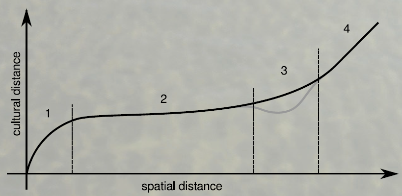

## Cultural distances

**traditional „Culture“ in Archaeology**

Archaeological culture = spatial and temporal limited entity of material culture 

**Cultures can correspond with:**

- language
- people
- race
- collective identity
- more...

<div style='position:absolute;top:35%;right:30%'>
    
</div>

<div style='position:absolute;top:35%;right:5%'>
    
</div>

<div style='position:absolute;bottom:10%;right:50%'>
    
</div>

--- &twocol

## Cultural distances | Components of cultural theory

*** =left

- What is culture?
  - Hansen, Tylor
- Why using culture?
  - B. Malinowski, A. Schweitzer
- How does culture work?
  - T. Parsons, A. Kroeber, R.Dawkins
- How are cultures connected?
  - F. Steger
- How do cultures evolve?
  - O. Spengler, R. Redfield, R. Linton u. M. Herskovits


*** =right

- Which components have cultures?
  - J. Huxley

<div style='position:absolute;top:35%;right:30%'>
    
</div>

<div style='position:absolute;top:35%;right:5%'>
    
</div>

<div style='position:absolute;bottom:7%;right:25%'>
    
</div>

--- .segue bg:grey

## What is wrong with the traditional approaches?

--- &twocol

## Cultural distances | Culture

*** =left


```r
Culture covers standardisations which 
are valid in collectives. 

(Hansen 2003, 39)
```

<div style='position:absolute;top:45%;left:5%'>
    
</div>

*** =right

- Formal and abstract definition which covers most other
- Spatial archaeological cultures as special case
- Applicable in archaeology

<div style='position:absolute;bottom:5%;right:5%'>
    
</div>

--- 

## Cultural distances

Structures|**Traditional arch. culture**|**Current arch. culture**
----|----|----
Actors|historical actor|cultures can not act
Dimensions|disjunct and exclusive|overlapping, multiple mem.
Hierarchy|mono-hierarchic|poly-hierarchic
Markers|based on cultural markers |broad basis of material culture
...|* ECNR-System| * No cultural equation
...|* Ethnic Groups = historical identification| * Ethnic Groups are the results of social interaction
...|* Cultures = empirical foundation| * Cultures are the adaptation, caused by interaction
...|* Nations = significance for people| * Nations are the result of political interaction
...|*Races = modern science based on laws of nature| * ’Races’, or rather biological units are the result of biological interaction
Entaglement|ethnic group = seed of nation = race = culture|ethnic group ̸= seed of nation ̸= race ̸= culture

<div style='position:absolute;top:5%;right:5%'>
    
</div>

--- &twocol

## Cultural distances

*** =left

**'Typenspektren'**

- All data are used for the calculation of cultural distances
- No diagnostic types or cultural markers
- ’Typenspektren’ include the relative amount of objects of certain types.

<div style='position:absolute;bottom:15%;left:10%'>
    
</div>

*** =right

<div style='position:absolute;bottom:20%;right:10%'>
    
</div>

--- &twocol

## Cultural distances | 'Typenspektren' 

*** =left

**Cultural fingerprint**

- 'Typenspektren' are a kind of cultural fingerprints.
- 'Typenspektren' don’t assume spatial archaeological cultures.
- 'Typenspektren' consider quantities and not only presence/absence.
- for every type of 'Typenspektren' a group of types, representing a certain part of society can be defines.
- 'Typenspektren' provide much more information and are much more robust than so called 'cultural markers'.

*** =right

<div style='position:absolute;top:15%;right:15%'>
  
</div>

<div style='position:absolute;bottom:10%;right:10%'>
  
</div>

--- &twocol

## Cultural distances | 'Typenspektren' 

**'Typenspektren' - using all available information**

*** =left

- 2; ”Beil”; xxx
  - 22; ”Beil, Tüllenbeil”; xxx
  - 221; ”Beil, T, Schlichte vierkantige T”; xxx
  - 2211; ”Beil, T, Schlichte vierkantige T, Norddeutsche T, Var. Hesepe”; xxx


*** =right

- 4; ”Nadel”; xxx
  - 41; ”Nadel, Rippenkopfnadeln”; xxx
  - 411; ”Nadel, Rippenkopfnadeln, Var. Nutteln”; xxx
  - 412; ”Nadel, Rippenkopfnadeln, Var. Badenstedt”; xxx

<div style='position:absolute;bottom:5%;right:25%'>
  
</div>

--- .segue bg:grey

## Which information can be used in 'Typenspektren'?

<a class="btn btn-primary btn-large" href='https://isaakiel.github.io/index.html'>
 
</a>

---

## Cultural distances

**Map of cultural distances**
- the cultural distances to one reference point are mapped on a grid
- topography of cultural similarities
- structure of interaction space

<div style='position:absolute;bottom:15%;right:20%'>
  
</div>

--- &twocol

## Cultural distances

*** =left

**Interaction spaces**

- groups of similar material culture indicate interaction spaces
- hierarchical Cluster analysis of regional Typensprektren
- cultural distance as Euclidean distance of two normalised Typensprektren

*** =right

<div style='position:absolute;bottom:10%;right:5%'>
  
</div>

---

## Cultural distances | Methodology for cultural areas

**Interaction areas**

<div style='position:absolute;bottom:10%;right:15%'>
  
</div>

--- &twocol

## Cultural distances

*** =left

**Hunsrück-Eifel-Kultur**
- same extent of different groups of material culture
- crisp border

<div style='position:absolute;bottom:20%;left:10%'>
  
</div>


*** =right

**Baden-Württemberg**
- fuzzy borders
- overlapping cultural areas

<div style='position:absolute;bottom:15%;right:5%'>
  
</div>

---

## Cultural distances | Methodology for cultural areas

**distance diagrams**

<div style='position:absolute;bottom:20%;right:15%'>
  
</div>

--- .segue bg:grey

## But how?!

<a class="btn btn-primary btn-large" href='https://isaakiel.github.io/index.html'>
 
</a>

---

## Preparation | Working Directory & Load Data


```r
wd <- "/home/fon/daten/analyse/mosaic"
setwd(wd)
```


```r
df.weapons <- read.csv("2data/shkr-weapons.csv", header=TRUE, sep=";")
t <- as.character(df.weapons[,13])
df.weapons <- data.frame(id= df.weapons[,4], 
               x=df.weapons[,1], y=df.weapons[,2], 
               t, stringsAsFactors = FALSE)
```

---

## Exploring Data | Structure & Content


```r
str(df.weapons)
## 'data.frame':	1165 obs. of  4 variables:
##  $ id: int  10261 10432 9439 9439 18567 18567 13415 13415 17039 17039 ...
##  $ x : num  3510314 3513254 3499751 3499751 3506691 ...
##  $ y : num  5433893 5417700 5417080 5417080 5345116 ...
##  $ t : chr  "B42213" "B4221" "B413" "B4211" ...
```


```r
df.weapons[1:4,]
##      id       x       y      t
## 1 10261 3510314 5433893 B42213
## 2 10432 3513254 5417700  B4221
## 3  9439 3499751 5417080   B413
## 4  9439 3499751 5417080  B4211
```

--- &twocol

## Global 'Typenspektrum' 

*** =left

- counting finds per type
- considering type hierarchy


*** =right


```r
tab.weapons <- table(df.weapons[,4])
tw <- tab.weapons
for (i in seq_along(tab.weapons)) {
  a <- dimnames(tab.weapons)[[1]][i]
  b <- dimnames(tab.weapons)[[1]][]
  tw[i] <- sum(tab.weapons[grepl(a, b)])
}
barplot(tw)
```

--- &twocol

## Spatial Data

*** =left

- packages
- projection data
- conversion

*** =right


```r
library(sp)         # spatial objects
library(proj4)      # projection
library(spatstat)   # spatial statistics
library(maptools)   # spatial tools

crs1 <- "+proj=tmerc +lat_0=0 +lon_0=9
+k=1 +x_0=3500000 +y_0=0
+ellps=WGS84 +units=m +no_defs"

coordinates(df.weapons)=~x+y
proj4string(df.weapons) <-
CRS(as.character(crs1))
```

---

## What is inside? | Structure of Spatial Objects


```r
str(df.weapons)
## Formal class 'SpatialPointsDataFrame' [package "sp"] with 5 slots
##   ..@ data       :'data.frame':	1165 obs. of  2 variables:
##   .. ..$ id: int [1:1165] 10261 10432 9439 9439 18567 18567 13415 13415 17039 17039 ...
##   .. ..$ t : chr [1:1165] "B42213" "B4221" "B413" "B4211" ...
##   ..@ coords.nrs : int [1:2] 2 3
##   ..@ coords     : num [1:1165, 1:2] 3510314 3513254 3499751 3499751 3506691 ...
##   .. ..- attr(*, "dimnames")=List of 2
##   .. .. ..$ : chr [1:1165] "1" "2" "3" "4" ...
##   .. .. ..$ : chr [1:2] "x" "y"
##   ..@ bbox       : num [1:2, 1:2] 3391750 5268797 3606087 5516434
##   .. ..- attr(*, "dimnames")=List of 2
##   .. .. ..$ : chr [1:2] "x" "y"
##   .. .. ..$ : chr [1:2] "min" "max"
##   ..@ proj4string:Formal class 'CRS' [package "sp"] with 1 slot
##   .. .. ..@ projargs: chr "+proj=tmerc +lat_0=0 +lon_0=9 +k=1 +x_0=3500000 +y_0=0 +ellps=WGS84 +units=m +no_defs"
```

--- &twocol

## Prep. local 'Typenspektren'

*** =left

- list of types
- variables
- owin object (`spatstat`)
- regular sample points

*** =right


```r
type.list <- unlist(dimnames(tab.weapons))
type.n <- length(type.list)
sdev <- 5000
bb <- bbox(df.weapons)
win <- owin(xrange=c(bb[1,1],bb[1,2]),
yrange= c(bb[2,1],bb[2,2]),
  unitname="m")
s.points <- spsample(df.weapons, 100,
  type="regular")
samp <- list()
i=0
```

--- &twocol

## Loop local 'Typenspektren'

*** =left

- loop through all types
- producing a point pattern object
- calculating density
- sampling density
- Typenspektren as list of vectors

*** =right


```r
for (t in type.list) {
  i <- i+1
  finds <- df.weapons[which(df.weapons
                            @data$t==t),]
  ppp_w <- ppp(finds@coords[,1],
      finds@coords[,2], window=win)
  dens <- density(ppp_w, kernel="gaussian", 
      sigma=sdev, dimyx=c(36,56), w=win,
      edge=TRUE, at="pixels")
  sgdf_w_dens <- as.SpatialGridDataFrame.im(
      dens)
  proj4string(sgdf_w_dens) <- CRS(
      as.character(crs1))
  meg_dens_samp <- over(s.points, 
                        sgdf_w_dens)
  samp[[i]] <- meg_dens_samp
}
```

--- 

## Exploring the result | Structure & Content


```r
str(samp)
```

```
## List of 49
##  $ :'data.frame':	99 obs. of  1 variable:
##   ..$ v: num [1:99] -3.90e-25 1.46e-26 1.17e-14 3.94e-13 5.13e-19 ...
##  $ :'data.frame':	99 obs. of  1 variable:
##   ..$ v: num [1:99] -1.05e-26 -1.30e-25 1.22e-19 1.77e-10 1.77e-10 ...
##  $ :'data.frame':	99 obs. of  1 variable:
##   ..$ v: num [1:99] 1.04e-11 1.03e-11 5.24e-16 2.59e-10 3.02e-09 ...
##  $ :'data.frame':	99 obs. of  1 variable:
##   ..$ v: num [1:99] 1.05e-19 -2.65e-26 -2.45e-26 1.85e-26 1.21e-26 ...
##  $ :'data.frame':	99 obs. of  1 variable:
##   ..$ v: num [1:99] 7.05e-27 5.04e-27 1.05e-26 5.59e-27 3.01e-27 ...
##  $ :'data.frame':	99 obs. of  1 variable:
##   ..$ v: num [1:99] 1.04e-11 7.13e-21 9.32e-22 4.55e-11 1.53e-09 ...
##  $ :'data.frame':	99 obs. of  1 variable:
##   ..$ v: num [1:99] -7.41e-26 2.89e-25 -5.82e-26 3.34e-18 5.22e-15 ...
##  $ :'data.frame':	99 obs. of  1 variable:
##   ..$ v: num [1:99] 1.05e-19 -9.24e-26 4.92e-26 -2.97e-26 2.42e-20 ...
##  $ :'data.frame':	99 obs. of  1 variable:
##   ..$ v: num [1:99] 3.28e-26 -4.53e-26 1.88e-26 4.28e-27 5.39e-26 ...
##  $ :'data.frame':	99 obs. of  1 variable:
##   ..$ v: num [1:99] 1.05e-19 4.85e-26 4.66e-22 2.28e-11 7.65e-10 ...
##  $ :'data.frame':	99 obs. of  1 variable:
##   ..$ v: num [1:99] 1.05e-19 1.51e-27 1.96e-26 3.60e-26 1.10e-26 ...
##  $ :'data.frame':	99 obs. of  1 variable:
##   ..$ v: num [1:99] 3.09e-28 8.61e-28 6.42e-27 -9.97e-27 6.91e-27 ...
##  $ :'data.frame':	99 obs. of  1 variable:
##   ..$ v: num [1:99] 9.68e-27 -4.57e-27 2.68e-27 7.91e-27 1.84e-26 ...
##  $ :'data.frame':	99 obs. of  1 variable:
##   ..$ v: num [1:99] 3.65e-26 1.89e-27 -2.37e-26 -1.48e-26 -5.57e-27 ...
##  $ :'data.frame':	99 obs. of  1 variable:
##   ..$ v: num [1:99] 2.54e-26 2.71e-27 -8.54e-27 2.69e-26 -1.70e-26 ...
##  $ :'data.frame':	99 obs. of  1 variable:
##   ..$ v: num [1:99] 8.18e-27 6.92e-28 7.53e-27 1.37e-26 5.55e-27 ...
##  $ :'data.frame':	99 obs. of  1 variable:
##   ..$ v: num [1:99] 4.73e-27 -1.88e-27 -1.65e-28 -3.13e-28 -1.43e-28 ...
##  $ :'data.frame':	99 obs. of  1 variable:
##   ..$ v: num [1:99] 2.31e-26 -1.86e-27 -7.70e-27 2.65e-26 -2.26e-27 ...
##  $ :'data.frame':	99 obs. of  1 variable:
##   ..$ v: num [1:99] 5.47e-27 1.04e-28 -3.82e-27 1.21e-26 2.06e-26 ...
##  $ :'data.frame':	99 obs. of  1 variable:
##   ..$ v: num [1:99] 4.20e-19 1.47e-25 2.60e-21 1.27e-10 4.38e-09 ...
##  $ :'data.frame':	99 obs. of  1 variable:
##   ..$ v: num [1:99] 3.15e-19 -3.47e-25 -3.64e-25 3.80e-25 -2.10e-25 ...
##  $ :'data.frame':	99 obs. of  1 variable:
##   ..$ v: num [1:99] -2.25e-25 1.05e-26 -8.15e-26 -5.19e-26 1.44e-15 ...
##  $ :'data.frame':	99 obs. of  1 variable:
##   ..$ v: num [1:99] -1.47e-25 1.02e-26 6.85e-27 9.68e-20 1.21e-18 ...
##  $ :'data.frame':	99 obs. of  1 variable:
##   ..$ v: num [1:99] 3.58e-19 -3.92e-25 1.67e-13 6.59e-09 4.94e-09 ...
##  $ :'data.frame':	99 obs. of  1 variable:
##   ..$ v: num [1:99] 1.31e-27 2.16e-25 1.88e-20 2.35e-11 7.66e-10 ...
##  $ :'data.frame':	99 obs. of  1 variable:
##   ..$ v: num [1:99] 3.40e-24 7.59e-15 3.79e-10 3.85e-12 1.64e-09 ...
##  $ :'data.frame':	99 obs. of  1 variable:
##   ..$ v: num [1:99] 5.54e-27 1.00e-25 1.84e-25 2.86e-25 -9.44e-26 ...
##  $ :'data.frame':	99 obs. of  1 variable:
##   ..$ v: num [1:99] -1.87e-26 2.80e-27 2.31e-27 -6.33e-27 -4.97e-27 ...
##  $ :'data.frame':	99 obs. of  1 variable:
##   ..$ v: num [1:99] 3.19e-24 7.82e-26 -1.59e-25 -7.74e-26 -9.61e-26 ...
##  $ :'data.frame':	99 obs. of  1 variable:
##   ..$ v: num [1:99] 5.91e-27 2.43e-26 4.42e-26 3.41e-28 -2.26e-27 ...
##  $ :'data.frame':	99 obs. of  1 variable:
##   ..$ v: num [1:99] 9.97e-28 -1.15e-26 9.33e-27 7.84e-27 1.21e-23 ...
##  $ :'data.frame':	99 obs. of  1 variable:
##   ..$ v: num [1:99] 1.78e-10 1.23e-16 4.48e-11 1.82e-12 1.03e-13 ...
##  $ :'data.frame':	99 obs. of  1 variable:
##   ..$ v: num [1:99] 1.85e-25 1.04e-17 4.48e-10 1.33e-11 2.73e-22 ...
##  $ :'data.frame':	99 obs. of  1 variable:
##   ..$ v: num [1:99] -8.86e-26 3.55e-17 1.53e-09 4.55e-11 9.33e-22 ...
##  $ :'data.frame':	99 obs. of  1 variable:
##   ..$ v: num [1:99] 6.03e-27 -1.44e-26 -7.34e-27 8.41e-17 1.08e-10 ...
##  $ :'data.frame':	99 obs. of  1 variable:
##   ..$ v: num [1:99] -6.69e-25 4.15e-18 1.79e-10 5.32e-12 1.09e-22 ...
##  $ :'data.frame':	99 obs. of  1 variable:
##   ..$ v: num [1:99] 1.31e-25 -5.39e-26 7.51e-19 7.89e-13 2.34e-14 ...
##  $ :'data.frame':	99 obs. of  1 variable:
##   ..$ v: num [1:99] -1.85e-26 6.23e-18 2.69e-10 7.98e-12 1.64e-22 ...
##  $ :'data.frame':	99 obs. of  1 variable:
##   ..$ v: num [1:99] -6.08e-27 1.04e-18 4.48e-11 1.33e-12 2.73e-23 ...
##  $ :'data.frame':	99 obs. of  1 variable:
##   ..$ v: num [1:99] -1.79e-26 -2.77e-26 1.51e-26 -1.63e-26 -5.06e-27 ...
##  $ :'data.frame':	99 obs. of  1 variable:
##   ..$ v: num [1:99] 1.31e-26 3.22e-27 -1.81e-26 2.48e-26 -5.06e-26 ...
##  $ :'data.frame':	99 obs. of  1 variable:
##   ..$ v: num [1:99] -2.70e-27 -1.52e-26 1.05e-19 3.11e-21 -2.09e-26 ...
##  $ :'data.frame':	99 obs. of  1 variable:
##   ..$ v: num [1:99] 2.44e-26 -1.26e-26 1.05e-19 3.11e-21 2.28e-26 ...
##  $ :'data.frame':	99 obs. of  1 variable:
##   ..$ v: num [1:99] 1.06e-19 4.55e-11 1.53e-09 5.90e-11 4.13e-09 ...
##  $ :'data.frame':	99 obs. of  1 variable:
##   ..$ v: num [1:99] -1.47e-26 1.27e-26 1.04e-18 4.48e-11 5.53e-12 ...
##  $ :'data.frame':	99 obs. of  1 variable:
##   ..$ v: num [1:99] -7.38e-27 6.98e-28 5.07e-27 -3.43e-27 -8.03e-26 ...
##  $ :'data.frame':	99 obs. of  1 variable:
##   ..$ v: num [1:99] -6.71e-26 1.48e-25 -6.49e-26 8.65e-26 4.84e-20 ...
##  $ :'data.frame':	99 obs. of  1 variable:
##   ..$ v: num [1:99] 1.33e-12 4.48e-11 1.04e-18 -5.21e-26 3.91e-26 ...
##  $ :'data.frame':	99 obs. of  1 variable:
##   ..$ v: num [1:99] 1.05e-19 -8.65e-26 -5.13e-26 5.33e-17 2.30e-09 ...
```

--- 

## Exploring the result | Structure & Content


```r
samp
```

```
## [[1]]
##                v
## 1  -3.900935e-25
## 2   1.464043e-26
## 3   1.172284e-14
## 4   3.944065e-13
## 5   5.134900e-19
## 6   4.479419e-22
## 7   2.083807e-24
## 8   3.112606e-21
## 9   1.047265e-19
## 10  4.783225e-25
## 11  1.201207e-21
## 12  5.861014e-11
## 13  1.971896e-09
## 14  2.155993e-10
## 15  7.671016e-13
## 16  1.939908e-13
## 17  1.330388e-12
## 18  4.476932e-11
## 19 -2.108395e-25
## 20  3.205490e-25
## 21  1.555947e-17
## 22  1.630659e-12
## 23  4.667740e-09
## 24  1.143720e-09
## 25  4.843042e-10
## 26  1.425623e-12
## 27  4.476932e-11
## 28 -1.458044e-25
## 29 -3.043721e-25
## 30  6.349482e-23
## 31  2.098975e-13
## 32  2.612407e-10
## 33  1.783965e-10
## 34  2.020343e-09
## 35  1.628512e-12
## 36  1.047162e-19
## 37 -4.363644e-25
## 38 -2.565111e-25
## 39  3.237316e-19
## 40  5.832558e-10
## 41  6.921611e-09
## 42  5.344767e-10
## 43  2.309410e-09
## 44  1.628513e-12
## 45  6.986645e-25
## 46 -3.860146e-25
## 47  9.647355e-26
## 48  7.143415e-21
## 49  1.034743e-11
## 50  3.914782e-09
## 51  3.656803e-08
## 52  6.046847e-11
## 53  1.078005e-10
## 54  9.525457e-14
## 55 -2.118885e-25
## 56  4.189079e-25
## 57  1.775535e-17
## 58  7.653948e-10
## 59  2.384020e-10
## 60  2.023548e-09
## 61  6.627977e-14
## 62  1.843373e-09
## 63  1.628852e-12
## 64  1.885564e-25
## 65  4.280437e-25
## 66  1.038325e-18
## 67  4.475994e-11
## 68  1.330388e-12
## 69  4.732171e-18
## 70  1.039433e-18
## 71  4.476120e-11
## 72  1.330668e-12
## 73  7.521319e-26
## 74 -2.353756e-25
## 75 -3.075432e-26
## 76  2.954874e-24
## 77 -1.791512e-25
## 78 -3.544908e-24
## 79  1.172259e-14
## 80  4.515430e-11
## 81  1.330667e-12
## 82  1.006995e-25
## 83  2.035729e-26
## 84  1.122257e-25
## 85  2.676694e-26
## 86  2.314822e-25
## 87  1.202608e-21
## 88  5.861015e-11
## 89  1.971896e-09
## 90  4.575603e-17
## 91  1.560186e-25
## 92  3.426495e-25
## 93  1.325666e-25
## 94  4.116862e-25
## 95  1.327727e-25
## 96 -3.137264e-24
## 97  1.513614e-14
## 98  5.092444e-13
## 99  1.181557e-20
## 
## [[2]]
##                v
## 1  -1.049068e-26
## 2  -1.296383e-25
## 3   1.220327e-19
## 4   1.769880e-10
## 5   1.769923e-10
## 6   5.530727e-09
## 7   4.886086e-12
## 8   2.732582e-24
## 9  -3.292819e-26
## 10 -4.615392e-26
## 11  5.788168e-26
## 12  3.213302e-19
## 13  4.660353e-10
## 14  4.673998e-10
## 15  1.088885e-09
## 16  2.303532e-11
## 17  4.666421e-22
## 18 -9.655914e-26
## 19 -1.888115e-25
## 20  2.067580e-25
## 21 -1.202416e-25
## 22  6.500277e-14
## 23  2.647781e-09
## 24  1.773372e-10
## 25  1.172167e-14
## 26  1.254661e-25
## 27  1.951162e-25
## 28 -1.475802e-25
## 29  1.191510e-25
## 30  9.811111e-27
## 31  4.484169e-20
## 32  2.275143e-11
## 33  7.653947e-10
## 34  1.775535e-17
## 35  1.200554e-25
## 36  1.470640e-25
## 37  8.829096e-26
## 38  2.409473e-25
## 39 -2.755160e-26
## 40  2.744441e-23
## 41  1.330388e-12
## 42  4.475994e-11
## 43  1.038325e-18
## 44  6.823162e-24
## 45  1.209996e-16
## 46 -4.615392e-26
## 47  1.199500e-25
## 48 -8.194970e-26
## 49  3.342974e-17
## 50  1.368447e-12
## 51  1.116190e-10
## 52  2.685575e-16
## 53  1.077996e-10
## 54  4.558823e-10
## 55 -4.678329e-25
## 56 -9.799422e-26
## 57 -3.420438e-25
## 58  1.671555e-13
## 59  6.367986e-09
## 60  2.094219e-08
## 61  5.043439e-13
## 62  1.843374e-09
## 63  1.720007e-12
## 64 -4.772735e-25
## 65 -3.210258e-25
## 66 -4.565091e-28
## 67  3.447170e-17
## 68  2.231940e-10
## 69  5.965599e-09
## 70  7.941859e-13
## 71  1.843398e-09
## 72  1.628853e-12
## 73  2.181822e-25
## 74 -4.920984e-25
## 75 -3.896852e-25
## 76  1.038352e-18
## 77  4.609038e-11
## 78  4.610306e-11
## 79  1.577811e-08
## 80  5.903569e-11
## 81  8.392535e-16
## 82  1.562940e-25
## 83 -2.092783e-25
## 84 -5.509667e-26
## 85  6.601633e-26
## 86  1.078045e-19
## 87  4.797333e-15
## 88  1.850023e-09
## 89  1.631063e-12
## 90  9.798154e-25
## 91  1.625426e-25
## 92  1.041687e-24
## 93 -2.542536e-25
## 94 -9.778456e-25
## 95  1.356201e-23
## 96  2.167112e-11
## 97  2.466944e-08
## 98  1.421223e-13
## 99 -5.989991e-25
## 
## [[3]]
##                v
## 1   1.037620e-11
## 2   1.034485e-11
## 3   5.236845e-16
## 4   2.586617e-10
## 5   3.024224e-09
## 6   3.687248e-09
## 7   1.846833e-09
## 8   1.628706e-12
## 9   5.241779e-16
## 10  1.346867e-10
## 11  2.089451e-17
## 12  7.653955e-10
## 13  2.017718e-09
## 14  2.565368e-08
## 15  2.175611e-10
## 16  1.527618e-10
## 17  3.122155e-11
## 18  9.894016e-10
## 19  1.346867e-10
## 20  3.124124e-18
## 21  2.022874e-12
## 22  2.020265e-09
## 23  2.028055e-09
## 24  2.182853e-10
## 25  1.085902e-09
## 26  7.984025e-10
## 27  2.242411e-10
## 28  3.150300e-19
## 29 -1.403442e-24
## 30  1.235833e-18
## 31  1.769701e-10
## 32  2.757914e-09
## 33  1.041716e-08
## 34  8.595123e-09
## 35  1.159244e-08
## 36  2.292167e-11
## 37 -6.000010e-25
## 38 -2.165426e-25
## 39  3.231939e-19
## 40  5.570339e-10
## 41  8.237290e-09
## 42  6.649502e-09
## 43  1.024059e-08
## 44  4.874863e-11
## 45  1.330821e-12
## 46 -5.664345e-26
## 47 -6.864488e-26
## 48  3.794253e-15
## 49  1.446368e-10
## 50  6.047177e-11
## 51  2.082961e-09
## 52  1.843373e-09
## 53  1.628512e-12
## 54  4.567370e-10
## 55 -8.307706e-25
## 56  2.429358e-23
## 57  6.736870e-14
## 58  4.814819e-09
## 59  9.246974e-10
## 60  1.816444e-08
## 61  1.772693e-13
## 62  7.705926e-15
## 63  4.750192e-09
## 64 -3.482523e-25
## 65  3.551069e-17
## 66  1.530789e-09
## 67  1.379742e-09
## 68  6.171958e-10
## 69  4.764045e-09
## 70  5.612741e-11
## 71  6.097364e-09
## 72  4.825155e-11
## 73  3.566439e-26
## 74  1.832376e-20
## 75  2.183996e-12
## 76  2.519678e-09
## 77  1.343463e-10
## 78  1.855050e-09
## 79  2.665504e-09
## 80  2.796868e-10
## 81  1.233703e-13
## 82  2.517487e-26
## 83  4.662419e-22
## 84  2.274962e-11
## 85  7.653964e-10
## 86  1.022480e-16
## 87  1.077997e-10
## 88  4.485644e-11
## 89  1.330390e-12
## 90  2.593750e-22
## 91  3.571805e-25
## 92 -3.445425e-25
## 93  2.009207e-17
## 94  6.759832e-16
## 95  1.624549e-23
## 96  3.255947e-19
## 97  1.354778e-19
## 98  4.017736e-21
## 99  5.632016e-25
## 
## [[4]]
##                v
## 1   1.050219e-19
## 2  -2.652929e-26
## 3  -2.452748e-26
## 4   1.854554e-26
## 5   1.207583e-26
## 6  -5.464697e-27
## 7  -1.311657e-26
## 8   1.235373e-26
## 9  -1.741402e-26
## 10  4.489558e-11
## 11  1.038325e-18
## 12  8.515454e-26
## 13 -7.782874e-26
## 14 -4.052667e-27
## 15  5.151208e-26
## 16  9.426635e-27
## 17  3.889488e-26
## 18  5.138949e-26
## 19  4.489558e-11
## 20  1.038325e-18
## 21  2.673378e-26
## 22 -5.299708e-27
## 23  3.547648e-27
## 24  1.541394e-26
## 25  1.099695e-26
## 26 -1.673519e-27
## 27  6.050141e-27
## 28  1.050104e-19
## 29 -7.173556e-27
## 30  6.226990e-27
## 31  3.332691e-26
## 32 -2.018971e-26
## 33 -1.968399e-26
## 34  6.516882e-27
## 35 -2.261097e-26
## 36  5.709779e-27
## 37  1.896759e-26
## 38 -2.617532e-26
## 39 -2.179309e-26
## 40  7.458113e-26
## 41 -1.690475e-26
## 42 -9.532214e-27
## 43  9.799041e-27
## 44  3.231489e-26
## 45  1.354563e-27
## 46  3.532840e-26
## 47 -3.126104e-26
## 48  1.531136e-26
## 49  1.650694e-26
## 50 -1.033669e-26
## 51 -1.455301e-26
## 52  2.295898e-26
## 53  1.186695e-26
## 54 -3.708875e-26
## 55 -2.720416e-26
## 56 -3.563283e-27
## 57  1.690601e-26
## 58  3.189430e-26
## 59 -2.660248e-26
## 60  8.485395e-27
## 61  7.777945e-28
## 62 -5.925143e-27
## 63  2.387153e-26
## 64  1.542605e-26
## 65  1.552934e-26
## 66  1.113810e-18
## 67  1.260764e-15
## 68  9.839911e-22
## 69 -1.576427e-26
## 70  1.549417e-26
## 71  2.906101e-26
## 72 -2.795865e-26
## 73  7.132879e-26
## 74  2.207909e-24
## 75  4.195554e-12
## 76  4.749106e-09
## 77  3.706524e-15
## 78  7.676429e-26
## 79  1.763444e-25
## 80  2.669200e-26
## 81 -4.514769e-26
## 82  3.561728e-26
## 83  2.075065e-26
## 84  8.390769e-16
## 85  9.497827e-13
## 86  7.412749e-19
## 87 -4.343200e-27
## 88  2.259766e-26
## 89  3.438578e-26
## 90 -2.160139e-26
## 91  8.901907e-26
## 92 -5.642811e-27
## 93  1.359884e-26
## 94  9.423949e-24
## 95  2.186539e-26
## 96  1.563754e-26
## 97  4.967894e-27
## 98  4.143217e-28
## 99 -1.859437e-26
## 
## [[5]]
##                v
## 1   7.045726e-27
## 2   5.037872e-27
## 3   1.045488e-26
## 4   5.586223e-27
## 5   3.014124e-27
## 6  -1.504568e-26
## 7  -1.712065e-26
## 8   2.178589e-27
## 9   1.204517e-26
## 10  8.635593e-27
## 11  2.413316e-28
## 12  2.051609e-26
## 13 -5.224741e-27
## 14 -2.035507e-26
## 15  3.095188e-27
## 16  3.808157e-27
## 17  2.052643e-26
## 18  4.889400e-26
## 19 -1.021049e-26
## 20 -7.344365e-27
## 21 -1.880942e-27
## 22  8.564117e-27
## 23  2.001148e-26
## 24 -1.046871e-26
## 25 -1.125995e-26
## 26 -8.863081e-28
## 27 -1.267873e-25
## 28 -7.746062e-27
## 29  2.832242e-27
## 30 -6.949291e-27
## 31 -6.576957e-27
## 32  1.829849e-26
## 33  4.092436e-27
## 34 -1.153993e-26
## 35  4.137535e-27
## 36  2.234069e-26
## 37  9.632955e-27
## 38 -4.467687e-27
## 39 -1.887892e-26
## 40  1.887616e-29
## 41 -1.170960e-27
## 42  1.912615e-26
## 43  1.419789e-26
## 44  1.681388e-26
## 45  2.742354e-26
## 46 -1.937080e-26
## 47 -6.870965e-27
## 48 -7.414420e-27
## 49  4.047872e-28
## 50  2.213690e-26
## 51 -5.003159e-27
## 52  7.741629e-27
## 53  3.342974e-17
## 54  1.273379e-12
## 55 -1.930073e-25
## 56  5.642998e-26
## 57 -1.555389e-25
## 58 -1.253143e-25
## 59  8.175190e-26
## 60 -2.651309e-26
## 61 -4.525999e-25
## 62  1.671555e-13
## 63  6.367155e-09
## 64 -4.916966e-28
## 65  1.689142e-27
## 66  1.497305e-26
## 67 -1.136567e-26
## 68  2.709825e-26
## 69 -2.719163e-27
## 70  7.636225e-27
## 71  3.342974e-17
## 72  1.273379e-12
## 73 -2.829766e-27
## 74  5.555840e-27
## 75  6.685776e-27
## 76 -1.646759e-27
## 77 -8.771064e-28
## 78  6.395799e-27
## 79  1.564203e-26
## 80 -8.621361e-28
## 81  6.199354e-26
## 82  2.568090e-27
## 83 -1.125894e-27
## 84 -1.796428e-26
## 85  1.302272e-26
## 86 -1.283828e-26
## 87 -2.643711e-27
## 88  2.524462e-27
## 89 -8.764100e-27
## 90  1.858828e-26
## 91  1.117348e-26
## 92 -3.398838e-26
## 93  2.985982e-26
## 94  5.420178e-27
## 95 -2.090901e-26
## 96  1.397758e-26
## 97  1.992516e-26
## 98  1.640592e-26
## 99  4.108318e-26
## 
## [[6]]
##                v
## 1   1.037620e-11
## 2   7.132368e-21
## 3   9.322532e-22
## 4   4.550424e-11
## 5   1.530957e-09
## 6   3.551460e-17
## 7  -1.071124e-25
## 8  -9.230686e-26
## 9  -2.733473e-25
## 10  1.774134e-10
## 11  1.219561e-19
## 12  5.437658e-23
## 13  2.660776e-12
## 14  8.951988e-11
## 15  2.076650e-18
## 16 -8.772383e-26
## 17 -1.749641e-25
## 18 -4.165053e-25
## 19  2.426685e-20
## 20 -4.883978e-25
## 21  9.003884e-24
## 22  3.379774e-19
## 23  2.717534e-23
## 24  6.447135e-16
## 25  1.365340e-16
## 26  5.234871e-16
## 27  1.556273e-17
## 28  5.250734e-16
## 29  1.555947e-17
## 30  3.794252e-15
## 31  1.444975e-10
## 32  8.084160e-15
## 33  1.050072e-09
## 34  1.997223e-10
## 35  7.653946e-10
## 36  2.275439e-11
## 37  7.677140e-10
## 38  2.274962e-11
## 39  6.488168e-14
## 40  2.652901e-09
## 41  6.123227e-09
## 42  2.042974e-09
## 43  6.110217e-11
## 44  1.539018e-10
## 45  1.330751e-12
## 46  3.955582e-13
## 47  1.172155e-14
## 48  7.588505e-15
## 49  2.890898e-10
## 50  5.954309e-11
## 51  1.585254e-10
## 52  5.752127e-09
## 53  2.602913e-09
## 54  6.497942e-14
## 55  2.502801e-24
## 56  7.412862e-19
## 57  1.082347e-12
## 58  6.786298e-09
## 59  7.311652e-09
## 60  1.315905e-08
## 61  4.371847e-12
## 62  1.444974e-10
## 63  3.795047e-15
## 64 -4.699308e-25
## 65  3.724280e-15
## 66  5.518696e-09
## 67  4.907801e-09
## 68  8.129710e-10
## 69  6.702501e-09
## 70  6.101858e-15
## 71  3.379776e-19
## 72  8.749899e-24
## 73  7.306612e-26
## 74  1.013184e-20
## 75  3.956251e-13
## 76  2.395996e-11
## 77  8.056798e-10
## 78  9.510620e-13
## 79  7.422591e-19
## 80 -8.165064e-26
## 81 -1.391715e-25
## 82  2.503216e-26
## 83 -1.037047e-25
## 84  3.410585e-24
## 85  5.601184e-20
## 86  1.884478e-18
## 87  7.398013e-24
## 88 -3.328204e-25
## 89 -3.158430e-27
## 90  4.405862e-26
## 91  3.868692e-25
## 92  9.486441e-26
## 93  3.337367e-26
## 94 -6.890374e-25
## 95  4.213620e-25
## 96  4.023040e-25
## 97 -2.141942e-25
## 98  2.180743e-25
## 99  4.260764e-26
## 
## [[7]]
##                v
## 1  -7.405765e-26
## 2   2.892564e-25
## 3  -5.818676e-26
## 4   3.341798e-18
## 5   5.221560e-15
## 6   1.902192e-09
## 7   1.973742e-09
## 8   4.574836e-17
## 9   1.403244e-25
## 10 -1.636366e-25
## 11  3.533216e-26
## 12  2.778618e-24
## 13  4.885533e-12
## 14  5.530119e-09
## 15  1.078157e-10
## 16  4.895978e-13
## 17  9.148357e-21
## 18 -1.704290e-25
## 19 -2.685319e-25
## 20 -1.812772e-25
## 21 -5.363665e-25
## 22  2.620450e-13
## 23  9.931224e-09
## 24  1.589932e-12
## 25  5.234871e-16
## 26  1.219579e-23
## 27  5.622521e-26
## 28 -5.244764e-28
## 29 -3.365299e-26
## 30 -1.669915e-25
## 31  1.519476e-14
## 32  1.343384e-09
## 33  4.551442e-11
## 34  7.653946e-10
## 35  1.775535e-17
## 36  1.791533e-25
## 37  1.736124e-26
## 38 -9.389790e-26
## 39 -7.204454e-26
## 40  4.782904e-23
## 41  5.248390e-16
## 42  1.330403e-12
## 43  4.475994e-11
## 44  1.038325e-18
## 45  4.294305e-26
## 46 -3.068187e-26
## 47 -7.304465e-27
## 48 -1.202947e-25
## 49  3.718613e-26
## 50  8.413415e-17
## 51  1.077996e-10
## 52  9.523461e-14
## 53  5.672389e-26
## 54 -7.809773e-27
## 55 -1.489513e-25
## 56 -1.172728e-26
## 57  7.875619e-27
## 58  1.768945e-25
## 59  1.438798e-15
## 60  1.843373e-09
## 61  1.628511e-12
## 62  9.683645e-25
## 63 -1.332352e-25
## 64  5.336547e-26
## 65 -1.417136e-25
## 66  3.859662e-26
## 67  1.038325e-18
## 68  4.475994e-11
## 69  1.331649e-12
## 70  1.113838e-18
## 71 -4.053556e-26
## 72 -3.051672e-26
## 73 -5.356215e-26
## 74 -2.448340e-26
## 75  1.026793e-25
## 76  1.038325e-18
## 77  4.475994e-11
## 78  1.330388e-12
## 79  2.726804e-23
## 80 -9.730255e-26
## 81 -1.007546e-25
## 82  1.547402e-25
## 83  9.040353e-26
## 84 -5.273162e-27
## 85  3.850642e-27
## 86  1.046929e-19
## 87  3.111652e-21
## 88 -2.168958e-26
## 89  1.967145e-26
## 90 -3.765876e-26
## 91  9.676205e-26
## 92  1.021560e-26
## 93 -1.273071e-25
## 94  1.826934e-26
## 95  4.012750e-25
## 96 -3.280166e-26
## 97  4.980935e-26
## 98  1.133204e-25
## 99 -6.097343e-26
## 
## [[8]]
##                v
## 1   1.050219e-19
## 2  -9.239960e-26
## 3   4.919938e-26
## 4  -2.968951e-26
## 5   2.419635e-20
## 6   2.419652e-20
## 7   1.727608e-26
## 8   3.112064e-21
## 9   1.047265e-19
## 10  4.489558e-11
## 11  1.038325e-18
## 12 -1.950103e-26
## 13  7.131948e-21
## 14  1.034371e-11
## 15  1.034371e-11
## 16  7.159227e-21
## 17  1.330388e-12
## 18  4.476932e-11
## 19  4.489558e-11
## 20  1.038325e-18
## 21  4.302357e-26
## 22  7.131840e-21
## 23  1.034371e-11
## 24  1.034371e-11
## 25  7.159270e-21
## 26  1.330388e-12
## 27  4.476932e-11
## 28  1.050104e-19
## 29 -1.629177e-26
## 30 -1.970018e-26
## 31  1.555947e-17
## 32  5.237634e-16
## 33  2.442873e-20
## 34 -2.756038e-26
## 35  3.111721e-21
## 36  1.047151e-19
## 37  6.923088e-26
## 38 -2.466413e-26
## 39  4.661311e-22
## 40  2.274970e-11
## 41  8.731943e-10
## 42  9.525237e-14
## 43  9.840789e-26
## 44  2.321357e-26
## 45  1.209996e-16
## 46 -8.601413e-26
## 47  1.115975e-25
## 48  3.342974e-17
## 49  1.349800e-12
## 50  2.579098e-09
## 51  1.601163e-13
## 52  1.745837e-25
## 53  3.141982e-19
## 54  4.557871e-10
## 55  4.274483e-26
## 56 -3.105820e-25
## 57  1.671555e-13
## 58  6.365825e-09
## 59  1.446645e-10
## 60  3.794252e-15
## 61  2.101301e-23
## 62  5.238251e-16
## 63  9.116927e-14
## 64  8.024489e-26
## 65 -7.850711e-26
## 66  3.342974e-17
## 67  1.273112e-12
## 68  3.376772e-17
## 69  8.819118e-24
## 70  3.812007e-15
## 71  9.098920e-10
## 72  2.275818e-11
## 73  3.331654e-26
## 74 -3.724175e-26
## 75  7.828569e-27
## 76  5.153704e-26
## 77 -2.212157e-25
## 78  2.214272e-26
## 79  3.794261e-15
## 80  1.448917e-10
## 81  1.551905e-14
## 82  6.030649e-26
## 83 -2.930066e-26
## 84  5.222350e-26
## 85  4.654408e-26
## 86  2.406188e-26
## 87  2.093827e-26
## 88  8.880913e-24
## 89  3.379815e-19
## 90  8.887247e-24
## 91  5.693253e-26
## 92 -9.471086e-26
## 93  8.642089e-27
## 94  1.418429e-26
## 95 -1.349776e-25
## 96 -6.921635e-26
## 97  2.321821e-26
## 98 -2.490883e-25
## 99 -2.992358e-26
## 
## [[9]]
##                v
## 1   3.276214e-26
## 2  -4.533861e-26
## 3   1.882224e-26
## 4   4.279088e-27
## 5   5.386830e-26
## 6  -2.863217e-26
## 7   7.164697e-26
## 8   2.942983e-26
## 9   5.444570e-27
## 10 -2.145148e-26
## 11  2.226456e-26
## 12  1.413101e-26
## 13  6.223414e-21
## 14  2.093863e-19
## 15  2.481695e-25
## 16 -9.911069e-26
## 17 -3.247017e-26
## 18  1.961265e-26
## 19 -1.008920e-25
## 20 -5.317259e-27
## 21  9.323775e-22
## 22  4.549924e-11
## 23  1.530789e-09
## 24  3.576284e-17
## 25  2.227961e-22
## 26 -2.039200e-27
## 27 -1.290343e-25
## 28  2.753501e-27
## 29 -5.077729e-26
## 30  5.455798e-23
## 31  2.660791e-12
## 32  8.952049e-11
## 33  1.077996e-10
## 34  9.523461e-14
## 35  3.848519e-26
## 36  4.792358e-26
## 37 -7.080431e-26
## 38 -2.885301e-26
## 39  4.662240e-22
## 40  2.274962e-11
## 41  7.653961e-10
## 42  1.843373e-09
## 43  1.628511e-12
## 44  9.524461e-25
## 45 -9.052419e-26
## 46  1.429198e-26
## 47 -2.495500e-26
## 48  2.451691e-25
## 49  1.172259e-14
## 50  4.515439e-11
## 51  1.091300e-10
## 52  9.523461e-14
## 53  3.270418e-26
## 54 -4.282264e-26
## 55  0.000000e+00
## 56 -4.412921e-27
## 57 -1.090155e-25
## 58  1.775535e-17
## 59  7.653961e-10
## 60  1.866123e-09
## 61  1.628511e-12
## 62  1.055530e-24
## 63  1.169933e-25
## 64  3.337097e-26
## 65 -2.692255e-26
## 66  1.113810e-18
## 67  1.260764e-15
## 68  5.234890e-16
## 69  1.276323e-15
## 70  1.113810e-18
## 71 -1.225735e-26
## 72  1.372376e-26
## 73 -1.048953e-25
## 74  2.236363e-24
## 75  4.195554e-12
## 76  4.749106e-09
## 77  3.706524e-15
## 78  1.686201e-25
## 79  1.939679e-25
## 80 -9.988869e-26
## 81  1.140940e-25
## 82  3.629848e-26
## 83  3.133039e-27
## 84  8.390769e-16
## 85  9.497827e-13
## 86  7.412749e-19
## 87  2.157957e-25
## 88  3.230535e-26
## 89  2.968541e-26
## 90  3.616754e-26
## 91 -3.770107e-26
## 92  1.330665e-26
## 93  1.274316e-26
## 94  9.361277e-24
## 95 -3.088372e-26
## 96  7.082796e-26
## 97 -3.426994e-26
## 98  5.380888e-28
## 99  2.253838e-26
## 
## [[10]]
##                v
## 1   1.050219e-19
## 2   4.852296e-26
## 3   4.662132e-22
## 4   2.275212e-11
## 5   7.654787e-10
## 6   1.775730e-17
## 7   6.375624e-26
## 8   8.194321e-26
## 9  -2.072621e-26
## 10  4.489558e-11
## 11  1.038325e-18
## 12  2.726996e-23
## 13  1.330388e-12
## 14  4.475994e-11
## 15  1.038325e-18
## 16  1.250079e-26
## 17  3.319781e-27
## 18 -4.430445e-27
## 19  4.489558e-11
## 20  1.038325e-18
## 21 -1.272573e-27
## 22  8.297398e-26
## 23  3.348063e-24
## 24  2.340752e-26
## 25  1.518532e-26
## 26 -8.789941e-27
## 27 -7.830210e-27
## 28  1.050104e-19
## 29  6.306924e-27
## 30 -8.338187e-27
## 31 -3.601924e-26
## 32  1.966400e-26
## 33 -1.609971e-26
## 34  8.757901e-28
## 35  1.687956e-27
## 36 -3.360945e-26
## 37  2.467824e-26
## 38  4.771736e-27
## 39  2.436521e-26
## 40 -2.981428e-27
## 41 -2.804713e-26
## 42 -1.073848e-26
## 43  4.648931e-26
## 44  3.497403e-26
## 45  5.410727e-27
## 46  7.451798e-26
## 47 -1.266009e-26
## 48  3.090907e-26
## 49  1.440415e-26
## 50  6.168331e-26
## 51 -2.109276e-26
## 52  6.127523e-27
## 53  2.264539e-26
## 54 -3.787689e-26
## 55 -2.812822e-26
## 56 -3.239841e-26
## 57  2.090336e-26
## 58  3.111784e-21
## 59  1.046931e-19
## 60  8.171013e-26
## 61 -2.951643e-26
## 62 -2.835269e-26
## 63  2.317765e-26
## 64  8.934281e-27
## 65  8.248673e-27
## 66  2.725193e-23
## 67  1.330388e-12
## 68  4.475994e-11
## 69  1.038325e-18
## 70  2.887958e-26
## 71 -5.862988e-27
## 72 -2.267242e-26
## 73  2.426433e-26
## 74 -1.391237e-26
## 75  2.726535e-23
## 76  1.330388e-12
## 77  4.475994e-11
## 78  1.038325e-18
## 79  1.952311e-26
## 80 -2.576963e-27
## 81 -1.714566e-27
## 82  8.762623e-27
## 83 -1.024804e-26
## 84  4.367922e-26
## 85  3.111779e-21
## 86  1.046932e-19
## 87  3.604219e-26
## 88 -4.824095e-27
## 89 -6.863968e-27
## 90  7.148893e-27
## 91  3.295655e-26
## 92 -3.756085e-26
## 93 -6.219488e-27
## 94 -1.947525e-26
## 95  1.320438e-26
## 96 -1.662971e-26
## 97 -4.027117e-26
## 98  4.310476e-27
## 99  1.849101e-26
## 
## [[11]]
##                v
## 1   1.050220e-19
## 2   1.510904e-27
## 3   1.961653e-26
## 4   3.602958e-26
## 5   1.103464e-26
## 6   9.169307e-28
## 7  -1.425969e-26
## 8   2.758205e-26
## 9   8.758314e-27
## 10  4.489558e-11
## 11  1.038325e-18
## 12  3.660624e-26
## 13 -5.932243e-27
## 14  9.756223e-27
## 15  1.801037e-26
## 16 -7.795274e-27
## 17  1.890645e-26
## 18 -6.846007e-27
## 19  4.489558e-11
## 20  1.038325e-18
## 21  2.597964e-26
## 22  2.258597e-26
## 23  8.000731e-26
## 24  1.209743e-16
## 25  1.209743e-16
## 26  8.370093e-26
## 27 -3.040840e-27
## 28  1.050103e-19
## 29 -1.057549e-25
## 30  3.591818e-26
## 31  2.952762e-27
## 32  1.219565e-19
## 33  1.768774e-10
## 34  1.768774e-10
## 35  1.219563e-19
## 36 -1.783791e-26
## 37  1.488202e-26
## 38 -1.402361e-26
## 39  2.463666e-27
## 40 -5.243795e-27
## 41  7.131955e-21
## 42  1.034371e-11
## 43  1.034371e-11
## 44  7.131979e-21
## 45  1.812537e-26
## 46  2.481191e-26
## 47  1.408581e-27
## 48  2.205848e-26
## 49 -1.642392e-26
## 50  2.440405e-26
## 51  7.516833e-25
## 52  6.945133e-25
## 53 -2.638825e-26
## 54 -7.166480e-26
## 55 -1.859147e-26
## 56  1.264330e-26
## 57 -2.154639e-26
## 58  1.030579e-26
## 59  1.043923e-26
## 60 -1.051855e-26
## 61 -3.473675e-26
## 62  2.939710e-27
## 63 -2.107970e-27
## 64  4.170872e-26
## 65  6.988062e-26
## 66 -9.616269e-27
## 67 -6.820370e-26
## 68  5.933456e-27
## 69 -1.310240e-26
## 70  2.262987e-26
## 71  4.036816e-27
## 72 -5.449605e-27
## 73  2.032142e-26
## 74  3.227231e-27
## 75  1.054683e-26
## 76 -9.645191e-27
## 77  3.116345e-26
## 78  7.596614e-27
## 79 -5.264350e-27
## 80  1.598342e-26
## 81 -2.268125e-26
## 82  2.684307e-26
## 83  2.309648e-26
## 84  2.577948e-26
## 85  5.225793e-26
## 86  8.011016e-27
## 87  3.435134e-26
## 88  8.064731e-27
## 89 -5.574910e-28
## 90  1.725468e-27
## 91  2.177145e-26
## 92 -1.448145e-26
## 93  1.233670e-26
## 94  1.399920e-26
## 95  6.371662e-27
## 96  2.977795e-27
## 97  2.851145e-26
## 98 -4.316876e-26
## 99  1.296067e-26
## 
## [[12]]
##                v
## 1   3.091052e-28
## 2   8.605893e-28
## 3   6.422102e-27
## 4  -9.970939e-27
## 5   6.907927e-27
## 6   6.098583e-26
## 7   3.255896e-27
## 8  -9.200609e-27
## 9  -1.585857e-26
## 10 -5.938990e-27
## 11  2.020630e-26
## 12  4.711151e-27
## 13  3.016940e-27
## 14 -9.062163e-28
## 15  4.908385e-27
## 16  2.854524e-27
## 17  4.355783e-27
## 18 -1.801787e-28
## 19 -6.903728e-27
## 20  2.683240e-26
## 21 -1.317614e-26
## 22  9.724024e-27
## 23  3.342974e-17
## 24  1.273112e-12
## 25  3.342974e-17
## 26  3.185429e-27
## 27  4.668927e-27
## 28  0.000000e+00
## 29  1.645483e-25
## 30 -4.508589e-26
## 31  2.495932e-25
## 32  1.671555e-13
## 33  6.365821e-09
## 34  1.671555e-13
## 35 -3.057135e-25
## 36  6.908964e-26
## 37  5.431711e-27
## 38  2.559949e-26
## 39  2.556329e-27
## 40 -7.413908e-27
## 41  3.342974e-17
## 42  1.273112e-12
## 43  3.342974e-17
## 44  1.883775e-26
## 45 -1.609158e-27
## 46 -9.412969e-27
## 47  1.477204e-26
## 48  4.503857e-27
## 49  9.305513e-27
## 50 -1.191444e-26
## 51  4.334889e-26
## 52  8.683724e-27
## 53  6.572289e-27
## 54  5.584155e-27
## 55  1.790664e-26
## 56 -9.852880e-27
## 57 -4.757334e-27
## 58 -4.355294e-27
## 59 -3.266872e-27
## 60 -1.252321e-26
## 61  5.792611e-27
## 62 -8.430308e-27
## 63  1.104269e-26
## 64  5.242250e-27
## 65  8.207289e-27
## 66 -7.010069e-27
## 67  5.664118e-27
## 68 -1.177762e-26
## 69 -4.975159e-26
## 70  1.502578e-26
## 71 -4.971120e-27
## 72 -4.216926e-27
## 73 -5.860582e-27
## 74 -4.421170e-27
## 75  1.139196e-26
## 76  1.739351e-26
## 77 -1.233821e-26
## 78 -3.717213e-26
## 79  4.158362e-27
## 80  2.757701e-27
## 81  2.058148e-27
## 82  6.875537e-27
## 83 -1.386360e-27
## 84 -4.053850e-28
## 85 -6.113806e-27
## 86  2.544013e-27
## 87 -2.604125e-26
## 88  8.269709e-27
## 89 -1.854184e-26
## 90 -6.313757e-27
## 91  1.680440e-26
## 92  1.899524e-26
## 93 -1.773249e-26
## 94 -1.421264e-26
## 95 -9.935606e-27
## 96  1.886512e-25
## 97  5.150167e-27
## 98  1.099559e-26
## 99 -5.068714e-27
## 
## [[13]]
##                v
## 1   9.680631e-27
## 2  -4.569832e-27
## 3   2.676972e-27
## 4   7.912621e-27
## 5   1.841838e-26
## 6  -8.940458e-27
## 7   2.417731e-26
## 8   5.449152e-27
## 9  -1.755003e-26
## 10  3.904573e-27
## 11 -2.053706e-27
## 12 -3.144826e-27
## 13 -2.763450e-26
## 14 -6.720982e-26
## 15  3.240385e-27
## 16  6.301611e-28
## 17 -1.463092e-26
## 18 -1.792487e-28
## 19 -1.625924e-27
## 20 -9.269993e-28
## 21 -4.843436e-27
## 22  3.326950e-27
## 23  5.331921e-27
## 24 -1.581353e-26
## 25 -8.956706e-28
## 26 -1.632561e-26
## 27 -6.723001e-27
## 28  2.234959e-26
## 29  2.495730e-28
## 30  2.290113e-26
## 31  8.641280e-27
## 32  2.037972e-26
## 33 -1.455295e-26
## 34  3.226270e-26
## 35  3.848213e-27
## 36  1.970235e-26
## 37 -4.866148e-29
## 38 -1.291636e-26
## 39  1.371218e-26
## 40  4.437544e-20
## 41  1.689960e-15
## 42  4.437543e-20
## 43 -6.540529e-28
## 44 -9.225412e-27
## 45  1.400848e-26
## 46 -8.391622e-26
## 47  3.765093e-26
## 48 -5.239569e-25
## 49  1.671555e-13
## 50  6.365821e-09
## 51  1.671555e-13
## 52  3.688920e-25
## 53  2.640691e-26
## 54 -9.717918e-27
## 55  3.453759e-26
## 56  8.219726e-27
## 57 -6.741086e-27
## 58  3.342974e-17
## 59  1.273112e-12
## 60  3.342974e-17
## 61  1.555971e-26
## 62  6.390772e-28
## 63  2.954401e-27
## 64  1.913817e-26
## 65 -1.698244e-26
## 66 -1.924808e-26
## 67 -1.470623e-26
## 68  1.040059e-23
## 69 -7.651108e-27
## 70  1.665872e-26
## 71 -3.220642e-26
## 72  1.549827e-26
## 73  1.144382e-28
## 74 -1.929665e-26
## 75  7.000481e-27
## 76 -1.622769e-26
## 77 -2.228682e-26
## 78  2.461656e-27
## 79 -2.457263e-26
## 80 -1.021279e-26
## 81  1.098477e-26
## 82 -4.783756e-27
## 83 -1.559932e-26
## 84  4.032176e-27
## 85 -4.489166e-27
## 86 -3.232298e-26
## 87  9.864403e-27
## 88 -1.940775e-27
## 89 -7.065392e-27
## 90 -1.975495e-26
## 91 -8.340387e-27
## 92  1.088702e-26
## 93  1.880538e-26
## 94 -8.291866e-27
## 95  6.744809e-26
## 96  1.746553e-26
## 97  7.712709e-27
## 98  1.002375e-26
## 99  3.213671e-27
## 
## [[14]]
##                v
## 1   3.653924e-26
## 2   1.887226e-27
## 3  -2.367215e-26
## 4  -1.475145e-26
## 5  -5.573964e-27
## 6  -1.091274e-28
## 7   2.220071e-26
## 8   8.987685e-28
## 9   2.962527e-27
## 10  8.861612e-28
## 11 -7.584378e-27
## 12 -7.639520e-27
## 13 -6.048647e-27
## 14  6.851383e-26
## 15 -1.972984e-26
## 16 -6.322258e-28
## 17  1.210177e-26
## 18  2.955477e-27
## 19 -9.585345e-27
## 20  1.938756e-26
## 21 -4.541978e-28
## 22 -1.213773e-26
## 23  1.046931e-19
## 24  3.111764e-21
## 25 -4.201652e-27
## 26 -2.027747e-26
## 27  8.721429e-27
## 28 -6.097038e-27
## 29 -1.850128e-26
## 30  4.714652e-28
## 31  1.038325e-18
## 32  4.475994e-11
## 33  1.330388e-12
## 34  2.727523e-23
## 35 -1.407704e-26
## 36  6.276996e-27
## 37  1.573429e-26
## 38 -2.301795e-26
## 39 -2.687585e-26
## 40  1.775535e-17
## 41  7.653946e-10
## 42  2.274962e-11
## 43  4.663180e-22
## 44 -5.876518e-27
## 45  5.004372e-26
## 46  7.241024e-27
## 47  2.752565e-26
## 48 -2.207046e-26
## 49  1.198796e-26
## 50  1.046932e-19
## 51  3.111776e-21
## 52 -1.049002e-26
## 53  4.174066e-27
## 54  1.883341e-26
## 55 -2.796014e-26
## 56 -5.398837e-27
## 57  1.400337e-26
## 58 -6.992832e-27
## 59 -3.573585e-26
## 60 -1.045917e-26
## 61  1.632468e-26
## 62 -9.244597e-27
## 63 -3.042914e-27
## 64 -8.361643e-27
## 65  9.934484e-28
## 66  1.116736e-26
## 67 -2.070427e-27
## 68 -1.205084e-27
## 69  1.781085e-26
## 70 -4.863931e-27
## 71  2.440889e-26
## 72  2.636930e-26
## 73 -7.609359e-27
## 74 -2.539312e-27
## 75  9.464965e-27
## 76  6.789164e-27
## 77 -3.829019e-26
## 78  1.829875e-27
## 79 -1.272971e-26
## 80  1.285326e-26
## 81  9.965088e-28
## 82 -2.739662e-26
## 83 -7.771578e-27
## 84 -6.340738e-27
## 85 -1.765607e-27
## 86  6.732359e-26
## 87 -3.676523e-26
## 88 -1.419755e-27
## 89 -5.572279e-27
## 90 -1.322052e-26
## 91 -1.724947e-26
## 92  1.930700e-26
## 93  8.724688e-28
## 94  1.462998e-26
## 95 -8.448402e-26
## 96  1.813342e-26
## 97  3.317889e-28
## 98 -3.153303e-27
## 99 -1.239047e-26
## 
## [[15]]
##                v
## 1   2.541260e-26
## 2   2.714900e-27
## 3  -8.542234e-27
## 4   2.688278e-26
## 5  -1.702388e-26
## 6  -9.026770e-27
## 7  -2.892307e-27
## 8  -1.049470e-26
## 9  -1.371459e-26
## 10 -2.256487e-27
## 11  8.390236e-27
## 12 -2.997087e-26
## 13  1.384097e-26
## 14 -4.078389e-26
## 15 -9.297723e-28
## 16  3.906133e-26
## 17 -4.462039e-26
## 18 -3.389957e-28
## 19  9.299035e-27
## 20  1.249489e-26
## 21 -9.977164e-27
## 22  4.431622e-27
## 23 -2.156143e-27
## 24  1.538822e-26
## 25  1.803175e-26
## 26 -3.666779e-26
## 27 -1.156246e-26
## 28 -1.273211e-26
## 29  5.100543e-27
## 30  2.099745e-28
## 31  5.233838e-28
## 32  6.910074e-27
## 33  3.571083e-27
## 34  2.227528e-22
## 35  2.521425e-19
## 36  1.988074e-25
## 37 -1.966786e-28
## 38  4.920533e-27
## 39 -1.729424e-26
## 40  2.194302e-27
## 41  3.874335e-27
## 42  5.833466e-26
## 43  9.523461e-14
## 44  1.077996e-10
## 45  8.415178e-17
## 46 -1.370195e-26
## 47 -1.434006e-26
## 48 -1.478293e-26
## 49 -1.204349e-26
## 50 -2.373366e-27
## 51  6.225675e-26
## 52  9.523461e-14
## 53  1.077996e-10
## 54  8.415178e-17
## 55  2.322993e-27
## 56  2.466577e-27
## 57  2.116367e-26
## 58  1.271183e-26
## 59 -1.883955e-26
## 60  1.485316e-26
## 61  2.227591e-22
## 62  2.521424e-19
## 63  1.948434e-25
## 64 -8.592706e-27
## 65  2.738615e-27
## 66 -3.961040e-26
## 67 -1.027623e-26
## 68 -8.875248e-27
## 69  1.421609e-26
## 70  5.474469e-27
## 71 -8.819822e-26
## 72  2.769384e-28
## 73  6.472862e-28
## 74 -1.875208e-26
## 75 -3.763222e-26
## 76 -4.317307e-27
## 77 -1.253840e-26
## 78  1.332308e-26
## 79 -2.417710e-26
## 80  2.376149e-26
## 81  7.782790e-26
## 82 -4.964068e-27
## 83  1.601437e-26
## 84 -1.286667e-26
## 85  2.406222e-26
## 86 -2.677381e-26
## 87  9.388889e-27
## 88  1.011382e-26
## 89 -1.193981e-25
## 90 -3.765816e-27
## 91 -5.997465e-27
## 92 -1.312664e-26
## 93  5.431797e-26
## 94 -9.434786e-27
## 95  6.958938e-27
## 96  2.326448e-26
## 97  4.483430e-27
## 98  4.707569e-26
## 99 -2.583392e-26
## 
## [[16]]
##                v
## 1   8.180167e-27
## 2   6.923917e-28
## 3   7.528116e-27
## 4   1.371552e-26
## 5   5.550319e-27
## 6  -6.878015e-27
## 7   3.400784e-28
## 8   3.112114e-21
## 9   1.047266e-19
## 10 -2.932957e-27
## 11 -2.111694e-26
## 12  5.357306e-27
## 13 -1.652675e-26
## 14 -4.414577e-27
## 15 -5.523346e-27
## 16  2.726119e-23
## 17  1.330388e-12
## 18  4.476932e-11
## 19  9.907111e-27
## 20 -4.992570e-27
## 21 -5.502345e-27
## 22  2.042546e-27
## 23 -2.417036e-27
## 24 -2.007557e-26
## 25  2.726009e-23
## 26  1.330388e-12
## 27  4.476932e-11
## 28  1.567467e-26
## 29 -2.664823e-27
## 30  6.639144e-27
## 31 -1.931506e-26
## 32  1.081144e-27
## 33 -3.428744e-26
## 34 -4.174409e-27
## 35  3.111772e-21
## 36  1.047151e-19
## 37 -6.056246e-27
## 38 -7.613506e-28
## 39 -4.334679e-27
## 40  2.702543e-26
## 41  2.333325e-26
## 42 -1.241408e-26
## 43 -2.724564e-27
## 44 -8.193620e-27
## 45  3.573138e-26
## 46 -1.777079e-27
## 47 -6.551991e-26
## 48  4.584836e-26
## 49  2.573779e-26
## 50 -1.140730e-27
## 51  2.107919e-26
## 52  1.282551e-26
## 53  1.174209e-26
## 54  2.520387e-26
## 55  9.206148e-27
## 56  3.537380e-26
## 57  2.434357e-27
## 58  1.758434e-26
## 59  1.468333e-26
## 60  2.202914e-26
## 61  4.348358e-27
## 62  9.124577e-27
## 63  3.197450e-28
## 64 -4.276069e-27
## 65 -1.680830e-26
## 66 -2.030792e-26
## 67  6.695116e-27
## 68 -4.644533e-27
## 69 -3.465066e-27
## 70 -8.225141e-27
## 71  1.749303e-27
## 72  1.864748e-26
## 73  7.744170e-27
## 74  1.449249e-26
## 75  4.344394e-28
## 76  9.447174e-27
## 77 -2.064584e-27
## 78 -8.945284e-27
## 79  1.328176e-26
## 80  3.645234e-27
## 81  1.666011e-26
## 82 -6.902361e-27
## 83  9.101266e-27
## 84 -4.855263e-27
## 85 -4.811117e-27
## 86  2.757449e-26
## 87 -1.110645e-26
## 88  8.338162e-27
## 89 -3.149560e-26
## 90  4.202926e-27
## 91  9.820528e-27
## 92  1.191455e-26
## 93  3.961703e-27
## 94  1.239639e-26
## 95 -1.330681e-26
## 96 -8.213001e-28
## 97 -1.398671e-26
## 98  1.030898e-26
## 99  2.641709e-26
## 
## [[17]]
##                v
## 1   4.730971e-27
## 2  -1.877689e-27
## 3  -1.645369e-28
## 4  -3.130665e-28
## 5  -1.425623e-28
## 6  -1.862415e-27
## 7   1.596467e-26
## 8   1.187567e-26
## 9   9.497809e-27
## 10 -1.151474e-27
## 11  4.999489e-27
## 12  1.547843e-26
## 13  5.442041e-27
## 14  3.313816e-27
## 15  7.732106e-27
## 16 -2.197892e-26
## 17 -2.702398e-27
## 18  1.049918e-26
## 19 -9.109646e-27
## 20 -1.382239e-27
## 21  3.924438e-27
## 22 -6.452210e-27
## 23  1.184953e-26
## 24  8.057046e-28
## 25 -1.618462e-26
## 26 -1.759160e-26
## 27 -1.393244e-26
## 28  9.702203e-27
## 29  9.110491e-27
## 30 -2.494262e-26
## 31  3.242054e-27
## 32  2.894965e-27
## 33 -2.982763e-26
## 34  3.192715e-24
## 35  9.174368e-26
## 36  1.652627e-26
## 37  6.646343e-27
## 38  3.830245e-28
## 39  6.799445e-27
## 40  1.866318e-26
## 41  1.789809e-26
## 42  9.148292e-21
## 43  3.943632e-13
## 44  1.172155e-14
## 45  2.520774e-25
## 46  3.456320e-26
## 47  2.050844e-26
## 48  3.418814e-26
## 49  1.875071e-26
## 50  4.207032e-26
## 51  1.775535e-17
## 52  7.653946e-10
## 53  2.274962e-11
## 54  4.663115e-22
## 55 -4.587016e-27
## 56  9.685440e-27
## 57 -1.183555e-27
## 58  9.167153e-27
## 59  1.673533e-28
## 60  1.216062e-23
## 61  5.234871e-16
## 62  1.555947e-17
## 63  1.289699e-26
## 64  9.173616e-27
## 65  1.794020e-26
## 66 -2.421073e-26
## 67  7.347252e-27
## 68  1.508806e-26
## 69 -1.847069e-26
## 70  9.470401e-27
## 71  1.108471e-26
## 72  1.349261e-26
## 73  2.482564e-26
## 74 -1.388391e-26
## 75 -1.578324e-26
## 76  2.078582e-27
## 77  1.145332e-26
## 78 -1.580432e-26
## 79  4.204595e-27
## 80  2.677783e-26
## 81  1.352739e-26
## 82 -6.293315e-27
## 83  1.596644e-27
## 84  4.438942e-27
## 85  1.562261e-26
## 86  3.476876e-27
## 87  1.081881e-26
## 88 -6.548684e-27
## 89 -1.178583e-26
## 90 -3.151204e-29
## 91  1.205885e-26
## 92 -3.708133e-27
## 93  6.914421e-27
## 94 -5.957992e-27
## 95  2.894543e-27
## 96  7.016554e-27
## 97  1.156607e-26
## 98  7.665489e-27
## 99 -3.454103e-27
## 
## [[18]]
##                v
## 1   2.306846e-26
## 2  -1.861909e-27
## 3  -7.695022e-27
## 4   2.647330e-26
## 5  -2.262996e-27
## 6   7.112079e-25
## 7   7.080736e-25
## 8  -1.538335e-27
## 9  -2.117451e-26
## 10  4.091326e-27
## 11  7.548417e-27
## 12  4.775078e-27
## 13 -4.720269e-27
## 14  6.283409e-23
## 15  9.113461e-14
## 16  9.113461e-14
## 17  6.284544e-23
## 18 -2.148113e-27
## 19 -8.496517e-26
## 20 -9.975796e-26
## 21 -2.586781e-26
## 22 -1.021955e-26
## 23  1.219565e-19
## 24  1.768774e-10
## 25  1.768774e-10
## 26  1.219563e-19
## 27  3.698082e-26
## 28 -7.161472e-27
## 29  6.794989e-27
## 30  1.241665e-26
## 31 -1.232914e-27
## 32  7.506294e-26
## 33  1.209743e-16
## 34  1.209743e-16
## 35  8.047574e-26
## 36 -1.435023e-27
## 37 -3.095870e-27
## 38 -1.270691e-26
## 39  6.314283e-27
## 40 -9.974346e-28
## 41  6.277130e-27
## 42  1.514535e-26
## 43  3.298793e-26
## 44  1.695283e-26
## 45  3.576663e-27
## 46  1.535855e-26
## 47 -2.944324e-27
## 48  1.399292e-26
## 49  3.172045e-27
## 50 -6.658381e-27
## 51 -1.781007e-26
## 52  3.046116e-26
## 53  9.827697e-28
## 54  2.821299e-27
## 55 -1.209100e-26
## 56  6.882677e-27
## 57  6.891097e-27
## 58 -2.764389e-27
## 59 -1.037245e-26
## 60  3.123202e-27
## 61 -1.045226e-26
## 62 -1.357789e-26
## 63  9.094999e-27
## 64  8.375858e-27
## 65 -1.331270e-26
## 66 -1.846107e-27
## 67  1.847439e-27
## 68  7.088547e-27
## 69  5.548928e-27
## 70  1.893381e-27
## 71 -2.143194e-27
## 72  9.701721e-27
## 73  1.287262e-27
## 74  1.753892e-26
## 75 -2.116638e-28
## 76 -1.354447e-26
## 77 -1.378373e-26
## 78  2.758816e-26
## 79  1.572787e-27
## 80  6.861505e-27
## 81  1.177672e-26
## 82  1.447032e-26
## 83 -2.344903e-26
## 84  1.354992e-26
## 85  4.820316e-26
## 86  4.838951e-27
## 87  9.757964e-27
## 88 -6.040766e-26
## 89 -6.518699e-27
## 90 -2.781994e-26
## 91  1.742893e-26
## 92  2.763129e-26
## 93  2.624984e-26
## 94  2.056679e-26
## 95 -7.125988e-27
## 96 -6.706867e-27
## 97 -1.342905e-26
## 98 -9.068303e-27
## 99 -2.257019e-26
## 
## [[19]]
##                v
## 1   5.465429e-27
## 2   1.041468e-28
## 3  -3.824715e-27
## 4   1.208953e-26
## 5   2.055244e-26
## 6   2.310009e-27
## 7  -2.752018e-27
## 8  -1.031229e-26
## 9  -5.859271e-27
## 10 -1.076554e-26
## 11 -4.708490e-27
## 12  1.021404e-26
## 13  1.150576e-26
## 14 -1.986187e-26
## 15 -2.596119e-27
## 16 -1.413575e-26
## 17 -1.373215e-26
## 18  9.324483e-27
## 19  7.025926e-27
## 20 -2.192226e-26
## 21 -2.050689e-26
## 22 -1.048692e-26
## 23 -3.222863e-29
## 24  1.890691e-26
## 25  4.254583e-27
## 26  2.517014e-26
## 27 -2.637007e-26
## 28  1.167158e-26
## 29  1.455907e-26
## 30 -3.454153e-27
## 31 -3.933866e-27
## 32  7.204553e-27
## 33  1.175630e-27
## 34  6.745695e-27
## 35  1.040436e-26
## 36 -1.018126e-26
## 37 -1.033332e-26
## 38 -1.546946e-26
## 39 -7.130551e-27
## 40  1.993287e-26
## 41 -2.060632e-26
## 42 -1.313513e-26
## 43  1.135045e-27
## 44  1.809493e-27
## 45  1.047577e-25
## 46 -8.194944e-27
## 47  2.522822e-27
## 48 -2.146233e-26
## 49 -7.641156e-27
## 50 -3.774115e-27
## 51 -1.124289e-26
## 52 -1.970676e-26
## 53  2.728230e-23
## 54  1.330667e-12
## 55 -2.097906e-26
## 56  4.264126e-26
## 57 -9.524620e-26
## 58 -4.464839e-26
## 59  9.059101e-26
## 60  1.306430e-26
## 61  2.670295e-26
## 62  4.662253e-22
## 63  2.275439e-11
## 64  9.528992e-27
## 65  9.513144e-27
## 66  4.396783e-27
## 67 -2.814694e-27
## 68 -1.583513e-26
## 69 -7.286559e-27
## 70 -6.048293e-27
## 71  2.357787e-27
## 72  1.556273e-17
## 73 -1.107074e-26
## 74 -2.639271e-27
## 75 -3.587948e-27
## 76 -4.248771e-27
## 77  1.418004e-26
## 78  6.674565e-27
## 79  1.077688e-26
## 80 -8.738278e-27
## 81 -1.797950e-26
## 82  9.129778e-28
## 83  3.834144e-27
## 84 -1.805654e-27
## 85 -5.569664e-27
## 86  6.963391e-27
## 87 -9.349243e-27
## 88 -4.816612e-27
## 89  1.096074e-26
## 90  5.435170e-27
## 91 -2.014147e-26
## 92  3.584328e-28
## 93  2.008990e-26
## 94  3.445274e-27
## 95 -6.406001e-27
## 96 -1.353372e-27
## 97 -2.244300e-27
## 98 -1.622852e-26
## 99  1.301743e-26
## 
## [[20]]
##                v
## 1   4.200875e-19
## 2   1.473534e-25
## 3   2.599730e-21
## 4   1.268730e-10
## 5   4.376361e-09
## 6   9.534413e-14
## 7   2.670693e-25
## 8   6.227334e-21
## 9   2.094525e-19
## 10  1.795823e-10
## 11  4.156411e-18
## 12  8.390768e-16
## 13  4.954106e-12
## 14  1.988391e-09
## 15  1.197223e-11
## 16  1.172156e-14
## 17  3.055139e-12
## 18  8.953864e-11
## 19  9.472963e-10
## 20  2.274962e-11
## 21  1.628511e-12
## 22  1.843439e-09
## 23  4.324622e-09
## 24  1.204155e-11
## 25  1.672471e-10
## 26  7.680592e-10
## 27  8.953866e-11
## 28  4.489558e-11
## 29  1.330388e-12
## 30  1.113837e-18
## 31  5.155748e-15
## 32  2.970576e-10
## 33  1.051566e-09
## 34  2.670626e-09
## 35  6.540555e-14
## 36  2.094423e-19
## 37  1.050097e-19
## 38  3.112080e-21
## 39  4.664772e-22
## 40  2.274964e-11
## 41  1.530791e-09
## 42  1.921226e-09
## 43  1.379390e-11
## 44  1.078114e-10
## 45  8.415178e-17
## 46  3.961764e-25
## 47  4.437523e-20
## 48  9.278465e-15
## 49  2.890078e-10
## 50  1.543259e-10
## 51  1.115419e-10
## 52  7.655860e-10
## 53  1.305493e-10
## 54  1.273463e-12
## 55 -5.118890e-25
## 56  6.488168e-14
## 57  2.471035e-09
## 58  6.830174e-09
## 59  9.481654e-09
## 60  1.723441e-08
## 61  5.994706e-12
## 62  1.688613e-13
## 63  6.367155e-09
## 64  4.615392e-26
## 65  3.794252e-15
## 66  1.444975e-10
## 67  8.918269e-10
## 68  1.418064e-09
## 69  2.084037e-09
## 70  6.736226e-14
## 71  2.470904e-09
## 72  1.338275e-12
## 73 -5.837053e-26
## 74 -2.680028e-25
## 75  3.921837e-22
## 76  1.862543e-11
## 77  6.266392e-10
## 78  1.479182e-17
## 79  3.342974e-17
## 80  1.273112e-12
## 81  3.343675e-17
## 82  4.427227e-25
## 83 -3.059678e-25
## 84  1.125865e-25
## 85  4.356471e-20
## 86  1.465705e-18
## 87 -1.005033e-25
## 88 -4.201347e-25
## 89  1.059155e-23
## 90  1.503254e-25
## 91  5.696350e-25
## 92 -1.781230e-25
## 93  4.455071e-25
## 94 -2.515921e-25
## 95  2.001146e-25
## 96  6.114577e-25
## 97 -2.237409e-25
## 98 -3.956753e-25
## 99  5.214884e-25
## 
## [[21]]
##                v
## 1   3.150660e-19
## 2  -3.474504e-25
## 3  -3.639319e-25
## 4   3.796217e-25
## 5  -2.102555e-25
## 6  -6.384882e-25
## 7   1.596742e-25
## 8   3.254191e-25
## 9   1.452498e-25
## 10  1.346867e-10
## 11  3.114975e-18
## 12 -1.250231e-25
## 13  1.171835e-25
## 14 -9.517755e-26
## 15  3.260283e-25
## 16  6.888587e-26
## 17 -1.618269e-26
## 18  3.352776e-26
## 19  1.346867e-10
## 20  3.114975e-18
## 21  2.519730e-26
## 22 -7.209024e-26
## 23  4.437551e-20
## 24  1.810934e-15
## 25  1.210459e-16
## 26  1.288870e-19
## 27  3.061346e-26
## 28  3.150310e-19
## 29 -2.235118e-25
## 30 -3.133470e-26
## 31  4.667840e-17
## 32  6.645226e-14
## 33  2.647781e-09
## 34  1.886164e-10
## 35  5.510366e-11
## 36  1.045676e-18
## 37  1.174827e-25
## 38 -7.294239e-26
## 39  1.398448e-21
## 40  6.824886e-11
## 41  2.296188e-09
## 42  1.548411e-10
## 43  2.099745e-10
## 44  9.422720e-10
## 45  1.788105e-17
## 46  1.436563e-25
## 47  1.013417e-25
## 48  9.661158e-25
## 49  3.516466e-14
## 50  1.183090e-12
## 51  2.746222e-20
## 52  2.730627e-20
## 53  1.288872e-19
## 54 -8.499215e-26
## 55 -1.620039e-25
## 56 -8.797587e-26
## 57 -6.029974e-26
## 58  3.112445e-21
## 59  2.344443e-14
## 60  7.899871e-13
## 61  1.936556e-20
## 62  3.664409e-15
## 63  1.089391e-16
## 64  3.215040e-25
## 65 -5.547464e-25
## 66  2.688128e-23
## 67  1.330389e-12
## 68  2.083687e-10
## 69  5.788496e-09
## 70  1.654467e-15
## 71  5.357762e-09
## 72  1.592807e-10
## 73  4.179421e-26
## 74  2.730677e-25
## 75  2.730755e-23
## 76  1.330389e-12
## 77  8.952075e-11
## 78  2.281218e-12
## 79  8.053645e-19
## 80  2.760542e-12
## 81  8.206805e-14
## 82  6.453996e-26
## 83  5.808642e-26
## 84  3.195369e-25
## 85  3.111806e-21
## 86  2.093868e-19
## 87  3.119043e-21
## 88 -1.247331e-25
## 89  2.260199e-23
## 90  3.370404e-25
## 91 -6.399304e-26
## 92 -2.186393e-25
## 93 -1.195434e-25
## 94  2.176703e-25
## 95 -7.575055e-26
## 96  2.627607e-27
## 97 -5.396110e-26
## 98 -7.502370e-25
## 99 -2.654317e-25
## 
## [[22]]
##                v
## 1  -2.245006e-25
## 2   1.047431e-26
## 3  -8.149854e-26
## 4  -5.187411e-26
## 5   1.438851e-15
## 6   1.843576e-09
## 7   1.628690e-12
## 8   8.195228e-25
## 9  -6.460202e-26
## 10  1.442310e-26
## 11  7.197110e-26
## 12 -6.806175e-27
## 13 -6.085971e-26
## 14  8.413422e-17
## 15  1.078908e-10
## 16  1.863692e-13
## 17  6.293834e-23
## 18 -2.512789e-26
## 19 -4.090916e-26
## 20  1.228796e-26
## 21  3.273757e-26
## 22  5.930881e-26
## 23  2.266563e-19
## 24  1.768774e-10
## 25  1.768774e-10
## 26  1.690186e-15
## 27  4.438494e-20
## 28 -9.152113e-26
## 29 -1.239115e-25
## 30 -9.274794e-26
## 31  1.779600e-18
## 32  4.570972e-11
## 33  1.331348e-12
## 34  1.395390e-12
## 35  2.515664e-09
## 36  6.489631e-14
## 37 -1.363639e-25
## 38 -2.694777e-25
## 39 -5.617656e-25
## 40  3.724280e-15
## 41  5.514500e-09
## 42  2.694517e-11
## 43  2.275341e-11
## 44  9.098920e-10
## 45  3.812806e-15
## 46  8.836706e-26
## 47  5.011681e-26
## 48 -6.373553e-26
## 49  9.839740e-22
## 50  1.260869e-15
## 51  1.116922e-18
## 52  3.112041e-21
## 53  1.047035e-19
## 54  1.960109e-26
## 55 -9.799162e-26
## 56 -3.755504e-27
## 57  4.526144e-26
## 58 -8.849894e-27
## 59  8.390909e-26
## 60 -1.416503e-26
## 61 -2.320690e-26
## 62 -7.208387e-26
## 63 -3.281121e-26
## 64 -4.622427e-26
## 65 -4.396765e-26
## 66  8.161127e-26
## 67 -6.708396e-26
## 68 -2.860789e-26
## 69 -4.382659e-26
## 70  1.921161e-25
## 71 -9.329749e-26
## 72  1.249926e-26
## 73 -2.848648e-26
## 74  7.946824e-26
## 75 -4.161114e-26
## 76 -2.466102e-26
## 77  3.147754e-26
## 78 -5.801830e-26
## 79  2.211952e-23
## 80  4.179143e-26
## 81  2.068317e-25
## 82 -6.770663e-26
## 83 -1.214354e-25
## 84  2.220083e-26
## 85 -5.147271e-26
## 86  1.198193e-25
## 87  2.517231e-15
## 88  2.849348e-12
## 89  2.223825e-18
## 90  1.360151e-26
## 91 -1.517064e-25
## 92  5.093650e-25
## 93 -4.260156e-25
## 94 -5.028924e-25
## 95  1.005417e-23
## 96  1.625326e-11
## 97  1.839768e-08
## 98  1.435880e-14
## 99  9.483809e-26
## 
## [[23]]
##                v
## 1  -1.468695e-25
## 2   1.024654e-26
## 3   6.854518e-27
## 4   9.678603e-20
## 5   1.210731e-18
## 6   1.315621e-13
## 7   4.943681e-09
## 8   4.489464e-11
## 9   1.038656e-18
## 10 -3.461544e-26
## 11 -6.574140e-26
## 12  2.852771e-20
## 13  4.137485e-11
## 14  4.300338e-11
## 15  2.608950e-09
## 16  4.568633e-11
## 17  7.653946e-10
## 18  1.780746e-17
## 19 -2.958047e-25
## 20 -3.032446e-25
## 21  2.852728e-20
## 22  4.137917e-11
## 23  5.571685e-09
## 24  5.755855e-10
## 25  3.547165e-10
## 26  3.537557e-10
## 27  3.538289e-10
## 28  3.650356e-25
## 29 -1.114985e-25
## 30 -2.916756e-27
## 31  3.755501e-16
## 32  4.162411e-10
## 33  6.483999e-09
## 34  4.857259e-09
## 35  2.497822e-11
## 36  2.069176e-11
## 37 -2.937068e-25
## 38 -1.278716e-25
## 39  1.219562e-19
## 40  1.768774e-10
## 41  1.707675e-09
## 42  5.720120e-09
## 43  1.849212e-09
## 44  1.629350e-12
## 45  3.864474e-19
## 46  1.132869e-25
## 47 -1.274019e-25
## 48  6.285326e-23
## 49  9.113461e-14
## 50  5.870128e-11
## 51  1.971897e-09
## 52  4.710995e-17
## 53  6.572075e-14
## 54  2.472371e-09
## 55 -2.454549e-25
## 56 -1.574323e-25
## 57 -1.527786e-25
## 58  6.387211e-23
## 59  1.042949e-13
## 60  1.843858e-09
## 61  1.628511e-12
## 62  4.199349e-12
## 63  4.894628e-09
## 64 -4.591791e-25
## 65 -2.064243e-25
## 66  8.231593e-26
## 67  3.141981e-19
## 68  4.556917e-10
## 69  5.738349e-10
## 70  1.043895e-11
## 71  8.390839e-16
## 72  9.499819e-13
## 73 -1.422642e-25
## 74 -1.279808e-26
## 75  9.034817e-26
## 76 -1.687693e-26
## 77  1.209814e-16
## 78  1.034383e-11
## 79  1.034371e-11
## 80  7.131944e-21
## 81 -4.320060e-25
## 82  4.227630e-26
## 83  3.065241e-26
## 84  2.593208e-26
## 85  5.617520e-26
## 86  9.279312e-26
## 87  2.419402e-20
## 88  2.419403e-20
## 89 -6.206812e-26
## 90  9.312151e-26
## 91 -2.061318e-27
## 92  1.709608e-25
## 93  5.152715e-27
## 94  3.250234e-26
## 95 -5.540977e-26
## 96  4.964243e-26
## 97  6.792700e-26
## 98 -1.328028e-25
## 99 -2.506926e-25
## 
## [[24]]
##                v
## 1   3.579541e-19
## 2  -3.915175e-25
## 3   1.671751e-13
## 4   6.589893e-09
## 5   4.940204e-09
## 6   1.833780e-08
## 7   1.858234e-09
## 8   1.628690e-12
## 9   4.189072e-19
## 10  1.530224e-10
## 11  9.557202e-17
## 12  4.583376e-10
## 13  4.898296e-09
## 14  1.818456e-08
## 15  6.814165e-09
## 16  1.102509e-10
## 17  5.417309e-12
## 18  1.790773e-10
## 19  2.130893e-09
## 20  1.590615e-16
## 21  1.223505e-09
## 22  6.457114e-09
## 23  1.066502e-08
## 24  1.532949e-08
## 25  3.108960e-09
## 26  1.977259e-09
## 27  1.790773e-10
## 28  3.955586e-13
## 29  9.162039e-21
## 30  5.757433e-16
## 31  7.666901e-10
## 32  4.803430e-09
## 33  4.707641e-08
## 34  1.391955e-08
## 35  2.023858e-09
## 36  1.628853e-12
## 37  2.366437e-24
## 38  1.024868e-24
## 39  9.741320e-21
## 40  1.372035e-10
## 41  7.998109e-09
## 42  1.835839e-08
## 43  1.353261e-08
## 44  1.106673e-10
## 45  9.525457e-14
## 46  1.267135e-24
## 47 -2.396958e-25
## 48  8.116965e-21
## 49  1.046165e-11
## 50  6.642384e-09
## 51  8.262401e-09
## 52  8.952935e-11
## 53  7.680554e-10
## 54  2.674639e-11
## 55 -1.319583e-24
## 56 -5.038390e-25
## 57  1.438694e-15
## 58  1.910380e-09
## 59  1.929985e-08
## 60  1.084238e-08
## 61  1.689797e-13
## 62  4.476480e-11
## 63  6.959397e-11
## 64  4.447560e-25
## 65 -8.152936e-25
## 66  8.413424e-17
## 67  1.118042e-10
## 68  3.719998e-10
## 69  1.130600e-08
## 70  7.731319e-14
## 71  7.784690e-09
## 72  2.034716e-10
## 73  5.205428e-25
## 74  3.527188e-25
## 75  9.523461e-14
## 76  1.117908e-10
## 77  2.238007e-10
## 78  3.612869e-12
## 79  9.365578e-14
## 80  3.170463e-09
## 81  1.099547e-11
## 82 -1.846157e-25
## 83  1.345462e-24
## 84  1.628511e-12
## 85  1.843373e-09
## 86  1.439217e-15
## 87  3.551933e-17
## 88  1.648177e-09
## 89  1.053199e-08
## 90  1.770818e-10
## 91 -6.065716e-26
## 92  7.462072e-25
## 93  1.438274e-18
## 94  1.628035e-15
## 95  1.271166e-21
## 96  2.681596e-18
## 97  1.156281e-10
## 98  6.098507e-12
## 99  1.994486e-16
## 
## [[25]]
##                v
## 1   1.311335e-27
## 2   2.161486e-25
## 3   1.876485e-20
## 4   2.354093e-11
## 5   7.655022e-10
## 6   1.775730e-17
## 7   2.818241e-24
## 8   1.392066e-26
## 9  -2.191699e-25
## 10 -2.281472e-26
## 11 -3.257125e-25
## 12  9.148669e-17
## 13  3.945123e-09
## 14  1.619802e-10
## 15  3.645395e-13
## 16  3.645384e-13
## 17  2.517269e-22
## 18 -3.772148e-26
## 19  1.276970e-12
## 20  3.342974e-17
## 21  2.417658e-23
## 22  1.047218e-15
## 23  3.537549e-10
## 24  1.061264e-09
## 25  7.075097e-10
## 26  6.972209e-19
## 27  1.822666e-25
## 28  6.385112e-09
## 29  1.671555e-13
## 30  2.075247e-25
## 31  1.557373e-17
## 32  2.068795e-11
## 33  2.068793e-11
## 34  2.661816e-12
## 35  9.079300e-11
## 36  3.551383e-17
## 37  1.276970e-12
## 38  3.342974e-17
## 39  4.665157e-22
## 40  2.274962e-11
## 41  7.654063e-10
## 42  2.314400e-11
## 43  8.111562e-10
## 44  8.004410e-09
## 45  1.673102e-13
## 46  2.163465e-26
## 47 -1.069441e-25
## 48  3.794252e-15
## 49  1.445091e-10
## 50  2.314778e-11
## 51  7.654063e-10
## 52  4.896156e-13
## 53  1.078013e-10
## 54  8.419617e-17
## 55  5.244764e-27
## 56 -6.404865e-26
## 57  6.488272e-14
## 58  2.515664e-09
## 59  1.395285e-12
## 60  5.234871e-16
## 61  2.379569e-22
## 62  2.521426e-19
## 63  1.731462e-25
## 64 -5.034973e-26
## 65 -3.767872e-26
## 66  1.779978e-17
## 67  7.680571e-10
## 68  1.122695e-10
## 69  2.077116e-18
## 70  3.849692e-26
## 71  2.236649e-26
## 72 -1.093890e-25
## 73 -7.331401e-27
## 74 -7.188439e-26
## 75  5.454415e-23
## 76  2.660776e-12
## 77  8.951988e-11
## 78  2.076650e-18
## 79  1.852582e-25
## 80 -7.277769e-26
## 81  3.363246e-27
## 82 -2.867474e-26
## 83 -4.281974e-26
## 84  3.095560e-26
## 85  6.223652e-21
## 86  2.093865e-19
## 87  3.447479e-25
## 88 -6.864991e-26
## 89 -9.505107e-26
## 90  3.636405e-26
## 91  2.250680e-25
## 92  1.590577e-25
## 93  1.467647e-25
## 94 -2.079526e-25
## 95 -7.889252e-26
## 96 -7.442153e-27
## 97 -3.462664e-26
## 98 -1.594423e-25
## 99 -7.490997e-27
## 
## [[26]]
##                v
## 1   3.402128e-24
## 2   7.591415e-15
## 3   3.785562e-10
## 4   3.851997e-12
## 5   1.638804e-09
## 6   4.559949e-11
## 7   9.329199e-22
## 8   3.112281e-21
## 9   1.047267e-19
## 10  3.955582e-13
## 11  3.655818e-17
## 12  1.575549e-09
## 13  5.963199e-09
## 14  2.432136e-09
## 15  7.138887e-12
## 16  2.223908e-18
## 17  1.330388e-12
## 18  4.476932e-11
## 19  7.677140e-10
## 20  1.879367e-17
## 21  4.475996e-11
## 22  7.670137e-10
## 23  2.982551e-09
## 24  6.319892e-09
## 25  3.989390e-13
## 26  1.342109e-12
## 27  4.476932e-11
## 28  5.250734e-16
## 29  1.227149e-23
## 30  1.047054e-19
## 31  1.509978e-15
## 32  1.548419e-10
## 33  3.999442e-10
## 34  2.325651e-09
## 35  5.861014e-11
## 36  3.581119e-19
## 37  8.916099e-26
## 38  2.912845e-25
## 39  1.867115e-21
## 40  9.519404e-11
## 41  7.810684e-09
## 42  2.069121e-11
## 43  2.108179e-11
## 44  1.069562e-13
## 45  1.078222e-10
## 46 -3.041963e-26
## 47 -3.075018e-25
## 48  1.084060e-24
## 49  4.692283e-14
## 50  1.533996e-09
## 51  1.891166e-09
## 52  1.483840e-14
## 53  9.523461e-14
## 54  1.078222e-10
## 55 -2.685319e-25
## 56 -5.390688e-26
## 57 -2.595440e-25
## 58  2.104656e-18
## 59  8.962258e-11
## 60  1.158057e-08
## 61  6.700134e-11
## 62  1.429094e-21
## 63  2.521951e-19
## 64 -1.306274e-26
## 65 -1.077200e-25
## 66  2.459825e-22
## 67  1.197349e-11
## 68  4.028395e-10
## 69  2.293938e-12
## 70  1.339971e-14
## 71  3.841416e-25
## 72 -3.822201e-26
## 73 -2.685319e-25
## 74 -1.277178e-25
## 75  1.438694e-15
## 76  1.855346e-09
## 77  4.044680e-10
## 78  9.344925e-18
## 79  2.811947e-25
## 80  3.881671e-25
## 81  2.389381e-25
## 82 -8.522743e-28
## 83 -2.010852e-26
## 84  8.413417e-17
## 85  1.077997e-10
## 86  9.523557e-14
## 87  5.971012e-25
## 88 -9.302025e-26
## 89  4.744986e-26
## 90 -2.812017e-25
## 91  1.309324e-25
## 92  7.384359e-26
## 93  2.672593e-25
## 94  3.255936e-19
## 95  2.876244e-22
## 96  1.303773e-26
## 97 -1.867127e-26
## 98 -2.850187e-25
## 99  5.886870e-26
## 
## [[27]]
##                v
## 1   5.539299e-27
## 2   1.004777e-25
## 3   1.835255e-25
## 4   2.861323e-25
## 5  -9.436800e-26
## 6  -1.155065e-25
## 7   3.343342e-17
## 8   1.273252e-12
## 9   3.344042e-17
## 10 -6.792371e-26
## 11 -2.869385e-25
## 12  1.682895e-25
## 13  4.062931e-26
## 14  2.833834e-25
## 15 -2.282833e-25
## 16  1.671555e-13
## 17  6.365821e-09
## 18  1.671905e-13
## 19  1.276970e-12
## 20  3.342974e-17
## 21  5.637247e-26
## 22 -4.882972e-26
## 23  2.093861e-19
## 24  1.109553e-19
## 25  1.837255e-18
## 26  2.950724e-15
## 27  4.536892e-20
## 28  6.385112e-09
## 29  1.671555e-13
## 30  4.259771e-25
## 31  1.763612e-17
## 32  8.952047e-11
## 33  5.024921e-11
## 34  2.922276e-10
## 35  1.843381e-09
## 36  1.438995e-15
## 37  4.617255e-11
## 38  1.330421e-12
## 39  4.931000e-22
## 40  2.274966e-11
## 41  2.296520e-09
## 42  1.677586e-08
## 43  7.099084e-09
## 44  1.079294e-10
## 45  8.415178e-17
## 46  4.489558e-11
## 47  1.330388e-12
## 48  1.011252e-21
## 49  1.300007e-14
## 50  7.671194e-10
## 51  6.974792e-11
## 52  3.956004e-13
## 53  9.173704e-21
## 54 -6.900849e-26
## 55  1.050102e-19
## 56  3.111463e-21
## 57  1.438693e-15
## 58  1.843373e-09
## 59  6.930523e-11
## 60  7.132546e-09
## 61  1.671733e-13
## 62 -5.029436e-25
## 63 -7.990481e-26
## 64 -5.747933e-26
## 65 -1.415982e-25
## 66  8.413421e-17
## 67  1.104604e-10
## 68  8.961517e-11
## 69  1.273638e-12
## 70  3.342975e-17
## 71 -9.527752e-26
## 72 -7.110878e-26
## 73 -7.649954e-26
## 74  9.845752e-27
## 75  5.453161e-23
## 76  2.660776e-12
## 77  8.951988e-11
## 78  2.076650e-18
## 79 -1.332527e-25
## 80  1.053530e-25
## 81  7.610947e-26
## 82 -3.016399e-26
## 83 -1.164433e-25
## 84 -2.147396e-26
## 85  6.223383e-21
## 86  2.093865e-19
## 87  3.000397e-25
## 88 -8.459026e-26
## 89  2.860029e-26
## 90  1.871105e-26
## 91  1.424788e-26
## 92 -9.583861e-26
## 93 -4.062638e-26
## 94  2.466863e-25
## 95 -2.783997e-25
## 96 -3.368563e-26
## 97 -7.596415e-25
## 98 -1.909461e-25
## 99 -1.772720e-26
## 
## [[28]]
##                v
## 1  -1.872529e-26
## 2   2.802143e-27
## 3   2.310325e-27
## 4  -6.330220e-27
## 5  -4.968322e-27
## 6   9.684437e-26
## 7   1.476325e-27
## 8   3.472083e-27
## 9   2.337166e-26
## 10 -6.127461e-26
## 11 -3.456194e-26
## 12 -1.119356e-26
## 13  4.232819e-26
## 14  5.269085e-26
## 15  2.126210e-26
## 16  2.930127e-26
## 17 -1.968038e-26
## 18  5.066098e-27
## 19  3.514299e-26
## 20  5.497934e-27
## 21 -3.977034e-26
## 22 -8.118225e-26
## 23  3.342974e-17
## 24  1.273112e-12
## 25  3.345394e-17
## 26  2.419385e-20
## 27  1.557148e-26
## 28  2.097906e-27
## 29 -8.219206e-27
## 30 -1.172779e-25
## 31 -2.250927e-26
## 32  1.671555e-13
## 33  6.365821e-09
## 34  1.051087e-11
## 35  1.034371e-11
## 36  7.133456e-21
## 37  2.517487e-26
## 38 -1.911790e-26
## 39  1.258209e-27
## 40  7.122561e-26
## 41  3.342974e-17
## 42  1.273113e-12
## 43  1.768774e-10
## 44  1.768774e-10
## 45  1.219819e-19
## 46  3.828473e-26
## 47  2.246396e-26
## 48  8.390767e-16
## 49  9.498160e-13
## 50  1.273113e-12
## 51  3.343285e-17
## 52  2.419389e-20
## 53  2.419383e-20
## 54  1.310659e-26
## 55 -9.230784e-26
## 56  2.157514e-24
## 57  4.195554e-12
## 58  4.749273e-09
## 59  6.410585e-09
## 60  1.497543e-12
## 61  2.743186e-23
## 62 -1.951653e-25
## 63  2.071167e-26
## 64  3.041963e-26
## 65 -5.367527e-26
## 66  8.390767e-16
## 67  9.498337e-13
## 68  7.666677e-10
## 69  2.274965e-11
## 70  4.663235e-22
## 71  2.794024e-26
## 72  2.189881e-26
## 73 -3.689891e-27
## 74 -1.830141e-27
## 75  3.018907e-26
## 76  5.267901e-26
## 77  1.046932e-19
## 78  3.111732e-21
## 79  4.758000e-27
## 80 -3.748651e-26
## 81 -2.661586e-26
## 82 -1.405437e-26
## 83 -2.807978e-26
## 84 -5.089895e-26
## 85  4.375436e-27
## 86  5.450796e-26
## 87 -4.981668e-27
## 88  5.721565e-26
## 89 -5.319960e-26
## 90 -2.288703e-26
## 91 -3.451644e-26
## 92 -2.495224e-26
## 93 -1.408293e-26
## 94  6.829258e-26
## 95  1.367298e-26
## 96  1.747763e-25
## 97  4.949537e-27
## 98  5.554665e-26
## 99  1.516183e-26
## 
## [[29]]
##                v
## 1   3.191570e-24
## 2   7.822074e-26
## 3  -1.593745e-25
## 4  -7.743034e-26
## 5  -9.613441e-26
## 6   6.377413e-24
## 7   2.540364e-25
## 8  -2.886981e-26
## 9   2.160740e-26
## 10  3.955582e-13
## 11  9.148342e-21
## 12  2.396100e-26
## 13  3.111978e-21
## 14  5.845186e-19
## 15  7.887264e-13
## 16  2.344310e-14
## 17  5.285440e-25
## 18 -4.305217e-26
## 19  7.677140e-10
## 20  1.775535e-17
## 21  4.657456e-22
## 22  2.275109e-11
## 23  4.139557e-09
## 24  1.579190e-09
## 25  4.549927e-11
## 26  9.324484e-22
## 27  2.847252e-25
## 28  5.250734e-16
## 29  1.204396e-23
## 30  2.727416e-23
## 31  1.330522e-12
## 32  2.870081e-10
## 33  6.369909e-09
## 34  1.671866e-13
## 35  2.521422e-19
## 36  1.873545e-25
## 37  1.468534e-25
## 38  1.106304e-25
## 39  1.398564e-21
## 40  6.824891e-11
## 41  3.062852e-09
## 42  2.402282e-11
## 43  9.526804e-14
## 44  1.077996e-10
## 45  8.415178e-17
## 46  1.195806e-25
## 47 -2.028158e-25
## 48  7.050880e-25
## 49  1.000463e-13
## 50  2.472087e-09
## 51  6.488171e-14
## 52  9.523461e-14
## 53  1.077996e-10
## 54  8.415178e-17
## 55  3.330480e-27
## 56  8.739579e-26
## 57  1.643960e-25
## 58  5.059983e-20
## 59  2.513327e-14
## 60  7.887264e-13
## 61  1.851935e-20
## 62  2.521422e-19
## 63  2.944051e-25
## 64  6.903420e-26
## 65 -2.950682e-25
## 66  5.439643e-23
## 67  2.660776e-12
## 68  2.067402e-10
## 69  3.943792e-09
## 70  9.148666e-17
## 71 -2.104223e-25
## 72  1.756197e-25
## 73 -6.228157e-26
## 74  3.480014e-26
## 75  5.455550e-23
## 76  2.660776e-12
## 77  8.951992e-11
## 78  4.476099e-11
## 79  1.330388e-12
## 80  2.732149e-23
## 81  8.833821e-26
## 82 -2.223780e-25
## 83 -6.515724e-27
## 84  2.388574e-26
## 85  6.223706e-21
## 86  1.796474e-17
## 87  7.653947e-10
## 88  2.274962e-11
## 89  4.661758e-22
## 90  1.121313e-25
## 91  6.169753e-26
## 92 -3.242312e-26
## 93  2.615346e-25
## 94 -2.853179e-26
## 95  1.553855e-23
## 96  6.759832e-16
## 97  2.009207e-17
## 98  4.692669e-26
## 99  1.876098e-25
## 
## [[30]]
##                v
## 1   5.913118e-27
## 2   2.429330e-26
## 3   4.420177e-26
## 4   3.411805e-28
## 5  -2.258585e-27
## 6   4.291484e-26
## 7  -1.828663e-26
## 8  -2.873369e-27
## 9   2.483131e-26
## 10 -1.915166e-26
## 11 -1.898670e-26
## 12  3.603005e-26
## 13  1.101131e-26
## 14  8.939476e-26
## 15  7.080296e-28
## 16 -1.915528e-26
## 17 -1.493346e-26
## 18  1.891271e-26
## 19  3.099619e-27
## 20 -4.939820e-26
## 21 -3.077852e-26
## 22 -4.140792e-26
## 23  9.690968e-24
## 24  7.320774e-25
## 25  6.734799e-25
## 26 -5.123543e-27
## 27  2.729799e-26
## 28  5.004652e-26
## 29  2.116760e-26
## 30 -6.819986e-29
## 31  7.504230e-19
## 32  1.344146e-12
## 33  1.036952e-13
## 34  9.113461e-14
## 35  6.283641e-23
## 36 -1.222366e-26
## 37 -3.451055e-25
## 38 -4.642299e-26
## 39 -4.410100e-25
## 40  3.752268e-15
## 41  6.721002e-09
## 42  5.184973e-10
## 43  4.556916e-10
## 44  3.141977e-19
## 45  2.114723e-26
## 46 -2.040147e-26
## 47 -4.590650e-26
## 48  2.522495e-27
## 49  9.961366e-22
## 50  1.784251e-15
## 51  1.376475e-16
## 52  1.209743e-16
## 53  5.963862e-26
## 54 -7.710596e-28
## 55 -2.728190e-26
## 56 -2.288132e-26
## 57 -8.424664e-27
## 58 -1.252045e-26
## 59  2.516276e-25
## 60  2.008218e-26
## 61  1.821241e-26
## 62 -3.154472e-26
## 63 -1.913472e-26
## 64  2.052957e-27
## 65  7.410255e-27
## 66 -6.204875e-27
## 67 -3.316135e-26
## 68  1.358645e-26
## 69 -1.522451e-26
## 70 -3.340025e-26
## 71 -2.981536e-27
## 72  7.121642e-27
## 73  2.884008e-26
## 74  4.109324e-26
## 75  2.202279e-26
## 76 -7.823291e-27
## 77  2.241814e-27
## 78  2.178713e-26
## 79 -2.145347e-26
## 80  5.661410e-28
## 81  3.025120e-26
## 82  1.340106e-26
## 83 -8.904108e-27
## 84 -1.854148e-26
## 85 -1.416416e-28
## 86  8.391050e-26
## 87 -3.476321e-28
## 88 -2.706019e-26
## 89 -3.844493e-26
## 90  1.299035e-26
## 91 -1.143088e-26
## 92 -1.231605e-26
## 93  3.246964e-27
## 94 -5.353112e-27
## 95 -6.441844e-26
## 96  5.598551e-27
## 97  1.711668e-26
## 98  1.859250e-26
## 99  4.170627e-26
## 
## [[31]]
##                v
## 1   9.974759e-28
## 2  -1.152168e-26
## 3   9.331735e-27
## 4   7.838630e-27
## 5   1.212767e-23
## 6   5.235446e-16
## 7   1.556118e-17
## 8   4.010068e-27
## 9  -1.731114e-26
## 10 -5.034973e-26
## 11 -2.075636e-26
## 12 -1.632573e-26
## 13  2.748629e-26
## 14  1.775535e-17
## 15  7.653946e-10
## 16  2.274962e-11
## 17  4.662256e-22
## 18  4.347282e-26
## 19 -3.225120e-26
## 20 -1.751264e-27
## 21 -1.180253e-26
## 22  2.824112e-27
## 23  5.352368e-20
## 24  3.960531e-13
## 25  1.172160e-14
## 26  2.564209e-25
## 27 -4.611537e-26
## 28 -1.573429e-26
## 29  1.909602e-26
## 30  2.150893e-26
## 31  7.589219e-26
## 32  6.488168e-14
## 33  2.470904e-09
## 34  6.488168e-14
## 35 -4.897200e-26
## 36  2.779151e-26
## 37  1.514426e-26
## 38  1.405725e-26
## 39  1.680924e-26
## 40  1.088250e-26
## 41  3.794252e-15
## 42  1.444974e-10
## 43  3.794252e-15
## 44  1.479476e-26
## 45  1.858587e-26
## 46 -8.260503e-27
## 47  3.989223e-26
## 48  1.484718e-26
## 49  8.413415e-17
## 50  1.077996e-10
## 51  9.523461e-14
## 52  9.798765e-26
## 53  2.337135e-27
## 54 -3.646240e-26
## 55 -1.678324e-26
## 56 -1.595700e-26
## 57 -1.251031e-25
## 58  1.438693e-15
## 59  1.843373e-09
## 60  1.628511e-12
## 61  1.122880e-24
## 62  6.693830e-26
## 63  8.637615e-27
## 64  2.998140e-26
## 65  5.089912e-27
## 66  1.392388e-26
## 67  9.840689e-22
## 68  1.260764e-15
## 69  1.113810e-18
## 70  1.031715e-26
## 71 -3.076706e-26
## 72 -2.291980e-26
## 73 -5.386909e-27
## 74 -7.123436e-28
## 75  2.432982e-26
## 76 -2.117593e-26
## 77 -9.638863e-26
## 78  7.658228e-26
## 79  4.645149e-26
## 80  7.130702e-27
## 81  4.556789e-28
## 82 -1.719570e-26
## 83 -8.963382e-27
## 84  3.845887e-27
## 85  2.614297e-26
## 86  2.169279e-26
## 87  1.220531e-25
## 88  1.941689e-26
## 89 -1.747882e-26
## 90  8.485150e-27
## 91  2.193414e-26
## 92 -2.553101e-26
## 93 -9.164988e-27
## 94  6.568633e-27
## 95 -1.973875e-26
## 96  7.297692e-26
## 97 -1.325969e-26
## 98 -2.311320e-26
## 99 -6.081083e-27
## 
## [[32]]
##                v
## 1   1.783858e-10
## 2   1.228893e-16
## 3   4.476486e-11
## 4   1.816085e-12
## 5   1.028697e-13
## 6   2.521805e-15
## 7   1.968175e-21
## 8   6.224424e-21
## 9   2.094532e-19
## 10  4.951286e-09
## 11  1.768811e-10
## 12  8.101546e-10
## 13  2.451668e-09
## 14  5.175588e-10
## 15  3.687140e-09
## 16  1.459894e-14
## 17  2.660776e-12
## 18  8.953864e-11
## 19  9.267536e-14
## 20  9.113565e-14
## 21  4.475994e-11
## 22  2.414553e-11
## 23  3.236300e-09
## 24  7.733850e-10
## 25  2.275387e-11
## 26  2.660776e-12
## 27  8.953864e-11
## 28 -6.041968e-25
## 29  9.492775e-25
## 30  1.118787e-19
## 31  1.300828e-11
## 32  2.466487e-10
## 33  3.676045e-08
## 34  5.774710e-11
## 35  3.343669e-17
## 36  2.094449e-19
## 37 -1.158044e-24
## 38 -8.561047e-25
## 39  1.224206e-19
## 40  1.996291e-10
## 41  1.101927e-08
## 42  1.673860e-08
## 43  6.580053e-09
## 44  1.688492e-13
## 45  1.900487e-12
## 46 -2.517487e-25
## 47 -6.844898e-25
## 48  1.015426e-24
## 49  3.263185e-12
## 50  9.435700e-09
## 51  1.943363e-10
## 52  5.485281e-15
## 53  6.186717e-11
## 54  5.659828e-09
## 55 -1.510492e-25
## 56 -1.187346e-25
## 57  1.038329e-18
## 58  5.315130e-11
## 59  9.845758e-09
## 60  3.236593e-09
## 61  6.489943e-14
## 62  1.172378e-14
## 63  3.969679e-13
## 64  1.017484e-25
## 65 -2.079193e-25
## 66  1.775535e-17
## 67  7.653963e-10
## 68  2.627771e-11
## 69  1.843375e-09
## 70  3.958019e-13
## 71  1.172155e-14
## 72  3.339013e-24
## 73 -1.392485e-25
## 74  1.243155e-25
## 75  1.894666e-26
## 76  1.046932e-19
## 77  8.390798e-16
## 78  9.498003e-13
## 79  7.653951e-10
## 80  2.274964e-11
## 81  4.657450e-22
## 82 -8.081957e-26
## 83  3.555008e-25
## 84 -9.782164e-26
## 85  1.837204e-25
## 86  5.474589e-25
## 87  1.775537e-17
## 88  7.653952e-10
## 89  2.274964e-11
## 90  4.662356e-22
## 91  2.850626e-25
## 92  1.464672e-25
## 93  3.197909e-25
## 94  8.462114e-26
## 95  9.460700e-25
## 96  1.340798e-18
## 97  5.779888e-11
## 98  1.717941e-12
## 99  3.551706e-23
## 
## [[33]]
##                v
## 1   1.849316e-25
## 2   1.038439e-17
## 3   4.476486e-10
## 4   1.330534e-11
## 5   2.728065e-22
## 6   2.521701e-19
## 7   2.228194e-22
## 8  -3.004180e-25
## 9  -1.290023e-26
## 10 -6.251759e-25
## 11  1.775535e-16
## 12  7.653946e-09
## 13  2.274962e-10
## 14  8.413882e-17
## 15  1.077996e-10
## 16  9.523461e-14
## 17 -8.332282e-25
## 18 -3.621050e-25
## 19 -2.274916e-25
## 20  3.216754e-25
## 21  1.046932e-18
## 22  3.111768e-20
## 23  8.413415e-17
## 24  1.077996e-10
## 25  9.523495e-14
## 26  8.947662e-24
## 27  7.313695e-26
## 28  3.560472e-26
## 29 -4.833839e-26
## 30  1.230955e-25
## 31 -1.403807e-25
## 32  3.614413e-25
## 33  3.794504e-15
## 34  1.444974e-10
## 35  3.794252e-15
## 36 -4.141664e-26
## 37  1.939743e-26
## 38 -2.037236e-26
## 39  4.447313e-26
## 40  2.175689e-25
## 41  1.878537e-25
## 42  6.488168e-14
## 43  2.470904e-09
## 44  6.488168e-14
## 45 -8.670328e-26
## 46 -8.741860e-26
## 47  1.537380e-25
## 48 -4.808545e-26
## 49  2.708743e-23
## 50  1.330388e-12
## 51  4.475994e-11
## 52  1.376303e-18
## 53  8.726572e-24
## 54  4.650134e-26
## 55  2.042595e-25
## 56  1.334137e-25
## 57  1.309671e-25
## 58  4.660260e-22
## 59  2.274962e-11
## 60  7.653946e-10
## 61  1.775535e-17
## 62  2.040444e-25
## 63 -1.655571e-25
## 64  1.215768e-25
## 65  7.662769e-26
## 66 -1.686779e-25
## 67  2.041007e-25
## 68  1.555947e-17
## 69  5.234871e-16
## 70  1.207624e-23
## 71  1.555947e-17
## 72  5.235967e-16
## 73 -1.190520e-25
## 74 -2.492560e-25
## 75  5.994359e-26
## 76 -9.180020e-26
## 77  3.496224e-26
## 78  2.336484e-25
## 79  1.200530e-21
## 80  5.861014e-11
## 81  1.972309e-09
## 82 -1.079659e-25
## 83  4.463412e-26
## 84  4.519601e-25
## 85  3.058973e-26
## 86 -1.823423e-26
## 87  1.384644e-25
## 88  3.849400e-27
## 89  1.172155e-14
## 90  3.944459e-13
## 91  3.231914e-26
## 92  9.881344e-26
## 93  2.115486e-25
## 94 -2.494298e-25
## 95  7.922108e-26
## 96 -1.258639e-25
## 97 -4.207962e-25
## 98 -3.930262e-26
## 99  4.248651e-24
## 
## [[34]]
##                v
## 1  -8.857954e-26
## 2   3.551460e-17
## 3   1.530957e-09
## 4   4.550424e-11
## 5   9.326930e-22
## 6   8.820218e-27
## 7   7.140227e-26
## 8  -4.783679e-25
## 9  -1.129629e-25
## 10  1.783078e-26
## 11  2.076650e-18
## 12  8.951988e-11
## 13  2.660776e-12
## 14  5.454597e-23
## 15 -1.158999e-26
## 16  1.813364e-26
## 17 -4.631882e-26
## 18  1.117632e-26
## 19  3.253195e-26
## 20 -3.578514e-26
## 21  6.804250e-24
## 22  2.008491e-25
## 23 -3.412100e-26
## 24  7.627255e-27
## 25 -1.329346e-26
## 26  1.513250e-26
## 27  1.549600e-27
## 28  3.514670e-26
## 29 -2.696202e-26
## 30  4.433887e-26
## 31 -4.337350e-26
## 32  4.721185e-26
## 33  1.617120e-26
## 34 -2.837558e-27
## 35  7.582640e-27
## 36  1.174009e-26
## 37 -1.437589e-26
## 38 -1.964593e-26
## 39  1.832925e-26
## 40 -1.211376e-26
## 41 -7.250470e-28
## 42  5.314712e-26
## 43 -4.320767e-26
## 44  1.208307e-25
## 45 -3.220970e-26
## 46 -1.219380e-26
## 47 -2.202407e-26
## 48  5.244601e-26
## 49  2.360471e-26
## 50 -5.616765e-27
## 51 -5.916072e-27
## 52  4.301449e-26
## 53 -3.690682e-26
## 54  6.824965e-27
## 55  1.190244e-26
## 56  3.881479e-26
## 57  1.256537e-25
## 58 -1.510475e-26
## 59  1.639301e-27
## 60  3.704700e-27
## 61  3.103713e-26
## 62  4.095463e-26
## 63 -1.611733e-26
## 64  5.629173e-27
## 65  3.701159e-26
## 66  1.490601e-26
## 67 -1.182390e-26
## 68 -2.141419e-26
## 69  9.504820e-27
## 70 -2.257209e-26
## 71 -1.428469e-26
## 72 -3.417262e-26
## 73  1.502482e-26
## 74 -9.377054e-27
## 75  5.588493e-26
## 76  1.960230e-26
## 77 -2.955650e-26
## 78 -2.461139e-27
## 79  9.502639e-27
## 80  1.578759e-26
## 81  8.416240e-27
## 82 -1.697937e-26
## 83 -3.275657e-26
## 84 -2.154493e-26
## 85 -1.476172e-26
## 86  9.408660e-27
## 87 -1.239828e-26
## 88  3.900415e-26
## 89  2.192441e-26
## 90 -1.413125e-26
## 91  1.071793e-26
## 92 -9.117333e-27
## 93  1.485836e-26
## 94  4.273230e-27
## 95  8.069997e-27
## 96 -3.223839e-26
## 97 -4.070774e-27
## 98 -2.677268e-26
## 99 -1.897699e-26
## 
## [[35]]
##                v
## 1   6.032141e-27
## 2  -1.440749e-26
## 3  -7.338883e-27
## 4   8.414340e-17
## 5   1.078115e-10
## 6   9.524508e-14
## 7   5.390158e-26
## 8   2.210568e-27
## 9  -5.397981e-27
## 10 -4.615392e-26
## 11  8.153418e-27
## 12 -1.669336e-25
## 13  1.438693e-15
## 14  1.843373e-09
## 15  1.628511e-12
## 16  1.074184e-24
## 17  4.927789e-26
## 18 -1.030904e-27
## 19 -3.683172e-27
## 20 -1.003351e-26
## 21  3.916186e-27
## 22  2.003616e-25
## 23  2.521425e-19
## 24  2.227555e-22
## 25 -4.233647e-27
## 26  4.396007e-27
## 27 -8.821251e-27
## 28 -1.616574e-26
## 29 -3.437281e-28
## 30  2.053674e-27
## 31 -1.286295e-26
## 32 -7.141195e-27
## 33  1.318552e-26
## 34  1.142877e-26
## 35  6.909983e-27
## 36 -5.203347e-27
## 37 -1.033261e-26
## 38 -1.139731e-26
## 39 -9.651377e-28
## 40 -1.516750e-26
## 41 -2.050107e-26
## 42  5.464150e-27
## 43  6.713036e-27
## 44 -1.052974e-26
## 45 -4.985514e-27
## 46  1.345623e-26
## 47 -7.921024e-27
## 48 -1.287657e-26
## 49  3.346758e-27
## 50 -4.120182e-26
## 51 -4.831834e-27
## 52  7.637194e-27
## 53 -2.330139e-26
## 54  1.891536e-26
## 55  2.127062e-26
## 56  3.006798e-26
## 57  2.173291e-26
## 58 -3.648207e-27
## 59  8.092906e-26
## 60  1.399953e-26
## 61 -3.533715e-27
## 62 -1.872730e-26
## 63  2.018938e-27
## 64 -1.449344e-26
## 65  1.153991e-26
## 66  1.604960e-26
## 67 -3.974216e-27
## 68  6.205998e-26
## 69 -3.033476e-27
## 70 -1.109917e-26
## 71 -1.104264e-26
## 72 -6.115371e-27
## 73 -5.351454e-27
## 74 -6.350041e-29
## 75 -6.911679e-27
## 76 -1.076121e-26
## 77  4.256651e-26
## 78  9.758050e-27
## 79 -2.265245e-26
## 80 -4.126506e-27
## 81  9.662528e-27
## 82 -4.940827e-27
## 83  1.101547e-27
## 84  2.545598e-27
## 85  6.049538e-28
## 86  2.744178e-26
## 87 -9.620337e-27
## 88 -1.634009e-27
## 89  1.402561e-26
## 90 -1.146888e-26
## 91 -1.364461e-28
## 92  9.784434e-27
## 93  4.526846e-27
## 94  1.106672e-26
## 95  8.592420e-28
## 96  4.000489e-27
## 97  3.829993e-27
## 98  8.466940e-27
## 99  2.414520e-28
## 
## [[36]]
##                v
## 1  -6.685868e-25
## 2   4.153757e-18
## 3   1.790594e-10
## 4   5.322136e-12
## 5   1.086608e-22
## 6   1.624848e-22
## 7   6.604423e-24
## 8   1.488371e-24
## 9  -6.545018e-25
## 10  1.188201e-24
## 11  7.102139e-17
## 12  3.061578e-09
## 13  9.099848e-11
## 14  4.684290e-19
## 15  2.011252e-11
## 16  5.977991e-13
## 17  1.320341e-23
## 18 -9.675394e-25
## 19 -2.685319e-25
## 20 -1.685019e-25
## 21  4.187697e-19
## 22  1.244552e-20
## 23  9.055227e-16
## 24  3.903513e-08
## 25  1.160231e-09
## 26  2.377762e-20
## 27  4.609184e-24
## 28  6.649327e-25
## 29 -5.308714e-25
## 30  8.861393e-25
## 31  4.497743e-26
## 32  6.205721e-22
## 33  2.669784e-14
## 34  7.935328e-16
## 35  4.004381e-25
## 36 -1.148531e-24
## 37  8.960204e-25
## 38 -6.132698e-25
## 39  6.972379e-25
## 40 -5.685755e-25
## 41 -2.468128e-25
## 42  4.207483e-24
## 43  6.279347e-26
## 44  5.369021e-25
## 45 -1.591570e-25
## 46 -1.312434e-24
## 47 -3.539769e-25
## 48 -2.486383e-25
## 49 -9.729623e-26
## 50 -1.085691e-24
## 51 -1.409686e-24
## 52  3.301328e-25
## 53 -7.536522e-26
## 54  5.824643e-25
## 55 -9.159068e-25
## 56  1.486160e-25
## 57  1.040407e-24
## 58 -9.803483e-25
## 59  5.615021e-25
## 60 -1.796026e-25
## 61  5.816040e-26
## 62 -5.499401e-25
## 63 -2.778360e-25
## 64  2.545976e-25
## 65 -4.888218e-25
## 66  6.519074e-25
## 67 -8.460501e-25
## 68 -5.437865e-25
## 69  1.139951e-24
## 70  7.505566e-25
## 71 -5.205555e-25
## 72 -3.104011e-25
## 73 -3.792226e-25
## 74 -3.318958e-25
## 75  8.326511e-26
## 76 -1.471793e-25
## 77 -6.279657e-27
## 78 -4.513159e-25
## 79  1.085767e-24
## 80 -6.590591e-26
## 81 -9.078442e-26
## 82 -1.058580e-24
## 83  1.706120e-25
## 84  4.000067e-25
## 85 -3.579309e-24
## 86  3.376516e-24
## 87 -5.159459e-24
## 88 -9.493739e-25
## 89  3.724038e-26
## 90 -1.470764e-24
## 91 -6.172207e-25
## 92  1.588205e-25
## 93 -9.624921e-25
## 94 -3.982973e-25
## 95 -1.490158e-24
## 96  2.195912e-24
## 97 -9.877194e-26
## 98 -8.702538e-25
## 99  6.906580e-26
## 
## [[37]]
##                v
## 1   1.308733e-25
## 2  -5.385993e-26
## 3   7.512309e-19
## 4   7.888131e-13
## 5   2.344568e-14
## 6   1.108900e-23
## 7  -2.969892e-24
## 8  -4.271505e-27
## 9   2.386225e-25
## 10  3.986021e-26
## 11  7.268274e-18
## 12  3.133197e-10
## 13  3.953105e-09
## 14  1.172203e-10
## 15  1.273113e-12
## 16  3.342974e-17
## 17  2.001450e-25
## 18 -8.360178e-25
## 19  5.360149e-25
## 20  7.268274e-18
## 21  3.133196e-10
## 22  9.313762e-12
## 23  6.491280e-14
## 24  2.470905e-09
## 25  1.014664e-12
## 26  7.412746e-19
## 27 -4.497475e-25
## 28 -4.237769e-25
## 29  3.490630e-25
## 30  7.328527e-19
## 31  2.178233e-20
## 32  4.437788e-20
## 33  4.197846e-12
## 34  4.772022e-09
## 35  4.308260e-15
## 36  4.926296e-25
## 37 -5.394240e-25
## 38 -1.771296e-25
## 39 -1.362607e-24
## 40 -1.529240e-24
## 41  1.046939e-19
## 42  3.009638e-12
## 43  1.145857e-07
## 44  3.008800e-12
## 45  2.419636e-20
## 46 -1.717005e-25
## 47  4.183496e-25
## 48  3.503111e-25
## 49  1.775535e-17
## 50  7.653947e-10
## 51  2.275100e-11
## 52  3.041928e-14
## 53  9.207145e-19
## 54  1.769145e-10
## 55 -3.038685e-25
## 56 -3.114523e-25
## 57  9.074122e-26
## 58  1.167415e-18
## 59  2.336096e-10
## 60  2.031924e-09
## 61  1.438822e-15
## 62  7.132075e-21
## 63  1.034588e-11
## 64 -3.991265e-25
## 65  1.253911e-25
## 66  2.228445e-22
## 67  3.812307e-19
## 68  1.873164e-10
## 69  2.950208e-10
## 70  8.426324e-17
## 71 -1.503692e-25
## 72  2.419871e-20
## 73  1.594408e-25
## 74  1.333939e-24
## 75  1.628511e-12
## 76  1.843373e-09
## 77  1.438717e-15
## 78  2.420132e-20
## 79 -1.847760e-24
## 80 -3.044313e-25
## 81 -1.439796e-25
## 82  6.747390e-25
## 83  3.105659e-25
## 84  9.523463e-14
## 85  1.077997e-10
## 86  8.413417e-17
## 87 -3.779764e-25
## 88 -2.959727e-25
## 89  6.320820e-26
## 90  3.404213e-25
## 91 -1.443155e-25
## 92  4.471870e-25
## 93  2.878907e-22
## 94  3.255941e-19
## 95 -8.185507e-26
## 96  2.840036e-25
## 97  2.172188e-26
## 98  3.793845e-25
## 99 -7.773108e-25
## 
## [[38]]
##                v
## 1  -1.850091e-26
## 2   6.230634e-18
## 3   2.685892e-10
## 4   7.983204e-12
## 5   1.636042e-22
## 6  -1.161045e-25
## 7   1.263895e-26
## 8  -2.270826e-25
## 9   2.606436e-26
## 10 -3.393793e-25
## 11  1.065321e-16
## 12  4.592368e-09
## 13  1.364977e-10
## 14  2.797825e-21
## 15 -4.635194e-25
## 16  3.096255e-25
## 17 -5.465527e-25
## 18 -1.539014e-25
## 19 -1.913743e-26
## 20  1.079495e-26
## 21  6.281588e-19
## 22  1.867064e-20
## 23 -3.060583e-26
## 24 -4.427149e-26
## 25  5.031415e-27
## 26 -9.189291e-26
## 27  3.871205e-27
## 28 -3.631747e-26
## 29 -8.219071e-26
## 30 -8.628193e-26
## 31 -8.323595e-26
## 32  1.022326e-25
## 33  3.627783e-26
## 34  1.304055e-26
## 35  4.016126e-26
## 36 -3.326293e-26
## 37 -3.287979e-26
## 38 -1.686873e-25
## 39  4.526382e-26
## 40  1.802411e-25
## 41  2.086125e-26
## 42  5.602037e-26
## 43 -2.421071e-26
## 44  1.271637e-25
## 45  4.782031e-26
## 46  9.510871e-26
## 47  1.074094e-25
## 48 -1.216247e-25
## 49  1.368576e-26
## 50 -4.947270e-26
## 51 -5.670477e-26
## 52  9.088984e-26
## 53 -6.849042e-26
## 54  3.962045e-26
## 55 -1.371793e-25
## 56  1.570489e-26
## 57 -1.057866e-25
## 58 -2.789046e-25
## 59 -7.218621e-26
## 60 -6.263469e-26
## 61 -1.739287e-25
## 62  1.995881e-25
## 63 -1.318880e-25
## 64 -9.591703e-26
## 65  1.550859e-25
## 66 -8.928528e-26
## 67  2.693757e-26
## 68 -3.699652e-26
## 69  7.085127e-26
## 70  2.056901e-27
## 71 -3.417249e-26
## 72  1.147859e-25
## 73  7.790427e-26
## 74  9.468714e-26
## 75  1.056198e-25
## 76  5.107366e-26
## 77  1.586079e-26
## 78  2.102402e-26
## 79 -4.641911e-26
## 80  6.360789e-27
## 81 -5.238232e-26
## 82 -5.964392e-26
## 83  4.970568e-27
## 84  1.145003e-25
## 85  4.186260e-26
## 86 -6.206879e-26
## 87  3.765502e-26
## 88 -8.143819e-26
## 89  2.392620e-25
## 90  3.418144e-26
## 91  4.320538e-26
## 92 -9.853071e-26
## 93  2.124578e-25
## 94  1.295486e-25
## 95  4.753944e-26
## 96 -1.234272e-25
## 97 -1.651499e-25
## 98 -1.654213e-27
## 99 -1.490936e-25
## 
## [[39]]
##                v
## 1  -6.080412e-27
## 2   1.038439e-18
## 3   4.476486e-11
## 4   1.330534e-12
## 5   2.727906e-23
## 6  -1.735629e-26
## 7   5.521567e-27
## 8  -4.327304e-26
## 9  -2.941741e-27
## 10 -6.094158e-26
## 11  1.775535e-17
## 12  7.653946e-10
## 13  2.274962e-11
## 14  4.663281e-22
## 15 -7.097677e-26
## 16  3.320806e-26
## 17 -4.387390e-26
## 18  1.553068e-26
## 19 -1.606163e-27
## 20  1.986751e-26
## 21  1.046931e-19
## 22  3.111759e-21
## 23 -2.822258e-27
## 24 -1.123905e-27
## 25  6.005918e-27
## 26 -9.360167e-27
## 27  8.925421e-27
## 28  7.593607e-27
## 29 -3.332207e-26
## 30  2.631103e-26
## 31 -1.750132e-26
## 32  8.038588e-27
## 33 -3.806001e-27
## 34  6.643014e-27
## 35  1.595127e-26
## 36 -1.083445e-26
## 37  1.156369e-27
## 38 -6.059123e-27
## 39 -3.408731e-28
## 40  1.442561e-26
## 41 -7.912400e-27
## 42  1.597488e-26
## 43  8.819909e-27
## 44 -8.990315e-29
## 45 -5.752062e-27
## 46  1.039765e-26
## 47  1.647012e-26
## 48  1.960659e-26
## 49 -1.796027e-26
## 50 -1.976998e-26
## 51  1.979254e-26
## 52  8.065427e-27
## 53 -4.540012e-28
## 54 -8.867953e-27
## 55  2.382666e-26
## 56  1.616157e-28
## 57  3.327060e-26
## 58  8.078265e-27
## 59 -1.057730e-26
## 60 -8.262886e-27
## 61 -6.051370e-27
## 62 -2.086396e-26
## 63 -3.331238e-26
## 64 -5.647537e-27
## 65  1.055913e-26
## 66 -1.080466e-26
## 67  5.419737e-27
## 68 -2.479440e-26
## 69 -9.888505e-27
## 70  4.483703e-27
## 71 -2.503654e-26
## 72  8.613506e-27
## 73 -2.449622e-28
## 74 -3.518508e-27
## 75  2.555131e-26
## 76 -2.312157e-26
## 77  6.809941e-27
## 78 -1.032583e-26
## 79 -1.698619e-26
## 80  3.798826e-26
## 81 -6.250763e-27
## 82 -7.766716e-27
## 83 -2.905923e-27
## 84  2.860046e-26
## 85  1.239037e-26
## 86  1.274464e-27
## 87 -1.089447e-26
## 88  3.148561e-27
## 89 -8.619991e-27
## 90  9.304599e-27
## 91  6.119314e-27
## 92  8.069836e-27
## 93  3.489008e-26
## 94  5.552495e-27
## 95  2.440589e-27
## 96 -2.095851e-26
## 97  2.752825e-27
## 98 -4.864513e-26
## 99 -7.089958e-27
## 
## [[40]]
##                v
## 1  -1.791262e-26
## 2  -2.768988e-26
## 3   1.509371e-26
## 4  -1.625368e-26
## 5  -5.063079e-27
## 6   9.160429e-27
## 7  -8.878500e-27
## 8   4.491382e-27
## 9  -6.332919e-27
## 10  1.050104e-19
## 11  3.111742e-21
## 12  8.725233e-27
## 13 -2.673091e-27
## 14 -2.483196e-26
## 15 -3.713639e-27
## 16  4.408559e-27
## 17  4.644551e-27
## 18  3.010474e-28
## 19  7.677140e-10
## 20  2.274962e-11
## 21  4.663154e-22
## 22 -1.030876e-26
## 23  2.195583e-26
## 24 -1.695068e-25
## 25 -6.511332e-28
## 26 -1.143307e-25
## 27 -8.900507e-28
## 28  4.489558e-11
## 29  1.330388e-12
## 30  2.729448e-23
## 31 -2.875670e-27
## 32 -1.079477e-26
## 33  1.657833e-26
## 34  5.935657e-27
## 35 -2.507129e-26
## 36 -4.864538e-27
## 37  1.050104e-19
## 38  3.111764e-21
## 39  5.447999e-26
## 40 -9.822220e-27
## 41  1.215937e-23
## 42  5.234871e-16
## 43  1.555947e-17
## 44 -9.524198e-27
## 45  3.133550e-27
## 46 -4.195811e-26
## 47 -1.404455e-26
## 48 -1.156153e-25
## 49 -9.848195e-26
## 50  4.574333e-17
## 51  1.971896e-09
## 52  5.861014e-11
## 53  1.201226e-21
## 54  1.710447e-25
## 55 -4.158934e-27
## 56 -1.905643e-26
## 57  3.712120e-27
## 58  4.419985e-26
## 59  9.148284e-21
## 60  3.943632e-13
## 61  1.172155e-14
## 62  2.962792e-25
## 63 -3.774980e-27
## 64  4.915546e-26
## 65 -1.802494e-26
## 66 -1.321406e-27
## 67 -2.965663e-27
## 68  2.033758e-26
## 69  3.159252e-24
## 70  1.173953e-25
## 71  1.780837e-26
## 72  7.271105e-27
## 73  3.867914e-26
## 74 -3.052438e-26
## 75  7.819302e-27
## 76  2.765627e-26
## 77 -2.402867e-26
## 78  3.477494e-26
## 79  8.135782e-27
## 80  6.443943e-27
## 81 -2.488030e-26
## 82  2.984637e-26
## 83 -1.832182e-26
## 84 -1.900964e-26
## 85 -8.858748e-27
## 86 -9.818651e-27
## 87 -9.036342e-27
## 88 -1.454222e-26
## 89 -3.568293e-26
## 90  1.554583e-26
## 91  9.085359e-27
## 92 -5.888071e-26
## 93 -2.313636e-26
## 94 -1.493682e-26
## 95 -2.395368e-26
## 96  7.828821e-26
## 97  2.273626e-26
## 98  5.374401e-26
## 99 -6.335119e-27
## 
## [[41]]
##                v
## 1   1.305630e-26
## 2   3.221130e-27
## 3  -1.809273e-26
## 4   2.476828e-26
## 5  -5.059874e-26
## 6   6.458539e-26
## 7  -1.303077e-25
## 8   4.182265e-26
## 9   9.908532e-26
## 10  5.742413e-26
## 11 -2.780970e-27
## 12 -3.206254e-26
## 13  7.756777e-29
## 14 -3.629610e-26
## 15 -2.358357e-27
## 16  1.126289e-25
## 17  1.073286e-26
## 18 -7.670612e-26
## 19 -2.596025e-27
## 20 -1.662522e-26
## 21  4.379473e-26
## 22  1.475240e-28
## 23  6.416687e-26
## 24  8.843864e-24
## 25  3.379779e-19
## 26  8.876629e-24
## 27 -1.295558e-28
## 28 -1.362358e-26
## 29  2.612161e-27
## 30  2.268131e-26
## 31  1.400530e-26
## 32  6.528127e-27
## 33  3.794252e-15
## 34  1.444974e-10
## 35  3.794252e-15
## 36  3.716558e-26
## 37  5.416038e-26
## 38  2.607923e-26
## 39 -4.119484e-26
## 40  3.424473e-26
## 41  2.227548e-22
## 42  6.488193e-14
## 43  2.470904e-09
## 44  6.488168e-14
## 45 -2.165086e-26
## 46  7.342669e-27
## 47  2.051228e-26
## 48 -1.481846e-28
## 49  9.796578e-25
## 50  1.628511e-12
## 51  1.843373e-09
## 52  1.439031e-15
## 53  8.852145e-24
## 54  1.176701e-25
## 55 -6.457616e-27
## 56  1.721932e-26
## 57  2.330541e-27
## 58  8.603700e-26
## 59  9.523461e-14
## 60  1.077996e-10
## 61  8.413415e-17
## 62  1.021984e-27
## 63  1.255115e-26
## 64  3.843538e-26
## 65  3.010851e-26
## 66  1.710614e-26
## 67 -4.102656e-26
## 68  2.228054e-22
## 69  2.521425e-19
## 70  2.062759e-25
## 71  1.555947e-17
## 72  5.235967e-16
## 73 -6.370339e-26
## 74 -1.864694e-25
## 75 -1.398370e-25
## 76 -3.595208e-25
## 77  2.341323e-26
## 78 -6.556105e-26
## 79  1.200682e-21
## 80  5.861014e-11
## 81  1.972309e-09
## 82  1.415396e-26
## 83  1.126766e-26
## 84 -3.981705e-26
## 85 -5.045470e-26
## 86  3.758627e-26
## 87  1.873905e-25
## 88  1.671660e-25
## 89  1.172155e-14
## 90  3.944459e-13
## 91  3.635412e-26
## 92  4.679424e-26
## 93 -6.873255e-28
## 94  3.578976e-26
## 95 -3.111077e-26
## 96 -1.279187e-25
## 97 -3.027068e-25
## 98  8.371422e-26
## 99  4.047606e-24
## 
## [[42]]
##                v
## 1  -2.698956e-27
## 2  -1.518188e-26
## 3   1.047047e-19
## 4   3.112088e-21
## 5  -2.092243e-26
## 6  -1.486141e-26
## 7   1.366081e-26
## 8  -1.291689e-26
## 9  -1.443421e-26
## 10  2.033863e-26
## 11  1.038325e-18
## 12  4.475994e-11
## 13  1.330388e-12
## 14  2.735695e-23
## 15 -3.719471e-26
## 16  9.901928e-27
## 17 -6.433715e-26
## 18  1.866352e-26
## 19 -1.325994e-26
## 20  1.038325e-18
## 21  4.475994e-11
## 22  1.330388e-12
## 23  2.725336e-23
## 24 -1.867373e-26
## 25  1.295255e-27
## 26 -9.827712e-27
## 27  3.001119e-26
## 28 -2.215635e-26
## 29 -5.944433e-27
## 30  1.046932e-19
## 31  3.111783e-21
## 32 -7.103188e-26
## 33  6.806044e-27
## 34 -1.030215e-26
## 35 -1.216697e-26
## 36 -6.443502e-27
## 37  2.373713e-26
## 38 -3.067782e-26
## 39 -3.215755e-27
## 40 -1.862847e-26
## 41  6.797767e-24
## 42  2.130628e-26
## 43  8.326080e-27
## 44  1.151224e-26
## 45 -1.002340e-26
## 46  5.336547e-26
## 47 -6.626707e-26
## 48  1.970614e-28
## 49  8.413415e-17
## 50  1.077996e-10
## 51  9.523461e-14
## 52  7.051777e-26
## 53  1.089764e-26
## 54 -2.052435e-26
## 55 -1.468534e-26
## 56  9.194341e-27
## 57 -1.415124e-25
## 58  1.438693e-15
## 59  1.843373e-09
## 60  1.628511e-12
## 61  1.082718e-24
## 62 -1.785939e-26
## 63  4.946792e-26
## 64 -4.029104e-26
## 65  7.520472e-27
## 66  2.144161e-26
## 67  9.839867e-22
## 68  1.260764e-15
## 69  1.113810e-18
## 70 -6.499683e-27
## 71  3.564591e-27
## 72  4.160605e-28
## 73 -9.088424e-28
## 74  1.664931e-26
## 75  1.694587e-26
## 76 -1.955962e-26
## 77 -5.661549e-26
## 78  2.259473e-27
## 79  2.072605e-26
## 80 -4.328305e-27
## 81 -2.601557e-26
## 82 -1.118275e-27
## 83 -4.790364e-27
## 84  1.772391e-26
## 85 -2.738738e-26
## 86  4.009884e-26
## 87  3.494879e-26
## 88 -7.360053e-27
## 89 -2.237833e-26
## 90 -3.221975e-26
## 91 -1.604074e-27
## 92 -3.482393e-26
## 93  5.711209e-26
## 94 -1.598329e-26
## 95  3.443625e-26
## 96  9.057870e-27
## 97 -2.485476e-26
## 98  4.370508e-26
## 99  3.486173e-26
## 
## [[43]]
##                v
## 1   2.435570e-26
## 2  -1.264500e-26
## 3   1.047046e-19
## 4   3.112088e-21
## 5   2.277277e-26
## 6  -1.152533e-26
## 7   7.272682e-24
## 8  -6.753703e-27
## 9   5.764943e-27
## 10 -8.696884e-28
## 11  1.038325e-18
## 12  4.475994e-11
## 13  1.330388e-12
## 14  2.728587e-23
## 15  7.412747e-19
## 16  9.497825e-13
## 17  8.390767e-16
## 18 -1.178422e-26
## 19  1.993010e-26
## 20  1.038325e-18
## 21  4.475994e-11
## 22  1.330388e-12
## 23  2.727651e-23
## 24  1.438693e-15
## 25  1.843373e-09
## 26  1.628511e-12
## 27  9.332730e-25
## 28  2.521576e-28
## 29  1.783498e-26
## 30  1.046932e-19
## 31  3.111765e-21
## 32 -2.446563e-28
## 33  9.839796e-22
## 34  1.260764e-15
## 35  1.113810e-18
## 36 -1.332731e-27
## 37  2.968553e-26
## 38 -4.599979e-26
## 39  4.692336e-28
## 40 -2.144708e-26
## 41  4.648555e-26
## 42 -9.763722e-27
## 43  1.857823e-25
## 44 -2.802092e-27
## 45  3.767624e-27
## 46  2.850044e-26
## 47 -8.630995e-27
## 48 -1.659889e-27
## 49  2.874964e-27
## 50 -6.627371e-27
## 51 -4.171656e-26
## 52  3.420971e-26
## 53  4.378042e-26
## 54  5.172104e-27
## 55 -3.113971e-27
## 56  5.245133e-27
## 57 -1.142094e-26
## 58 -7.059138e-27
## 59 -9.587181e-27
## 60 -1.670876e-26
## 61  3.093687e-26
## 62 -2.419107e-26
## 63 -2.425048e-26
## 64  3.719298e-27
## 65  2.029689e-26
## 66  2.453242e-26
## 67  4.275098e-26
## 68  4.959617e-27
## 69 -3.947540e-27
## 70  7.183390e-26
## 71  3.764492e-26
## 72 -5.299953e-27
## 73 -2.000016e-27
## 74  3.018681e-26
## 75  3.823489e-26
## 76  9.951215e-27
## 77  1.122345e-26
## 78  1.031996e-26
## 79  2.167870e-26
## 80 -1.983000e-26
## 81 -1.880682e-26
## 82  2.255073e-27
## 83  1.066966e-25
## 84  9.028798e-26
## 85 -7.263945e-26
## 86  1.937331e-26
## 87  1.606162e-26
## 88 -1.295667e-25
## 89 -3.162699e-27
## 90  8.840441e-27
## 91 -9.182016e-27
## 92 -4.416723e-26
## 93  6.663336e-26
## 94  2.118792e-26
## 95  1.390897e-26
## 96  9.256127e-27
## 97 -1.554371e-25
## 98  2.987397e-27
## 99 -1.480808e-26
## 
## [[44]]
##                v
## 1   1.059570e-19
## 2   4.550424e-11
## 3   1.530957e-09
## 4   5.901487e-11
## 5   4.134263e-09
## 6   3.434432e-09
## 7   2.959293e-12
## 8   4.476486e-11
## 9   1.248110e-18
## 10  4.489558e-11
## 11  3.734888e-17
## 12  2.238008e-10
## 13  1.980448e-09
## 14  1.179710e-08
## 15  1.405136e-08
## 16  1.136549e-10
## 17  7.707162e-10
## 18  8.953866e-11
## 19  4.872649e-11
## 20  1.065192e-16
## 21  2.237997e-10
## 22  6.792139e-12
## 23  1.808703e-08
## 24  2.277411e-08
## 25  3.024317e-09
## 26  2.807339e-11
## 27  8.953865e-11
## 28  1.915534e-08
## 29  5.014665e-13
## 30  6.488220e-14
## 31  2.470908e-09
## 32  1.830262e-09
## 33  5.372764e-08
## 34  5.642168e-10
## 35  3.345428e-09
## 36  2.281937e-11
## 37  3.830911e-12
## 38  1.006461e-16
## 39  3.794255e-15
## 40  1.445089e-10
## 41  1.856039e-08
## 42  1.351141e-08
## 43  1.706171e-09
## 44  2.032630e-09
## 45  1.335901e-12
## 46  1.460862e-15
## 47  2.608768e-09
## 48  2.437813e-11
## 49  4.131941e-15
## 50  6.335948e-10
## 51  5.043388e-09
## 52  1.314462e-13
## 53  1.843373e-09
## 54  1.628852e-12
## 55  8.543058e-17
## 56  1.525596e-10
## 57  1.425623e-12
## 58  4.476282e-11
## 59  3.910461e-09
## 60  1.999918e-09
## 61  7.708271e-15
## 62  1.078114e-10
## 63  4.897004e-13
## 64  3.878503e-25
## 65  3.568355e-19
## 66  3.331818e-17
## 67  7.667255e-10
## 68  6.751224e-11
## 69  1.171900e-15
## 70  5.766324e-13
## 71  5.880413e-11
## 72  1.972309e-09
## 73  6.923088e-26
## 74  1.200908e-21
## 75  5.861014e-11
## 76  1.973226e-09
## 77  4.475999e-11
## 78  1.903758e-17
## 79  1.119149e-09
## 80  3.765045e-10
## 81  5.238412e-16
## 82  4.192862e-25
## 83  3.777428e-25
## 84  1.172155e-14
## 85  3.943632e-13
## 86  1.138415e-19
## 87  1.207268e-23
## 88  7.654357e-16
## 89  2.575080e-16
## 90 -1.447479e-24
## 91  2.866353e-25
## 92  1.085720e-24
## 93 -3.359472e-25
## 94  4.481890e-24
## 95 -1.696821e-26
## 96 -1.262613e-24
## 97  2.677269e-25
## 98 -4.654704e-25
## 99  5.836258e-25
## 
## [[45]]
##                v
## 1  -1.468695e-26
## 2   1.266722e-26
## 3   1.038439e-18
## 4   4.476486e-11
## 5   5.526550e-12
## 6   4.749633e-09
## 7   6.593207e-09
## 8   8.371210e-12
## 9   6.688085e-17
## 10  7.587195e-19
## 11  4.451550e-22
## 12  1.775535e-17
## 13  7.653946e-10
## 14  3.309417e-11
## 15  1.138472e-11
## 16  1.091749e-10
## 17  1.273174e-08
## 18  3.343811e-13
## 19  5.546877e-09
## 20  3.258461e-12
## 21  1.038327e-18
## 22  4.475994e-11
## 23  1.167410e-11
## 24  1.872258e-10
## 25  1.768792e-10
## 26  1.090761e-10
## 27  9.528809e-14
## 28  3.243789e-10
## 29  1.905534e-13
## 30  1.775536e-17
## 31  7.653951e-10
## 32  2.450791e-11
## 33  6.785336e-09
## 34  2.471295e-09
## 35  8.209259e-09
## 36  1.796043e-12
## 37  7.587193e-19
## 38  4.456893e-22
## 39  1.775536e-17
## 40  7.653951e-10
## 41  2.285415e-11
## 42  8.524898e-10
## 43  6.001967e-10
## 44  1.278168e-12
## 45  3.455079e-17
## 46  1.342660e-25
## 47  3.097991e-25
## 48  9.184227e-21
## 49  5.646120e-13
## 50  8.317109e-09
## 51  3.986854e-10
## 52  7.795840e-15
## 53  1.332909e-12
## 54  4.609999e-11
## 55 -6.713298e-26
## 56 -3.584743e-25
## 57  1.744497e-16
## 58  2.296188e-09
## 59  2.035658e-09
## 60  6.797644e-09
## 61  3.400785e-12
## 62  3.710931e-09
## 63  7.884034e-10
## 64  2.779725e-25
## 65  2.198606e-18
## 66  2.663973e-10
## 67  3.264047e-10
## 68  1.466530e-08
## 69  4.170370e-09
## 70  1.079399e-10
## 71  7.392475e-09
## 72  4.557922e-10
## 73 -2.097906e-25
## 74  2.076713e-18
## 75  9.124528e-11
## 76  9.219617e-09
## 77  6.611255e-12
## 78  2.371829e-12
## 79  3.985153e-10
## 80  8.680585e-10
## 81  2.428096e-09
## 82 -1.164338e-25
## 83 -3.938145e-26
## 84  9.557137e-14
## 85  5.389983e-10
## 86  3.810226e-13
## 87  1.775847e-17
## 88  7.653950e-10
## 89  2.285272e-11
## 90  4.855996e-13
## 91  2.882049e-25
## 92  4.615636e-25
## 93  2.887563e-22
## 94  1.627969e-18
## 95  1.151148e-21
## 96  1.340797e-18
## 97  5.779888e-11
## 98  1.717941e-12
## 99  4.027774e-23
## 
## [[46]]
##                v
## 1  -7.377182e-27
## 2   6.977389e-28
## 3   5.068458e-27
## 4  -3.430763e-27
## 5  -8.028218e-26
## 6   2.491269e-26
## 7  -4.462017e-28
## 8   1.085188e-26
## 9  -9.610924e-27
## 10  1.710413e-27
## 11  2.350119e-27
## 12 -3.310153e-27
## 13  1.888186e-25
## 14  2.521425e-19
## 15  2.227474e-22
## 16 -1.969416e-26
## 17 -7.875725e-27
## 18 -1.154938e-26
## 19 -2.097906e-27
## 20  1.464722e-26
## 21 -1.392654e-25
## 22  1.438693e-15
## 23  1.843373e-09
## 24  1.628511e-12
## 25  1.095123e-24
## 26  2.546664e-27
## 27  1.413808e-26
## 28  5.507002e-27
## 29  1.277190e-26
## 30 -1.230954e-26
## 31  8.413415e-17
## 32  1.077996e-10
## 33  9.523461e-14
## 34  7.441667e-26
## 35 -4.944997e-27
## 36  5.795423e-27
## 37 -5.466673e-27
## 38 -1.064571e-26
## 39 -7.355907e-27
## 40  1.953215e-25
## 41  2.521425e-19
## 42  2.227483e-22
## 43 -1.045012e-26
## 44 -1.200213e-27
## 45 -9.280502e-27
## 46  1.878041e-26
## 47 -1.053060e-26
## 48  7.946981e-27
## 49 -2.478982e-27
## 50 -6.109019e-28
## 51 -6.040849e-27
## 52  1.592795e-26
## 53  3.453756e-27
## 54 -1.208812e-26
## 55 -9.015541e-27
## 56 -2.028503e-26
## 57  2.291362e-26
## 58  6.422695e-27
## 59  9.713377e-26
## 60  3.450020e-26
## 61 -3.879961e-26
## 62 -1.551007e-26
## 63  1.558353e-26
## 64 -2.148269e-27
## 65  4.588073e-27
## 66 -5.639276e-27
## 67 -8.695738e-28
## 68 -5.351248e-27
## 69 -1.837389e-26
## 70 -5.991057e-28
## 71 -1.540726e-26
## 72  7.293395e-27
## 73 -4.197485e-27
## 74  1.427386e-26
## 75  2.079155e-26
## 76  1.014553e-26
## 77  2.967337e-26
## 78  4.252137e-27
## 79 -2.398205e-27
## 80 -4.809985e-28
## 81 -1.594810e-26
## 82 -1.531685e-26
## 83  5.953084e-27
## 84 -9.929486e-27
## 85  1.541804e-28
## 86 -6.982482e-26
## 87  8.673114e-27
## 88 -1.578166e-26
## 89  1.116717e-27
## 90 -3.457658e-27
## 91 -1.806579e-26
## 92  8.137804e-27
## 93 -2.120091e-26
## 94  8.187984e-27
## 95  1.593967e-26
## 96  4.680772e-26
## 97 -1.626713e-26
## 98  2.570722e-26
## 99 -1.782497e-26
## 
## [[47]]
##                v
## 1  -6.711243e-26
## 2   1.476944e-25
## 3  -6.490863e-26
## 4   8.652083e-26
## 5   4.840508e-20
## 6   5.235930e-16
## 7   1.556118e-17
## 8  -2.232212e-25
## 9  -3.350440e-26
## 10  8.391622e-27
## 11  2.965777e-26
## 12 -2.477650e-26
## 13  1.426390e-20
## 14  2.068745e-11
## 15  7.860820e-10
## 16  2.274962e-11
## 17  4.661616e-22
## 18 -8.566294e-26
## 19 -1.017484e-25
## 20 -4.096480e-26
## 21 -1.159954e-25
## 22  1.776961e-17
## 23  7.860820e-10
## 24  4.383690e-11
## 25  1.445091e-10
## 26  3.794252e-15
## 27 -7.508982e-26
## 28  6.293717e-26
## 29  1.591961e-25
## 30 -1.085677e-26
## 31  4.773502e-17
## 32  4.561529e-11
## 33  2.687922e-09
## 34  2.471159e-09
## 35  6.488193e-14
## 36  1.720233e-25
## 37 -5.139869e-25
## 38 -3.512179e-25
## 39  1.397967e-21
## 40  6.824895e-11
## 41  6.239983e-09
## 42  3.948464e-09
## 43  4.811768e-11
## 44  1.091300e-10
## 45  8.415181e-17
## 46 -4.648172e-26
## 47  1.324583e-25
## 48  9.846634e-22
## 49  3.642552e-14
## 50  1.184138e-12
## 51  3.268900e-17
## 52  4.485518e-11
## 53  1.091300e-10
## 54  8.415181e-17
## 55  2.097906e-27
## 56 -2.178637e-25
## 57  1.439732e-15
## 58  1.888133e-09
## 59  2.958899e-12
## 60  2.830864e-23
## 61  1.049164e-19
## 62  7.595389e-19
## 63  4.457524e-22
## 64 -1.284967e-26
## 65 -5.456175e-26
## 66  1.018895e-16
## 67  8.745246e-10
## 68  6.760480e-11
## 69  1.038791e-18
## 70  1.682683e-16
## 71  2.155993e-10
## 72  1.905091e-13
## 73  1.817311e-25
## 74  9.328235e-26
## 75  2.736367e-23
## 76  1.330388e-12
## 77  4.475994e-11
## 78  1.038325e-18
## 79  1.682683e-16
## 80  2.155993e-10
## 81  1.905091e-13
## 82 -1.945194e-27
## 83  1.294173e-26
## 84  9.232234e-26
## 85  3.111618e-21
## 86  1.046933e-19
## 87  4.420965e-25
## 88  2.011216e-25
## 89  5.042848e-19
## 90  4.453676e-22
## 91 -1.073069e-26
## 92 -5.888708e-26
## 93 -3.215568e-26
## 94  2.733299e-25
## 95  2.294865e-25
## 96  1.639494e-25
## 97 -2.869687e-25
## 98 -3.364591e-25
## 99  1.658421e-26
## 
## [[48]]
##                v
## 1   1.334566e-12
## 2   4.476486e-11
## 3   1.038439e-18
## 4  -5.209002e-26
## 5   3.910478e-26
## 6   1.359796e-26
## 7   1.162057e-26
## 8  -6.043737e-27
## 9   2.414652e-26
## 10  3.121190e-21
## 11  1.046931e-19
## 12  4.300563e-26
## 13  1.657789e-26
## 14 -8.624133e-27
## 15 -1.729566e-26
## 16 -1.678493e-26
## 17  8.027705e-27
## 18  1.779703e-26
## 19 -2.684673e-27
## 20  2.040073e-26
## 21 -6.267427e-27
## 22 -2.621327e-26
## 23  2.522227e-26
## 24 -2.765002e-26
## 25 -4.894773e-27
## 26  5.884703e-27
## 27 -1.533414e-26
## 28 -2.358208e-26
## 29 -3.727303e-26
## 30  4.535653e-26
## 31  3.111893e-17
## 32  1.046974e-15
## 33  2.428446e-23
## 34  2.392705e-26
## 35  1.873839e-26
## 36  1.503761e-27
## 37 -8.433416e-26
## 38 -2.312832e-26
## 39  9.323172e-22
## 40  4.549924e-11
## 41  1.530789e-09
## 42  3.551069e-17
## 43  1.813425e-25
## 44  5.521530e-26
## 45 -1.356944e-25
## 46  2.690682e-26
## 47 -2.051042e-26
## 48  4.461107e-25
## 49  2.344310e-14
## 50  7.887264e-13
## 51  1.829658e-20
## 52 -4.993556e-26
## 53  1.461514e-26
## 54  1.191030e-26
## 55  1.941933e-26
## 56 -6.459172e-26
## 57  1.488573e-26
## 58  1.936750e-25
## 59  6.271325e-24
## 60 -1.518695e-26
## 61  1.083164e-27
## 62  4.965650e-26
## 63  7.861072e-26
## 64 -2.931209e-26
## 65 -3.462429e-26
## 66  3.127217e-24
## 67  3.569588e-26
## 68  4.568924e-26
## 69 -7.541590e-26
## 70  1.341651e-26
## 71  8.351723e-27
## 72 -2.748083e-28
## 73  3.323406e-26
## 74  1.038325e-18
## 75  4.475994e-11
## 76  1.330388e-12
## 77  2.725142e-23
## 78  2.458080e-26
## 79 -1.814371e-26
## 80 -2.777863e-28
## 81 -6.774897e-27
## 82 -3.478818e-26
## 83  1.775535e-17
## 84  7.653947e-10
## 85  2.274962e-11
## 86  4.663721e-22
## 87 -1.069531e-25
## 88 -2.628242e-26
## 89 -1.168663e-25
## 90 -4.108334e-26
## 91 -3.096482e-26
## 92  1.571547e-23
## 93  6.759832e-16
## 94  2.009207e-17
## 95  5.247513e-26
## 96  3.278107e-26
## 97 -1.885600e-26
## 98 -2.041932e-27
## 99  3.811250e-26
## 
## [[49]]
##                v
## 1   1.050214e-19
## 2  -8.651421e-26
## 3  -5.134510e-26
## 4   5.327190e-17
## 5   2.296436e-09
## 6   6.825941e-11
## 7   1.556454e-17
## 8   5.878283e-25
## 9   8.235948e-25
## 10  4.489558e-11
## 11  1.038325e-18
## 12 -1.517514e-25
## 13  3.114979e-18
## 14  1.375377e-10
## 15  4.457476e-09
## 16  2.276422e-11
## 17  9.113461e-14
## 18  9.115371e-14
## 19  4.489558e-11
## 20  1.038325e-18
## 21 -1.028951e-24
## 22  1.298375e-14
## 23  1.815011e-08
## 24  7.168118e-09
## 25  2.276569e-11
## 26  1.768774e-10
## 27  1.769145e-10
## 28  1.050102e-19
## 29  2.151251e-25
## 30 -1.853548e-25
## 31  7.592937e-16
## 32  1.084382e-09
## 33  1.794862e-09
## 34  2.293209e-11
## 35  1.209748e-16
## 36  1.209996e-16
## 37 -4.363644e-25
## 38 -5.067803e-25
## 39 -3.683197e-25
## 40  4.574333e-17
## 41  1.971896e-09
## 42  1.014754e-09
## 43  9.127136e-10
## 44  8.805643e-19
## 45  2.230206e-22
## 46 -2.559445e-25
## 47 -3.561827e-25
## 48 -9.521636e-26
## 49  1.456561e-15
## 50  2.620450e-09
## 51  3.684768e-10
## 52  9.270192e-15
## 53  1.843373e-09
## 54  1.628852e-12
## 55 -5.569939e-25
## 56 -2.554000e-25
## 57  1.038325e-18
## 58  4.476003e-11
## 59  3.536468e-10
## 60  5.885505e-09
## 61  1.298654e-13
## 62  1.077996e-10
## 63  9.525457e-14
## 64 -1.379373e-25
## 65 -1.479719e-25
## 66  1.775535e-17
## 67  7.653946e-10
## 68  2.274976e-11
## 69  4.024385e-15
## 70  9.526813e-14
## 71  1.090728e-10
## 72  6.411855e-16
## 73 -2.622382e-27
## 74 -3.362533e-25
## 75 -2.222127e-25
## 76  1.046930e-19
## 77  3.111533e-21
## 78  2.678970e-25
## 79  1.601163e-13
## 80  2.637313e-09
## 81  1.972374e-09
## 82  1.297690e-25
## 83  3.725420e-26
## 84  1.638648e-26
## 85 -1.612880e-25
## 86 -1.582840e-25
## 87  8.390769e-16
## 88  9.497827e-13
## 89  1.341251e-14
## 90  3.944459e-13
## 91 -2.058873e-25
## 92  1.574305e-25
## 93 -2.711888e-25
## 94 -1.770666e-25
## 95  2.603322e-24
## 96  5.417754e-12
## 97  6.132560e-09
## 98  4.786265e-15
## 99  4.198745e-24
```

--- &twocol

## Conversion to Data Frame

*** =left

- points in rows
- types in columns
- rename columns

*** =right


```r
ts <- data.frame(matrix(unlist(samp),
      nrow=49, byrow=T))
colnames(ts) <- type.list
ts[1:4,1:3]
##              B4           B41          B411
## 1 -3.900935e-25  1.464043e-26  1.172284e-14
## 2 -1.049068e-26 -1.296383e-25  1.220327e-19
## 3  1.037620e-11  1.034485e-11  5.236845e-16
## 4  1.050219e-19 -2.652929e-26 -2.452748e-26
```

--- &twocol

## Distance diagram (dd)

*** =left

- different view-points
- different focus-points
- cultural distance as an inverse interaction proxy

<div style='position:absolute;bottom:20%;left:10%'>
  
</div>


*** =right

Viewpoint|fixed vocus|selected focus|all foucused
----|----|----|----
fixed viewpoint|**dd1** fixed profile dd, similarity profiles|**dd2** fixed sector dd|**dd3** fixed multi-focal dd, fall-off curve
selected viewpoints|**dd4** selected profile dd|**dd5** selected secotr dd|**dd6** selected multi-focal dd
all viewpoints**dd7** aggregated profile dd|**dd8** aggregated sector dd|**dd9** aggregated multi-focal dd, variogram
  

---

## Cultural Distances 

<div style='position:absolute;bottom:10%;right:15%'>
  
</div>

--- .segue bg:grey

## Do you have other ideas for interpretation?

<a class="btn btn-primary btn-large" href='https://isaakiel.github.io/index.html'>
 
</a>

---

## Space 

**Disciplinary spaces**

A metrical space is spanned by a metric, which defines
distances.
- A **social space** is constructed by social distances.
- An **economic space** is constructed by economic distances.
- A **cultural space** is constructed by cultural distances.
- A **geographic space** is constructed by geodetic distances.

--- &twocol

## Interaction model

*** =left

- fixed starting point
- fixed profile
- ceramics
- interaction friction at Black Forrest?

<div style='position:absolute;bottom:10%;left:10%'>
  
</div>


*** =right

<div style='position:absolute;bottom:20%;right:5%'>
  
</div>

--- &twocol

## Interaction model

*** =left

- fixed starting point
- along the main axes
- ceramics
- rivers as interactive areas?

<div style='position:absolute;bottom:10%;left:10%'>
  
</div>


*** =right

<div style='position:absolute;bottom:20%;right:5%'>
  
</div>

--- &twocol

## Interaction model

*** =left

- from all points
- to all points
- fibulae and adornment
- interaction threshold at 200 km?


*** =right

<div style='position:absolute;bottom:20%;right:5%'>
  
</div>

---

## Theoretical Models

**Interaction decreases with distance.**
Distance decay functions can quantify the decrease.

<div style='position:absolute;bottom:10%;left:5%'>
  <p><b>Tobler’s first law of geography</b></p>
  <p>Everything is related to everything else, but near things are more related </p>
  <p>than distant things.</p>
</div>

<div style='position:absolute;bottom:33%;right:5%'>
  
</div>

<div style='position:absolute;bottom:35%;left:5%'>
  
</div>

--- &twocol

## Gravity models

*** =left

- involve properties of the interaction partners
- based on an analogy from physics
- population, settlement size, …
- can be used to produce distance decay functions/fall off curves, which consider population

*** =right

<div style='position:absolute;bottom:25%;right:5%'>
  
</div>

--- &twocol

## Distance diagram (dd)

*** =left

- different viewpoints
- different focus-points
- cultural distance as an inverse interaction proxy

*** =right

Viewpoint|fixed vocus|selected focus|all foucused
----|----|----|----
fixed viewpoint|**dd1** fixed profile dd, similarity profiles|**dd2** fixed sector dd|**dd3** fixed multi-focal dd, fall-off curve
selected viewpoints|**dd4** selected profile dd|**dd5** selected secotr dd|**dd6** selected multi-focal dd
all viewpoints**dd7** aggregated profile dd|**dd8** aggregated sector dd|**dd9** aggregated multi-focal dd, variogram

--- &twocol

## Mapping profiles

*** =left 


```r
p.index <- (s.points@coords[,1] > 3475200 & s.points@coords[,1] < 3511200)
p.points <- s.points[p.index,]
p.ts <- ts[p.index,]

plot(s.points)
points(df.weapons, col='grey')
points(p.points, pch=16, col="dark red")
```

*** =right


--- &twocol

## dd1

*** =left

- distance function
- data for specific distance diagram
- distance calculation
- plot

<div style='position:absolute;bottom:15%;left:10%'>
  
</div>

*** =right


```r
edist <- function(a,b){sqrt(sum((a-b)^2))}
n <-length(p.points@coords[,1])
x <-1:n
df.d <- data.frame(p1=rep(1,n),p2=x,
  d1=x,d2=x)
for (i in seq_along(p.ts[,1])) {
  df.d[i,3] <- edist(p.points@coords[1,],
  p.points@coords[i,])
}
for (i in seq_along(p.ts[,1])) {
  df.d[i,4] <- edist(p.ts[1,],p.ts[i,])
}
plot(df.d[,3:4], pch=16, xlab="spatial
  distance (km)", ylab= "density
  distance", main="dd1")
lines(df.d[,3:4])
```

--- &twocol

## dd3

*** =left

- similar to dd1
- sampling cultural distances in spatial distance ranges

<div style='position:absolute;bottom:15%;left:10%'>
  
</div>

*** =right


```r
p.points <- s.points; p.ts <- ts
n <-length(p.points@coords[,1]); x <-1:n
df.d<-data.frame(p1=rep(1,n),p2=x,d1=x,d2=x)
for (i in seq_along(p.ts[,1])) {
  df.d[i,3] <- edist(p.points@coords[50,],
  p.points@coords[i,])}
for (i in seq_along(p.ts[,1])) {
  df.d[i,4] <- edist(p.ts[50,],p.ts[i,])}
  df.dd <- data.frame(id=seq(0,250000,20000)
  /20000+1,d1=seq(0,250000,20000),
  d2=seq(0,250000,20000))
for (i in df.dd[,1]) {
  df.dd[i,3] <- mean(df.d[(df.d[,3] >
  df.dd[i,2] & df.d[,3] < df.dd[i+1,2]),4])}
plot(df.dd[,2:3], pch=16, xlab="spatial distance (m)", 
  ylab= "density distance", main="dd3")
lines(df.dd[,2:3])
```

--- &twocol

## dd9

*** =left

- similar to dd1
- sampling cultural distances in spatial distance ranges


```r
p.points <- s.points; p.ts <- ts
n <-length(p.points@coords[,1]); x <-1:n
df.d <- data.frame(p1=rep(1,n),p2=x,d1=x,d2=x)
```


<div style='position:absolute;bottom:5%;left:15%'>
  
</div>


*** =right


```r
for (i in 2:n) {
  df.d <- rbind(df.d,data.frame(p1=rep
  (i,n),p2=x,d1=x,d2=x))}
for (i in seq_along(df.d[,1])) {
  df.d[i,3] <- edist(p.points@coords[
  df.d[i,1],],p.points@coords[df.d[i,2],])}
for (i in seq_along(df.d[,1])) {
  df.d[i,4] <- edist(p.ts[df.d[i,1],],
  p.ts[df.d[i,2],])}
df.dd <- data.frame(id=seq(0,250000,20000)
  /20000+1,d1=seq(0,250000,20000),
  d2=seq(0,250000,20000))
for (i in df.dd[,1]) {
  df.dd[i,3] <- mean(df.d[(df.d[,3] >
  df.dd[i,2] & df.d[,3] < df.dd[i+1,2]),4])}
plot(df.dd[,2:3], pch=16, xlab="spatial distance
  (m)", ylab= "density distance", main="dd9")
lines(df.dd[,2:3])
```


--- .segue bg:grey

## How can we interpret the distance diagrams?
## Which pitfalls for interpretation can you find?
## How can we improve thedistance diagrams and develop other versions?

<a class="btn btn-primary btn-large" href='https://isaakiel.github.io/index.html'>
 
</a>
    

--- .segue bg:grey

## Apply distance diagrams in the workshop this afternoon!

<a class="btn btn-primary btn-large" href='https://isaakiel.github.io/index.html'>
 
</a>

---

<a class="btn btn-primary btn-large" href='https://isaakiel.github.io/index.html'>
  
</a>
