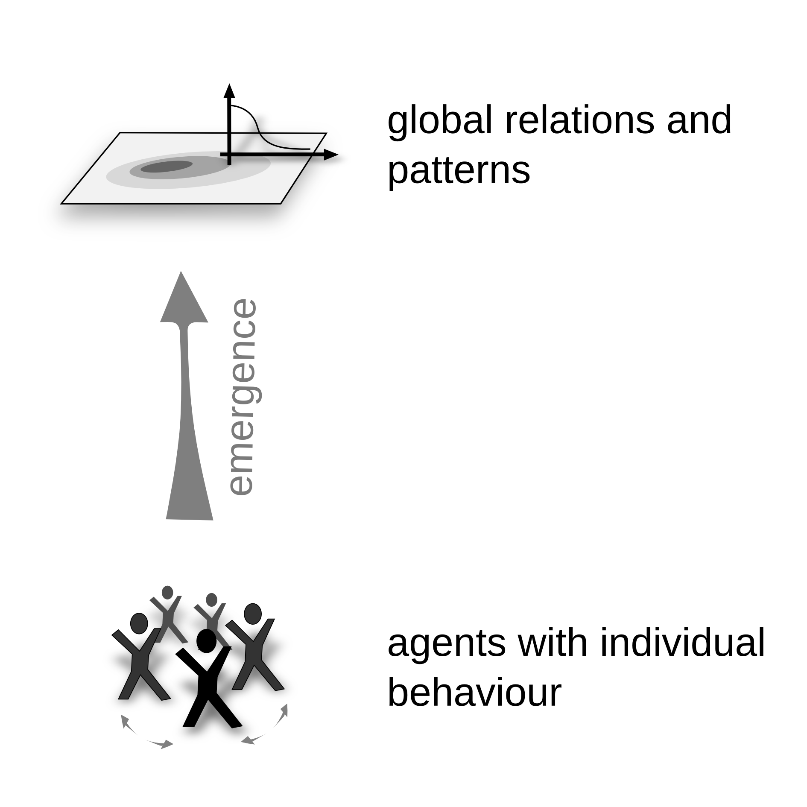

## Modelling Spheres of Interaction

**Interacting systems**

- Point Patterns
- Networks
- Systems

<div style='position:absolute;bottom:15%;right:10%'>
  
</div>

--- .segue bg:grey

## Point Patterns

<a class="btn btn-primary btn-large" href='https://isaakiel.github.io/index.html'>
 
</a>

--- .dk

## Point pattern analyses

An approach and a set of methods that helps you to **be explicit about the processes** that caused the spatial distribution of your points (e.g. ceramic finds, settlements, graveyards, ...) [from pattern to process]

- http://spatstat.github.io/
- https://cran.r-project.org/web/packages/spatstat/index.html
- <a href="https://cran.r-project.org/web/packages/spatstat/vignettes/getstart.pdf">Getting Started with Spatstat</a>
- <a href="https://cran.r-project.org/web/packages/spatstat/spatstat.pdf">Spatstat manual (1639 pages)</a>
- THE book - - - - >

<a href='https://www.crcpress.com/Spatial-Point-Patterns-Methodology-and-Applications-with-R/Baddeley-Rubak-Turner/p/book/9781482210200'>
 
</a>

--- .dk

## Point pattern analyses

It uses the simplest possible form of spatial data: points/events in an area/region/space

<div style='text-align:center'>
  
</div>

--- .dk &twocol

## Point pattern analyses

*** =left

**Random point pattern**

independent from space ...

- noise
- individuality
- non-spatial process

*** =right

**Structured point patterns**

are influenced by:

- space (first-order effects/properties)
- points (second-order effects/properties)
- structures (third-order effects/properties)

--- 


## Point pattern analyses

<div style='text-align:center'>
  
  </div>

---

## Point pattern analyses

<div style='position:absolute;top:25%;right:10%'>
  
  </div>

---

## Point pattern analyses

Simple measures: mean, standard deviation, intensity (~ density)

<div style='text-align:center'>
  
  </div>

<div style='text-align:right;font-size:12px'>
O'Sullivan & Unwin 2010, 126-126
</div>

--- .small 

## Point pattern analyses

```{r "download meg"}
download.file(
    url = "https://raw.githubusercontent.com/dakni/mhbil/master/data/meg_dw.csv",
    destfile = "2data/meg_dw.csv")

meg_dw <- read.table(file = "2data/meg_dw.csv",
                     header = TRUE,
                     sep = ";")
```

--- .small 

## Point pattern analyses

```{r "createPPP object", results="hide", message=FALSE}
library(spatstat)
meg_pp <- ppp(x = meg_dw$x, y = meg_dw$y,
              window = owin(xrange = c(min(meg_dw$x),
                                       max(meg_dw$x)
                                       ),
                            yrange = c(min(meg_dw$y),
                                       max(meg_dw$y)
                                       ),
                            unitname = c("meter", "meters")
                            )              
              )
```

--- .small 

## Point pattern analyses

```{r "plot ppp"}
plot(meg_pp)
```

---


--- .segue bg:grey

## Networks

<a class="btn btn-primary btn-large" href='https://isaakiel.github.io/index.html'>
 
</a>

--- 

## Networks

**Definition**

- A networks are objects, in which elements (vertices) are connected by edges.

- Networks are models, mapping certain facets of the real world.

- Network theory has roots in geography and in social sciences

--- 

## Networks

# Network theory is based on graph theory

<div style='position:absolute;bottom:15%;right:10%'>
  
</div>


--- .segue bg:grey

## Do you know examples of networks?

<a class="btn btn-primary btn-large" href='https://isaakiel.github.io/index.html'>
 
</a>

---

## Networks

- Rivers, Knappett, Evans
- Cyclades in Bronze Age
- fixed radius network

<div style='position:absolute;bottom:15%;right:10%'>
  
</div>

---

## Networks

- Rivers, Knappett, Evans
- distance decay function

<div style='position:absolute;bottom:15%;right:10%'>
  
</div>

---

## Networks

- Rivers, Knappett, Evans
- Cyclades in Bronze Age
- entropy model using double constrains

<div style='position:absolute;bottom:15%;right:10%'>
  
</div>

--- &twocol

## Networks | Graphs

*** =left

- package igraph
- constructing graphs

```{r echo=FALSE, fig.height=5}
plot(n1)
```


*** =right

```{r collapse=TRUE, fig.show='hide'}
library("igraph")
n1 <- graph( edges=c(1,5, 2,4, 1,3, 2,5, 
      3,5, 1,2, 3,4), n=6, directed=T ) 
plot(n1)
n1
E(n1)
V(n1)
```

--- &twocol

## Networks | Graphs

*** =left

- package igraph
- constructing graphs

```{r echo=FALSE, fig.height=5}
plot(n1)
```


*** =right

```{r collapse=TRUE}
get.adjacency(n1)
```


--- &twocol

## Networks | Graphs

*** =left


```{r echo=FALSE, fig.height=5}
n1 <- set_vertex_attr(n1, "label", 
      value =c("p1", "p2", "p3", 
      "Ppoint4", "Punkt 5", "6"))
plot(n1)
```


*** =right

```{r collapse=TRUE, fig.show='hide'}
n1 <- set_vertex_attr(n1, "label", 
      value =c("p1", "p2", "p3", 
      "Ppoint4", "Punkt 5", "6"))
plot(n1)
```

--- &twocol

## Networks | Graphs

*** =left


```{r echo=FALSE, fig.height=5}
n2 <- make_full_graph(22)
plot(n2)
```


*** =right

```{r collapse=TRUE, fig.show='hide'}
n2 <- make_full_graph(22)
plot(n2)
```

--- &twocol

## Networks | Graphs

*** =left

```{r echo=FALSE, fig.height=5}
n3 <- make_tree(22, children = 3, 
      mode = "undirected")
plot(n3)
```


*** =right

```{r collapse=TRUE, fig.show='hide'}
n3 <- make_tree(22, children = 3, 
      mode = "undirected")
plot(n3)
```

--- &twocol

## Networks

*** =left

**Delaunay graph**
- Delaunay graph as example for graphs/spatial networks
- The Delaunay graph connects the natural neighbours

*** =right

<div style='position:absolute;bottom:8%;right:5%'>
  
</div>

--- 

## Networks | Delaunay graph

Construction rules for some **neighbourhood graphs**

<div style='position:absolute;bottom:15%;right:10%'>
  
</div>

--- &twocol

## Networks | Delaunay graph

*** =left

The connections represent the **liklyness of interaction**

*** =right

<div style='position:absolute;bottom:10%;right:5%'>
  
</div>

--- &twocol

## Networks

*** =left

- packages `spdep`
- spatial **graphs**

*** =right

```{r collapse=TRUE, echo=FALSE}
library("spdep") 
set.seed(1242)
co.weapons <- read.csv("2data/shkr-weapons.csv", 
    header=TRUE, sep=";")[sample(1:220,10),1:2]
```

```{r collapse=TRUE, eval=FALSE}
library("spdep")
wd <- "/home/fon/daten/analyse/mosaic"  
setwd(wd)  
set.seed(1242)
co.weapons <- read.csv("2data/
    shkr-weapons.csv", header=TRUE, 
    sep=";")[sample(1:220,10),1:2]
```

--- &twocol

## Networks | Delaunay graph

*** =left

```{r collapse=TRUE, echo=FALSE, fig.height=6}
coords <- as.matrix(coordinates(co.weapons))
ids <- row.names(as.data.frame(co.weapons))
wts <- co.weapons[,1]; wts[] <- 1
fs_nb_del <- tri2nb(co.weapons, row.names=ids)    
del <- nb2lines(fs_nb_del, wts=wts, coords=coords,  proj4string =  CRS(as.character(crs1)))
plot(del)
```

*** =right

```{r collapse=TRUE, eval=FALSE}
coords <- as.matrix(coordinates
    (co.weapons))
ids <- row.names(as.data.frame
    (co.weapons))
wts <- co.weapons[,1]; wts[] <- 1
fs_nb_del <- tri2nb(co.weapons, 
    row.names=ids)    
del <- nb2lines(fs_nb_del, 
    wts=wts, coords=coords,  
    proj4string =  CRS(as.character(crs1)))
plot(del)
```

--- &twocol

## Networks | SOI

*** =left

```{r collapse=TRUE, echo=FALSE, fig.height=6}
fs_nb_soi <- graph2nb(soi.graph(fs_nb_del, coords),   row.names=ids)
soi <- nb2lines(fs_nb_soi, wts=wts, coords=coords,  proj4string =  CRS(as.character(crs1)))
plot(soi)
```

*** =right

```{r collapse=TRUE, eval=FALSE}
library(RANN)
fs_nb_soi <- graph2nb(soi.graph(fs_nb_del,
    coords),   row.names=ids)
soi <- nb2lines(fs_nb_soi, wts=wts, 
    coords=coords,  proj4string =  
    CRS(as.character(crs1)))
plot(soi)
```

--- &twocol

## Networks | Gabriel-Graph

*** =left

```{r collapse=TRUE, echo=FALSE, fig.height=6}
fs_nb_gabriel <- graph2nb(gabrielneigh(coords),  row.names=ids)  
gabriel <- nb2lines(fs_nb_gabriel, wts=wts,   coords=coords, proj4string =  CRS(as.character(crs1)))
plot(gabriel)
```

*** =right

```{r collapse=TRUE, eval=FALSE}
fs_nb_gabriel <- graph2nb(gabrielneigh
  (coords),  row.names=ids)  
gabriel <- nb2lines(fs_nb_gabriel, 
  wts=wts,   coords=coords, 
  proj4string =  CRS(as.character(crs1)))
plot(gabriel)
```

--- &twocol

## Networks | Relative-Neighbour-Graph

*** =left

```{r collapse=TRUE, echo=FALSE, fig.height=6}
fs_nb_relative <- graph2nb(relativeneigh(coords),  row.names=ids) 
relative <- nb2lines(fs_nb_relative, wts=wts,  coords=coords, proj4string =  CRS(as.character(crs1)))
plot(relative)
```

*** =right

```{r collapse=TRUE, eval=FALSE}
fs_nb_relative <- graph2nb(
  relativeneigh(coords),  
  row.names=ids) 
relative <- nb2lines(fs_nb_relative, 
  wts=wts,  coords=coords, 
  proj4string =  CRS(as.character(crs1)))
plot(relative)
```

--- &twocol

## Networks | Delaunay graph

*** =left

- transforming `spdep-graph` to `igraph-graph`

```{r collapse=TRUE, echo=FALSE, fig.height=6}
n4nb <- nb2mat(fs_nb_del, style="B", zero.policy=TRUE)
n4 <- graph.adjacency(n4nb, mode="undirected")
plot(n4)
```

*** =right

```{r collapse=TRUE, eval=FALSE}
n4nb <- nb2mat(fs_nb_del, 
  style="B", zero.policy=TRUE)
n4 <- graph.adjacency(n4nb, 
  mode="undirected")
plot(n4)
```

--- .segue bg:grey

## What do spatial graphs tell about interaction?

<a class="btn btn-primary btn-large" href='https://isaakiel.github.io/index.html'>
 
</a>

--- &twocol

## Networks | Centrality

*** =left

**Centrality** maps the structural importance of a node/edge in a network.

*** =right
    
<div style='position:absolute;bottom:10%;right:5%'>
  
</div>

---

## Networks | Centrality

```{r collapse=TRUE}
degree(n4)
closeness(n4)
betweenness(n4)
edge_betweenness(n4)
```

--- &twocol

## Networks | Plotting Centrality

*** =left

- transforming `spdep-graph` to `igraph-graph`

```{r collapse=TRUE, echo=FALSE, fig.height=6}
ceb <- cluster_edge_betweenness(n4) 
dendPlot(ceb, mode="hclust")
```

*** =right

```{r collapse=TRUE, eval=FALSE}
ceb <- cluster_edge_
  betweenness(n4) 
dendPlot(ceb, mode="hclust")
```

--- &twocol

## Networks | Plotting Centrality

*** =left

- transforming `spdep-graph` to `igraph-graph`

```{r collapse=TRUE, echo=FALSE, fig.height=6}
plot(ceb, n4)
```

*** =right

```{r collapse=TRUE, eval=FALSE}
plot(ceb, n4)
```

--- .segue bg:grey

## What does centrality tell about interaction?

<a class="btn btn-primary btn-large" href='https://isaakiel.github.io/index.html'>
 
</a>

--- .segue bg:grey

## Systems

<a class="btn btn-primary btn-large" href='https://isaakiel.github.io/index.html'>
 
</a>

---

## Systems | Agent Based Modelling

**AMB** comprises
- an actors
- an envirionment and
- a process

<div style='position:absolute;bottom:10%;right:5%'>
  
</div>

---

## Systems | Agent Based Modelling

# Example Heuneburg

- indigenous people
- merchants

<div style='position:absolute;bottom:10%;right:5%'>
  
</div>

---

## Systems | Agent Based Modelling

# Reasoning for certain relationships

<div style='position:absolute;bottom:10%;right:5%'>
  
</div>

---

## Systems | Agent Based Modelling

**The process**

**Actors** can:
- move
- trade
- accumulate wealth

<div style='position:absolute;bottom:10%;right:5%'>
  
</div>

---

## Systems | Agent Based Modelling

# Some results

<div style='position:absolute;bottom:10%;right:5%'>
  
</div>

---

## Systems | Agent Based Modelling

## But is it useful?
## Whad do you think?

<div style='position:absolute;bottom:10%;right:5%'>
  
</div>

---

## Systems | Agent Based Modelling

# Introducing some complexity

<div style='position:absolute;bottom:10%;right:5%'>
  
</div>

---

## Systems | Agent Based Modelling

# Some more results

<div style='position:absolute;bottom:10%;right:5%'>
  
</div>

---

## Systems | Agent Based Modelling

# Interpretation for the Heuneburg

<div style='position:absolute;bottom:10%;right:5%'>
  
</div>

--- .segue bg:grey

## No code provided for the AMB (Summer School 2017)

<a class="btn btn-primary btn-large" href='https://isaakiel.github.io/index.html'>
 
</a>

--- .segue bg:grey

## Apply point pattern analysis and network analysis in the workshop this afternoon!


<a class="btn btn-primary btn-large" href='https://isaakiel.github.io/index.html'>
 
</a>

---
  
<a class="btn btn-primary btn-large" href='https://isaakiel.github.io/index.html'>
  
</a>
