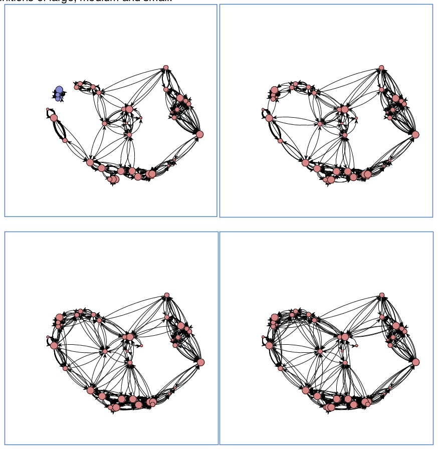
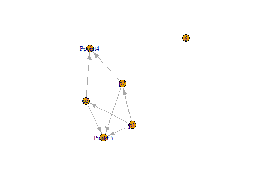

## Modelling Spheres of Interaction

**Interacting systems**

- Point Patterns
- Networks
- Systems

<div style='position:absolute;bottom:15%;right:10%'>
  
</div>

--- .segue bg:grey

## Point Patterns

<a class="btn btn-primary btn-large" href='https://isaakiel.github.io/index.html'>
 
</a>

---

## Daniels Teil zu PointPatterns

--- .segue bg:grey

## Networks

<a class="btn btn-primary btn-large" href='https://isaakiel.github.io/index.html'>
 
</a>

--- 

## Networks

**Definition**
A networks are objects, in which elements (vertices) are connected by edges. Networks are models, mapping certain facets of the real world.

- Network theory has roots in geography and in social sciences

--- 

## Networks

# Network theory is based on graph theory

<div style='position:absolute;bottom:15%;right:10%'>
  
</div>


--- .segue bg:grey

## Do you know examples of networks?

<a class="btn btn-primary btn-large" href='https://isaakiel.github.io/index.html'>
 
</a>

---

## Networks

- Rivers, Knappett, Evans
- Cyclades in Bronze Age
- fixed radius network

<div style='position:absolute;bottom:15%;right:10%'>
  
</div>

---

## Networks

- Rivers, Knappett, Evans
- distance decay function

<div style='position:absolute;bottom:15%;right:10%'>
  
</div>

---

## Networks

- Rivers, Knappett, Evans
- Cyclades in Bronze Age
- entropy model using double constrains

<div style='position:absolute;bottom:15%;right:10%'>
  
</div>

--- &twocol

## Networks | Graphs

*** =left

- package igraph
- constructing graphs


```
## Error in plot(n1): cannot open file 'C:/Diss/R/develpoment/Mosaic01/Mosaic/10-Network_Analysis/.cache/unnamed-chunk-6_a06615d0fab008585b8490f9b1746abe.rdb': No such file or directory
```


*** =right


```r
library("igraph")
n1 <- graph( edges=c(1,5, 2,4, 1,3, 2,5, 
      3,5, 1,2, 3,4), n=6, directed=T ) 
plot(n1)
n1
## IGRAPH D--- 6 7 -- 
## + edges:
## [1] 1->5 2->4 1->3 2->5 3->5 1->2 3->4
E(n1)
## + 7/7 edges:
## [1] 1->5 2->4 1->3 2->5 3->5 1->2 3->4
V(n1)
## + 6/6 vertices:
## [1] 1 2 3 4 5 6
```

--- &twocol

## Networks | Graphs

*** =left

- package igraph
- constructing graphs


*** =right


```r
get.adjacency(n1)
## 6 x 6 sparse Matrix of class "dgCMatrix"
##                 
## [1,] . 1 1 . 1 .
## [2,] . . . 1 1 .
## [3,] . . . 1 1 .
## [4,] . . . . . .
## [5,] . . . . . .
## [6,] . . . . . .
```


--- &twocol

## Networks | Graphs

*** =left





*** =right


```r
n1 <- set_vertex_attr(n1, "label", 
      value =c("p1", "p2", "p3", 
      "Ppoint4", "Punkt 5", "6"))
plot(n1)
```

--- &twocol

## Networks | Graphs

*** =left


*** =right


```r
n2 <- make_full_graph(22)
plot(n2)
```

--- &twocol

## Networks | Graphs

*** =left


*** =right


```r
n3 <- make_tree(22, children = 3, 
      mode = "undirected")
plot(n3)
```

--- &twocol

## Networks

*** =left

**Delaunay graph**
- Delaunay graph as example for graphs/spatial networks
- The Delaunay graph connects the natural neighbours

*** =right

<div style='position:absolute;bottom:8%;right:5%'>
  
</div>

--- 

## Networks | Delaunay graph

Construction rules for some **neighbourhood graphs**

<div style='position:absolute;bottom:15%;right:10%'>
  
</div>

--- &twocol

## Networks | Delaunay graph

*** =left

The connections represent the **liklyness of interaction**

*** =right

<div style='position:absolute;bottom:10%;right:5%'>
  
</div>

--- &twocol

## Networks

*** =left

- packages `spdep`
- spatial **graphs**

*** =right


```r
library("spdep")
wd <- "/home/fon/daten/analyse/mosaic"  
setwd(wd)  
set.seed(1242)
co.weapons <- read.csv("2data/
    shkr-weapons.csv", header=TRUE, 
    sep=";")[sample(1:220,10),1:2]
```

--- &twocol

## Networks | Delaunay graph

*** =left


*** =right


```r
coords <- as.matrix(coordinates
    (co.weapons))
ids <- row.names(as.data.frame
    (co.weapons))
wts <- co.weapons[,1]; wts[] <- 1
fs_nb_del <- tri2nb(co.weapons, 
    row.names=ids)    
del <- nb2lines(fs_nb_del, 
    wts=wts, coords=coords,  
    proj4string =  CRS(as.character(crs1)))
plot(del)
```

--- &twocol

## Networks | SOI

*** =left


*** =right


```r
library(RANN)
fs_nb_soi <- graph2nb(soi.graph(fs_nb_del,
    coords),   row.names=ids)
soi <- nb2lines(fs_nb_soi, wts=wts, 
    coords=coords,  proj4string =  
    CRS(as.character(crs1)))
plot(soi)
```

--- &twocol

## Networks | Gabriel-Graph

*** =left


*** =right


```r
fs_nb_gabriel <- graph2nb(gabrielneigh
  (coords),  row.names=ids)  
gabriel <- nb2lines(fs_nb_gabriel, 
  wts=wts,   coords=coords, 
  proj4string =  CRS(as.character(crs1)))
plot(gabriel)
```

--- &twocol

## Networks | Relative-Neighbour-Graph

*** =left


*** =right


```r
fs_nb_relative <- graph2nb(
  relativeneigh(coords),  
  row.names=ids) 
relative <- nb2lines(fs_nb_relative, 
  wts=wts,  coords=coords, 
  proj4string =  CRS(as.character(crs1)))
plot(relative)
```

--- &twocol

## Networks | Delaunay graph

*** =left

- transforming `spdep-graph` to `igraph-graph`


*** =right


```r
n4nb <- nb2mat(fs_nb_del, 
  style="B", zero.policy=TRUE)
n4 <- graph.adjacency(n4nb, 
  mode="undirected")
plot(n4)
```

--- .segue bg:grey

## What do spatial graphs tell about interaction?

<a class="btn btn-primary btn-large" href='https://isaakiel.github.io/index.html'>
 
</a>

--- &twocol

## Networks | Centrality

*** =left

**Centrality** maps the structural importance of a node/edge in a network.

*** =right
    
<div style='position:absolute;bottom:10%;right:5%'>
  
</div>

---

## Networks | Centrality


```r
degree(n4)
##  [1] 5 3 6 5 5 3 6 3 5 3
closeness(n4)
##  [1] 0.07142857 0.06666667 0.08333333 0.07692308 0.07692308 0.05882353
##  [7] 0.08333333 0.06250000 0.07692308 0.06666667
betweenness(n4)
##  [1] 3.0000000 0.6666667 5.1666667 2.5000000 3.9166667 0.0000000 5.1666667
##  [8] 0.0000000 3.9166667 0.6666667
edge_betweenness(n4)
##  [1] 3.666667 2.833333 2.833333 2.000000 3.666667 4.166667 2.500000
##  [8] 3.750000 2.666667 3.500000 4.083333 2.500000 1.833333 2.833333
## [15] 3.750000 1.833333 3.083333 4.083333 3.666667 3.083333 3.500000
## [22] 4.166667
```

--- &twocol

## Networks | Plotting Centrality

*** =left

- transforming `spdep-graph` to `igraph-graph`


*** =right


```r
ceb <- cluster_edge_
  betweenness(n4) 
dendPlot(ceb, mode="hclust")
```

--- &twocol

## Networks | Plotting Centrality

*** =left

- transforming `spdep-graph` to `igraph-graph`


*** =right


```r
plot(ceb, n4)
```

--- .segue bg:grey

## What does centrality tell about interaction?

<a class="btn btn-primary btn-large" href='https://isaakiel.github.io/index.html'>
 
</a>

--- .segue bg:grey

## Systems

<a class="btn btn-primary btn-large" href='https://isaakiel.github.io/index.html'>
 
</a>

---

## Systems | Agent Based Modelling

**AMB** comprises
- an actors
- an envirionment and
- a process

<div style='position:absolute;bottom:10%;right:5%'>
  
</div>

---

## Systems | Agent Based Modelling

# Example Heuneburg

- indigenous people
- merchants

<div style='position:absolute;bottom:10%;right:5%'>
  
</div>

---

## Systems | Agent Based Modelling

# Reasoning for certain relationships

<div style='position:absolute;bottom:10%;right:5%'>
  
</div>

---

## Systems | Agent Based Modelling

**The process**

**Actors** can:
- move
- trade
- accumulate wealth

<div style='position:absolute;bottom:10%;right:5%'>
  
</div>

---

## Systems | Agent Based Modelling

# Some results

<div style='position:absolute;bottom:10%;right:5%'>
  
</div>

---

## Systems | Agent Based Modelling

# But is it useful?
# Whad do you think?

<div style='position:absolute;bottom:10%;right:5%'>
  
</div>
