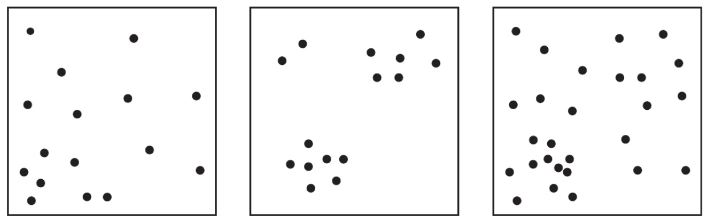
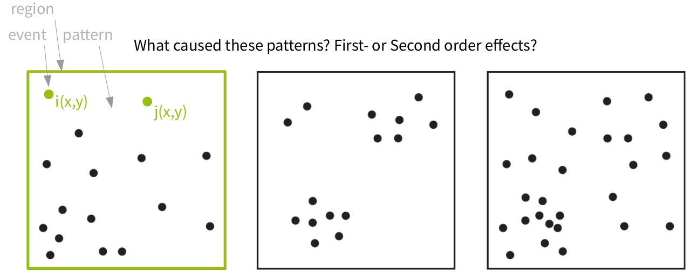
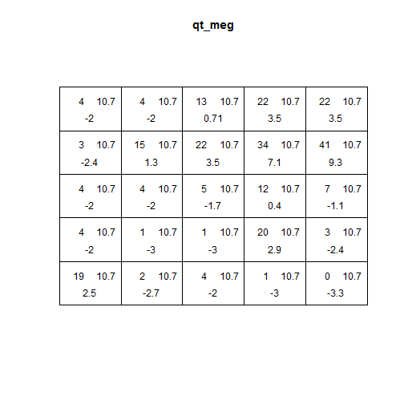
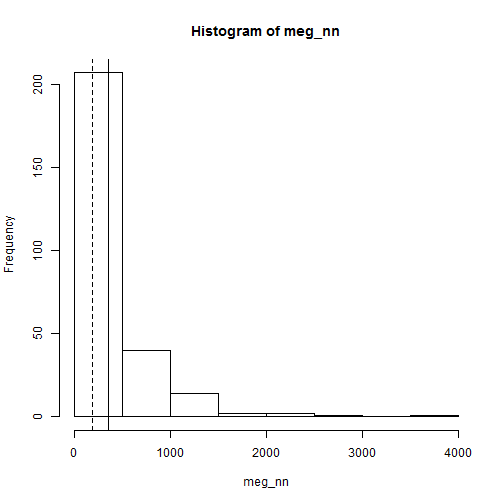

## Modelling Spheres of Interaction

**Interacting systems**

- Point Patterns
- Networks
- Systems

<div style='position:absolute;bottom:15%;right:10%'>
  
</div>

--- .segue bg:grey

## Point Patterns

<a class="btn btn-primary btn-large" href='https://isaakiel.github.io/index.html'>
 
</a>

--- .dk

## Point pattern analyses

An approach and a set of methods that helps you to **be explicit about the processes** that caused the spatial distribution of your points (e.g. ceramic finds, settlements, graveyards, ...) [from pattern to process]

- http://spatstat.github.io/
- https://cran.r-project.org/web/packages/spatstat/index.html
- <a href="https://cran.r-project.org/web/packages/spatstat/vignettes/getstart.pdf">Getting Started with Spatstat</a>
- <a href="https://cran.r-project.org/web/packages/spatstat/spatstat.pdf">Spatstat manual (1639 pages)</a>
- THE book - - - - >

<a href='https://www.crcpress.com/Spatial-Point-Patterns-Methodology-and-Applications-with-R/Baddeley-Rubak-Turner/p/book/9781482210200'>
 
</a>

--- .dk

## Point pattern analyses

It uses the simplest possible form of spatial data: points/events in an area/region/space

<div style='text-align:center'>
  
</div>

--- .dk &twocol

## Point pattern analyses

*** =left

**Random point pattern**

independent from space ...

- noise
- individuality
- non-spatial process

*** =right

**Structured point patterns**

are influenced by:

- space (first-order effects/properties)
- points (second-order effects/properties)
- structures (third-order effects/properties)

--- 


## Point pattern analyses

<div style='text-align:center'>
  
  </div>

---

## Point pattern analyses

Some terminology: in case we have an random point pattern, **Complete Spatial Randomness** or an **Independent Random Process** prevails. The condition are:

- equal probability: any event has an equal probability of being in any position
- independence: the positioning of any event is independent of the positioning of any other event

---

## Point pattern analyses

Some terminology: in case we have an random point pattern, **Complete Spatial Randomness** or an **Independent Random Process** prevails. The condition are:

- equal probability: any event has an equal probability of being in any position
- independence: the positioning of any event is independent of the positioning of any other event

CSR means that the **process is random** not the resulting point pattern!

In point pattern analyses we test against CSR and different forms of specific processes to learn more about our pattern.

---

## Point pattern analyses

<div style='position:absolute;top:25%;right:10%'>
  
  </div>

---

## Point pattern analyses

A structured point pattern violates CSR conditions:

1. First-order effects influence the probability of events being in any position of the region
--> to trace such influences we investigate the intensity function (~ density) of the points

2. In case second-order effects are present, points are not independent from one another
--> to trace such influences we investigate the distance distributions of the points

---

## Point pattern analyses

- a **stationary point process** has a constant point density function.
- a **homogeneous point process** is stationary and isotropic. --> CSR
- a stationary **Poisson point process** is the reference model in many test for CSR

---

## Point pattern analyses

Events are independent
- a non-stationary **(Poisson) point process** has an inhomogeneous intensity function --> e.g. caused by a covariate.

Events are not independent
- the **Cox process** is an inhomogeneous Poisson process with a random
intensity function. (Approach: create random pattern, create points using Poisson and covariate of random intensity)
- a **Gibbs process** involves influence from other points and models an explicit interaction between points (mainly for inhibition). In the case of a hard core Gibbs process, points
avoid each other up to a certain threshold and they ignore each other.
- a **Strauss process** has a constant influence within a certain distance threshold.
- a **Neyman–Scott process** is used to create clustered point pattern by creating random cluster centres that create "offspring" points

---

## Point pattern analyses

Simple measures: mean, standard deviation, intensity (~ density)

<div style='text-align:center'>
  
  </div>

<div style='text-align:right;font-size:12px'>
O'Sullivan & Unwin 2010, 126-126
</div>

--- .small 

## Point pattern analyses


```r
download.file(
    url = "https://raw.githubusercontent.com/dakni/mhbil/master/data/meg_dw.csv",
    destfile = "2data/meg_dw.csv")

meg_dw <- read.table(file = "2data/meg_dw.csv",
                     header = TRUE,
                     sep = ";")
```

--- .small 

## Point pattern analyses


```r
library(spatstat)
meg_pp <- ppp(x = meg_dw$x, y = meg_dw$y,
              window = owin(xrange = c(min(meg_dw$x),
                                       max(meg_dw$x)
                                       ),
                            yrange = c(min(meg_dw$y),
                                       max(meg_dw$y)
                                       ),
                            unitname = c("meter", "meters")
                            )              
              )
```

--- .small 

## Point pattern analyses


```r
plot(meg_pp)
```


---

## Point pattern analyses


```r
mc <- cbind(sum(meg_pp$x/meg_pp$n),
            sum(meg_pp$y/meg_pp$n)
            )

stdist <- sqrt(sum((meg_pp$x-mean(meg_pp$x))^2 +
                   (meg_pp$y-mean(meg_pp$y))^2) /
               meg_pp$n
               )

plot(meg_pp)
points(mc)
library(plotrix)
draw.circle(x = mc[1], y = mc[2], radius = stdist, border = "red")
```

---

## Point pattern analyses

<div style="text-align:center">


---

## Point pattern analyses

Global intensity = Number of points per area


```r
## A = a * b
area.sqm <- diff(meg_pp$window$xrange) * diff(meg_pp$window$yrange)
area.sqkm <- area.sqm*10^-6
# area <- area/1000000
area.sqkm
```

```
## [1] 431.3529
```

```r
## calculate intensity
intensity <- meg_pp$n/area.sqkm
intensity
```

```
## [1] 0.6189827
```

---

## Point pattern analyses

Local intensity


```r
qc.meg <- quadratcount(X = meg_pp)

plot(qc.meg);
points(meg_pp, pch = 20, cex = .5, col = rgb(.2,.2,.2,.5))
```

--- &twocol

## Point pattern analyses

Local intensity

*** =left

Does the quadratcount indicates CSR?

*** =right


--- &twocol

## Point pattern analyses

Local intensity

*** =left

Does the quadratcount indicates CSR?

To check we use a $\chi^2$ test approach (remember: relation between observed (i.e. empirical) and expected (i.e. theoretical, here CSR) amounts of points in quadrants)

*** =right


```r
qt_meg <- quadrat.test(meg_pp)
qt_meg
```

```
## 
## 	Chi-squared test of CSR using quadrat counts
## 	Pearson X2 statistic
## 
## data:  meg_pp
## X2 = 274.48, df = 24, p-value < 2.2e-16
## alternative hypothesis: two.sided
## 
## Quadrats: 5 by 5 grid of tiles
```

--- &twocol

## Point pattern analyses

Local intensity

*** =left

- top left = observed
- top right = expected
- bottom = Pearson residual

Meaning of bottom values:
- +/- 2 = unusual
- larger values = gross departure from fitted model

*** =right


```r
plot(qt_meg)
```



---

## Point pattern analyses

Kernel density estimation

<div style='text-align:center'>
  
  </div>

<div style='text-align:right;font-size:12px'>
O'Sullivan & Unwin 2010, Nakoinz & Knitter 2016
</div>

--- &twocol

## Point pattern analyses

Kernel density estimation

*** =left


```r
meg_dens <- density(x = meg_pp,
                    sigma = 2500)

plot(raster(meg_dens))
```

*** =right


---

## Point pattern analyses

Kernel density estimation

<div style='text-align:center'>
  
  </div>

<div style='text-align:right;font-size:12px'>
Knitter & Nakoinz in press
</div>

---

## Point pattern analyses

Kernel density estimation

<div style='text-align:center'>
  
  </div>

<div style='text-align:right;font-size:12px'>
Meister et al. forthcoming
</div>

---

## Point pattern analyses

We assume that the intensity of the point process is a function of the covariate (Z):

$$\lambda(u) = \rho(Z(U))$$

$\lambda(u)$ can be regarded as location selection function --> it causes an inhomogeneous probability of points to be located in same areas of the study region

Calculation in `R` is straightforward


```r
cov_meg <- rhohat(object = "YOUR POINT PATTERN",
                     covariate = "YOUR COVARIATE RASTER",
                     bw = 100
                  )
pred_cov_meg <- predict(cov_meg)
cov_compare <- meg_dens - pred_cov_meg
```

---

## Point pattern analyses

Kernel density estimation

<div style='text-align:center'>
  
  </div>

<div style='text-align:right;font-size:12px'>
Meister et al. forthcoming
</div>

---

## Point pattern analyses

Kernel density estimation

<div style='text-align:center'>
  
  </div>

<div style='text-align:right;font-size:12px'>
Meister et al. forthcoming
</div>

---

## Point pattern analyses

Second order effects

---

## Point pattern analyses

Second order effects

<div style='text-align:center'>
  
  </div>

<div style='text-align:right;font-size:12px'>
O'Sullivan & Unwin 2010
</div>


--- &twocol

## Point pattern analyses

Second order effects

*** =left

$$R = \frac{observed~\overline{d_{min}}}{expected~\overline{d_{min}}}$$

$$R = \frac{\overline{d_{min}}}{\frac{1}{2\sqrt{\lambda}}}$$

*** =right


```r
meg_nn <- nndist(meg_pp)
mean(meg_nn)
```

```
## [1] 358.8447
```

```r
nnE <- 1/(2*sqrt((meg_pp$n/area.sqm)))
nnE
```

```
## [1] 635.5222
```

```r
R.meg <- mean(meg_nn)/nnE
R.meg
```

```
## [1] 0.5646453
```


--- &twocol

## Point pattern analyses

Second order effects

*** =left


```r
hist(meg_nn)
abline(v=mean(meg_nn))
abline(v=median(meg_nn), lty=2)
```

*** =right



---

## Point pattern analyses

Second order effects

<div style='text-align:center'>
  
  </div>

<div style='text-align:right;font-size:12px'>
Nakoinz & Knitter 2016, 135
</div>


--- &twocol

## Point pattern analyses

*** =left
Second order effects

cumulative frequency distribution of the nearest-neighbor distances

$$G(d) = \frac{\#(d_{min}(s_{i}) < d)}{n}$$

The function tells us what fraction of all n-n
distances is less than d


```r
meg_g <- Gest(meg_pp)
plot(meg_g)
```

*** =right


--- .segue bg:grey

## Networks

<a class="btn btn-primary btn-large" href='https://isaakiel.github.io/index.html'>
 
</a>

--- 

## Networks

**Definition**

- A networks are objects, in which elements (vertices) are connected by edges.

- Networks are models, mapping certain facets of the real world.

- Network theory has roots in geography and in social sciences

--- 

## Networks

# Network theory is based on graph theory

<div style='position:absolute;bottom:15%;right:10%'>
  
</div>


--- .segue bg:grey

## Do you know examples of networks?

<a class="btn btn-primary btn-large" href='https://isaakiel.github.io/index.html'>
 
</a>

---

## Networks

- Rivers, Knappett, Evans
- Cyclades in Bronze Age
- fixed radius network

<div style='position:absolute;bottom:15%;right:10%'>
  
</div>

---

## Networks

- Rivers, Knappett, Evans
- distance decay function

<div style='position:absolute;bottom:15%;right:10%'>
  
</div>

---

## Networks

- Rivers, Knappett, Evans
- Cyclades in Bronze Age
- entropy model using double constrains

<div style='position:absolute;bottom:15%;right:10%'>
  
</div>

--- &twocol

## Networks | Graphs

*** =left

- package igraph
- constructing graphs


```
## Error in plot(n1): object 'n1' not found
```


*** =right


```r
library("igraph")
n1 <- graph( edges=c(1,5, 2,4, 1,3, 2,5, 
      3,5, 1,2, 3,4), n=6, directed=T ) 
plot(n1)
n1
## IGRAPH D--- 6 7 -- 
## + edges:
## [1] 1->5 2->4 1->3 2->5 3->5 1->2 3->4
E(n1)
## + 7/7 edges:
## [1] 1->5 2->4 1->3 2->5 3->5 1->2 3->4
V(n1)
## + 6/6 vertices:
## [1] 1 2 3 4 5 6
```

--- &twocol

## Networks | Graphs

*** =left

- package igraph
- constructing graphs


*** =right


```r
get.adjacency(n1)
## 6 x 6 sparse Matrix of class "dgCMatrix"
##                 
## [1,] . 1 1 . 1 .
## [2,] . . . 1 1 .
## [3,] . . . 1 1 .
## [4,] . . . . . .
## [5,] . . . . . .
## [6,] . . . . . .
```


--- &twocol

## Networks | Graphs

*** =left


*** =right


```r
n1 <- set_vertex_attr(n1, "label", 
      value =c("p1", "p2", "p3", 
      "Ppoint4", "Punkt 5", "6"))
plot(n1)
```

--- &twocol

## Networks | Graphs

*** =left


*** =right


```r
n2 <- make_full_graph(22)
plot(n2)
```

--- &twocol

## Networks | Graphs

*** =left


*** =right


```r
n3 <- make_tree(22, children = 3, 
      mode = "undirected")
plot(n3)
```

--- &twocol

## Networks

*** =left

**Delaunay graph**
- Delaunay graph as example for graphs/spatial networks
- The Delaunay graph connects the natural neighbours

*** =right

<div style='position:absolute;bottom:8%;right:5%'>
  
</div>

--- 

## Networks | Delaunay graph

Construction rules for some **neighbourhood graphs**

<div style='position:absolute;bottom:15%;right:10%'>
  
</div>

--- &twocol

## Networks | Delaunay graph

*** =left

The connections represent the **liklyness of interaction**

*** =right

<div style='position:absolute;bottom:10%;right:5%'>
  
</div>

--- &twocol

## Networks

*** =left

- packages `spdep`
- spatial **graphs**

*** =right


```r
library("spdep")
wd <- "/home/fon/daten/analyse/mosaic"  
setwd(wd)  
set.seed(1242)
co.weapons <- read.csv("2data/
    shkr-weapons.csv", header=TRUE, 
    sep=";")[sample(1:220,10),1:2]
```

--- &twocol

## Networks | Delaunay graph

*** =left


```
## 
##      PLEASE NOTE:  The components "delsgs" and "summary" of the
##  object returned by deldir() are now DATA FRAMES rather than
##  matrices (as they were prior to release 0.0-18).
##  See help("deldir").
##  
##      PLEASE NOTE: The process that deldir() uses for determining
##  duplicated points has changed from that used in version
##  0.0-9 of this package (and previously). See help("deldir").
## Error in CRS(as.character(crs1)): object 'crs1' not found
## Error in plot(del): object 'del' not found
```

*** =right


```r
coords <- as.matrix(coordinates
    (co.weapons))
ids <- row.names(as.data.frame
    (co.weapons))
wts <- co.weapons[,1]; wts[] <- 1
fs_nb_del <- tri2nb(co.weapons, 
    row.names=ids)    
del <- nb2lines(fs_nb_del, 
    wts=wts, coords=coords,  
    proj4string =  CRS(as.character(crs1)))
plot(del)
```

--- &twocol

## Networks | SOI

*** =left


```
## Error in CRS(as.character(crs1)): object 'crs1' not found
## Error in plot(soi): object 'soi' not found
```

*** =right


```r
library(RANN)
fs_nb_soi <- graph2nb(soi.graph(fs_nb_del,
    coords),   row.names=ids)
soi <- nb2lines(fs_nb_soi, wts=wts, 
    coords=coords,  proj4string =  
    CRS(as.character(crs1)))
plot(soi)
```

--- &twocol

## Networks | Gabriel-Graph

*** =left


```
## Error in CRS(as.character(crs1)): object 'crs1' not found
## Error in plot(gabriel): object 'gabriel' not found
```

*** =right


```r
fs_nb_gabriel <- graph2nb(gabrielneigh
  (coords),  row.names=ids)  
gabriel <- nb2lines(fs_nb_gabriel, 
  wts=wts,   coords=coords, 
  proj4string =  CRS(as.character(crs1)))
plot(gabriel)
```

--- &twocol

## Networks | Relative-Neighbour-Graph

*** =left


```
## Error in CRS(as.character(crs1)): object 'crs1' not found
## Error in plot(relative): object 'relative' not found
```

*** =right


```r
fs_nb_relative <- graph2nb(
  relativeneigh(coords),  
  row.names=ids) 
relative <- nb2lines(fs_nb_relative, 
  wts=wts,  coords=coords, 
  proj4string =  CRS(as.character(crs1)))
plot(relative)
```

--- &twocol

## Networks | Delaunay graph

*** =left

- transforming `spdep-graph` to `igraph-graph`


*** =right


```r
n4nb <- nb2mat(fs_nb_del, 
  style="B", zero.policy=TRUE)
n4 <- graph.adjacency(n4nb, 
  mode="undirected")
plot(n4)
```

--- .segue bg:grey

## What do spatial graphs tell about interaction?

<a class="btn btn-primary btn-large" href='https://isaakiel.github.io/index.html'>
 
</a>

--- &twocol

## Networks | Centrality

*** =left

**Centrality** maps the structural importance of a node/edge in a network.

*** =right
    
<div style='position:absolute;bottom:10%;right:5%'>
  
</div>

---

## Networks | Centrality


```r
degree(n4)
##  [1] 5 3 6 5 5 3 6 3 5 3
closeness(n4)
##  [1] 0.07142857 0.06666667 0.08333333 0.07692308 0.07692308 0.05882353
##  [7] 0.08333333 0.06250000 0.07692308 0.06666667
betweenness(n4)
##  [1] 3.0000000 0.6666667 5.1666667 2.5000000 3.9166667 0.0000000 5.1666667
##  [8] 0.0000000 3.9166667 0.6666667
edge_betweenness(n4)
##  [1] 3.666667 2.833333 2.833333 2.000000 3.666667 4.166667 2.500000
##  [8] 3.750000 2.666667 3.500000 4.083333 2.500000 1.833333 2.833333
## [15] 3.750000 1.833333 3.083333 4.083333 3.666667 3.083333 3.500000
## [22] 4.166667
```

--- &twocol

## Networks | Plotting Centrality

*** =left

- transforming `spdep-graph` to `igraph-graph`


*** =right


```r
ceb <- cluster_edge_
  betweenness(n4) 
dendPlot(ceb, mode="hclust")
```

--- &twocol

## Networks | Plotting Centrality

*** =left

- transforming `spdep-graph` to `igraph-graph`


*** =right


```r
plot(ceb, n4)
```

--- .segue bg:grey

## What does centrality tell about interaction?

<a class="btn btn-primary btn-large" href='https://isaakiel.github.io/index.html'>
 
</a>

--- .segue bg:grey

## Systems

<a class="btn btn-primary btn-large" href='https://isaakiel.github.io/index.html'>
 
</a>

---

## Systems | Agent Based Modelling

**ABM** comprises
- an actors
- an envirionment and
- a process

<div style='position:absolute;bottom:10%;right:5%'>
  
</div>

---

## Systems | Agent Based Modelling

# Example Heuneburg

- indigenous people
- merchants

<div style='position:absolute;bottom:10%;right:5%'>
  
</div>

---

## Systems | Agent Based Modelling

# Reasoning for certain relationships

<div style='position:absolute;bottom:10%;right:5%'>
  
</div>

---

## Systems | Agent Based Modelling

**The process**

**Actors** can:
- move
- trade
- accumulate wealth

<div style='position:absolute;bottom:10%;right:5%'>
  
</div>

---

## Systems | Agent Based Modelling

# Some results

<div style='position:absolute;bottom:10%;right:5%'>
  
</div>

---

## Systems | Agent Based Modelling

## But is it useful?
## What do you think?

<div style='position:absolute;bottom:10%;right:5%'>
  
</div>

---

## Systems | Agent Based Modelling

# Introducing some complexity

<div style='position:absolute;bottom:10%;right:5%'>
  
</div>

---

## Systems | Agent Based Modelling

# Some more results

<div style='position:absolute;bottom:10%;right:5%'>
  
</div>

---

## Systems | Agent Based Modelling

# Interpretation for the Heuneburg

<div style='position:absolute;bottom:10%;right:5%'>
  
</div>

--- .segue bg:grey

## No code provided for the AMB (Summer School 2017)

<a class="btn btn-primary btn-large" href='https://isaakiel.github.io/index.html'>
 
</a>

--- .segue bg:grey

## Apply point pattern analysis and network analysis in the workshop this afternoon!


<a class="btn btn-primary btn-large" href='https://isaakiel.github.io/index.html'>
 
</a>

---
  
<a class="btn btn-primary btn-large" href='https://isaakiel.github.io/index.html'>
  
</a>
