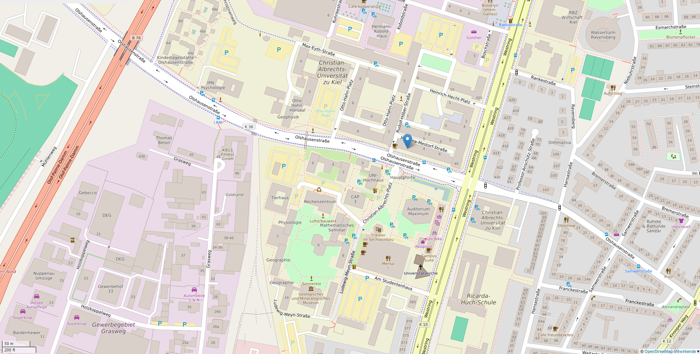
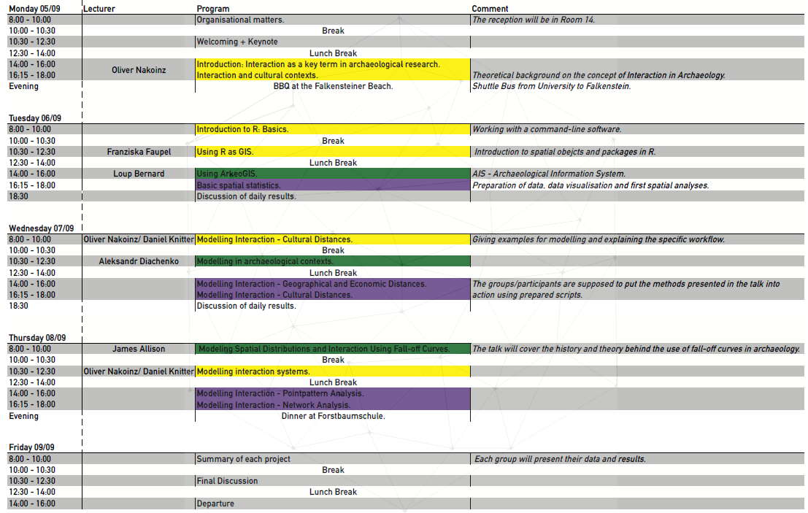

## Some usefull information

<div style='position:absolute;bottom:10%;right:5%'>
  
</div>

---

## Timetable

<div style='position:absolute;bottom:10%;right:15%'>
  
</div>

--- &twocol

## Needed Packages

*** =left
- `vioplot`
- `ggplot2`
- `sm`
- `rgdal`
- `raster`
-  `sp`
- `rgeos`
- `maptools`
- `proj4`
- `gstat`

*** =right

- `foreign`
- `shapefiles`
- `plyr`
- `RSAGA`
- `Matrix`
- `spdep`
- `nlme`
- `rpart`
- `spatstat`

---

## Install Packages from a local directory

In case the internet connection is not stable enough, you find all needed packages on your flash drive.
Please adapte the follwing code to your needs. 

```{r collapse=TRUE, eval=FALSE}
 install.packages("ggplot2", lib="path to flash drive or local dir/Rpackages/")
 library(ggplot2, lib.loc="path to flash drive or local dir/Rpackages/")
```

---

## MOSAIC - Modelling Speheres of Interaction

**Aim**

This Summer School focuses on interaction as a key concept in social life, and 
on methods for reconstructing and modeling spheres of interaction at different 
spatial and temporal scales. Students will learn an innovative approach, used in
recent studies, for modelling spheres of interaction. The course will cover a 
variety of theories and concepts that will enable students to apply this method 
to further regions, material groups, and time periods. The course is divided 
into individual lessons presented by experts, thus providing a diverse overview 
of approaches.

---

## MOSAIC - Modelling Speheres of Interaction

**About Mosaic**

At Kiel University there is a growing interdisciplinary community which strives 
to establish an integrative concept and culture of modelling. The intention 
behind Mosaic is to convey the Kiel spirit of interdisciplinary modelling and to
facilitate knowledge transfer on basic theories, methods and techniques in 
spatio-temporal modelling. In this summer school we will introduce participants 
to the basics of modelling, mathematics, trends, boundaries, movement, 
interaction and networks.

---

<a class="btn btn-primary btn-large" href='https://isaakiel.github.io/index.html'>
 
</a>
